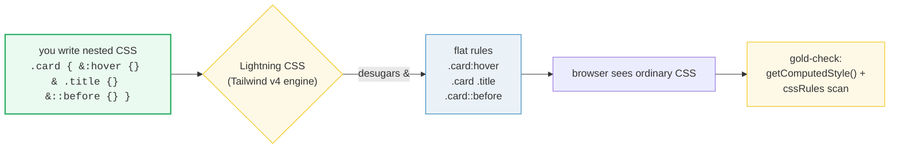
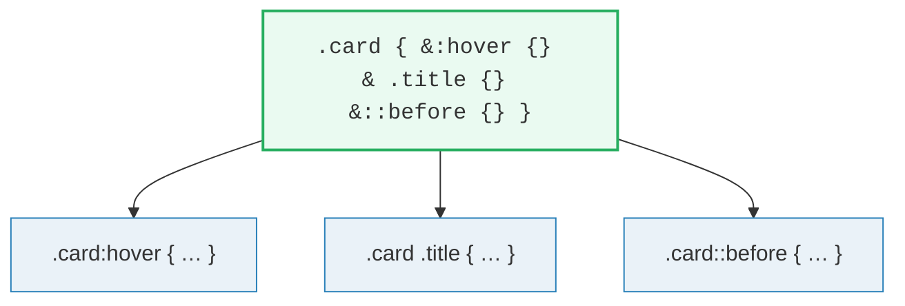
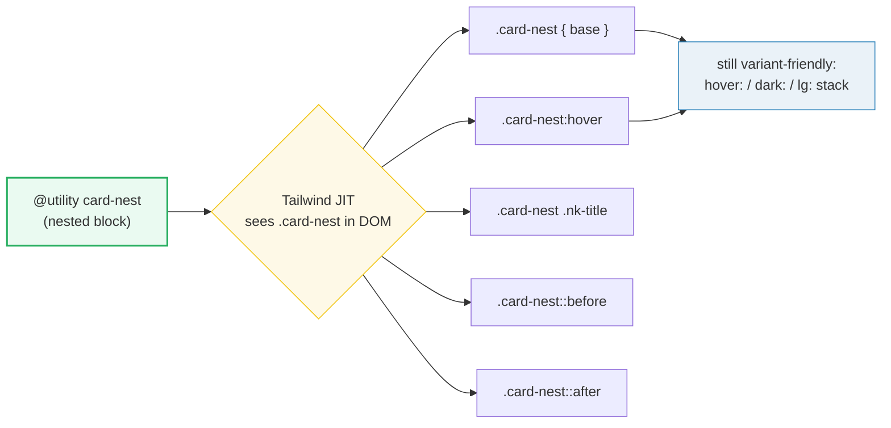

# Native CSS Nesting in Tailwind v4

> **Companion demo:** [`css_nesting.html`](./css_nesting.html) — open in a browser.
> The gold-check proves a custom `@utility card-nest` compiled all four nested
> rules: `::before` carries `"★"`, `.nk-title` carries `font-weight: 700`, and a
> literal `.card-nest:hover` rule exists in the live stylesheet.

---

## 0. TL;DR — the one idea

CSS Nesting — putting selectors inside other selectors and using `&` to mean "the
parent" — used to require Sass. Since late 2023 it is **native CSS**, baseline in
every evergreen browser. Tailwind v4 is built on Lightning CSS, which desugars
nesting everywhere it appears. That means a custom **`@utility` can own its hover
state, its child styles, and its `::before`/`::after` decorations in ONE block** —
co-located, readable, no scattered flat selectors, and still variant-friendly.



The `&` is the entire mental model: **it refers to the selector of the rule that
contains it.** Everything else is the desugaring rule below.

---

## 1. Native CSS nesting vs Sass nesting

The syntax is deliberately familiar to anyone who has used Sass. The differences
are architectural (no build step) and a couple of edge-case semantic ones.

| aspect | Sass nesting | native CSS nesting |
|---|---|---|
| build step | required — `dart-sass` emits CSS | **none** — the browser flattens it |
| `&` meaning | parent selector (interpolation) | the parent rule's matched element |
| output | exact flat selector (`.card .title`) | flat; parent wrapped in `:is()` in reversed/complex cases → max-specificity semantics |
| BEM suffix `&__elem` | fully supported, idiomatic | supported in modern browsers (late spec addition); historically spotty |
| nesting depth | unlimited | unlimited (keep it ≤ 3 — deep nesting hurts readability & perf) |
| `@media` inside a rule | supported | supported — and the properties are implicitly wrapped in `&` |
| in Tailwind v4 | separate pipeline, not integrated | **first-class** — `@utility`, `@layer`, plain CSS |

```css
/* This is the SAME in Sass and native CSS — and both flatten to the same rules. */
.card {
  padding: 1rem;
  border-radius: 0.5rem;

  &:hover { box-shadow: 0 4px 12px rgb(0 0 0 / 20%); }
  & .title { font-weight: 700; }
  &::before { content: "★"; margin-right: 0.5rem; }
}
```



**The practical takeaway:** if you were holding onto Sass *only* for nesting, you
can drop it. Tailwind v4 already gives you nesting for free.

---

## 2. The `&` nesting selector — every position

`&` is short for "the parent rule's selector". It can lead, trail, repeat, or sit
inside compound selectors. Getting these positions right is 90% of nesting.

| you write (nested) | desugars to | meaning |
|---|---|---|
| `&:hover { … }` | `.card:hover` | style the element ITSELF in a state |
| `& .title { … }` | `.card .title` | descendant (the space matters) — implicit if you omit `&` |
| `& > .child { … }` | `.card > .child` | direct child only |
| `&::before { … }` | `.card::before` | generate/box pseudo-element of the parent |
| `.featured & { … }` | `.featured .card` | trailing `&` reverses context (parent as descendant) |
| `& + & { … }` | `.card + .card` | repeat `&` — adjacent sibling of the same kind |
| **bare** `:hover { … }` | `.card *:hover` | **GOTCHA** — a bare pseudo targets DESCENDANTS, not self |

### The desugaring rule (precisely)

1. If a nested selector **starts with `&`**, splice it in verbatim
   (`&:hover` → `.card:hover`).
2. If it **does not start with `&`**, an implicit descendant combinator is added
   (`.title` → `.card .title`; bare `:hover` → `.card *:hover`).
3. When `&` is used in a **reversed/complex position**, the parent is wrapped in
   `:is()` to preserve correctness, so specificity follows `:is()` rules (takes
   the max of its arguments).

### The one hard limitation

`&` is equivalent to `:is()`, so it **cannot represent a pseudo-element** in a
reversed context. `&::before { .x & { color: red } }` will not paint —
`:is(.card::before)` cannot match generated content. Keep pseudo-elements on the
leading `&::before` form.

---

## 3. Nesting inside `@utility` (the Tailwind v4 idiom)

This is where nesting shines in Tailwind. A custom `@utility` is *one selector*.
Without nesting, styling its hover state means a separate flat rule somewhere;
with nesting, the whole component lives in one block **and keeps full variant
support** — `hover:`, `dark:`, `lg:` still stack because the utility is emitted
into the `utilities` layer.

```css
@utility card-nest {
  position: relative;
  display: flex;
  align-items: center;
  gap: 0.85rem;
  padding: 1rem 1.25rem;
  border-radius: 0.6rem;
  transition: transform .2s ease, box-shadow .2s ease;

  &:hover {                                   /* → .card-nest:hover */
    transform: translateY(-3px);
    box-shadow: 0 12px 30px oklch(0.7 0.2 195 / 0.22);
  }

  & .nk-title { font-weight: 700; }           /* → .card-nest .nk-title */
  & .nk-body  { color: oklch(0.78 0.02 250); }

  &::before { content: "★"; font-size: 1.5rem; }   /* → .card-nest::before */
  &::after  { content: ""; position: absolute; }   /* → .card-nest::after  */
}
```



The gold-check in the demo asserts this concretely:

```js
// pseudo-element nesting -> content survives computation
getComputedStyle(card, "::before").content   // '"★"'  (contains ★)
// descendant nesting -> font-weight is plumbed to the child
getComputedStyle(titleEl).fontWeight         // '700'
// state nesting -> a literal :hover rule was emitted
document.styleSheets[…].cssRules[…].selectorText  // matches /\.card-nest\s*:hover/
```

### Where nesting works inside Tailwind v4

| context | nesting? | note |
|---|---|---|
| `@utility name { &… }` | ✅ | the idiomatic home for nested component CSS |
| `@layer components { .x { & .y } }` | ✅ | emitted inside the named layer |
| plain rule `.x { & > .y }` in `<style type="text/tailwindcss">` | ✅ | Lightning CSS desugars it |
| inside `@media` / `@supports` nested under a rule | ✅ | properties are implicitly wrapped in `&` |
| `@theme { &… }` | ❌ | `@theme` holds variables only — move rules to `@utility`/`@layer` |
| `@custom-variant` | ⚠️ | `&` is a selector placeholder there, not nesting — different meaning |

---

## 4. Browser support

Native CSS Nesting is **Baseline "Widely available"** since December 2023.
Tailwind v4 targets this baseline, so nesting ships without a fallback in any
v4-supported browser.

| browser | min version | shipped |
|---|---|---|
| Chrome / Edge | 112+ | April 2023 |
| Safari (desktop + iOS) | 16.5+ | May 2023 |
| Firefox | 117+ | August 2023 |
| Samsung Internet | 22+ | 2023 |

> Note: Tailwind v4's Lightning CSS desugars nesting at **build time** (and in the
> Play CDN at runtime), so even an older engine would receive flat CSS — but the
> Play CDN itself requires a modern browser anyway.

---

## 5. Killer Gotchas

| trap | symptom | fix |
|---|---|---|
| **Bare `:hover` instead of `&:hover`** | The nested rule styles *every hovered descendant* of the card, not the card itself — silently wrong, no error | Always prefix state pseudo-classes with `&`: `&:hover`, `&:focus-visible` |
| **`& .title` vs `&.title`** | A stray space changes meaning: descendant (`.card .title`) vs compound (`.card.title`, same element) | Decide intentionally; the space is load-bearing |
| **Forgetting `&` on `::before`** | `::before { … }` nested is invalid (pseudo-element cannot start a relative selector) — the rule is dropped | Write `&::before` / `&::after` |
| **`&` cannot reach a reversed pseudo-element** | `.x & { … }` inside a `::before` block never paints — `:is(.foo::before)` matches nothing | Keep pseudo-elements on the leading `&::before` form; don't reverse them |
| **Deep nesting (> 3 levels)** | Specificity balloons, output selector gets long, refactoring hurts | Flatten intentionally; if you're 4 levels deep, extract a component |
| **Expecting BEM `&__elem` everywhere** | `&__title` works in modern browsers but was a late spec addition — older evergreen engines may not desugar it | Prefer descendant/child nesting (`.card .title`); reserve BEM suffix for known-modern targets |
| **Nesting inside `@theme`** | Rule silently has no effect — `@theme` is a custom-property namespace, not a style block | Move the rule into `@utility` or `@layer components` |
| **`@media` nesting specificity surprise** | A nested `@media { color: red }` is implicitly wrapped in `&`, so it inherits `:is()` specificity | Be explicit; don't rely on a media query winning a specificity fight it can lose |
| **Thinking you still need Sass** | You add a whole build pipeline just for nesting that the browser now does natively | Drop Sass; use native nesting inside `@utility` / `@layer` |

---

### Cheat sheet

```css
/* A custom utility that owns EVERYTHING about itself */
@utility btn {
  padding: 0.5rem 1rem;
  border-radius: 0.375rem;

  &:hover        { background: oklch(0.5 0.2 250); }   /* self, in a state */
  &:focus-visible { outline: 2px solid currentColor; }
  &:active       { transform: translateY(1px); }

  & .label       { font-weight: 600; }                 /* descendant */
  & > .icon      { width: 1rem; }                       /* direct child */
  &::before      { content: "▶"; margin-right: 0.4rem; }/* pseudo-element */
}

/* Reverse context — style self only inside an ancestor */
.card {
  .dark & { border-color: white; }   /* → .dark .card */
}

/* Nested at-rule — properties are implicitly &-wrapped */
.widget {
  @media (width < 600px) { flex-direction: column; }  /* → .widget @media */
}
```

```html
<!-- It still composes with Tailwind variants -->
<button class="btn hover:scale-105 dark:bg-cyan-600">…</button>
```

---

## 🔗 Cross-references

- **[`FUNCTIONAL_UTILITY.md`](./FUNCTIONAL_UTILITY.md)** — nesting's natural home.
  A functional `@utility tab-* { … }` pairs perfectly with `&:hover` /
  `& .child` to build a self-contained, variant-friendly component utility.
- **[`ARBITRARY_PROPERTIES.md`](./ARBITRARY_PROPERTIES.md)** — the one-off escape
  hatch (`[mask-type:luminance]`). When the same one-off + its hover state recur,
  graduate to a nested `@utility` instead of repeating arbitrary properties.
- **[`PREFLIGHT_RESET.md`](./PREFLIGHT_RESET.md)** *(planned, Phase 7)* — Preflight
  ships as base-layer CSS; nesting is the cleanest way to extend or override its
  rules inside `@layer base`.
- **[`BUILD_TOOLING.md`](./BUILD_TOOLING.md)** *(planned, Phase 7)* — Lightning
  CSS (the `@tailwindcss/vite` / `@tailwindcss/postcss` engine) is what desugars
  your nesting at build time; the Play CDN runs the same pipeline in the browser.
- **[MDN — `&` nesting selector](https://developer.mozilla.org/en-US/docs/Web/CSS/Nesting_selector)**
  (canonical semantics + the bare-`:hover` gotcha).
- **[MDN — Using CSS nesting](https://developer.mozilla.org/en-US/docs/Web/CSS/CSS_nesting/Using_CSS_nesting)**
  (desugaring rules, at-rule nesting).
- **[web.dev — CSS Nesting](https://web.dev/articles/css-nesting)** (practical
  guide + browser-support context).

---

## Sources

- MDN Web Docs — *& nesting selector*. <https://developer.mozilla.org/en-US/docs/Web/CSS/Nesting_selector>. Verified 2026-06 (Baseline "Widely available" since December 2023; bare `:hover` desugars to descendant).
- MDN Web Docs — *Using CSS nesting*. <https://developer.mozilla.org/en-US/docs/Web/CSS/CSS_nesting/Using_CSS_nesting>. Verified 2026-06.
- web.dev — *CSS Nesting*. <https://web.dev/articles/css-nesting>. Verified 2026-06.
- Can I Use — *CSS Nesting*. <https://caniuse.com/css-nesting>. Verified 2026-06 (Chrome 112+, Safari 16.5+, Firefox 117+).
- Tailwind CSS — *Adding custom styles → `@utility`*. <https://tailwindcss.com/docs/adding-custom-styles#adding-custom-utilities>. Verified 2026-06.
