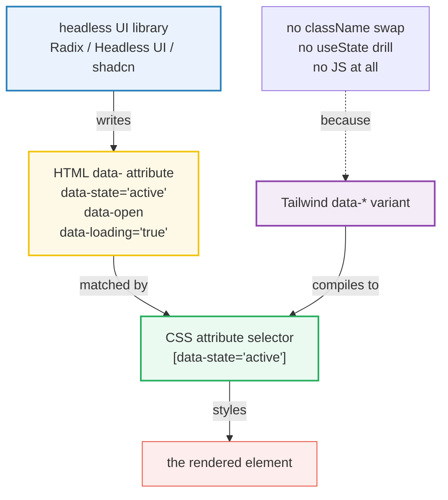
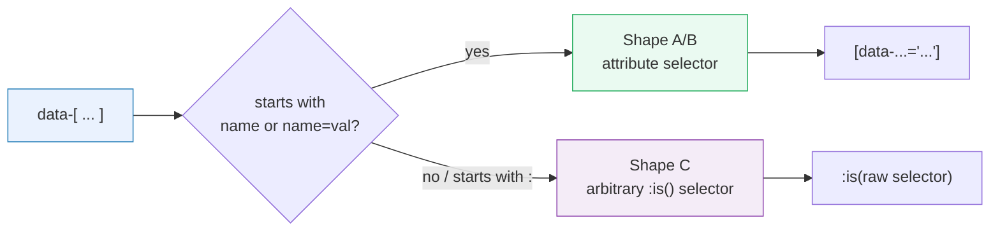

# Data Attribute Variants (`data-*`)

> **Companion demo:** [`data_attribute.html`](./data_attribute.html) — open in a browser.
> **Tailwind version:** v4.0+ via `@tailwindcss/browser@4` Play CDN.
> **Specs:** CSS Attribute Selectors Level 3 (`[attr]`, `[attr=val]`), HTML `data-*` global attributes.

---

## 0. TL;DR — the one idea

> **Headless UI libraries don't toggle your classes — they write `data-` attributes
> to announce state.** Radix puts `data-state="active"` on the open tab, Headless UI
> puts a bare `data-open` on the expanded disclosure, shadcn drives async UI with
> `data-loading="true"`. Tailwind v4's `data-*` variants turn those attributes into
> styling hooks with **zero glue code**: `data-[state=active]:bg-cyan-600` compiles
> to `[data-state="active"] { background-color: … }`. The browser already knew how
> to match attribute selectors — Tailwind just gives you the syntax.



| Variant | Compiles to | Fires when… |
|---------|-------------|-------------|
| `data-[open]:`          | `[data-open]`                  | attribute is **present** (any value, even `""`) |
| `data-[state=active]:`  | `[data-state="active"]`        | exact **value match** |
| `data-[loading=true]:`  | `[data-loading="true"]`        | explicit value match (quoted in CSS) |
| `data-[:not([open])]:`  | `:not([data-open])`            | **arbitrary selector** mode — escape hatch |
| `group-data-[open]:`    | `.group[data-open] …`          | named-group descendant reacts to ancestor's attr |
| `peer-data-[open]:`     | `.peer[data-open] ~ …`         | named-peer forward-sibling reacts |
| `@custom-variant loading (&[data-loading="true"])` | `.loading\[…\][data-loading="true"]` | reusable named variant |

---

## 1. How it works — three shapes, one CSS feature

Every `data-*` variant is a 1:1 wrapper around a **CSS attribute selector**. There
is no Tailwind runtime — the utility class is emitted with a selector the browser
natively understands. The three shapes differ only in which selector they generate.

### Shape A — presence check: `data-[open]:`

```html
<!-- Headless UI Disclosure: writes bare data-open when expanded -->
<button data-open class="data-[open]:bg-cyan-600">Toggle</button>
```

Compiles to:

```css
.data-\[open\]\:bg-cyan-600[data-open] { background-color: oklch(0.577 .143 222); }
```

The `[data-open]` selector matches if the attribute **exists at all** — value `""`,
`"true"`, or `"bananas"` all match. This is the cleanest "open/closed" signal: add
the attribute to open, remove it to close. No boolean-to-string mapping needed.

### Shape B — value match: `data-[state=active]:`

```html
<!-- Radix Tabs: data-state cycles through "active" | "inactive" -->
<button data-state="active" class="data-[state=active]:bg-cyan-600 data-[state=inactive]:bg-slate-700">
  Tab
</button>
```

Compiles to:

```css
.data-\[state\=active\]\:bg-cyan-600[data-state="active"] { background-color: …cyan… }
.data-\[state\=inactive\]\:bg-slate-700[data-state="inactive"] { background-color: …slate… }
```

CSS **auto-quotes** the value: `[data-state="active"]`. You write `active` (no
quotes) in Tailwind; the quotes appear in the output. This is the multi-state workhorse
— any enum the library emits (`open`/`closed`, `on`/`off`, `checked`/`unchecked`)
maps to one variant per value.

### Shape C — arbitrary selector: `data-[:not([open])]:`

```html
<!-- hide the dropdown when data-open is ABSENT -->
<div class="data-[open]:block data-[:not([open])]:hidden">Menu</div>
```

When the bracket content starts with `:` (or is otherwise not a bare `name` /
`name=value`), Tailwind treats it as a **raw selector fragment** and injects it
inside `:is(…)`. So `data-[:not([open])]` becomes roughly
`:is(:not([data-open]))`. This is the escape hatch for negation, `:has()`,
descendant matching, etc.



---

## 2. Mechanism / internals

### What Tailwind emits

The Play CDN's JIT scans the DOM, finds `data-[…]:utility` patterns, and emits one
rule per unique combination. The selector it generates is a **compound selector**
on the same element — the data-attribute test is attached to the utility class
itself, not to a parent or sibling:

```
class="data-[state=active]:bg-cyan-600"
   ↓
.data-\[state\=active\]\:bg-cyan-600[data-state="active"] { background-color: … }
```

That `[data-state="active"]` tacked on the end is a **specificity bump** — the
attribute selector adds `0-1-1` to the rule, so data-variant styles win ties
against bare utilities on the same element. This is usually what you want (state
should override base), but it means data-variant rules are **harder to override
later** — see Gotcha #2.

### Composition with other variants

Variants stack left-to-right, each wrapping the next. `md:data-[state=active]:bg-cyan-600`
compiles to:

```css
@media (min-width: 48rem) {
  .md\:data-\[state\=active\]\:bg-cyan-600[data-state="active"] { … }
}
```

So **responsive wraps data wraps utility**. The order matters: `data-[state=active]:md:bg-c…`
is *not* a valid combination (responsive variants can't be the inner layer) — keep
breakpoints on the outside.

### `group-data-*` and `peer-data-*` — reach across elements

A plain `data-[open]:` only styles the **same element** that carries the attribute.
To style a *child* based on an *ancestor's* data attribute, use the named-group
form:

```html
<div class="group/data" data-open="">
  <span class="group-data-[open]/data:opacity-100 opacity-0">↑ visible when menu open</span>
</div>
```

This is the bridge to [`group_peer.html`](./group_peer.html) — same `group`/`peer`
machinery, but the trigger is a `data-` attribute instead of a pseudo-class like
`:hover` or `:checked`. See also [`has_variant.html`](./has_variant.html) for the
`group-has-[data-open]:` pattern, which lets a *parent* react to a child's data
attribute (something plain `group-data-*` cannot do).

---

## 3. Headless UI integration — the real-world reason this exists

The three dominant headless React libraries all speak the data-attribute protocol.
Matching their conventions means your styling drops in with **zero adapter code**.

| Library | State attribute | Typical values | Tailwind wiring |
|---------|-----------------|----------------|-----------------|
| **Radix UI** | `data-state` | `active` / `inactive`, `open` / `closed`, `on` / `off` | `data-[state=active]:` / `data-[state=open]:` |
| **Headless UI** (React/Vue) | `data-open`, `data-checked`, `data-focus`, `data-hover` (presence) | bare attribute, no value | `data-[open]:` / `data-[checked]:` |
| **shadcn/ui** | `data-[loading=true]`, `data-[side=top]`, `data-[align=start]` | explicit values on Radix primitives | `data-[loading=true]:` / `data-[side=top]:` |

### Radix — `data-state` enum

```jsx
<Tabs.Root>
  <Tabs.List>
    <Tabs.Trigger
      className="data-[state=active]:bg-cyan-600 data-[state=inactive]:bg-slate-700"
    />
  </Tabs.List>
  <Tabs.Content className="data-[state=inactive]:hidden" />
</Tabs.Root>
```

Radix cycles `data-state` between two named values per primitive. Every primitive
(Tabs, Accordion, Dialog, Popover, Tooltip) uses the same attribute name, so a
shared `data-[state=active]:` rule works across your whole design system.

### Headless UI — bare presence

```jsx
<Disclosure>
  <DisclosureButton className="data-[open]:bg-cyan-600 data-[open]:rotate-180" />
  <DisclosurePanel className="data-[open]:block data-[:not([open])]:hidden" />
</Disclosure>
```

Headless UI adds a bare `data-open` (no value) to the trigger. The presence form
`data-[open]:` is the idiomatic match. Note the `data-[:not([open])]:hidden`
companion — Headless UI does **not** remove the element from the DOM when closed,
it just removes the attribute, so you need an explicit "absent" rule to hide it.

### shadcn/ui — Radix + Tailwind + composition

shadcn wraps Radix primitives with pre-styled classes and often adds its own
`data-[loading=true]` for async buttons. Because it ships as **source you copy in**
(not an npm dep), you can rewrite every `data-[…]` variant to match your theme. The
canonical pattern in shadcn components:

```jsx
<button
  data-loading={isLoading ? "true" : "false"}
  className="data-[loading=true]:opacity-70 data-[loading=true]:pointer-events-none"
/>
```

shadcn's `cn()` helper (clsx + tailwind-merge) means the data-variant classes are
never de-duped away by conflicting later classes — a subtle but important reason
this pattern works reliably in the shadcn ecosystem.

---

## 4. Killer Gotchas

| # | Trap | Symptom | Fix |
|---|------|---------|-----|
| 1 | **`data-state="true"` vs bare `data-state`** — using the value form when the library emits presence (or vice-versa) | Style never applies; `getComputedStyle()` shows the base color | Check what the library *actually* writes. Headless UI → `data-[open]:` (presence). Radix → `data-[state=open]:` (value). Inspect in DevTools before writing the variant. |
| 2 | **Specificity trap** — `[data-state="active"]` adds `0-1-1`, so a later `.text-white` on the same element **loses** | You set a utility but the data-variant style "wins" and won't override | Either put the override behind the same variant (`data-[state=active]:text-white`), or use `!` important, or restructure so the override is also attribute-qualified. |
| 3 | **Quoting** — CSS quotes values, you don't | `data-[state="active"]:` (with your own quotes) generates a malformed selector | Write **unquoted**: `data-[state=active]:`. Tailwind injects the quotes. |
| 4 | **`data-[:not([open])]` vs `data-[open=false]`** | You wrote `data-[open=false]` expecting it to match "closed", but the attribute was *removed* (not set to `false`) | Presence-based libraries **remove** the attribute when closed. Use the arbitrary-negation form `data-[:not([open])]:` to match absence. |
| 5 | **Attribute set but Tailwind didn't see it** | You set `el.setAttribute("data-state","active")` after load and the style doesn't apply | The Play CDN watches the DOM via MutationObserver, so it eventually compiles. In a real build, classes are static — the variant must appear in source. Don't construct class names dynamically at runtime in a production build (JIT won't find them). |
| 6 | **`aria-*` vs `data-*` confusion** | You styled off `data-expanded` but the screen reader still announces "collapsed" | `data-*` is invisible to AT. If the state is an accessibility fact (expanded, checked, invalid, pressed), use the `aria-*` variant and get the styling + a11y in one attribute. See [`a11y_variants.html`](./a11y_variants.html). |
| 7 | **Group/peer require the marker + name** | `group-data-[open]:` silently does nothing | You must name the group: `class="group/menu" data-open` on the ancestor, then `group-data-[open]/menu:` on the descendant. The `/name` suffix is what links them. |
| 8 | **CDN compile lag in gold-checks** | `getComputedStyle()` returns transparent right after load | Poll via `requestAnimationFrame` (up to ~2.5s). The Play CDN compiles asynchronously. See the demo's `stageActive()` poller. |

---

## 5. Cheat sheet

```html
<!-- PRESENCE: attribute exists (any value) -->
<button data-open class="data-[open]:bg-cyan-600">…</button>

<!-- VALUE MATCH: exact value -->
<button data-state="active"
        class="data-[state=active]:bg-cyan-600 data-[state=inactive]:bg-slate-700">…</button>

<!-- NEGATION / ABITRARY SELECTOR -->
<div class="data-[open]:block data-[:not([open])]:hidden">…</div>

<!-- NAMED GROUP: descendant reacts to ancestor's data attr -->
<div class="group/menu" data-open="">
  <span class="group-data-[open]/menu:opacity-100 opacity-0">…</span>
</div>

<!-- NAMED PEER: later sibling reacts to earlier sibling's data attr -->
<input class="peer/toggle" data-on="" type="checkbox" />
<label class="peer-data-[on]/toggle:text-cyan-300">…</label>

<!-- STACK with responsive + theme variants -->
<button class="md:data-[state=active]:bg-cyan-600 dark:data-[state=active]:bg-cyan-400">…</button>
```

### Define a reusable custom variant

When the same `data-[loading=true]` clutters every element, promote it to a named
variant in your `@theme` / `<style type="text/tailwindcss">`:

```css
@custom-variant loading (&[data-loading="true"]);
@custom-variant open   (&[data-open]);
```

Now write `loading:opacity-70` and `open:bg-cyan-600` — cleaner, and the variant
name shows up in your IDE autocomplete. (This is the same mechanism covered in
[`arbitrary_variants.html`](./arbitrary_variants.html) — `@custom-variant` is the
general-purpose variant factory, and `data-*` is just the most common input.)

---

## 6. When to reach for `data-*` vs the alternatives

| You want to style based on… | Use | Because |
|-----------------------------|-----|---------|
| an element's own pseudo-class (`:hover`, `:focus`, `:checked`) | `hover:` / `focus:` / `checked:` | native CSS, no attribute to manage |
| an ancestor's state | `group-hover:` / `group-data-[open]:` | descendant combinator, reaches any depth — see [`group_peer.html`](./group_peer.html) |
| a previous sibling's state | `peer-checked:` / `peer-data-[open]:` | general sibling combinator, forward-only |
| a descendant's existence | `has-[input:invalid]:` / `group-has-[data-open]:` | `:has()` — see [`has_variant.html`](./has_variant.html) |
| **a library-emitted data attribute** | **`data-[state=active]:`** | the attribute is already there; you'd otherwise write a JS adapter |
| **a WAI-ARIA accessibility fact** | **`aria-expanded:` / `aria-invalid:`** | the attribute carries a11y meaning too; don't duplicate it as `data-*` |
| an arbitrary custom selector | `data-[:is(.x)]:` / `[@media…]:` | escape hatch — see [`arbitrary_variants.html`](./arbitrary_variants.html) |

---

## 🔗 Cross-references

- [`group_peer.html`](./group_peer.html) / [`GROUP_PEER.md`](./GROUP_PEER.md) —
  `group`/`peer` variants. `group-data-*` and `peer-data-*` are the same machinery
  but keyed on a `data-` attribute instead of a pseudo-class.
- [`has_variant.html`](./has_variant.html) / [`HAS_VARIANT.md`](./HAS_VARIANT.md) —
  `group-has-[data-open]:` lets a **parent** react to a child's data attribute
  (plain `group-data-*` can only flow downward).
- [`arbitrary_variants.html`](./arbitrary_variants.html) —
  `@custom-variant` and the `[arbitrary-selector]:` escape hatch that the
  `data-[:not([open])]:` form is built on.
- [`a11y_variants.html`](./a11y_variants.html) / [`A11Y_VARIANTS.md`](./A11Y_VARIANTS.md) —
  the `aria-*` counterpart: same bracket syntax, but the attributes are spec-defined
  and consumed by assistive tech.

---

## Sources

1. **Tailwind CSS — Hover, focus, and other states (Using data attributes):** https://tailwindcss.com/docs/hover-focus-and-other-states#using-data-attributes — official v4 docs for `data-[attribute=value]:` variants, presence vs value forms, and `@custom-variant`.
2. **Tailwind CSS v4.0 release blog:** https://tailwindcss.com/blog/tailwindcss-v4 — data-attribute variants as a first-class v4 feature alongside `aria-*` and arbitrary variants.
3. **MDN — Attribute selectors (`[attr]`, `[attr=value]`):** https://developer.mozilla.org/en-US/docs/Web/CSS/Attribute_selectors — the underlying CSS feature every `data-*` variant compiles to.
4. **Radix UI — Components / States (data-attributes):** https://www.radix-ui.com/primitives/docs/overview/styling#data-attributes — documents the `data-state`, `data-disabled`, `data-[side=top]` contract that Radix primitives emit and that shadcn consumes.
5. **Headless UI — React / Styling:** https://headlessui.com/react/disclosure — documents the bare `data-open`, `data-checked`, `data-focus` presence attributes on Headless UI primitives.
6. **shadcn/ui — Components:** https://ui.shadcn.com/docs/components/button — shows the `data-[loading=true]` / `cn()` pattern used throughout the shadcn ecosystem.
