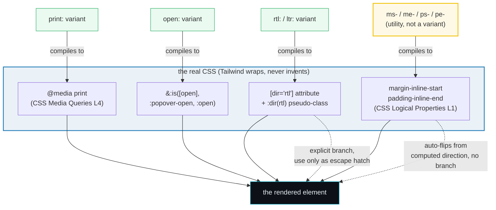

# Directional &amp; Media Variants

> **Companion demo:** [`directional_media.html`](./directional_media.html) — open in a browser.
> **Tailwind version:** v4.3.x via `@tailwindcss/browser@4` Play CDN.
> **Specs:** CSS Selectors Level 4 (`:dir()`, attribute selectors), CSS Media
> Queries Level 4 (`@media print`), HTML (`[open]` on `<details>`/`<dialog>`,
> `:popover-open`), CSS Logical Properties Level 1 (`margin-inline-start`, …).

---

## 0. TL;DR — the one idea

> **`rtl:` / `ltr:` / `print:` / `open:` are the four variants that wrap a real
> CSS selector or `@media` query tied to document state — not user input.**
> `rtl:`/`ltr:` wrap a descendant `[dir]` attribute selector (plus `:dir()`);
> `print:` wraps `@media print`; `open:` wraps
> `&:is([open], :popover-open, :open)`. Tailwind adds zero magic. The companion
> decision: **prefer logical properties** (`ms-4`, `ps-4`, `start-0`) for
> direction-aware spacing — they auto-flip for free. Reach for `rtl:`/`ltr:`
> only when there's no logical equivalent (flip an SVG, swap flex-direction,
> per-dir background-position).



| Variant / utility | Compiles to | Fires when… |
|-------------------|-------------|-------------|
| `rtl:`            | `&:where(:dir(rtl), [dir="rtl"], [dir="rtl"] *)` | element or ancestor has `dir="rtl"` (or computes rtl via `:dir()`) |
| `ltr:`            | `&:where(:dir(ltr), [dir="ltr"], [dir="ltr"] *)` | element or ancestor has `dir="ltr"` |
| `print:`          | `@media print`                                     | the document is being sent to a printer / Save-as-PDF |
| `open:`           | `&:is([open], :popover-open, :open)`               | `<details open>`, `<dialog open>`, or a popover's open state is active |
| `details-content:`| `&::details-content`                               | the new pseudo-element styling the content region of `<details>` (Chrome 145+) |
| `group-open:`     | `&:is(:is([open], :popover-open, :open) *)`        | a parent marked `group` is in open state — child reacts |
| `ms-*` / `me-*`   | `margin-inline-start/end`                          | always — **auto-flips** with computed direction, no variant |
| `ps-*` / `pe-*`   | `padding-inline-start/end`                         | always — **auto-flips** |
| `start-*` / `end-*` | `inset-inline-start/end`                        | always — **auto-flips** |
| `border-s-*` / `border-e-*` | `border-inline-start/end-width`        | always — **auto-flips** |
| `text-start` / `text-end` | `text-align: start/end`                 | always — **auto-flips** |

---

## 1. How it works — each family in 30 seconds

### `rtl:` / `ltr:` — the writing-direction branch

```html
<!-- The element with dir="rtl" (or an ancestor) makes rtl: match -->
<div dir="rtl">
  <p class="ltr:ml-4 rtl:mr-4">Margin flips with the writing direction</p>
  <svg class="rtl:scale-x-[-1]">Chevron mirrors in RTL (no logical equivalent)</svg>
</div>
```

Compiles to:

```css
.ltr\:ml-4:where(:dir(ltr), [dir="ltr"], [dir="ltr"] *) { margin-left: 1rem; }
.rtl\:mr-4:where(:dir(rtl), [dir="rtl"], [dir="rtl"] *) { margin-right: 1rem; }
```

Three matching strategies, deliberately layered:

1. **`:dir(rtl)`** — the CSS Selectors Level 4 pseudo-class. It honors the
   *computed* direction, including inherited and bidirectional auto-detection
   from the Unicode bidirectional algorithm. This is the most robust.
2. **`[dir="rtl"]`** — matches the element that *directly* carries the attribute.
3. **`[dir="rtl"] *`** — the descendant selector that lets you write
   `rtl:` on a child and still match when an ancestor has `dir="rtl"`.

> **Important:** `rtl:`/`ltr:` are only useful if your site supports **both**
> directions. If you ship a single-direction site, you do not need these — just
> use logical properties or the physical side that matches your direction.

### `print:` — the print stylesheet, one prefix at a time

```html
<!-- Hide chrome, expand article, reveal URLs — only on paper -->
<nav class="print:hidden">…</nav>
<article class="print:text-black print:bg-white">
  See the <a class="after:content-[attr(href)]">docs</a>.
</article>
<div class="hidden print:block">↪ only visible on paper</div>
```

Compiles to a one-shot `@media print` block per utility:

```css
.print\:hidden { @media print { display: none; } }
.print\:text-black { @media print { color: #000; } }
```

The trigger is "the user hit Cmd+P / Ctrl+P" — the browser switches to the
print media, and the `@media print` rules snap into existence. There is no
"print mode" toggle in your app. Note `getComputedStyle()` cannot observe these
rules on screen (the media query is inactive), so the
[`directional_media.html`](./directional_media.html) print panel is illustrative;
open Print Preview to see the rules fire.

### `open:` — `<details>` / `<dialog>` / popover state

```html
<!-- open: classes apply when <details> has the [open] attribute -->
<details class="open:bg-cyan-500/20 open:border-cyan-500">
  <summary>Toggle (whole details tints cyan when open)</summary>
  <p>Content</p>
</details>

<!-- group-open: lets a CHILD react to its details parent's open state -->
<details class="group">
  <summary class="group-open:text-cyan-300">summary turns cyan</summary>
</details>
```

Compiles to a single selector that covers all three open-state mechanisms:

```css
.open\:bg-cyan-500\/20:is([open], :popover-open, :open) {
  background-color: rgb(6 182 212 / 0.2);
}
```

- `[open]` — the HTML attribute on `<details>` and `<dialog>`.
- `:popover-open` — the pseudo-class for elements with the `popover` attribute
  (Popover API) when they are shown.
- `:open` — the broader CSS Selectors Level 4 pseudo-class matching open
  `<details>`/`<dialog>` (newer browsers).

The compound variant `group-open:` is the "child reacts to parent `<details>`"
pattern — the same shape as `group-hover:`, with `open:` substituted.

### Logical properties — the variant-less path

```html
<!-- ms-4 = margin-inline-start. In LTR it's left-margin; in RTL it's right-margin. -->
<!-- No rtl:/ltr: needed — the browser resolves it from the computed direction. -->
<div class="ms-4 ps-4 start-0 border-s-2 text-start">…</div>
```

| Utility | CSS | LTR meaning | RTL meaning |
|---|---|---|---|
| `ms-4`   | `margin-inline-start: 1rem`     | `margin-left`   | `margin-right`  |
| `me-4`   | `margin-inline-end: 1rem`       | `margin-right`  | `margin-left`   |
| `ps-4`   | `padding-inline-start: 1rem`    | `padding-left`  | `padding-right` |
| `pe-4`   | `padding-inline-end: 1rem`      | `padding-right` | `padding-left`  |
| `start-0`| `inset-inline-start: 0`         | `left: 0`       | `right: 0`      |
| `end-0`  | `inset-inline-end: 0`           | `right: 0`      | `left: 0`       |
| `border-s-2` | `border-inline-start-width: 2px` | left border  | right border    |
| `rounded-ss-lg` | `border-start-start-radius` | top-left corner | top-right corner |
| `text-start` | `text-align: start`         | left-aligned    | right-aligned   |

This is the **default API** for direction-aware layout. Use it before reaching
for `rtl:`/`ltr:`.

---

## 2. Mechanism / internals

### Why `:dir()` AND `[dir]` AND `[dir] *`?

A single mechanism wouldn't cover every real case:

| Mechanism | Covers | Misses |
|---|---|---|
| `:dir(rtl)` only | computed direction (most robust, honors inheritance + bidi auto-detection) | older Safari (before 16.4) lacks `:dir()` for non-input elements |
| `[dir="rtl"]` only | the element that directly has the attribute | descendants that should inherit the branch |
| `[dir="rtl"] *` only | descendants of an explicitly-set element | the element with `dir` itself, and `:dir()` auto-detected cases |

Tailwind's `&:where(:dir(rtl), [dir="rtl"], [dir="rtl"] *)` layers all three so
the variant matches the widest possible set of real-world RTL layouts. The
`:where()` wrapper keeps specificity at zero, so your base utilities always win.

### Why `:is([open], :popover-open, :open)` instead of just `[open]`?

`[open]` alone misses two modern mechanisms:

- **Popovers** (`<div popover>`) — opened via `popovertarget`, they don't get an
  HTML `[open]` attribute; they get the `:popover-open` pseudo-class instead.
- **`:open` pseudo-class** — the broader Selectors Level 4 wrapper that
  normalizes `<details>`, `<dialog>`, and popovers under one flag, useful for
  future-proofing.

Layering all three means one `open:` variant covers disclosure widgets, modals,
and popovers with the same prefix.

### Print stylesheets — what to actually ship

A production `print:` strategy usually covers four things:

```html
<!-- 1. Hide interactive chrome (no value on paper) -->
<nav class="print:hidden">…</nav>
<aside class="print:hidden">sidebar / ads</aside>
<button class="print:hidden">share</button>

<!-- 2. Force ink-friendly colors (dark themes waste toner) -->
<main class="print:bg-white print:text-black">
  <h1 class="print:text-black">Article</h1>
</main>

<!-- 3. Expand collapsed content (accordions, <details>) -->
<details class="print:open" open>…</details>  <!-- or just leave them open -->

<!-- 4. Reveal link URLs (paper isn't clickable) -->
<a class="after:content-['_('attr(href)')']">docs</a>
```

`@media print` is one of the few media queries you cannot emulate from DevTools
by toggling OS settings — use **DevTools → Rendering → Emulate CSS media
feature → print**, or just open the real Print Preview.

---

## 3. Killer Gotchas

| trap | symptom | fix |
|------|---------|-----|
| using `rtl:ml-4` / `ltr:ml-4` for **spacing** | works, but you wrote two rules where one logical property would auto-flip | prefer `ms-4` (margin-inline-start) — zero variants, auto-flips for free |
| `dir="rtl"` only on a child, but `rtl:` on a sibling outside that subtree | the `rtl:` rule never fires — `[dir="rtl"] *` only matches descendants | set `dir="rtl"` on the nearest common ancestor (often `<html>` or the page wrapper) |
| `rtl:scale-x-[-1]` on a `<span>` wrapping an SVG | the span flips but layout reflows oddly | put `rtl:scale-x-[-1]` directly on the `<svg>` (or use `rtl:-scale-x-100`) |
| `open:` on the `<summary>` expecting it to fire on expand | never matches — `<summary>` never gets `[open]`; only `<details>` does | put `open:` on the `<details>`, OR use `group` on details + `group-open:` on the summary |
| `print:` styles "don't work" when checked via `getComputedStyle()` on screen | `@media print` is inactive outside print mode — the browser reports screen styles | verify in Print Preview or DevTools "Emulate CSS media → print"; do not assert print rules at runtime |
| `after:content-[attr(href)]` shows the URL on screen too | you forgot the `print:` prefix | write `print:after:content-[attr(href)]` (stack the variants) so the `::after` only exists in print |
| thinking `forced-colors:` and `print:` overlap | they don't — forced-colors is Windows High Contrast (a user mode), print is a document mode | use them independently; pair `print:` with `forced-colors:` only if you need a print + high-contrast intersection |
| logical properties ignored because "Safari doesn't support them" | outdated — Safari has shipped `margin-inline-*` etc. since 15.x (2021) | safe to use as the default; the v4 utilities were built around them |
| `dir="auto"` on an input | `:dir()` honors it, but `[dir]` attribute selectors do NOT see `auto` (there's no literal `dir` value) | Tailwind's layered `:dir() OR [dir] OR [dir] *` covers `auto` via the `:dir()` arm |
| `<dialog open>` with `open:` expecting the backdrop to style too | `open:` styles the dialog; the backdrop is a separate pseudo-element | use `backdrop:bg-gray-50` for the backdrop (see the [backdrop variant](https://tailwindcss.com/docs/hover-focus-and-other-states)) |
| nesting `rtl:dark:` and getting wrong order | variant order matters — `rtl:dark:` vs `dark:rtl:` can resolve differently in edge cases | put the broader/later condition last; test both orderings if a rule misfires |

---

## Cheat sheet

```html
<!-- ============ DIRECTION (rtl: / ltr:) ============ -->

<!-- PREFERRED: logical properties auto-flip — no variant -->
<div class="ms-4 me-4 ps-4 pe-4 start-0 end-0 border-s-2 text-start">…</div>

<!-- ESCAPE HATCH: rtl:/ltr: for things logical properties can't cover -->
<svg  class="rtl:scale-x-[-1]">chevron mirrors</svg>
<div  class="ltr:flex-row rtl:flex-row-reverse">flex order swaps</div>
<div  class="ltr:bg-left rtl:bg-right">bg-position swaps</div>

<!-- ============ PRINT (print:) ============ -->

<!-- Hide chrome on paper -->
<nav    class="print:hidden">…</nav>
<button class="print:hidden">share</button>

<!-- Force ink-friendly colors -->
<main class="print:bg-white print:text-black">…</main>

<!-- Reveal link URLs in print (stack variants: print: + after:) -->
<a class="print:after:content-['_('attr(href)')']">docs</a>

<!-- Show a print-only block -->
<div class="hidden print:block">↪ only on paper</div>

<!-- ============ OPEN STATE (open:) ============ -->

<!-- Style the open <details> directly -->
<details class="open:bg-cyan-500/20 open:border-cyan-500 rounded-lg">
  <summary>toggle</summary>
  <p>content</p>
</details>

<!-- Child reacts to details open (group-open: compound variant) -->
<details class="group">
  <summary class="group-open:text-cyan-300 group-open:font-bold">summary</summary>
  <svg     class="group-open:rotate-90 transition-transform">chevron rotates</svg>
</details>

<!-- <dialog> and popovers use the same open: prefix -->
<dialog class="open:opacity-100 opacity-0">modal</dialog>
<div popover class="open:scale-100 scale-95">popover</div>
```

```css
/* Custom variant: target a specific data-direction value */
@custom-variant dir-horizontal (&[data-direction="horizontal"]);

/* Custom variant: screen-only (the inverse of print:) */
@custom-variant screen (@media screen);
```

---

## 🔗 Cross-references

- **[`a11y_variants`](./a11y_variants.html)** — the sibling "system-state"
  variant family (`motion-safe:` / `motion-reduce:` / `contrast-more:` /
  `forced-colors:` / `focus-visible:`). Same "wraps a real `@media` query or
  pseudo-class" model as `print:` / `rtl:` here — together they cover every
  document- and user-state variant in v4.
- **[`group_peer`](./group_peer.html)** — `group-open:` shown above is the
  named-group version of `open:`; the combinator mechanics there compose with
  every state variant. `group-focus-within:`, `peer-checked:`, etc. follow the
  same shape.
- **[`child_variants`](./child_variants.html)** — `first:` / `last:` / `odd:` /
  `even:` / `empty:`. Structural-position variants, complementary to the
  state-based `open:` here.
- **[`form_state`](./form_state.html)** — `required:` / `valid:` / `invalid:` /
  `read-only:`. Pair `invalid:` with `rtl:`-aware error icons (mirror the
  warning glyph for RTL layouts).
- **[`has_variant`](./has_variant.html)** — `has-open:` / `group-has-open:` for
  styling an element based on a *different* element's open state (e.g. disable a
  button when a details elsewhere is open).
- Companion onboarding: [`../frontend/tailwind/tailwind_responsive_variants.html`](../frontend/tailwind/tailwind_responsive_variants.html)
  — `sm:`/`md:`/`lg:` are the viewport-axis media variants; `print:` here is the
  document-mode axis of the same media-query model.

---

## Sources

1. **Tailwind CSS — "Hover, focus, and other states"** (v4.3 docs): the
   canonical descriptions of `rtl`/`ltr` ("RTL support"), `print` ("Print"), and
   `open` ("Open/closed state") variants, including the `:popover-open` coverage
   note. <https://tailwindcss.com/docs/hover-focus-and-other-states#rtl-support> ·
   <https://tailwindcss.com/docs/hover-focus-and-other-states#print> ·
   <https://tailwindcss.com/docs/hover-focus-and-other-states#open-closed-state>
2. **Tailwind CSS v4 source — `packages/tailwindcss/src/variants.ts`**: the
   exact compiled selectors —
   `rtl:` → `&:where(:dir(rtl), [dir="rtl"], [dir="rtl"] *)`,
   `ltr:` → `&:where(:dir(ltr), [dir="ltr"], [dir="ltr"] *)`,
   `print:` → `@media print`,
   `open:` → `&:is([open], :popover-open, :open)`. The source of truth for the
   selector layering. <https://github.com/tailwindlabs/tailwindcss/blob/main/packages/tailwindcss/src/variants.ts>
3. **MDN Web Docs — CSS Logical Properties and Values**: `margin-inline-start`,
   `padding-inline-end`, `inset-inline-*`, `border-inline-*`, and the
   auto-flip-from-computed-direction behavior that makes `ms-`/`me-`/`ps-`/`pe-`
   the preferred direction-aware API.
   <https://developer.mozilla.org/en-US/docs/Web/CSS/CSS_logical_properties_and_values>
4. **MDN Web Docs — `:dir()` pseudo-class** and **`dir` global attribute**: why
   `:dir(rtl)` honors computed direction (including `dir="auto"` and Unicode
   bidi auto-detection) whereas `[dir="rtl"]` only matches the literal attribute.
   <https://developer.mozilla.org/en-US/docs/Web/CSS/:dir> ·
   <https://developer.mozilla.org/en-US/docs/Web/HTML/Global_attributes/dir>
5. **MDN Web Docs — `@media print`** and **Using media queries**: the underlying
   media feature every `print:` variant wraps.
   <https://developer.mozilla.org/en-US/docs/Web/CSS/@media> ·
   <https://developer.mozilla.org/en-US/docs/Web/CSS/CSS_media_queries>
6. **W3C — HTML Standard, the `<details>` element** and **Popover API**: the
   `[open]` attribute on `<details>`/`<dialog>` and the `:popover-open`
   pseudo-class that `open:` unifies under one selector.
   <https://html.spec.whatwg.org/multipage/interactive-elements.html#the-details-element> ·
   <https://developer.mozilla.org/en-US/docs/Web/API/Popover_API>
