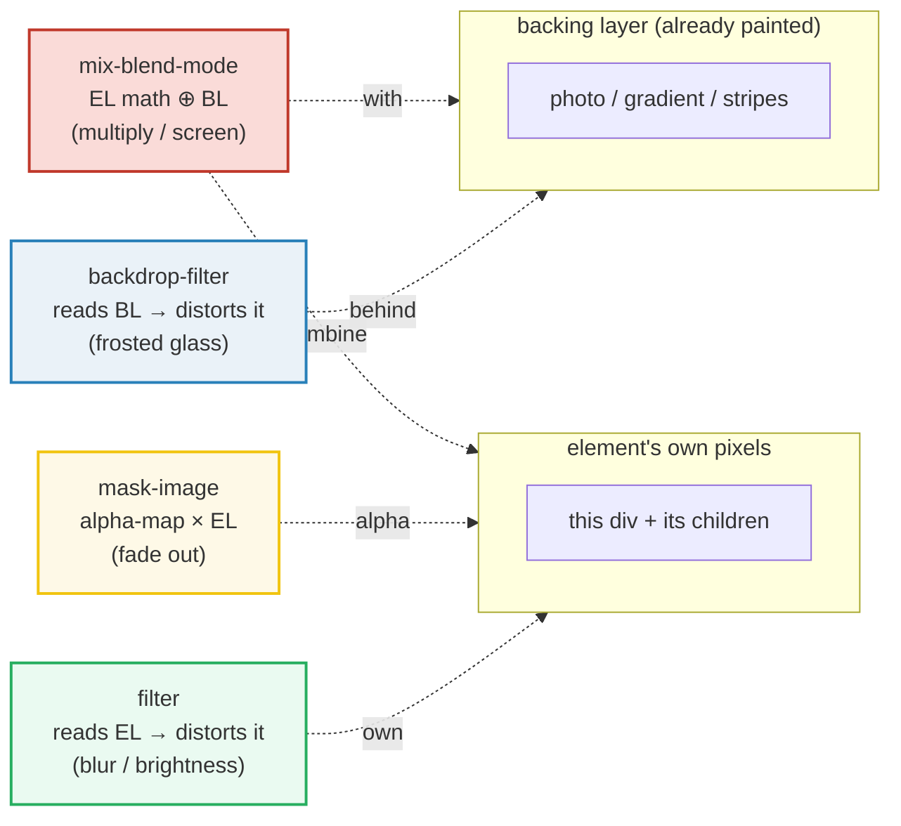
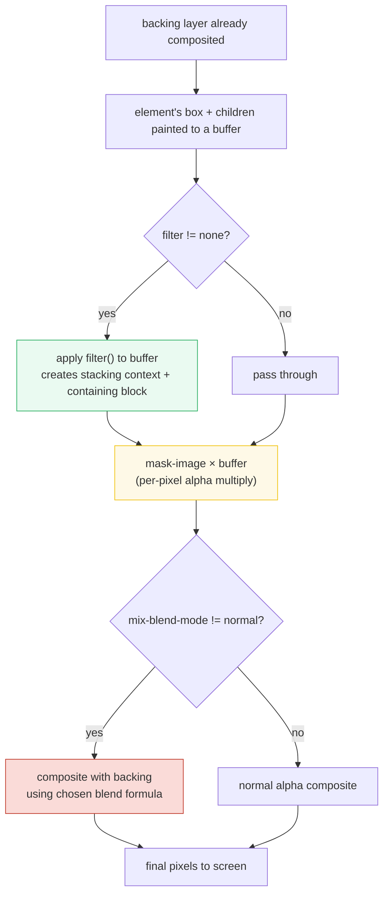
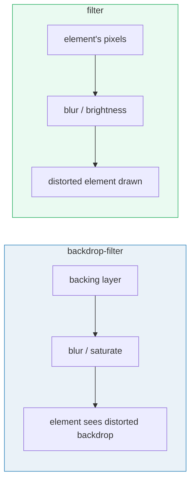

# Filters, Masks & Blend Modes

> **Companion demo:** [`filters_masks.html`](./filters_masks.html) — open in a browser.
> Four compositing pipelines, four live demos, one gold-check.

---

## 0. TL;DR — the one idea

CSS ships **four orthogonal pixel-pipelines** that beginners conflate because
they all "make things look funny." They read *different layers* and compose
*differently*:



| system | reads | distorts | Tailwind v4 classes |
|---|---|---|---|
| `backdrop-filter` | the **backing layer** | what's *behind* the element | `backdrop-blur-md`, `backdrop-saturate-150` |
| `filter` | the **element's own pixels** | the element + its children | `blur-sm`, `brightness-125`, `grayscale` |
| `mask-image` | an **alpha map** | element's opacity per-pixel | `mask-b-from-50%`, `mask-radial-from-60%` |
| `mix-blend-mode` | **both layers** | the math of stacking | `mix-blend-multiply`, `bg-blend-overlay` |

**Rule of thumb:** if you want to see what is *behind* an element distorted,
that's `backdrop-filter`. If you want the element *itself* distorted, that's
`filter`. If you want to hide parts of the element gradually, that's
`mask-image`. If you want the element to *react* to its backdrop's colors, that's
`mix-blend-mode`.

---

## 1. How it works

### 1.1 backdrop-filter — the frosted glass

`backdrop-filter: blur(12px)` tells the browser: "after you paint everything
behind this element, take that backing rectangle, run it through a blur, and
show the result *through* my translucent background." Without a translucent
background (`bg-white/10`, `bg-black/20`), the backdrop is occluded and you see
nothing — a classic first-time bug.

Tailwind v4 ships all the backdrop sub-filters as composable utilities. They
stack into a single `backdrop-filter` declaration:

```html
<!-- iOS-style saturated frosted glass -->
<div class="backdrop-blur-xl backdrop-saturate-150 backdrop-brightness-110 bg-white/10">
  Saturated, brightened, blurred backdrop
</div>
```

Compiles to roughly:
```css
.backdrop-blur-xl { --tw-backdrop-blur: blur(24px); }
.backdrop-saturate-150 { --tw-backdrop-saturate: saturate(1.5); }
/* … */
backdrop-filter: blur(24px) saturate(1.5) brightness(1.1);
```

### 1.2 filter — distorting the element itself

`filter` operates on the element's *own* rendered pixels (including descendants).
This is the same property you'd use to blur an ``, desaturate a card, or
drop-shadow a PNG. Tailwind ships each sub-filter as its own utility:

```html

```

Stacking `blur-sm brightness-125 ...` produces one `filter:` declaration —
browsers compose them in declaration order. Crucially, applying *any* non-`none`
`filter` creates a new **stacking context** and a **containing block** for
`position: fixed` descendants. This is why a blurred modal sometimes breaks its
fixed-position children.

### 1.3 mask-image — alpha multiplication

`mask-image` takes a picture (or gradient) and uses its **luminance/alpha** as a
per-pixel multiplier on the element's opacity. The counterintuitive bit: in the
default `mask-mode: alpha`, **black = fully visible, transparent = hidden**. This
is the *opposite* of how `opacity` feels.

Tailwind v4.1 (released March 2025) added ergonomic mask utilities. They compile
to `linear-gradient` / `radial-gradient` / `conic-gradient` masks:

```html
<!-- Fade bottom half to invisible -->
<div class="mask-b-from-50%">…</div>
<!-- Spotlight from center -->
<div class="mask-radial-from-60% mask-radial-at-center">…</div>
<!-- Arbitrary angle -->
<div class="mask-linear-45 mask-linear-from-60% mask-linear-to-80%">…</div>
```

The `mask-b-from-50%` utility compiles to:
```css
mask-image: linear-gradient(to bottom, black 50%, transparent var(--tw-mask-bottom-to));
mask-composite: intersect; /* default — combines with other masks */
```

For anything bespoke, arbitrary values work:
```html
<div class="[mask-image:linear-gradient(to_bottom,black,transparent)]">…</div>
```

### 1.4 mix-blend-mode — the math of stacking

`mix-blend-mode` decides the formula used when an element's pixels are drawn over
an existing backdrop. `multiply` multiplies channel values (result is always
darker — great for tinting). `screen` inverts, multiplies, inverts back (always
lighter — great for glow). `difference` subtracts (great for quirky effects).
`bg-blend-mode` is the analogue for *background layers* on the same element.

```html
<!-- Tint a photo red -->
<div class="absolute inset-0 mix-blend-multiply bg-red-500/60"></div>
<!-- Background layers blend with each other -->
<div class="bg-blend-overlay bg-[url(photo.jpg)] bg-red-500">…</div>
```

**Isolation:** `mix-blend-mode` blends with *everything behind it in the same
stacking context* — which can leak across components. Add `isolate` on a parent
to create a boundary: children blend only among themselves.

---

## 2. Mechanism / internals

### 2.1 The filter pipeline (per element)



Note: `backdrop-filter` is *not* in this pipeline — it runs on the **backing
layer** before the element is drawn, which is why it's more expensive (the
browser must snapshot and re-composite the backdrop).

### 2.2 backdrop-filter vs filter — the decisive difference



| question | backdrop-filter | filter |
|---|---|---|
| what gets distorted? | what's *behind* the element | the element + its children |
| needs translucent bg? | **yes** (otherwise backdrop is occluded) | no |
| cost | expensive (re-composites backdrop) | cheap |
| creates stacking context? | yes | yes |
| creates containing block for `position:fixed`? | yes | **yes** (gotcha!) |
| sub-filters | blur, brightness, contrast, grayscale, hue-rotate, invert, opacity, saturate, sepia | blur, brightness, contrast, drop-shadow, grayscale, hue-rotate, invert, saturate, sepia |

### 2.3 Mask types — which gradient for which job

| utility family | gradient type | typical use |
|---|---|---|
| `mask-t/r/b/l-from-…`, `mask-x/y-…` | linear | fade one/two edges out (scroll fade, vignette edges) |
| `mask-linear-<angle>` | linear | angled fade — text reveal, diagonal wipe |
| `mask-radial-from-…` + `mask-radial-at-*` | radial | spotlight, vignette, "focus in center" |
| `mask-conic-<angle>` + `mask-conic-from-…` | conic | pie-chart reveal, circular progress (storage dial) |
| `mask-[url(…)]` | image alpha | organic shapes (ink, brush, scribble borders) |
| `mask-[<arbitrary>]` | any | bespoke — any value `mask-image` accepts |

**Combining masks:** `mask-composite: intersect` (Tailwind's default) means
multiple `mask-*` utilities multiply their alphas together. Use
`mask-composite-add`/`subtract`/`exclude` to change the boolean logic.

### 2.4 Blend modes — quick semantic map

| mode | formula intuition | use when |
|---|---|---|
| `normal` | src overwrites dst | default |
| `multiply` | src × dst (always darker) | tint photos, shade |
| `screen` | 1 − (1−src)(1−dst) (always lighter) | glow, light beams |
| `overlay` | multiply on darks, screen on lights | contrast boost |
| `darken` / `lighten` | min / max per channel | shadow/highlight masks |
| `difference` / `exclusion` | |dst − src| | glitch, invert art |
| `hue` / `saturation` / `color` / `luminosity` | HSL-channel swaps | colorize grayscale, match palette |
| `plus-lighter` | src + dst (additive) | bloom, neon, HDR-feel |

---

## 3. Killer Gotchas

| trap | symptom | fix |
|---|---|---|
| **backdrop-filter with opaque bg** | frosted glass shows nothing — looks like a flat panel | use a translucent bg: `bg-white/10`, `bg-black/20`. The backdrop must *show through* |
| **backdrop-filter needs something behind it** | frost invisible against a solid page bg | put a busy/photo backing layer behind the card. Empty backdrop = nothing to blur |
| **filter creates a containing block for fixed children** | a `position: fixed` modal inside a blurred parent is anchored to the parent, not the viewport | move the fixed child out of the filtered ancestor, or drop the filter on the parent |
| **`backdrop-filter` on Safari needs `-webkit-`** | frost missing on iOS Safari in some setups | Tailwind v4 emits both prefixed and unprefixed — but custom CSS may need the `-webkit-backdrop-filter` fallback |
| **mask color intuition is reversed** | `mask-image: linear-gradient(to bottom, white, black)` makes the *bottom* visible, not hidden | black = visible, transparent = hidden. Use `black` → `transparent`, not `white` → `black` |
| **mix-blend-mode leaks across components** | a blended element affects the whole page bg, not just its card | add `isolate` on the parent — creates a stacking-context boundary |
| **`mix-blend-mode: difference` on identical colors → black** | overlapping same-color shapes vanish to black | expected math (`a − a = 0`); pick a different mode or change one layer's color |
| **performance: stacking backdrop-filter + filter + mask** | jank on scroll, especially mobile | each is a GPU layer; prefer fewer. `will-change: transform` can hint the compositor |
| **`drop-shadow` vs `box-shadow`** | drop-shadow follows the alpha shape (good for PNGs/SVGs); box-shadow follows the box | use `drop-shadow-*` for irregular shapes, `shadow-*` for boxes |
| **Tailwind v4.0 has no mask utilities** | classes like `mask-b-from-50%` don't exist pre-v4.1 | upgrade to v4.1+ (Play CDN `@tailwindcss/browser@4` tracks latest) or use arbitrary `[mask-image:…]` |

---

## Cheat sheet

```html
<!-- ── backdrop-filter (frosted glass) ────────────────────────────── -->
<div class="backdrop-blur-md bg-white/10">frost</div>
<div class="backdrop-blur-xl backdrop-saturate-150 backdrop-brightness-110 bg-black/20">
  saturated iOS glass
</div>

<!-- ── filter (distort the element itself) ─────────────────────────── -->

<div class="drop-shadow-2xl">PNG-accurate shadow</div>
<div class="invert">invert colors</div>

<!-- ── mask-image (v4.1 utilities) ─────────────────────────────────── -->
<div class="mask-b-from-50%">fade bottom half out</div>
<div class="mask-t-from-50% mask-b-from-50%">fade both edges</div>
<div class="mask-radial-from-60% mask-radial-at-center">spotlight</div>
<div class="mask-conic-from-75% mask-conic-to-75%">circular progress dial</div>
<div class="[mask-image:linear-gradient(45deg,black,transparent)]">bespoke</div>

<!-- ── mix-blend-mode & background-blend-mode ──────────────────────── -->
<div class="mix-blend-multiply bg-red-500/60">tint what's behind</div>
<div class="mix-blend-screen">glow</div>
<div class="bg-blend-overlay bg-[url(photo.jpg)] bg-blue-500">photo + color blend</div>

<!-- ── isolation (stop blend leak) ─────────────────────────────────── -->
<div class="isolate">
  <div class="mix-blend-multiply">blends only with siblings inside</div>
</div>
```

**Quick reference table:**

| intent | reach for |
|---|---|
| "I want to see the wallpaper blurred through this card" | `backdrop-blur-*` |
| "I want to blur / darken / desaturate THIS element" | `filter` (`blur-*`, `brightness-*`, `grayscale`) |
| "I want parts of this element to fade out" | `mask-b-from-…` / `mask-radial-from-…` |
| "I want this element to react to its backdrop's color" | `mix-blend-*` |
| "I want a PNG-accurate shadow that hugs the shape" | `drop-shadow-*` (a `filter` sub-util) |

---

## 🔗 Cross-references

- **[`transforms_3d.md`](./TRANSFORMS_3D.md)** — `transform-style: preserve-3d`
  + `mix-blend-mode` is how you get correct depth sorting in CSS 3D. A child
  with `mix-blend-mode` also *flattens* its parent's 3D context (a frequent
  gotcha when combining the two).
- **[`gradients_v4.md`](./GRADIENTS_V4.md)** — `mask-image` reads
  `linear-gradient()` / `radial-gradient()` — the exact same gradient syntax
  `bg-linear-to-r` compiles to. Master gradients first, masks come free.
- **[`transitions_timing.md`](./TRANSITIONS_TIMING.md)** — animating
  `filter`, `backdrop-filter`, or `mask-image` requires
  `transition-property: filter, backdrop-filter` (Tailwind's `transition`
  utility includes them). Watch performance: these are GPU-expensive.
- **[`keyframes_animate.md`](./KEYFRAMES_ANIMATE.md)** — `@keyframes` can drive
  `--tw-mask-linear-position` etc. to animate a mask wipe across an element —
  the v4.1 mask CSS variables are first-class animation targets.
- **[`HOW_TO_RESEARCH.md`](./HOW_TO_RESEARCH.md)** — how this bundle was built
  (rendered-ground-truth workflow).
- **Companion demo:** [`filters_masks.html`](./filters_masks.html)

---

## Sources

1. **Tailwind CSS v4.1 release blog** — "Text shadows, masks, and tons more"
   (announces the `mask-*` utility family shipped in v4.1, March 2025).
   <https://tailwindcss.com/blog/tailwindcss-v4-1>
2. **Tailwind CSS docs — `mask-image`** (v4.3, current): full reference for
   `mask-linear-*`, `mask-radial-*`, `mask-conic-*`, `mask-t/r/b/l-*`,
   arbitrary `[mask-image:…]`, and `mask-composite` defaults.
   <https://tailwindcss.com/docs/mask-image>
3. **Tailwind CSS docs — `backdrop-filter`** (sub-filter list, default values).
   <https://tailwindcss.com/docs/backdrop-filter>
4. **MDN — `backdrop-filter`**: notes on `-webkit-` prefix, performance, and the
   "must have translucent background" requirement.
   <https://developer.mozilla.org/en-US/docs/Web/CSS/backdrop-filter>
5. **Josh W. Comeau — "Next-level frosted glass with backdrop-filter"**: practical
   stacking of `backdrop-blur` + `backdrop-saturate` + `backdrop-brightness`.
   <https://www.joshwcomeau.com/css/backdrop-filter/>
6. **MDN — `mix-blend-mode`**: blend formula reference, `isolation` boundary
   behavior.
   <https://developer.mozilla.org/en-US/docs/Web/CSS/mix-blend-mode>
