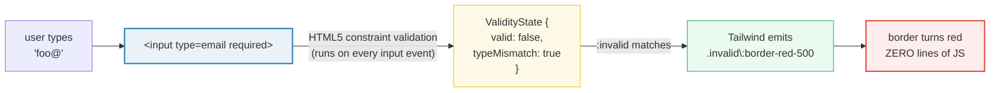

# Form State Variants

> **Companion demo:** [`form_state.html`](./form_state.html) — open in a browser.
> **Tailwind version:** v4.3.x via `@tailwindcss/browser@4` Play CDN.

---

## 0. TL;DR — the one idea

> **The analogy:** every form control is already a tiny state machine. The
> browser tracks whether it is `:required`, `:valid`, `:invalid`, `:checked`,
> `:disabled`, `:read-only`, `:placeholder-shown`, `:-webkit-autofill`, and
> `:default` — and it updates that state on every keystroke for free.
> Tailwind v4's form-state variants just **hand you a class suffix for each of
> those pseudo-classes**, so you can style the state declaratively — no JS
> class toggling, no React `useState`, no Alpine store.



The whole mechanism is ten CSS pseudo-classes Tailwind exposes as variant
suffixes:

| Variant | Compiles to | Trigger |
|---------|-------------|---------|
| `required:x` | `*:required …` | element has the `required` attribute |
| `valid:x` | `*:valid …` | passes HTML5 constraint validation |
| `invalid:x` | `*:invalid …` | fails validation (bad email, pattern mismatch, required+empty) |
| `user-valid:x` | `*:user-valid …` | valid AND user has interacted |
| `user-invalid:x` | `*:user-invalid …` | invalid AND user has interacted |
| `checked:x` | `*:checked …` | checkbox/radio is checked |
| `disabled:x` | `*:disabled …` | has `disabled` attribute (auto-dims, no pointer events) |
| `enabled:x` | `*:enabled …` | NOT disabled |
| `readonly:x` / `read-only:x` | `*:read-only …` | has `readonly` attribute |
| `placeholder-shown:x` | `*:placeholder-shown …` | input is empty and showing its placeholder |
| `autofill:x` | `*:-webkit-autofill …` | browser has auto-filled the value |
| `default:x` | `*:default …` | radio/checkbox/option had `checked`/`selected` in source HTML |

---

## 1. How it works — live validity from HTML5 constraint validation

The `:valid` / `:invalid` pseudo-classes are powered by the HTML5 **constraint
validation API**. The browser re-runs every applicable constraint on every
`input`, `change`, and `blur` event — no `checkValidity()` call needed.

```html
<input type="email" required placeholder="you@example.com"
  class="border-2 border-slate-600
         invalid:border-red-500 invalid:ring-2 invalid:ring-red-500/30
         valid:border-green-500 valid:ring-2 valid:ring-green-500/30">
```

- Empty + `required` → `valueMissing` → `:invalid` → red border.
- `"foo@"` → `typeMismatch` → `:invalid` → red border.
- `"foo@bar.com"` → `:valid` → green border.

Stack them with other variants for the canonical "show error only after focus
loss" pattern:

```html
<input type="email" required
  class="border-2 border-slate-600
         focus:invalid:border-red-500 focus:invalid:ring-2 focus:invalid:ring-red-500/40" />
```

`focus:invalid:` reads as "while focused AND invalid" — variants stack as a
logical AND, left-to-right.

### `checked:` vs `peer-checked:`

`checked:` styles the **checkbox itself** from its own state. `peer-checked:`
styles a **later sibling** from the checkbox's state (see
[`group_peer`](./group_peer.html)). They are complementary:

```html
<!-- the box itself reacts to its own :checked -->
<input type="checkbox" class="size-5 checked:bg-cyan-500 checked:border-cyan-500">

<!-- a LATER SIBLING reacts to the box's :checked (peer mechanism) -->
<input type="checkbox" class="peer" id="agree">
<button class="peer-checked:bg-cyan-500 peer-checked:text-white">Submit</button>
```

### `disabled:` vs `enabled:`

Native `<button disabled>` already dims and blocks clicks. The variants let you
**add** styling on top — e.g. a clearer cursor or color shift:

```html
<button disabled class="enabled:bg-cyan-500 enabled:cursor-pointer
                        disabled:cursor-not-allowed disabled:opacity-60">
  Submit
</button>
```

---

## 2. HTML5 validation rules — what makes an input `:invalid`

| Attribute / type | Constraint | Example that fails |
|------------------|------------|--------------------|
| `required` | field must have a non-empty value | empty input with `required` (`valueMissing`) |
| `type="email"` | must match the email regex (has `@` + domain) | `"hello"`, `"a@b"` (`typeMismatch`) |
| `type="url"` | must be an absolute URL | `"example.com"` (missing scheme) |
| `type="number"` | must parse as a number | `"abc"` |
| `min` / `max` | numeric/date range bound | `min="0"` with value `-5` (`rangeUnderflow`) |
| `minlength` / `maxlength` | character count range | `minlength="8"` with `"abc"` (`tooShort`) |
| `pattern="…"` | must match the regex (auto-anchored) | `pattern="[0-9]{4}"` with `"12"` (`patternMismatch`) |
| `step="n"` | value must be a multiple of `n` from `min` | `step="2"` with value `3` (`stepMismatch`) |

Each failure sets a flag on the element's `ValidityState` object
(`el.validity.valueMissing`, `el.validity.typeMismatch`, etc.). The composite
`el.validity.valid` is `false` if **any** flag is set, which is what drives
`:invalid`.

> **Gotcha:** an empty input WITHOUT `required` is **always** `:valid` (no
> constraint to violate). This is why the email demo in
> [`form_state.html`](./form_state.html) uses `required` — otherwise the empty
> field would already paint green.

---

## 3. The autofill WebKit hack — overriding the browser's chrome

When Chrome/Edge/Safari autofill an input, they paint a hardcoded background
color (yellow in Chrome, light blue in Safari) and a hardcoded text color —
and **plain `background-color` cannot override it**. The autofill paint
happens in a UA shadow tree that wins over author styles for those two
properties.

The only escape hatch is the non-standard `:-webkit-autofill` pseudo-class
(which Tailwind v4 exposes as `autofill:`), paired with a giant **inset
box-shadow** that "covers" the autofill background:

```css
input:-webkit-autofill {
  /* background-color is ignored here — the UA shadow paint wins.
     Use a 1000px inset box-shadow to cover the autofill background. */
  -webkit-box-shadow: 0 0 0 1000px #0b0f14 inset;
  -webkit-text-fill-color: #e6edf3;            /* overrides autofill text color */
  caret-color: #e6edf3;                         /* keeps the caret visible */
  transition: background-color 9999s ease-out;  /* optional: delay trick */
}
```

In Tailwind, apply this with arbitrary-value utilities under the `autofill:`
variant:

```html
<input class="
  autofill:[-webkit-box-shadow:0_0_0_1000px_#0b0f14_inset]
  autofill:[-webkit-text-fill-color:#e6edf3]
  autofill:caret-cyan-400
">
```

**Why three properties and not one?**

- `-webkit-box-shadow: ... inset` paints the visible background (since
  `background-color` is overridden by the UA).
- `-webkit-text-fill-color` overrides the autofill text color (this is NOT
  the same as `color` — autofill uses `-webkit-text-fill-color`).
- `caret-color` keeps the user's typing cursor visible against the new bg.

> **Why the demo can't trigger it live:** browsers explicitly forbid
> JavaScript from synthesizing `:-webkit-autofill`. Autofill only fires from
> real user gesture + saved profile in the password manager. The
> [`form_state.html`](./form_state.html) panel shows a static before/after
> mock using regular classes instead.

---

## 4. `placeholder-shown:` vs `placeholder:` — easy to confuse

| Variant | Targets | Use case |
|---------|---------|----------|
| `placeholder-shown:` | the **input element** itself, while empty | style the input's border/bg/outline when empty |
| `placeholder:` (note: NO `-shown`) | the **`::placeholder` pseudo-element** (the grey hint text) | color/style the placeholder text itself |

```html
<!-- Style the INPUT when empty: dashed border until the user types -->
<input placeholder="Type something..."
       class="border-2 placeholder-shown:border-dashed placeholder-shown:border-slate-600
              not-placeholder-shown:border-solid not-placeholder-shown:border-cyan-500">

<!-- Style the PLACEHOLDER TEXT (the grey hint), regardless of input state -->
<input placeholder="Type something..."
       class="placeholder:text-slate-500 placeholder:italic">
```

`not-placeholder-shown:` is the inverse — it matches once the user types
anything. Together they give you empty-vs-filled styling with zero JS.

---

## Killer Gotchas

| Trap | Symptom | Fix |
|------|---------|-----|
| **Empty non-required input is `:valid`** | `valid:border-green-500` paints green on first paint before the user has done anything | Add `required` if you want empty = invalid, OR use `user-valid:` / `user-invalid:` (only fire after interaction) |
| **`invalid:` yells at untouched fields** | Required email is red the moment the page loads — bad UX, users think they already made a mistake | Use `user-invalid:` instead — it only matches `:invalid` AND after the user has interacted (focus+blur, or input) |
| **`background-color` cannot override autofill** | You set `autofill:bg-slate-900` and Chrome's yellow autofill still shows through | Use the `:-webkit-autofill` box-shadow-inset hack (see §3). `background-color` is overridden by the UA shadow paint. |
| **Confusing `placeholder:` and `placeholder-shown:`** | `placeholder:border-red-500` styles the hint text, not the input border | Use `placeholder-shown:` for the input element, `placeholder:` only for the grey hint pseudo-element |
| **Disabled button still styled as enabled** | You used `disabled:opacity-50` but the button still shows bright colors | `disabled:` does NOT suppress `enabled:` rules. Either remove the `enabled:` classes or use `disabled:` to override every property you set with `enabled:`. |
| **`checked:` does not fire on `indeterminate`** | Tri-state checkbox with `indeterminate=true` does not pick up `checked:` styles | `:checked` requires a real `checked` attribute/property. `indeterminate` is its own state — style it via a `[aria-checked=mixed]:` arbitrary variant. |
| **`autofill:` is WebKit-only** | Firefox uses `:autofill` (no prefix); Tailwind's `autofill:` variant emits `:-webkit-autofill` only | For full cross-browser support, add a `[@supports selector(:autofill)]:` arbitrary variant OR accept Firefox's default autofill chrome. |
| **`default:` is NOT the current state** | You used `default:border-cyan-500` expecting it to track the current checkbox | `:default` matches the option that had `checked`/`selected` in the **source HTML** — it does NOT change when the user toggles. Use `checked:` for live state. |
| **`read-only:` vs `readonly:`** | You typed `readonly:` and it didn't work in some setups | Tailwind v4 supports both `readonly:` and `read-only:` (alias). The CSS pseudo-class is `:read-only` (with hyphen). Both suffixes compile to the same selector. |
| **Setting `.value` from JS does update `:valid`/`:invalid`** (this is a feature, not a bug) | Programmatic value changes DO re-run constraint validation synchronously | This is reliable and is what the [`form_state.html`](./form_state.html) gold-check relies on. Don't assume you need to call `checkValidity()`. |

### Cheat sheet

```html
<!-- 1. Email: red while invalid, green when valid -->
<input type="email" required
  class="border-2
         invalid:border-red-500 invalid:ring-2 invalid:ring-red-500/30
         valid:border-green-500 valid:ring-2 valid:ring-green-500/30">

<!-- 2. Better UX: only flag AFTER the user interacts -->
<input type="email" required
  class="border-2 user-invalid:border-red-500 user-valid:border-green-500">

<!-- 3. Mark every required field with a ring -->
<input required class="required:ring-1 required:ring-cyan-500">

<!-- 4. Disabled vs enabled button -->
<button disabled
  class="enabled:bg-cyan-500 enabled:cursor-pointer
         disabled:opacity-60 disabled:cursor-not-allowed">
  Submit
</button>

<!-- 5. Empty vs filled (placeholder-shown) -->
<input placeholder="Type..."
  class="placeholder-shown:border-dashed placeholder-shown:border-slate-600
         not-placeholder-shown:border-solid not-placeholder-shown:border-cyan-500">

<!-- 6. Style the placeholder TEXT -->
<input placeholder="Type..."
  class="placeholder:text-slate-500 placeholder:italic">

<!-- 7. Autofill WebKit hack (cross-browser bg override) -->
<input class="
  autofill:[-webkit-box-shadow:0_0_0_1000px_#0b0f14_inset]
  autofill:[-webkit-text-fill-color:#e6edf3]
  autofill:caret-cyan-400">

<!-- 8. Read-only field styled as static text -->
<input readonly value="computed-value"
  class="read-only:bg-slate-800 read-only:text-slate-400 read-only:cursor-default">

<!-- 9. Styled checkbox (it styles itself) -->
<input type="checkbox" class="size-5 checked:bg-cyan-500 checked:border-cyan-500">

<!-- 10. Enable a sibling button from a checkbox (peer + checked) -->
<input type="checkbox" class="peer" id="agree">
<button class="peer-checked:bg-cyan-500 peer-checked:text-white
               peer-checked:cursor-pointer">Submit</button>
```

---

## 🔗 Cross-references

- [group_peer](/tailwind/group_peer.html) — `group-*` and `peer-*`. The form-state variants drive the SOURCE half of these patterns: `peer-checked:`, `peer-invalid:`, `group-invalid:` all read the form-state pseudo-classes through the parent/sibling combinators. This is the canonical pairing.
- [has_variant](/tailwind/has_variant.html) — `:has()` selector: `has-*`, `group-has-*`, `peer-has-*`. Use this when you need "style a parent if any child input is `:invalid`" — e.g. `has-invalid:` on a `<form>` to flag the whole form. Group/peer cannot do this.
- [child_variants](/tailwind/child_variants.html) — `first:`, `last:`, `even:`, `odd:`, `empty:`, `nth-*`. `empty:` is the structural-state cousin of `placeholder-shown:` — `empty:` matches elements with no children (incl. `<input>` with no value attribute), while `placeholder-shown:` matches inputs that currently display a placeholder.
- [frontend/tailwind: forms & inputs](/frontend/tailwind/tailwind_cdn_playground.html) — the v4 onboarding bundle covers basic form styling; this guide is the deep dive on validation/interaction state.

---

## Sources

1. **Tailwind CSS — Form states**: https://tailwindcss.com/docs/hover-focus-and-other-states#form-states (v4.3, official docs — covers `required:`, `valid:`, `invalid:`, `checked:`, `disabled:`, `enabled:`, `placeholder-shown:`, `default:`)
2. **Tailwind CSS — `read-only` variant**: https://tailwindcss.com/docs/hover-focus-and-other-states#read-only (v4.3, official docs)
3. **MDN — `:valid` / `:invalid`**: https://developer.mozilla.org/en-US/docs/Web/CSS/:valid (HTML5 constraint validation semantics)
4. **MDN — `:placeholder-shown`**: https://developer.mozilla.org/en-US/docs/Web/CSS/:placeholder-shown (vs `::placeholder` pseudo-element)
5. **MDN — `:-webkit-autofill`**: https://developer.mozilla.org/en-US/docs/Web/CSS/:-webkit-autofill (the non-standard WebKit pseudo-class that drives the autofill: variant)
6. **MDN — `ValidityState`**: https://developer.mozilla.org/en-US/docs/Web/API/ValidityState (the constraint flags: `valueMissing`, `typeMismatch`, `patternMismatch`, etc.)
7. **Chrome Developers — Autofill styling**: https://developer.chrome.com/docs/css-user-agent/autofill (why `background-color` is overridden and the box-shadow-inset hack)
