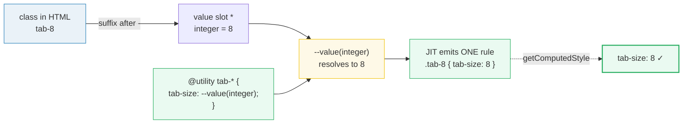
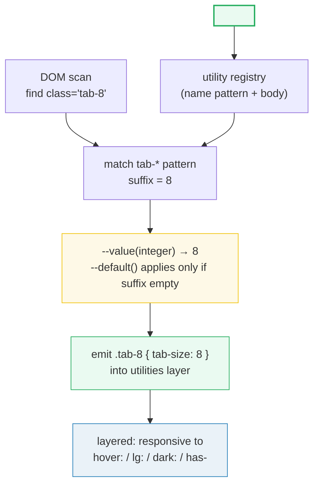

# Functional `@utility`

> **Companion demo:** [`functional_utility.html`](./functional_utility.html) — open in a browser.
> The gold-check proves `tab-4` → `tab-size: 4` **and** `tab-8` → `tab-size: 8`
> (integer is actually plumbed), plus bare `tab` → `4` via `--default()`.

---

## 0. TL;DR — the one idea

A **static** `@utility` (`@utility tab-4 { tab-size: 4 }`) is one rule for one
class. A **functional** `@utility` ends in `-*` and is a **template**: the `*` is a
value slot, and the special `--value()` function resolves whatever you put there.
This is exactly how every built-in utility (`w-4`, `p-8`, `text-cyan-500`) is
authored internally — so your custom utilities inherit the full variant system
(`hover:`, `lg:`, `dark:`, `group-has-`, …) for free.



**Use it when** a *family* of related values shares one formula/property (a scale,
a step count, a size factor). **Avoid it** for a single one-off value — that's an
[arbitrary value](./arbitrary_values.html) (`w-[117px]`).

---

## 1. How it works

### 1.1 Static → functional

```css
/* STATIC — one rule, one value. Want tab-8? Write another block. */
@utility tab-4 {
  tab-size: 4;
}

/* FUNCTIONAL — a template with a value slot */
@utility tab-* {
  tab-size: --value(integer, --default(4));
}
/* .tab-2, .tab-4, .tab-8, .tab-76 all compile on demand.
   Bare .tab resolves to 4 via --default(4). */
```

The CDN/build JIT scans the DOM for classes matching `tab-*` and emits **one
concrete CSS rule per used value**. Unused values produce nothing — the output is
still tree-shaken.

### 1.2 `--value()` — the resolver

`--value()` is the bridge between the class suffix and your CSS. It has five
shapes, all verified against the official v4 docs:

| form | syntax | matches | example class |
|---|---|---|---|
| **theme key** | `--value(--tab-size-*)` | keys defined in `@theme` | `tab-github` ← `--tab-size-github: 8` |
| **bare value** | `--value(integer)` | a raw value of a CSS type | `tab-4` (types: `number`, `integer`, `ratio`, `percentage`) |
| **literal** | `--value("inherit", "unset")` | exact keyword strings (quoted) | `tab-inherit` |
| **arbitrary value** | `--value([integer])` | a bracketed value of a type | `tab-[76]` (types: `length`, `color`, `image`, `*`, …) |
| **default value** | `--value(integer, --default(4))` | bare class with no suffix | `tab` → `tab-size: 4` |

You can stack multiple `--value()` declarations (or comma-separated arguments) so
one utility accepts theme, bare, *and* arbitrary values. Each declaration that
fails to resolve is **silently dropped** from the output:

```css
@theme { --tab-size-github: 8; }

@utility tab-* {
  /* left-to-right resolution — first match wins per input */
  tab-size: --value(--tab-size-*, integer, [integer]);
}
/* tab-github → 8 (theme) · tab-4 → 4 (bare) · tab-[76] → 76 (arbitrary) */
```

### 1.3 Bare values & defaults

Bare values are validated against a CSS data type — only four types are accepted
as bare: **`number`, `integer`, `ratio`, `percentage`**. To make the *bare class*
(no number) work, wrap a `--default()` inside `--value()`:

```css
@utility tab-* {
  tab-size: --value(integer, --default(4));
}
```

This matches `tab-2`, `tab-4`, **and** plain `tab` (which resolves to `4`). It
does **not** match `tab-2.5` (that needs `number`, not `integer`).

> ⚠️ **Busted myth:** you'll find old blog posts showing
> `--value(integer)?` — a `?` to mark the value "optional". **That syntax does
> not exist in v4.** The real mechanism is the `--default()` function shown above.

### 1.4 Modifiers — the part after `/`

`--modifier()` works exactly like `--value()` but reads the `slash` part of a
class. This is how the built-in `text-*` reads its line-height
(`text-lg/7` → leading `7`):

```css
@utility tab-* {
  tab-size: --value(integer);
  line-height: --modifier(integer, --default(1));
}
/* tab-2/3 → tab-size 2, line-height 3 · tab-2 → line-height 1 (default) */
```

### 1.5 Functional utilities set many properties

A functional `@utility` body can declare multiple properties — that's how the
built-in `line-clamp-*` sets four declarations from one value. The demo's
`grid-auto-fill-*` sets `display`, `gap`, and `grid-template-columns`:

```css
@utility grid-auto-fill-* {
  display: grid;
  gap: 0.75rem;
  grid-template-columns: repeat(auto-fill, minmax(calc(--value(integer) * 4rem), 1fr));
}
```

The integer is plumbed straight into a `calc()` expression — proving functional
utilities are real templates, not just pass-through.

---

## 2. Mechanism / internals



Key points:

- **Registration:** `@utility name-*` registers a *pattern* in the utility
  registry. Static `@utility name` registers one literal class.
- **On-demand emission:** the JIT only emits a rule when a matching class is
  detected in source/ DOM. `tab-99` with no usage → no CSS.
- **Layer placement:** functional utilities go into the `utilities` layer
  alongside built-ins, so variants compose for free (`hover:tab-8`).
- **Left-to-right resolution:** in a comma-separated `--value(a, b, c)`, the
  first form that resolves wins; the rest are ignored for that input.
- **Silent drop:** any declaration whose `--value()`/`--modifier()` doesn't
  resolve is omitted from that rule's output (not an error).

### Negative values

v4 has no sign flag on the value. Register the negative form as a **separate**
utility, mirroring how built-in `-inset-*` is defined:

```css
@utility inset-* {
  inset: --spacing(--value(integer));
}
@utility -inset-* {
  inset: --spacing(--value(integer) * -1);   /* note the * -1 */
}
```

### Fractions

Use the CSS `ratio` type. Tailwind treats the value *and* the modifier as a
single ratio, so `aspect-3/4` works:

```css
@utility aspect-* {
  aspect-ratio: --value(--aspect-ratio-*, ratio, [ratio]);
}
```

---

## 3. Killer Gotchas

| trap | symptom | fix |
|---|---|---|
| **`text-shadow-*` now collides with v4.3 built-in** | Your custom `text-shadow-*` and the new built-in preset scale (`text-shadow-sm/lg`) share a namespace | They coexist — the resolver picks the numeric branch (`text-shadow-6`) for your integer and the theme-key branch for presets. If you only need presets, **don't reinvent**. |
| **Old `?` optional-value syntax** | `--value(integer)?` doesn't compile / does nothing | Use `--value(integer, --default(4))`. The `?` shorthand is a myth from pre-release drafts. |
| **Bare value type mismatch** | `tab-2.5` silently produces no rule under `@utility tab-* { tab-size: --value(integer) }` | `integer` rejects decimals. Use `--value(number)` (accepts `2.5`) or add `--value([number])` for `tab-[2.5]`. |
| **No `* -1` on the value itself** | `@utility -mt-* { margin-top: --value(integer); }` produces a *positive* margin | Multiply: `margin-top: calc(--value(integer) * -1 * 1rem)` — or register via `--spacing(...) * -1` like built-ins. |
| **Modifier branch disappears silently** | `tab-2/3` only sets `tab-size`; the `line-height` declaration vanishes | Any declaration depending on `--modifier()` is dropped when no modifier is present. That's intended — if you need a line-height anyway, give it `--default()`. |
| **Forgot `<style type="text/tailwindcss">`** | `@utility` is ignored entirely; classes never compile | Plain `<style>` is not processed by the CDN's JIT. Use `type="text/tailwindcss"` (or `@import "tailwindcss"` in a build). |
| **Checking computed styles too early** | Gold-check reads `tab-size: 8` (UA default) right after load | The CDN compiles async. Poll via `requestAnimationFrame` for ~2–3s before declaring FAIL. |
| **Two `--value()` forms both "match"** | Unexpected output when theme key and bare integer collide | Resolution is **left-to-right** within a single `--value(a, b, c)`; reorder so the most specific form is first. |

---

## 4. Real-world examples

| need | utility | why functional, not arbitrary |
|---|---|---|
| Code-block indent width tied to a setting | `@utility tab-* { tab-size: --value(integer, --default(4)); }` | Used across dozens of `<pre>` blocks with variants (`dark:tab-8`); arbitrary `[8]` per element doesn't scale. |
| Brand text-glow scale | `@utility text-shadow-* { text-shadow: 0 0 calc(--value(integer)*.3rem) var(--glow); }` | One formula, N intensities, themeable color via `var()`. |
| Auto-filling responsive card grid | `@utility grid-auto-fill-* { ... minmax(calc(--value(integer)*4rem), 1fr); }` | A *family* of breakpoints from one integer; arbitrary `grid-cols-[repeat(...)]` is unreadable. |
| Truncate after N lines (built-in pattern) | `@utility line-clamp-* { -webkit-line-clamp: --value(integer); ... }` | Four declarations from one value — the canonical multi-property functional utility. |
| Numeric opacity scale | `@utility opacity-* { opacity: calc(--value(integer) * 1%); }` | Integer → percentage transform; mirrors how Tailwind's own `opacity-*` is authored. |
| Custom scroll-snap step | `@utility snap-step-* { scroll-snap-stop: always; scroll-snap-align: start; scroll-margin: calc(--value(integer)*1rem); }` | Multi-property + formula; used with `md:` variants. |

---

## 5. When to use functional `@utility` vs the alternatives

| frequency | tool | example |
|---|---|---|
| once, never again | [arbitrary value](./arbitrary_values.html) | `top-[117px]` |
| a CSS prop Tailwind lacks, once | [arbitrary property](./arbitrary_properties.html) | `[mask-type:luminance]` |
| one design token reused everywhere | `@theme` → generated utility | `--color-brand` → `bg-brand` |
| a **family** of utilities from a formula/scale | **functional `@utility`** | `tab-*`, `grid-auto-fill-*` |
| custom selector logic, once | [arbitrary variant](./arbitrary_variants.html) | `[&:nth-child(3)]:underline` |
| reset/normalize base element styles | [Preflight](./preflight_reset.html) + `@layer base` | `@layer base { h1 { ... } }` |

**Rule of thumb:** if you'd write the *same* arbitrary value 3+ times, or it's one
of N values from a formula, promote it to a functional `@utility`. If it's a
once-off, keep it inline.

---

### Cheat sheet

```css
/* 1 · register a parameterized family */
@utility tab-* {
  tab-size: --value(integer);
}

/* 2 · bare class gets a default */
@utility tab-* {
  tab-size: --value(integer, --default(4));   /* tab → 4 */
}

/* 3 · accept theme + bare + arbitrary, left-to-right */
@utility tab-* {
  tab-size: --value(--tab-size-*, integer, [integer]);
}

/* 4 · multi-property body (like built-in line-clamp-*) */
@utility grid-auto-fill-* {
  display: grid;
  gap: .75rem;
  grid-template-columns: repeat(auto-fill, minmax(calc(--value(integer) * 4rem), 1fr));
}

/* 5 · read the /modifier */
@utility tab-* {
  tab-size: --value(integer);
  line-height: --modifier(integer, --default(1));   /* tab-2/3 → lh 3 */
}

/* 6 · negative values = separate utility, * -1 */
@utility -inset-* {
  inset: calc(--value(integer) * -1px);
}
```

```html
<!-- variants compose for free — functional utilities live in the utilities layer -->
<pre class="tab-4 dark:hover:tab-8">…</pre>
<h1 class="text-shadow-6">glow</h1>
<div class="grid-auto-fill-4 lg:grid-auto-fill-6">…cards…</div>
```

---

## 🔗 Cross-references

- [`arbitrary_values.html`](./arbitrary_values.html) — the one-off escape hatch
  (`w-[117px]`). Functional `@utility` is the **reusable, variant-friendly**
  counterpart for *families* of values.
- [`arbitrary_properties.html`](./arbitrary_properties.html) — one-off CSS
  properties Tailwind doesn't cover (`[mask-type:luminance]`). When that property
  becomes a scale, graduate to functional `@utility`.
- [`arbitrary_variants.html`](./arbitrary_variants.html) — custom selector logic
  (`[&:nth-child(3)]:`). Functional `@utility` is about *custom values*; arbitrary
  *variants* are about custom *selectors*. They compose: `hover:tab-8`.
- [`preflight_reset.html`](./preflight_reset.html) — base-layer resets. Functional
  utilities sit in the **`utilities` layer**, which correctly overrides Preflight.
- [`container_basics.html`](./container_basics.html) — same `<style type="text/tailwindcss">`
  JIT pipeline; `@container` + functional `@utility` compose (`@md:grid-auto-fill-4`).

---

## Sources

1. **Tailwind CSS — Adding custom styles → Functional utilities** (official, v4.3):
   <https://tailwindcss.com/docs/adding-custom-styles#functional-utilities>
   — defines `@utility name-*`, the `--value()` forms (theme/bare/literal/arbitrary),
   `--default()`, `--modifier()`, negative values, and fractions.
2. **Tailwind CSS — Functions & directives → `@utility`** (official, v4.3):
   <https://tailwindcss.com/docs/functions-and-directives#utility-directive>
   — `@utility` registers custom utilities in the `utilities` layer; they work
   with `hover`, `focus`, `lg`, and all variants.
3. **Tailwind CSS — `tab-size` utility** (official, v4.3):
   <https://tailwindcss.com/docs/tab-size>
   — canonical `tab-*` example referenced throughout (built-in is `tab-size-*`;
   the short `tab-*` alias is the docs' own `@utility` illustration).
