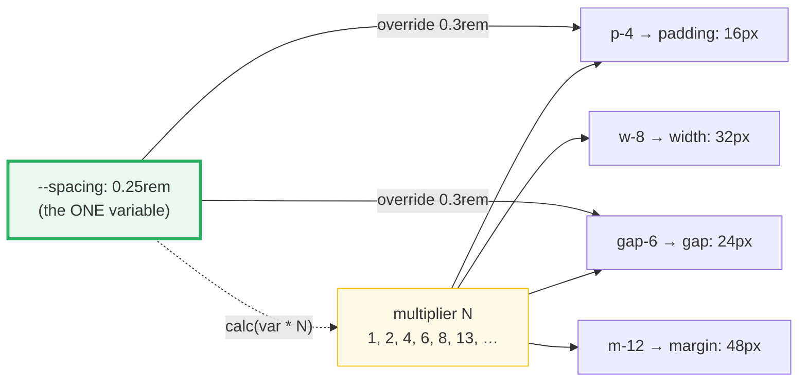

# Gap & the Spacing Scale

> **Companion demo:** [`gap_spacing.html`](./gap_spacing.html) — open in a
> browser, drag the `--spacing` slider, watch every utility rescale live.

---

## 0. TL;DR — the one idea

Tailwind v4 derives the **entire spacing scale** — padding, margin, gap, width,
height, inset — from a single CSS variable: `--spacing` (default `0.25rem` =
4px). Every `*-N` utility compiles to `calc(var(--spacing) * N)`. Change that
one variable and the whole design system rescales in lockstep. The `gap-*`
family maps to the CSS `gap` / `column-gap` / `row-gap` properties and works
identically in flexbox and grid — it replaces v3's removed `space-x-*` /
`space-y-*` utilities.



---

## 1. How it works

### The single variable

```css
@theme {
  --spacing: 0.25rem;  /* default. ONE token controls everything. */
}
```

The compiler turns every spacing utility into a multiplier of `var(--spacing)`,
**not** a hardcoded rem value:

| utility | compiled CSS | default px |
|---|---|---|
| `p-1`  | `padding: calc(var(--spacing) * 1)`  | 4px |
| `p-4`  | `padding: calc(var(--spacing) * 4)`  | 16px |
| `gap-6`| `gap: calc(var(--spacing) * 6)`       | 24px |
| `m-12` | `margin: calc(var(--spacing) * 12)`   | 48px |
| `w-8`  | `width: calc(var(--spacing) * 8)`     | 32px |

Because every utility *references* the variable, overriding `--spacing` on
`:root` rescales them all at runtime — no recompile, no class changes. This is
what the live slider in [`gap_spacing.html`](./gap_spacing.html) demonstrates.

### The default spacing scale

| suffix | N | px (0.25rem) | rem |
|---|---|---|---|
| `-0`   | 0    | 0   | 0 |
| `-px`  | —    | 1   | 1px (fixed) |
| `-0.5` | 0.5  | 2   | 0.125rem |
| `-1`   | 1    | 4   | 0.25rem |
| `-1.5` | 1.5  | 6   | 0.375rem |
| `-2`   | 2    | 8   | 0.5rem |
| `-3`   | 3    | 12  | 0.75rem |
| `-4`   | 4    | **16** | 1rem |
| `-5`   | 5    | 20  | 1.25rem |
| `-6`   | 6    | 24  | 1.5rem |
| `-8`   | 8    | 32  | 2rem |
| `-10`  | 10   | 40  | 2.5rem |
| `-12`  | 12   | 48  | 3rem |
| `-16`  | 16   | 64  | 4rem |
| `-20`  | 20   | 80  | 5rem |
| `-24`  | 24   | 96  | 6rem |
| `-32`  | 32   | 128 | 8rem |
| `-13`  | 13   | 52  | 3.25rem (v4 dynamic) |

> **v3 → v4 change:** in v3, `p-13` didn't exist — you had to extend the theme
> or fall back to `p-[3.25rem]`. In v4 the compiler generates
> `calc(var(--spacing) * N)` for **any** numeric `N` on demand. The named steps
> above are just the traditional defaults; the scale is now continuous.

---

## 2. Mechanism / internals

### gap-* → the CSS `gap` property

The `gap` utilities map directly to the CSS Box Alignment properties:

| utility | CSS property |
|---|---|
| `gap-6`   | `gap` |
| `gap-x-6` | `column-gap` |
| `gap-y-6` | `row-gap` |

`gap` works in **flexbox**, **grid**, and **multi-column** containers. It is the
modern replacement for margin-based spacing between siblings.

### gap vs margin — why gap wins

| concern | `gap-*` | `mr-*` / `mb-*` on children |
|---|---|---|
| outer edge | ✅ no stray margin on last child | ❌ last child has leftover margin (needs `:last-child` reset) |
| wrapping (`flex-wrap`) | ✅ correct on every wrapped row | ❌ broken on wrapped rows |
| margin collapse | ✅ immune | ❌ vertical margins collapse |
| works in grid | ✅ yes | ❌ no (grid has no per-axis "next sibling") |
| RTL / logical | ✅ always logical | ⚠️ `mr-*` is physical; use `me-*` |
| dynamic children (JS) | ✅ just works | ❌ must manage per-child |

> **v4 removed `space-x-*` / `space-y-*`.** Use `gap-x-*` / `gap-y-*` (or
> `gap-*`) on the parent instead. `space-*` relied on margins + selector hacks
> that break with wrapping; `gap` does not.

### Custom `--spacing` — rescale the whole system

```css
@theme {
  --spacing: 0.3rem;  /* now p-4 = 12px, gap-6 = 18px, w-8 = 24px — everywhere */
}
```

Or scope it to a subtree (the variable cascades like any custom property):

```css
.dense { --spacing: 0.2rem; }   /* this subtree uses a tighter scale */
```

Children of `.dense` resolve `var(--spacing)` to `0.2rem`, so every `p-*`,
`gap-*`, `m-*` inside shrinks. One property, system-wide density control — no
new utility classes, no rebuild.

---

## 3. Arbitrary spacing — the escape hatch

Bracket notation emits the value **verbatim** — it does NOT reference
`var(--spacing)`, so it will not rescale:

| utility | compiled CSS | rescales? |
|---|---|---|
| `p-4`                          | `calc(var(--spacing) * 4)` | ✅ |
| `p-13`                         | `calc(var(--spacing) * 13)`| ✅ (v4 dynamic) |
| `p-[13px]`                     | `13px`                     | ❌ |
| `gap-[0.75rem]`                | `0.75rem`                  | ❌ |
| `mx-[clamp(1rem,5vw,3rem)]`    | `clamp(...)`               | ❌ |
| `gap-[var(--my-gap)]`          | `var(--my-gap)`            | ❌ (your var) |

Reach for arbitrary values only for genuine one-offs (a Figma token, a fluid
`clamp()`). For values that *should* track system density, prefer the integer
scale (`p-13`) so they rescale with `--spacing`.

---

## 4. Killer Gotchas

| trap | symptom | fix |
|---|---|---|
| `space-x-4` silently does nothing | children butt together, no space | v4 **removed** `space-*`; use `flex gap-4` / `grid gap-4` on the parent |
| override `--spacing` but nothing changes | utilities still show old values | you set it on a child that the utility's element isn't a descendant of; `var(--spacing)` resolves up the tree — set it at the highest level you want to affect (`:root` or a wrapping scope) |
| `gap-4` looks like 0 | gap is invisible / zero | the parent isn't a flex/grid/multicol container — `gap` only applies to those display types |
| `p-13` "doesn't exist" (v3 muscle memory) | you reach for `p-[3.25rem]` | v4 generates any integer multiplier — `p-13` works natively; prefer it over the bracket form |
| arbitrary `p-[13px]` ignores the `--spacing` slider | that one box stays fixed while others flex | by design — bracket values are literal; use `p-13` if you want it on the scale |
| root font-size change shifts your pixel math | `p-4` is no longer 16px after `html { font-size: 18px }` | `--spacing` is in `rem`, so it tracks the root font-size — that's the point (zoom-friendly), not a bug |
| expecting a negative gap (`-gap-4`) | invalid / ignored | there is no negative `gap`; use `gap-0` or restructure. Negative values exist for margin (`-m-4`) and inset only |

---

## Cheat sheet

```css
@theme {
  --spacing: 0.25rem;          /* the ONE knob (default 4px) */
}
```

| want | write | note |
|---|---|---|
| space between flex/grid children | `flex gap-6` / `grid gap-6` | replaces v3 `space-x-6` |
| different row vs column gaps | `gap-x-8 gap-y-2` | `column-gap` + `row-gap` |
| 16px padding | `p-4` | `calc(var(--spacing) * 4)` |
| off-scale on-system value (52px) | `p-13` | v4 dynamic — any integer works |
| literal escape | `p-[13px]` / `gap-[0.75rem]` | does NOT rescale with `--spacing` |
| rescale whole system | `@theme { --spacing: 0.3rem; }` | one variable, everywhere |
| scoped density | `.dense { --spacing: 0.2rem; }` | children inherit the tighter scale |

---

## 🔗 Cross-references

- **[arbitrary_values](./arbitrary_values.html)** — the bracket syntax
  (`p-[13px]`, `gap-[0.75rem]`) is the literal escape hatch off the spacing scale
- **[container_patterns](./container_patterns.html)** — `gap-*` is how the
  responsive card grids in those patterns space their cells; it rescales with
  `--spacing` just like padding
- **[subgrid_layout](./subgrid_layout.html)** *(planned)* — subgrid inherits the
  parent's `gap`, so the `--spacing` scale flows through nested grids unchanged
- **[frontend/tailwind: design tokens](/frontend/tailwind/tailwind_design_tokens.html)**
  — the `@theme` `--spacing` namespace: this is the single token every spacing
  utility multiplies

---

## Sources

1. **Tailwind CSS — "Tailwind CSS v4.0" (release blog).** Documents the dynamic
   spacing scale derived from a single `--spacing` variable (default `0.25rem`)
   and the removal of the v3 fixed lookup table.
   <https://tailwindcss.com/blog/tailwindcss-v4>
2. **Tailwind CSS docs — Gap.** Maps `gap-*` / `gap-x-*` / `gap-y-*` to the CSS
   `gap` / `column-gap` / `row-gap` properties and confirms flex + grid support.
   <https://tailwindcss.com/docs/gap>
3. **MDN Web Docs — `gap` (CSS).** The underlying CSS Box Alignment property;
   confirms `gap` applies to flex, grid, and multi-column layouts and does not
   collapse like margins.
   <https://developer.mozilla.org/en-US/docs/Web/CSS/gap>
