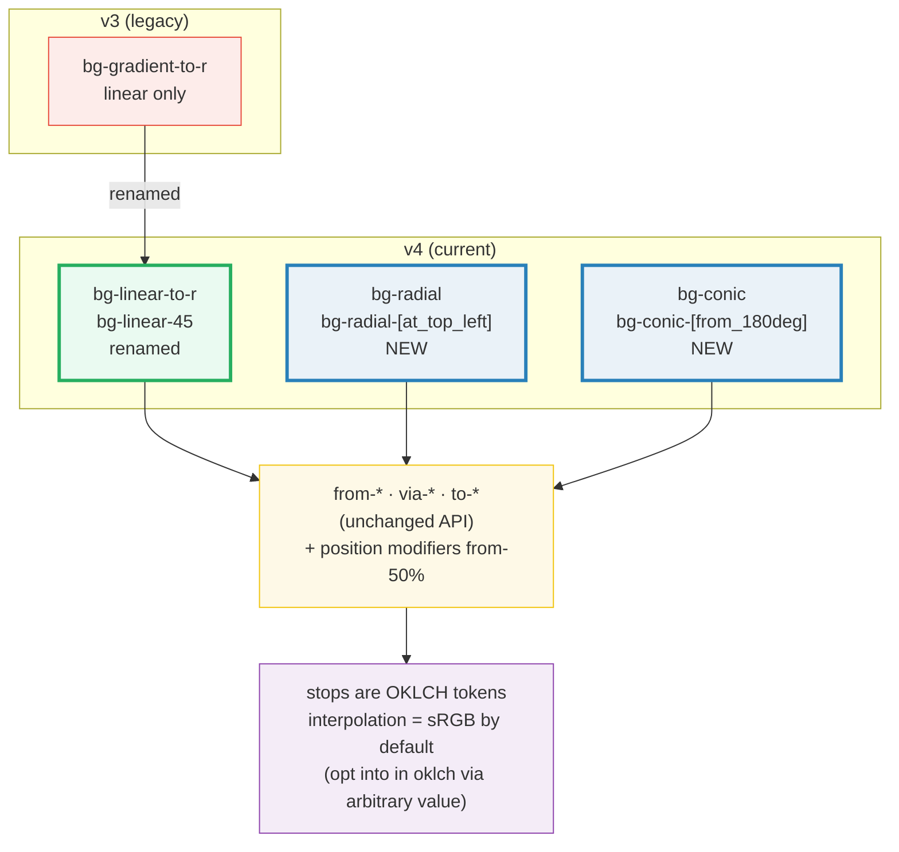
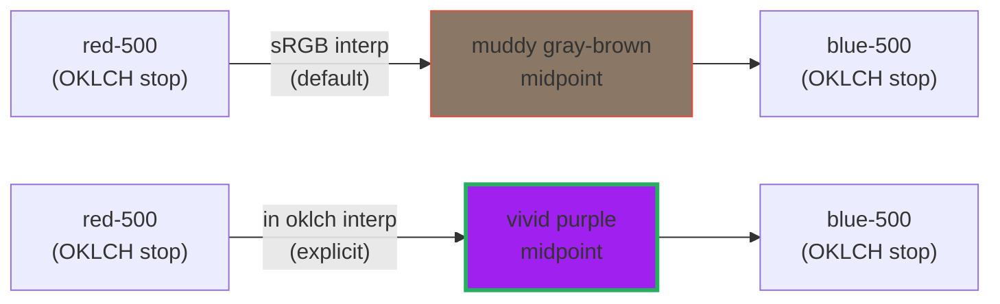
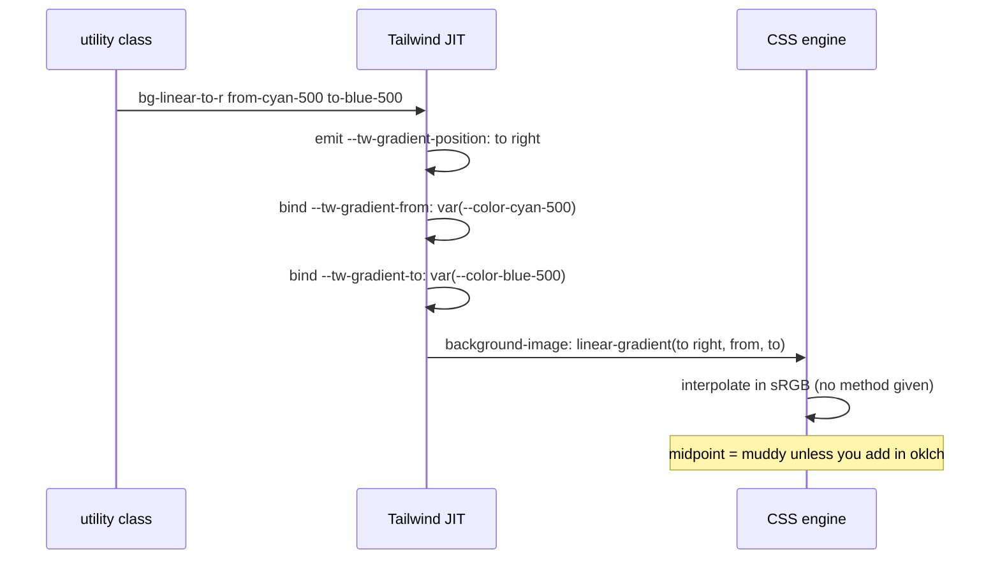

# Gradients in Tailwind v4 — bg-linear / bg-radial / bg-conic

> **Companion demo:** [`gradients_v4.html`](./gradients_v4.html) — open in a browser.
> **Tailwind version:** v4.3.x via `@tailwindcss/browser@4` Play CDN.

---

## 0. TL;DR — the one idea

> Tailwind v4 **renamed** linear gradients (`bg-gradient-to-r` → `bg-linear-to-r`)
> and **added** two new families the engine never had as utilities:
> `bg-radial` and `bg-conic`. The color-stop API (`from-*` / `via-*` / `to-*`) is
> unchanged, but stops now accept **position modifiers** (`from-50%`) and the
> linear angle can be any integer (`bg-linear-45`). The stop COLORS are OKLCH
> tokens — but the browser still interpolates them in sRGB unless you opt into
> `in oklch`.



```
bg-linear-to-r from-A to-B                ← direction by keyword
bg-linear-45   from-A via-B to-C          ← angle + 3 stops
bg-radial      from-A to-transparent      ← center → edge
bg-radial-[at_top_left] from-A to-B       ← positioned focal point
bg-conic       from-A via-B to-C          ← sweep around a point
bg-conic-[from_180deg] from-A to-B        ← rotated start angle
```

---

## 1. Linear gradients — the rename + arbitrary angles

The single biggest mechanical change in v4: **`bg-gradient-to-*` is now `bg-linear-to-*`**.
The old name still works (kept as a deprecated alias for migration) but the docs,
IDE autocomplete, and all new examples use `bg-linear-*`. The keyword set
(`to-r`, `to-br`, `to-t`, …) and the stop API (`from-*`/`via-*`/`to-*`) are identical.

What's genuinely new: **arbitrary integer angles**. v3 only exposed fixed
directions; v4 lets you write `bg-linear-45`, `bg-linear-135`, `bg-linear-90` —
any integer compiles to `linear-gradient(<n>deg, …)`.

| Pattern | Compiles to | Notes |
|---------|-------------|-------|
| `bg-linear-to-r` | `linear-gradient(to right, …)` | direct rename of `bg-gradient-to-r` |
| `bg-linear-to-br` | `linear-gradient(to bottom right, …)` | diagonal keyword |
| `bg-linear-45` | `linear-gradient(45deg, …)` | **new** — any integer angle |
| `bg-linear-135` | `linear-gradient(135deg, …)` | **new** — arbitrary degree |
| `bg-linear-to-r from-A via-B to-C` | 3-stop linear | `via-*` unchanged |

```html
<!-- v3: bg-gradient-to-r → v4: bg-linear-to-r -->
<div class="bg-linear-to-r from-cyan-500 to-blue-500">Linear</div>

<!-- 3-stop diagonal -->
<div class="bg-linear-to-br from-purple-500 via-pink-500 to-red-500">3-stop</div>

<!-- Exact angle (NEW in v4 — any integer works) -->
<div class="bg-linear-45 from-cyan-500 to-blue-500">45°</div>
```

---

## 2. Radial gradients — NEW family in v4

`bg-radial` is entirely new — v3 had no radial gradient utility (you had to drop
to raw CSS or a plugin). It radiates from the center outward by default; pass an
arbitrary position to move the focal point. Underscores in the arbitrary value
become spaces, per Tailwind's standard convention.

| Pattern | Compiles to |
|---------|-------------|
| `bg-radial` | `radial-gradient(…)` — centered |
| `bg-radial-[at_top_left]` | `radial-gradient(at top left, …)` |
| `bg-radial-[at_30%_30%]` | `radial-gradient(at 30% 30%, …)` |
| `bg-radial from-A via-B to-transparent` | 3-stop radial fading out |

```html
<!-- Default center radial -->
<div class="bg-radial from-cyan-500 to-transparent">Radial</div>

<!-- Positioned focal point -->
<div class="bg-radial-[at_top_left] from-cyan-500 to-transparent">Top-left glow</div>
```

The killer use case is **glows and vignettes** — pair `from-<vivid>` with
`to-transparent` and drop the element behind content for an ambient light effect.

---

## 3. Conic gradients — NEW family in v4

`bg-conic` sweeps color *around* a center point (think pie chart / color wheel),
not outward like radial. Rotate the starting angle with
`bg-conic-[from_180deg]`; combine with a center position
`bg-conic-[from_90deg_at_50%_50%]`.

| Pattern | Compiles to |
|---------|-------------|
| `bg-conic` | `conic-gradient(…)` |
| `bg-conic-[from_180deg]` | `conic-gradient(from 180deg, …)` |
| `bg-conic-[from_90deg_at_50%_50%]` | `conic-gradient(from 90deg at 50% 50%, …)` |

```html
<!-- Conic loop: start and end on the same color for a seamless wheel -->
<div class="bg-conic from-cyan-500 via-blue-500 to-cyan-500">Conic</div>

<!-- Rotated start angle -->
<div class="bg-conic-[from_180deg] from-cyan-500 to-blue-500">From 180°</div>
```

Conic gradients shine for **color wheels**, **loading spinners**, and **angular
highlights** (the "shimmer" on a metallic edge).

---

## 4. The v3 → v4 rename (cheat table)

The rename is purely cosmetic for linear keyword gradients — the generated CSS is
identical. The *real* upgrades are the new radial/conic families and arbitrary
angles.

| v3 (deprecated, still works) | v4 (canonical) | Status |
|------------------------------|----------------|--------|
| `bg-gradient-to-r` | `bg-linear-to-r` | renamed |
| `bg-gradient-to-br` | `bg-linear-to-br` | renamed |
| `bg-gradient-to-t` | `bg-linear-to-t` | renamed |
| *(not possible)* | `bg-linear-45` | **new** — arbitrary angle |
| *(plugin only)* | `bg-radial` | **new** — radial family |
| *(plugin only)* | `bg-conic` | **new** — conic family |
| `from-*` / `via-*` / `to-*` | `from-*` / `via-*` / `to-*` | unchanged |
| *(not possible)* | `from-50%` / `via-30%` | **new** — position modifiers |

> **Migration tip:** a project-wide find/replace of `bg-gradient-to-` →
> `bg-linear-to-` covers the rename. The old classes are aliased so nothing
> breaks immediately, but lint with the v4 upgrade guide to surface them.

---

## 5. Color stop positions — `from-50%` / `via-30%` / `to-100%`

New in v4: append a percentage to any stop to pin its position along the
gradient line. Without positions, stops distribute evenly; with positions, you
control exactly where each color sits — push two stops close together for a hard
edge, spread them for a slow ramp.

| Pattern | Effect |
|---------|--------|
| `from-cyan-500 from-0% to-blue-500 to-100%` | explicit full-range (same as default) |
| `from-cyan-500 from-20% to-blue-500 to-80%` | solid color bands at both edges |
| `via-purple-500 via-50%` | middle stop pinned at the halfway point |
| `via-purple-500 via-20%` | middle stop pushed early — crossover near the start |

```html
<!-- Hard edge: two stops almost touching -->
<div class="bg-linear-to-r from-cyan-500 from-49% to-blue-500 to-51%">sharp line</div>

<!-- Solid edges with a gradient band in the middle -->
<div class="bg-linear-to-r from-cyan-500 from-20% to-blue-500 to-80%">soft center</div>
```

---

## 6. OKLCH interpolation — the honest truth

This is the most misunderstood part of v4 gradients, so read carefully.

**What IS true:** every `--color-*` stop Tailwind v4 ships is an OKLCH value
(see [`oklch_colors`](./OKLCH_COLORS.md)). So `from-red-500` and `to-blue-500`
feed OKLCH colors into the gradient.

**What is NOT true by default:** the browser does **not** interpolate between
those stops in OKLCH. The CSS `linear-gradient()` function, when given no
interpolation method, defaults to **sRGB** interpolation. Tailwind v4's generated
CSS is `linear-gradient(to right, var(--tw-gradient-stops))` — no `in oklch` —
so the midpoint of red→blue is still a muddy gray-brown.

To get the vivid purple midpoint everyone associates with OKLCH, you must
**opt in** with an explicit arbitrary value containing `in oklch`:

```html
<!-- DEFAULT: sRGB interpolation — muddy gray midpoint -->
<div class="bg-linear-to-r from-red-500 to-blue-500">muddy</div>

<!-- EXPLICIT in oklch: vivid purple midpoint -->
<div class="bg-[linear-gradient(in_oklch_to_right,var(--color-red-500),var(--color-blue-500))]">vivid</div>
```



The stops are identical in both rows — only the interpolation method differs.
Underscores in the arbitrary value become spaces; `var(--color-red-500)` pulls
the OKLCH token directly from v4's theme.

> The live demo (Panel 5) renders both side-by-side so you can see the midpoint
> difference on your own screen — this is the rendered ground truth, not a claim.

---

## 7. How v4 compiles a gradient (mechanism)

When you write `bg-linear-to-r from-cyan-500 to-blue-500`, Tailwind v4 emits
roughly this CSS (simplified):

```css
.bg-linear-to-r {
  --tw-gradient-position: to right;
  background-image: linear-gradient(var(--tw-gradient-position),
    var(--tw-gradient-stops));
}
.from-cyan-500 {
  --tw-gradient-from: var(--color-cyan-500);  /* oklch(0.715 0.143 215.221) */
  --tw-gradient-stops: var(--tw-gradient-from), var(--tw-gradient-to);
}
.to-blue-500 {
  --tw-gradient-to: var(--color-blue-500);    /* oklch(0.623 0.214 259.815) */
}
```

Two v4 internals to notice:

1. **`@property` typing.** v4 registers `--tw-gradient-*` as typed custom
   properties (`@property --tw-gradient-angle { syntax: '<angle>'; … }`). This is
   why you can now **transition/animate** the gradient angle in v4 — typed
   properties are interpolable, untyped ones aren't.
2. **Stops are theme variables.** `from-cyan-500` doesn't hardcode a hex — it
   binds `--tw-gradient-from` to `var(--color-cyan-500)`. Override the theme token
   and every gradient using that stop updates automatically.



---

## Killer Gotchas

| Trap | Symptom | Fix |
|------|---------|-----|
| **Using the v3 name** | `bg-gradient-to-r` silently works (aliased) but linters/autocomplete don't recognize it | Find/replace `bg-gradient-to-` → `bg-linear-to-` across the project |
| **Assuming `in oklch` by default** | `from-red-500 to-blue-500` has a muddy gray midpoint, not vivid purple | v4 stops are OKLCH but interpolation is sRGB by default. Opt in with `bg-[linear-gradient(in_oklch_to_right,…)]` |
| **No radial in v3 muscle memory** | You reach for a non-existent `bg-gradient-radial` | Use the new `bg-radial` (no "gradient" in the name) |
| **Arbitrary position syntax** | `bg-radial(at top left)` doesn't parse | Use square brackets + underscores: `bg-radial-[at_top_left]` |
| **Conic needs a loop for seamless wheels** | `bg-conic from-A to-B` shows a hard seam where A and B meet | Make start === end: `from-cyan-500 via-blue-500 to-cyan-500` |
| **Position modifier must be a separate class** | `from-cyan-500-50%` is invalid | Two classes: `from-cyan-500 from-50%` |
| **`via-*` ignored without a `to-*`** | 3-stop gradient shows only 2 colors | Always pair `via-*` with both `from-*` and `to-*` |
| **High-chroma OKLCH stops clip on sRGB screens** | A vivid green stop looks dull on a non-P3 display | Accept the clip or target P3; the stop value is still correct, the screen just can't show it |
| **Gradient doesn't transition on hover** | `transition` + changing `from-*` does nothing in v3 | v4's `@property`-typed gradient vars make this work — but you must transition a typed var (`--tw-gradient-angle`), not `background-image` |
| **`bg-clip-text` needs `text-transparent`** | Gradient text shows no color | Always pair `bg-clip-text` with `text-transparent` so the gradient shows through the glyphs |
| **Tailwind CDN compiles async** | `getComputedStyle().backgroundImage` returns `none` right after load | Poll via `requestAnimationFrame` for up to ~2s (see the demo's gold-check) |

### Cheat sheet

```css
/* 1. Linear — renamed in v4 (bg-gradient-to-r → bg-linear-to-r) */
.lin { background-image: linear-gradient(to right,
          var(--color-cyan-500), var(--color-blue-500)); }

/* 2. Arbitrary angle — NEW in v4 */
.ang { background-image: linear-gradient(45deg,
          var(--color-cyan-500), var(--color-blue-500)); }

/* 3. Radial — NEW family */
.rad { background-image: radial-gradient(
          var(--color-cyan-500), transparent); }

/* 4. Conic — NEW family */
.con { background-image: conic-gradient(
          var(--color-cyan-500), var(--color-blue-500), var(--color-cyan-500)); }

/* 5. TRUE OKLCH interpolation (opt-in) */
.ok { background-image: linear-gradient(in oklch to right,
          var(--color-red-500), var(--color-blue-500)); }
```

```html
<!-- Renamed linear -->
<div class="bg-linear-to-r from-cyan-500 to-blue-500">…</div>

<!-- Arbitrary angle -->
<div class="bg-linear-45 from-cyan-500 to-blue-500">…</div>

<!-- 3-stop -->
<div class="bg-linear-to-r from-purple-500 via-pink-500 to-red-500">…</div>

<!-- Radial glow -->
<div class="bg-radial from-cyan-500 to-transparent">…</div>

<!-- Positioned radial -->
<div class="bg-radial-[at_top_left] from-cyan-500 to-transparent">…</div>

<!-- Conic wheel (loop start === end) -->
<div class="bg-conic from-cyan-500 via-blue-500 to-cyan-500">…</div>

<!-- Pinned stop positions -->
<div class="bg-linear-to-r from-cyan-500 from-20% to-blue-500 to-80%">…</div>

<!-- Gradient text -->
<div class="bg-linear-to-r from-cyan-500 to-blue-500 bg-clip-text text-transparent">…</div>
```

---

## 🔗 Cross-references

- [oklch_colors](/tailwind/oklch_colors.html) — the OKLCH palette these gradient stops draw from; why `cyan-500` and `green-500` read as the same brightness tier
- [color_mix_opacity](/tailwind/color_mix_opacity.html) — how `/40` opacity modifiers compile to `color-mix(in oklab, …)`, the perceptual-alpha sibling of `in oklch` gradient interpolation
- [filters_masks](/tailwind/filters_masks.html) — `mask-*` and `mix-blend-*` compose with gradients for fade-out edges and blend-mode layering
- [keyframes_animate](/tailwind/keyframes_animate.html) — v4's `@property`-typed gradient vars are what make gradient-angle animation possible (`--tw-gradient-angle` is interpolable)
- [arbitrary_values](/tailwind/arbitrary_values.html) — the `bg-[linear-gradient(in_oklch_to_right,…)]` arbitrary-value syntax used for true OKLCH interpolation
- [frontend/tailwind: design tokens](/frontend/tailwind/tailwind_design_tokens.html) — the `@theme` `--color-*` namespace the gradient stops bind to via `var(--color-*)`

---

## Sources

1. **Tailwind CSS — Background Image (v4 official docs)**: https://tailwindcss.com/docs/background-image — canonical reference for `bg-linear-*`, `bg-radial`, `bg-conic`, and the `from-*`/`via-*`/`to-*` stop API with position modifiers
2. **Tailwind CSS v4.0 — blog announcement**: https://tailwindcss.com/blog/tailwindcss-v4 — "Conic and radial gradients. We've added new `bg-conic-*` and `bg-radial-*` utilities" + the `@property` gradient var typing that enables animation
3. **MDN — `linear-gradient()` / `radial-gradient()` / `conic-gradient()`**: https://developer.mozilla.org/en-US/docs/Web/CSS/gradient/linear-gradient — confirms default interpolation is sRGB and documents the `in <color-space>` syntax (e.g. `in oklch`)
4. **Max Myron — Improving gradients in TailwindCSS**: https://mmyron.com/posts/improving_tailwind_gradients — deep dive on gradient internals, the `from-*`/`via-*`/`to-*` stop pipeline, and the W3C interpolation-method syntax
5. **Cruip — Linear, Radial and Conic Gradients with Tailwind CSS**: https://cruip.com/linear-radial-and-conic-gradients-with-tailwind-css/ — practical v4 examples for all three gradient families including arbitrary-value positions and angles
