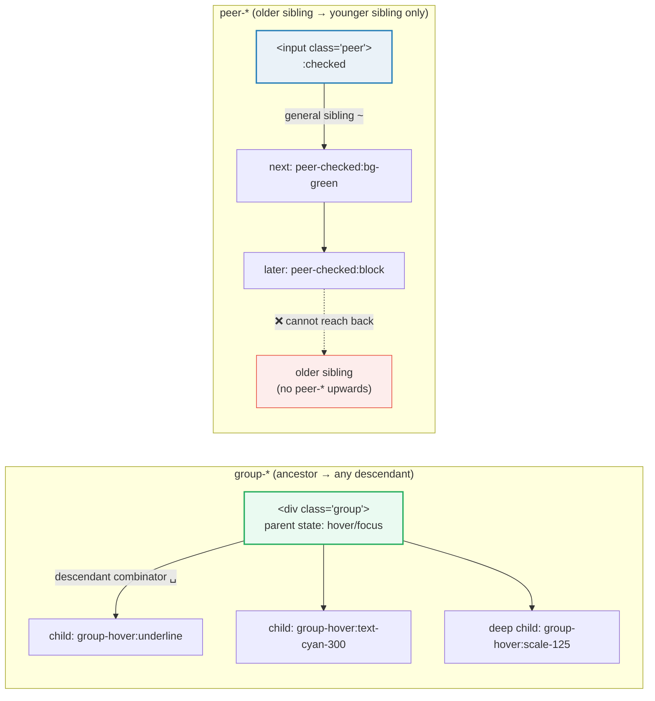
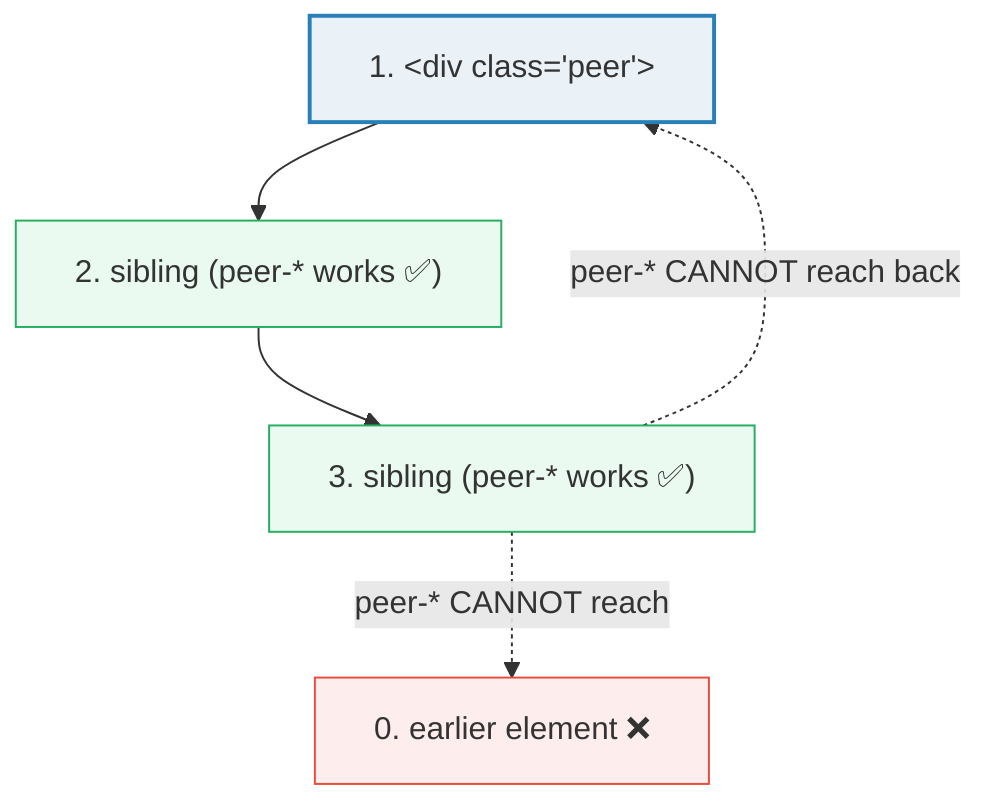

# Group & Peer Variants

> **Companion demo:** [`group_peer.html`](./group_peer.html) — open in a browser.
> **Tailwind version:** v4.3.x via `@tailwindcss/browser@4` Play CDN.

---

## 0. TL;DR — the one idea

> **The analogy:** `group-*` is a **broadcast** — one ancestor shouts "I'm
> hovered!" and every descendant that cares reacts. `peer-*` is a **tap on the
> shoulder from behind** — an element can only hear siblings that come *before*
> it in the DOM. Both let you style one element from another's state, with zero
> JavaScript.



The whole mechanism is two CSS combinators Tailwind emits for you:

| Variant | Compiles to | Combinator | Reach |
|---------|-------------|------------|-------|
| `group-hover:x` | `.group:hover .group-hover\:x` | descendant (`␣`) | any descendant, any depth |
| `peer-checked:x` | `.peer:checked ~ .peer-checked\:x` | general sibling (`~`) | later siblings **only** |

---

## 1. How it works

### group-* — mark the ancestor, react from any descendant

```html
<div class="group hover:bg-cyan-600 rounded-lg p-4">
  <!-- every child that uses group-hover:* reacts to the SAME parent -->
  <p class="text-white group-hover:underline">I underline when the card is hovered</p>
  <p class="text-gray-400 group-hover:text-white">I brighten when the card is hovered</p>
  <span class="opacity-0 group-hover:opacity-100">I appear when the card is hovered</span>
</div>
```

The `group` class is just a marker — it carries no styles itself. Each
`group-<state>:` utility compiles to `.group:<state> <utility>`, so **all**
descendants reading that group update together from a single source of truth.

### peer-* — mark the trigger, react from a later sibling

```html
<!-- the peer MUST come first, as a sibling -->
<input type="checkbox" class="peer" id="toggle" />
<label for="toggle" class="peer-checked:bg-green-500 peer-checked:text-white">
  Turns green when checked
</label>
<p class="hidden peer-checked:block">Revealed — also a later sibling.</p>
```

`peer-checked:` compiles to `.peer:checked ~ .peer-checked\:x`. The `~`
(general sibling) combinator matches any element that shares the **same parent**
and appears **after** `.peer` in source order. That is the entire reason peer-*
flows forward only.

---

## 2. Named groups & named peers (disambiguate when nesting)

When groups or peers nest, an unqualified `group-hover:` would match the
**nearest** qualifying ancestor — which may not be the one you mean. Name them:

```html
<!-- named group -->
<section class="group/card">
  <div class="group/card-inner">
    <!-- reacts to the INNER card, not the outer section -->
    <p class="group-hover/card-inner:text-red-400">scoped</p>
  </div>
</section>

<!-- named peer -->
<fieldset>
  <input class="peer/agree" type="checkbox" />
  <input class="peer/subscribe" type="checkbox" />
  <!-- reacts only to subscribe, not agree -->
  <button class="peer-checked/subscribe:bg-cyan-500">send newsletter</button>
</fieldset>
```

The `/name` suffix is purely a Tailwind label — it does **not** appear in the
generated class name. It only changes which marker the variant matches
(`.group/card` vs `.group/card-inner`).

---

## 3. Stacking variants (AND conditions)

Variants stack left-to-right as a logical **AND**. This is how you combine a
group state with a peer state:

```html
<!-- red ONLY when the parent is hovered AND the sibling checkbox is checked -->
<div class="group">
  <input type="checkbox" class="peer" />
  <span class="group-hover:peer-checked:bg-red-500">♥</span>
</div>
```

Reading order matches CSS specificity order: outer state first (`group-hover:`),
then inner state (`peer-checked:`), then the utility (`bg-red-500`). You can
chain as many as you need: `group-focus-within:peer-invalid:data-[dirty]:…`.

---

## 4. The peer-* limitation — backward only

Because peer-* compiles to the `~` (general sibling) combinator, it is strictly
**forward in the DOM**:



| You want… | Works with peer-*? | Use instead |
|-----------|--------------------|-------------|
| Style an element that comes BEFORE the trigger | ❌ No | restructure DOM, or use `group-*` with the trigger as the group |
| Style a sibling in a DIFFERENT parent | ❌ No | move them to a common parent, or use `:has()` (see `has_variant`) |
| Style any descendant of the trigger | ❌ No | use `group-*` (peer is for siblings, group is for descendants) |

> **Need "child state → parent styling"?** peer-* cannot do this — that is
> exactly what `:has()` solves. See [`has_variant`](./has_variant.html):
> `has-checked:`, `group-has-*`, `peer-has-*`.

---

## 5. group-* vs peer-* — decision table

| Question | Answer → use |
|----------|--------------|
| Is the trigger an **ancestor** of the element I'm styling? | `group-*` |
| Is the trigger a **previous sibling**? | `peer-*` |
| Is the trigger a **child/descendant** of the element I'm styling? | `:has()` (`has_variant`) — neither group nor peer can go upward |
| Do many elements react to ONE source? | `group-*` (broadcast) |
| Does ONE element react to a specific input control? | `peer-*` (point-to-point) |
| Are the trigger and target at different DOM depths? | `group-*` (peer requires same parent) |
| Need pure-CSS show/hide from a checkbox/radio? | `peer-*` |

---

## Killer Gotchas

| Trap | Symptom | Fix |
|------|---------|-----|
| **peer target is NOT a sibling** (wrapped in a sub-`<div>`) | `peer-checked:` does nothing | The `.peer` and every `peer-*` target must share the **same parent**; the `~` combinator cannot cross into a child wrapper |
| **peer target comes BEFORE the peer** in source | `peer-*` silently fails | Move the `.peer` element first; peer-* only reaches later siblings |
| **Forgot `group` on the ancestor** | `group-hover:` utilities don't fire | Add `class="group"` to the parent whose state you want to read |
| **Nested groups hijack children** | Inner card's child reacts to the outer section instead | Name them: `group/card` → `group-hover/card:` |
| **Synthesizing `:hover` from JS** | `dispatchEvent(new MouseEvent('mouseenter'))` does **not** flip CSS `:hover` | `:hover` is bound to the real OS pointer; use `group-focus-within:` (triggered by `.focus()`) as the testable proxy |
| **Hover-only is inaccessible** | Keyboard users never see the affordance | Pair `group-hover:` with `group-focus-within:` |
| **`peer-checked:` + `hidden`** | Element stays hidden because `display:none` wins | Use `peer-checked:block` (it sets `display:block`) rather than toggling a non-display property |
| **Re-rendering resets peer state** | Checkbox untoggles on framework re-render | Keep the peer a native input so its `:checked` survives; avoid mapping peer state to component state |

### Cheat sheet

```html
<!-- 1. GROUP: one ancestor, many reacting children -->
<div class="group hover:bg-cyan-600">
  <p class="group-hover:underline">reacts together</p>
  <p class="group-hover:text-white">reacts together</p>
</div>

<!-- 2. PEER: trigger FIRST, targets AFTER as siblings -->
<input type="checkbox" class="peer" id="t">
<label for="t" class="peer-checked:bg-green-500">label</label>
<p    class="hidden peer-checked:block">revealed</p>

<!-- 3. Accessible: hover + focus-within -->
<div class="group">
  <button class="opacity-50 group-hover:opacity-100 group-focus-within:opacity-100">♥</button>
</div>

<!-- 4. Named (disambiguate nesting) -->
<section class="group/card">
  <p class="group-hover/card:scale-105">scoped to card only</p>
</section>

<!-- 5. Stacked AND conditions -->
<span class="group-hover:peer-checked:bg-red-500">parent hovered AND sibling checked</span>

<!-- 6. Arbitrary / data state -->
<div class="group" data-open="true">
  <p class="group-data-[open=true]:block">visible when data-open="true"</p>
</div>
```

---

## 🔗 Cross-references

- [has_variant](/tailwind/has_variant.html) — `:has()` selector: `has-*`, `group-has-*`, `peer-has-*`. Use this when you need to style a **parent** from a child's state (peer/group cannot go upward).
- [child_variants](/tailwind/child_variants.html) — `first:`, `last:`, `even:`, `odd:`, `empty:`, `nth-*` — structural pseudo-class variants that complement group/peer.
- [form_state](/tailwind/form_state.html) — `required:`, `valid:`, `invalid:`, `autofill:`, `read-only:` — the form states most often paired with `peer-*`.
- [frontend/tailwind: customization](/frontend/tailwind/tailwind_customization.html) — `@custom-variant` for defining your own state channels beyond the built-in group/peer system.

---

## Sources

1. **Tailwind CSS — Styling based on parent state (group)**: https://tailwindcss.com/docs/hover-focus-and-other-states#styling-based-on-parent-state (v4.3, official docs)
2. **Tailwind CSS — Styling based on sibling state (peer)**: https://tailwindcss.com/docs/hover-focus-and-other-states#styling-based-on-sibling-state (v4.3, official docs)
3. **Tailwind CSS — Variants config & `group/name` / `peer/name`**: https://tailwindcss.com/docs/hover-focus-and-other-states#using-multiple-groups-and-peers
4. **MDN — General sibling combinator (`~`)**: https://developer.mozilla.org/en-US/docs/Web/CSS/Subsequent-sibling_combinator (why peer-* flows forward only)
5. **MDN — `:focus-within`**: https://developer.mozilla.org/en-US/docs/Web/CSS/:focus-within (the keyboard-accessible proxy for hover)
