# `:has()` Variants — `has-*`, `group-has-*`, `peer-has-*`

> **Companion demo:** [`has_variant.html`](./has_variant.html) — open in a browser.
> **Tailwind version:** v4.0+ via `@tailwindcss/browser@4` Play CDN.

---

## 0. TL;DR — the one idea

> **The analogy:** `group-*` is a broadcast **downward**, `peer-*` is a tap on
> the shoulder **forward**. Neither can point **upward** — you cannot style a
> parent from a child's state. `:has()` is the missing arrow: it lets an element
> ask *"do I **contain** something matching X?"* and style itself when the
> answer is yes. Tailwind v4 ships it as three variants that differ only in
> **which element the `:has()` test runs on**.

```mermaid
graph TD
    subgraph "has-*  (element tests ITSELF)"
        H["&lt;section class='has-[input:invalid]:border-red-500'&gt;"] -->|does it contain input:invalid?| HST["border turns red"]
    end
    subgraph "group-has-*  (GROUP is tested, descendant reacts)"
        G["&lt;div class='group'&gt;"] -->|does group contain :checked?| GC["&lt;p class='group-has-[:checked]:text-green-300'&gt; reacts"]
    end
    subgraph "peer-has-*  (PEER sibling is tested, later sibling reacts)"
        P["&lt;fieldset class='peer'&gt;"] -->|does peer contain :checked?| PC["&lt;p class='peer-has-[:checked]:block'&gt; reacts"]
    end
    style H fill:#eafaf1,stroke:#27ae60,stroke-width:2px
    style G fill:#eaf2fe,stroke:#2980b9,stroke-width:2px
    style P fill:#fef9e7,stroke:#f39c12,stroke-width:2px
    style HST fill:#fdedec,stroke:#e74c3c
    style GC fill:#eafaf1,stroke:#27ae60
    style PC fill:#eafaf1,stroke:#27ae60
```



The whole mechanism is one CSS functional pseudo-class, `:has()`, applied in
three places:

| Variant | Compiles to | Where `:has()` runs |
|---------|-------------|---------------------|
| `has-[X]:u` | `.el:has(X).u` | on the element itself |
| `group-has-[X]:u` | `.group:has(X) .group-has-\[X\]:u` | on the `.group` ancestor |
| `peer-has-[X]:u` | `.peer:has(X) ~ .peer-has-\[X\]:u` | on the `.peer` sibling |

`X` is an arbitrary **relative selector** — anything you'd write after `:has`.
So `has-[input:invalid]`, `has-[:checked]`, `has-[>img]`, `has-[.error]` are all
legal.

---

## 1. How it works

### `has-*` — style the container from a descendant's state

```html
<!-- The section itself carries has-[input:invalid]:border-red-500 -->
<section class="border border-slate-700 rounded p-4
               has-[input:invalid]:border-red-500 has-[input:invalid]:bg-red-950/40">
  <label>
    Email (required)
    <input type="email" required />
  </label>
</section>
```

`has-[input:invalid]:border-red-500` compiles to
`.\has-\[input\:invalid\]\:border-red-500:has(input:invalid) { border-color: … }`.
The moment any descendant `<input>` matches `:invalid`, the **section** re-styles.
No `aria-invalid`, no JS toggling, no React state — the browser's constraint
validation drives the section affordance directly.

### `group-has-*` — a descendant reacts if its GROUP contains X

```html
<div class="group">
  <input type="checkbox" />
  <!-- This paragraph is NOT the container of the checkbox, but it IS a
       descendant of the .group, so group-has-[:checked] reaches it. -->
  <p class="text-slate-400 group-has-[:checked]:text-green-300 group-has-[:checked]:font-semibold">
    Turns green when the group contains a checked box.
  </p>
</div>
```

`group-has-[:checked]` compiles to `.group:has(:checked) .group-has-\[...\]`. The
`:has()` runs on `.group`, then the descendant combinator (`␣`) reaches every
element carrying the variant. This is the right choice when the **reacting**
element is not the container of the trigger.

### `peer-has-*` — a sibling reacts if its PEER contains X

```html
<!-- The peer is a CONTAINER (a fieldset of radios), not a single input -->
<fieldset class="peer">
  <label><input type="radio" name="ship" /> Standard</label>
  <label><input type="radio" name="ship" /> Express</label>
</fieldset>
<p class="hidden peer-has-[:checked]:block">
  Revealed once any shipping option is selected.
</p>
```

`peer-has-[:checked]` compiles to `.peer:has(:checked) ~ .peer-has-\[...\]`. The
`:has()` runs on `.peer`, then the general sibling combinator (`~`) reaches later
siblings. This is the variant `peer-checked:` **cannot** replace: a `<fieldset>`
can never itself be `:checked`, but it can *contain* something that is.

---

## 2. How `:has()` actually works (internals)

`:has()` is a **functional pseudo-class** that takes a **relative selector** and
matches an element if any descendant/subject of that selector exists within it.
Conceptually:

```css
/* "match any <section> that has a descendant input matching :invalid" */
section:has(input:invalid) { border-color: #ef4444; }

/* relative selectors can use combinators — ">" tests a DIRECT child */
li:has(> img) { padding: 0; }

/* and compound arguments — class + pseudo-class */
form:has(.error:focus-visible) { outline: 2px solid red; }
```

Key properties that make it work as a Tailwind variant:

1. **Relative selector inside the parens.** `:has(input)` means "has a descendant
   `input`"; `:has(> input)` means "has a *direct-child* `input`". Tailwind's
   arbitrary-value brackets (`has-[...]`) pass the contents straight through, so
   `has-[>img]`, `has-[.error]`, `has-[input:invalid]` all work.
2. **Synchronous re-evaluation.** When `:checked` / `:invalid` / `:focus` flips,
   `:has()` re-resolves in the same style recalc — there is no async lag, which
   is why the gold-check passes after a single `requestAnimationFrame`.
3. **Zero specificity penalty.** `:has()` itself adds no specificity beyond the
   selector inside it, so `has-[:checked]:bg-green-500` orders normally against
   `bg-slate-700`.

### Browser support (baseline 2026-06)

`:has()` is now universally green — the era of "progressive enhancement only" is
over, but the milestones are still worth knowing:

| Browser | Baseline version | Ship date |
|---------|------------------|-----------|
| Safari  | 15.4 | 2022-03 |
| Chrome / Edge / Chromium | 105 | 2022-08 |
| Firefox | 121 | 2023-12 |
| Samsung Internet | 18.0 | 2023 |
| iOS Safari | 15.4 | 2022-03 |

Tailwind v4 ships `has-*` / `group-has-*` / `peer-has-*` directly because all
evergreen browsers now support `:has()` natively. On the rare legacy Firefox
<121, the compiled rule simply never matches — the demo silently degrades to the
unstyled (default) state, it does not error.

---

## 3. `group-has-*` vs `peer-has-*` — decision table

The two named variants exist because `group-*` / `peer-*` can only read the
state of the marked element **itself**. `group-has-*` / `peer-has-*` extend them
to read what that element **contains**.

| Question | Use |
|----------|-----|
| Is the trigger a **descendant** of the element I'm styling? | `has-[X]` (the element tests itself) |
| Is the trigger inside a **`.group` ancestor** of the element I'm styling? | `group-has-[X]` |
| Is the trigger inside an **earlier `.peer` sibling** of the element I'm styling? | `peer-has-[X]` |
| Does the reacting element need to react to many different descendants at once? | `has-[X]` on the container (one source of truth) |
| Is the peer a **container** (fieldset, div) rather than a single input? | `peer-has-[X]` — `peer-checked:` cannot do this |
| Need to test a **deep** selector (class, attribute, combinator)? | any of the three — `X` is arbitrary |

> **Rule of thumb:** reach for `has-*` first (simplest). Add `group-has-*` /
> `peer-has-*` only when the reacting element is *not* the container of the
> trigger — i.e. the state and the style live in different parts of the tree.

---

## 4. Killer Gotchas

| Trap | Symptom | Fix |
|------|---------|-----|
| **`has-[input:invalid]` but the input is not a `<input>`** (e.g. a custom `<div role=textbox>`) | `:invalid` only applies to real form-associated elements; the variant never fires | Use a real `<input>`/`<select>`/`<textarea>`, or test a class instead: `has-[.is-invalid]` |
| **Specificity clash with `peer-invalid:` etc.** | A `peer-invalid:border-red-500` on the field wins over `has-[input:invalid]:border-red-500` on the section, and the section never looks red | The two target *different* elements; if both apply to the same node, order utilities deliberately or use `!` important |
| **`group-has-` without `group`** on the ancestor | Variant silently fails — `.group:has(...)` has nothing to anchor to | Add `class="group"` (or `group/name`) to the container whose descendants you want to test |
| **`peer-has-` target is not a later sibling of `.peer`** | `~` combinator cannot reach backwards or into a child wrapper | The `.peer` and every `peer-has-*` target must share the same parent, peer first |
| **Testing `:has()` too early in JS** | `getComputedStyle()` returns the pre-`:has()` value | `:has()` resolves in the same frame as `:checked`/`:invalid`/`:focus`, but style recalc is async — always poll via `requestAnimationFrame` (see `HOW_TO_RESEARCH.md` §4) |
| **Over-nested `:has()` hurts performance** | Style recalc gets expensive on huge lists with `has-[...]` on every row | `:has()` is fast for shallow trees; for 1000s of rows prefer a class toggle. Avoid `has-[...]` with universal/descendant-heavy selectors on `<body>` |
| **Firefox < 121 silently no-ops** | Variant compiles to valid CSS that the engine ignores — element stays in default state | Acceptable graceful degradation; if you must support it, polyfill with a `data-state` attribute + `data-[state=invalid]:` variant |
| **`:has(:focus)` vs `:focus-within`** | Both highlight a parent on child focus, but `:focus-within` is older and cheaper | Tailwind ships `focus-within:` for this exact case; reach for `has-[input:focus]` only when you need a more specific selector (e.g. only `<input>`, not `<a>`) |
| **Container queries vs `:has()`** | `@container` asks "how wide am I?", `:has()` asks "what do I contain?" — easy to confuse | They compose: `has-[:checked]:@md:flex-row` works, but think first about which question you're actually asking |

### Cheat sheet

```html
<!-- 1. HAS-* : container styles itself from a descendant state -->
<section class="has-[input:invalid]:border-red-500">
  <input type="email" required />
</section>

<!-- 2. layout decision from a checked child -->
<div class="flex flex-col has-[:checked]:flex-row has-[:checked]:bg-green-900">
  <input type="checkbox" />
  <p>I reflow when the box is ticked.</p>
</div>

<!-- 3. row highlight from child focus -->
<li class="has-[input:focus]:bg-cyan-900 has-[input:focus]:border-cyan-500">
  <input type="text" />
</li>

<!-- 4. GROUP-HAS-* : descendant reacts if its GROUP contains state -->
<div class="group">
  <input type="checkbox" />
  <p class="group-has-[:checked]:text-green-300">reacts from inside the group</p>
</div>

<!-- 5. PEER-HAS-* : sibling reacts if its PEER (a container) contains state -->
<fieldset class="peer">
  <input type="radio" name="s" />
</fieldset>
<p class="hidden peer-has-[:checked]:block">revealed once a radio is picked</p>

<!-- 6. arbitrary selector in the brackets -->
<article class="has-[>img]:p-0 has-[.is-premium]:border-amber-500">
  <!-- direct-child img → no padding; any .is-premium descendant → amber border -->
</article>
```

---

## 🔗 Cross-references

- [group_peer](/tailwind/group_peer.html) — `group-*` / `peer-*`: the ancestor and sibling state channels. `has-*` is the upward complement — read this first to understand *why* `:has()` needed to exist (group/peer cannot go up).
- [child_variants](/tailwind/child_variants.html) — `first:`, `last:`, `empty:`, `nth-*`: structural pseudo-class variants. `empty:` overlaps conceptually with `has-[:not(:scope>*)]` (container has no children) — prefer `empty:` for that case.
- [form_state](/tailwind/form_state.html) — `required:`, `valid:`, `invalid:`, `autofill:`, `read-only:`: the form pseudo-class variants most often paired with `has-[input:invalid]`.
- [frontend/tailwind: customization](/frontend/tailwind/tailwind_customization.html) — `@custom-variant` for registering your own state channels when even `has-[X]` arbitrary selectors get repetitive.

---

## Sources

1. **Tailwind CSS — Styling based on descendant state (`:has()`)**: https://tailwindcss.com/docs/hover-focus-and-other-states#styling-based-on-descendant-state (v4.x official docs — covers `has-*`, `group-has-*`, `peer-has-*`)
2. **MDN — `:has()` functional pseudo-class**: https://developer.mozilla.org/en-US/docs/Web/CSS/:has (mechanism, relative-selector syntax, specificity, examples)
3. **MDN — `:has()` browser compatibility table**: https://developer.mozilla.org/en-US/docs/Web/CSS/:has#browser_compatibility (Safari 15.4, Chrome 105, Firefox 121 baseline data)
4. **caniuse — `:has()` CSS relational pseudo-class**: https://caniuse.com/css-has (cross-browser ship timeline + global usage %)
5. **web.dev — "Style, specificity, and the source of truth" / `:has()` selector**: https://developer.chrome.com/docs/css-ui/has-selector (Chrome 105 launch notes + performance guidance)
