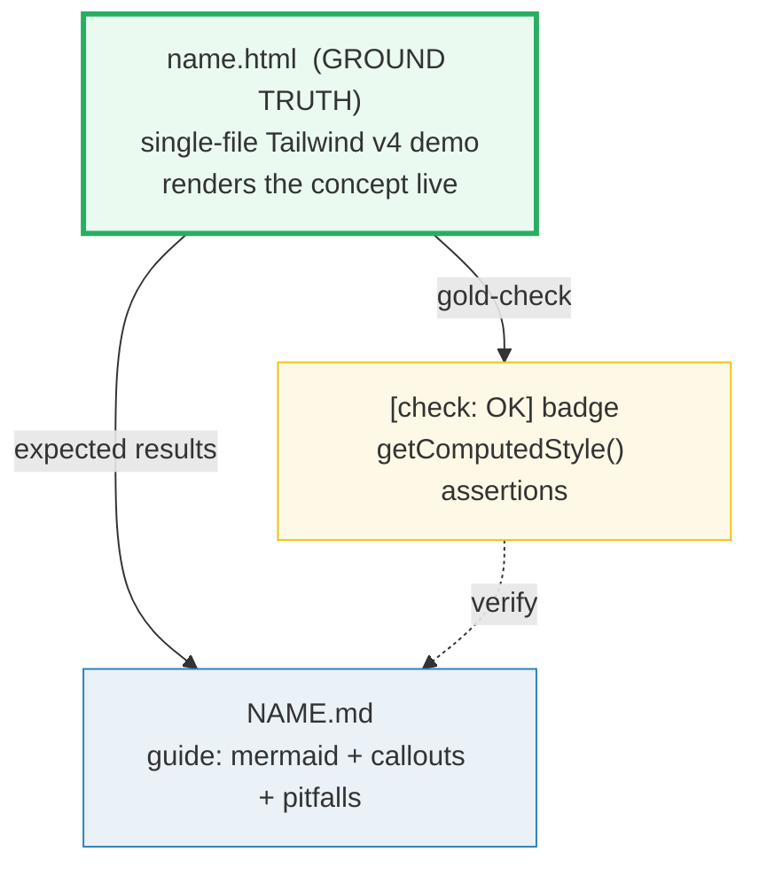

# HOW_TO_RESEARCH — Tailwind CSS 4 Deep Dive Workflow

> Adapted from [`../skills/concept-builder/SKILL.md`](../skills/concept-builder/SKILL.md).
> This section uses the **rendered-ground-truth** variant: the `.html` IS the
> ground truth (it renders the concept live with Tailwind v4 via CDN), with an
> embedded `[check: OK]` gold-check proving computed CSS styles.

## 0. The one rule

> **Every concept is a set of files that cite each other, all deriving from ONE
> ground-truth artifact. Nothing is ever hand-waved.**



A **concept bundle** = `name.html` + `NAME.md`. No `.py`, no `_output.txt` —
the live Tailwind demo is the ground truth.

## 1. Focus

Advanced Tailwind CSS v4: **container queries → variant ecosystem → arbitrary
values → oklch color internals → modern CSS layout → animations → build pipeline.**
38 bundles across 7 phases. See [`TODO.md`](./TODO.md).

**Companion to:** [`../frontend/tailwind/`](../frontend/index.html) — where
`frontend/tailwind/` (4 bundles) teaches v4 onboarding (CDN, @theme, customization,
responsive/dark mode), this section goes advanced.

## 2. The roles of each file

| File | Role | Hard rules |
|---|---|---|
| **`name.html`** | GROUND TRUTH. A single-file demo loading Tailwind v4 Play CDN. Renders the concept live with real utility classes. | Opens from `file://`. **Embeds a gold-check** using `getComputedStyle()`. Dark palette `#0d1117`, Tailwind cyan accent `#06b6d4`. Full GitHub URLs for `.md` links. Back-link to `/tailwind/index.html` (absolute path). |
| **`NAME.md`** | Static guide. What / why / gotchas. | ≥1 mermaid diagram. ≥1 code snippet. Pitfalls table + cheat sheet + `## Sources` (web-verified ≥2). |

## 3. CDN setup (every `.html`)

```html
<!-- Tailwind v4 Play CDN (verified 2026-06, jsDelivr @tailwindcss/browser@4) -->
<script src="https://cdn.jsdelivr.net/npm/@tailwindcss/browser@4"></script>
```

For `@theme`, `@utility`, `@custom-variant`, `@container` directives:
```html
<style type="text/tailwindcss">
  @theme {
    --color-brand: oklch(0.7 0.15 250);
  }
  @utility tab-4 {
    tab-size: 4;
  }
</style>
```

The `<style type="text/tailwindcss">` block is processed by the Play CDN's JIT
compiler — it reads `@theme`, `@utility`, etc. and generates the corresponding
utilities. This is how the demo defines custom tokens and utilities.

## 4. The gold-check (the falsifiable anchor)

The Tailwind CDN compiles **asynchronously** — `getComputedStyle()` right after
load may return UA defaults. Always **poll via `requestAnimationFrame`** (up to ~2s):

```javascript
var MAX_FRAMES = 130; // ~2s

function runGoldCheck(frame) {
  frame = frame || 0;
  var cs = getComputedStyle(document.getElementById('demo-el'));
  var ok = cs.display === 'flex'; // or whatever property you're checking
  if (ok) {
    badge.textContent = '[check] display=flex: OK';
    badge.style.color = 'var(--ok)';
    return;
  }
  if (frame < MAX_FRAMES) {
    requestAnimationFrame(function() { runGoldCheck(frame + 1); });
    return;
  }
  badge.textContent = '[check] FAIL';
  badge.style.color = 'var(--bad)';
}
runGoldCheck();
```

Pick a concrete computed CSS fact (display, flex-direction, padding, container-type,
color) the demo pins. Assert it via `getComputedStyle()`.

## 5. The `.html` style guide

### Page chrome (dark palette)
- **Accent**: Tailwind cyan `#06b6d4`
- Dark bg `#0d1117`, panels `#161b22`, borders `#30363d`
- Monospace font stack
- Minimal `<style>` block for chrome elements (goldcheck, badge, codearea, panels)

### Demo area (`.stage`)
```html
<div style="border:1px dashed var(--accent); padding:18px; border-radius:8px; background:#0b0f14;">
  <!-- Demo content styled PURELY by Tailwind utility classes -->
</div>
```

### Required elements (in order)
1. `<header>` — title + gold-check badge + badge links + back-link
2. `.guide-callout` div — pairs this demo with the `.md` guide
3. `<main>` — concept panels + demo stages + cheat sheet
4. Gold-check `<script>` — polls `getComputedStyle()`, passes `node --check`

### Badge links
```html
<a class="badge md" href="https://github.com/quanhua92/tutorials/blob/main/tailwind/NAME.md">📖 guide (.md)</a>
```
No `.badge.py` — HTML-only section.

### Table overflow
Every `<table>` wrapped: `<div style="overflow-x:auto;min-width:0"><table>...</table></div>`

### Paths — ALL ABSOLUTE
- Back-link: `<a href="/tailwind/index.html">`
- Cross-refs between bundles: `<a href="/tailwind/xxx.html">`
- Cross-refs to frontend: `<a href="/frontend/tailwind/xxx.html">`

## 6. The `.md` structure

```markdown
# [Concept Name]

> **Companion demo:** [`name.html`](./name.html) — open in a browser.

---

## 0. TL;DR — the one idea

[≥1 mermaid diagram]

## 1. How it works
## 2. Mechanism / internals
## 3. Killer Gotchas (table: trap | symptom | fix)
### Cheat sheet

## 🔗 Cross-references
## Sources
```

## 7. Naming & layout

- `.html` → `lower_snake_case`
- `.md` → `UPPER_SNAKE_CASE`
- Bundles live **flat** in `tailwind/` (no subdirectories)

## 8. Verification discipline

```bash
# node --check the inline <script>
python3 -c "import re;open('/tmp/_j.js','w').write('\n\n'.join(m.group(1) for m in re.finditer(r'<script>(.*?)</script>',open('tailwind/name.html').read(),re.S)))"
node --check /tmp/_j.js && echo "JS OK"
# gold-check present
grep -q '\[check' tailwind/name.html && echo "GOLD OK"
```

## 9. Common bugs to AVOID

- **Relative paths** — ALWAYS use absolute (`/tailwind/xxx.html`), never `./xxx.html`
- **No `<style type="text/tailwindcss">`** — `@theme`/`@utility` won't work in regular `<style>`
- **Checking styles too early** — Tailwind compiles async, always poll via rAF
- **Container queries need `@container` class** — children won't respond without it
- **CDN version drift** — pin `@tailwindcss/browser@4` (tracks latest v4.x)
