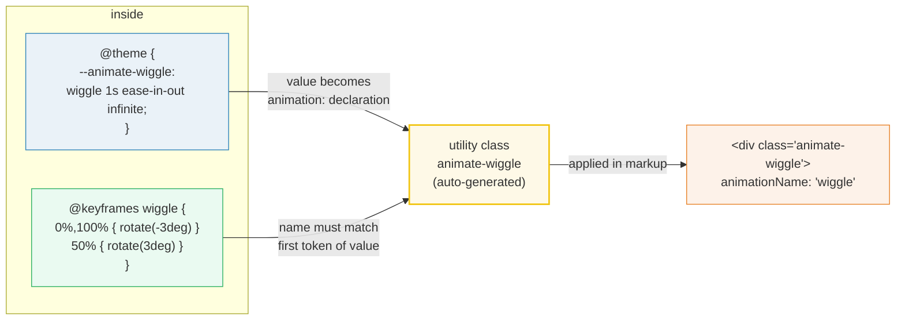

# Keyframes & the `--animate-*` Namespace

> **Companion demo:** [`keyframes_animate.html`](./keyframes_animate.html) — open in a browser.
> Renders three custom animations (`wiggle`, `float`, `gradient`) live via the Play CDN,
> with a `getComputedStyle().animationName` gold-check.

---

## 0. TL;DR — the one idea

In Tailwind v4, **every animation is a CSS custom property**. The `--animate-*`
theme namespace maps 1:1 to the CSS `animation:` shorthand. Register a token in
`@theme`, define `@keyframes` alongside it, and the utility class is generated
for free — no plugin, no `tailwind.config.js` extension function.



The two halves (token + keyframes) are **independent files of knowledge**: the
`--animate-wiggle` token is a *contract* (what the utility is called + its timing),
and `@keyframes wiggle` is the *implementation* (what the frames look like).
Swap the keyframes and the utility's name/stay the same; rename the token and
the keyframes still exist as plain CSS.

---

## 1. How it works — defining a custom animation

Two pieces, both inside a `<style type="text/tailwindcss">` block (or your main
CSS entry in a build setup):

```css
@theme {
  --animate-wiggle: wiggle 1s ease-in-out infinite;
}

@keyframes wiggle {
  0%, 100% { transform: rotate(-3deg); }
  50%      { transform: rotate(3deg); }
}
```

```html
<div class="animate-wiggle">Wiggling!</div>
```

That's the entire API. The Play CDN's JIT compiler (or the v4 build pipeline)
sees `--animate-wiggle` in `@theme`, emits a `.animate-wiggle { animation: var(--animate-wiggle); }`
rule, and passes `@keyframes wiggle` through to the final CSS. The first token
of the value (`wiggle`) is the keyframe name — it **must** match.

### `@keyframes` can also nest inside `@theme`

The [official docs](https://tailwindcss.com/docs/animation) show keyframes nested
directly in `@theme`, and Tailwind hoists them out:

```css
@theme {
  --animate-wiggle: wiggle 1s ease-in-out infinite;
  @keyframes wiggle {
    0%, 100% { transform: rotate(-3deg); }
    50%      { transform: rotate(3deg); }
  }
}
```

Both placements work. Top-level `@keyframes` is easier to read when you have
many animations; nested keeps each animation's contract + implementation together.

---

## 2. `@keyframes` syntax

`@keyframes <name>` defines a named timeline of CSS property snapshots. Each
stop is a percentage (`0%`–`100%`) or the aliases `from` (= `0%`) / `to` (= `100%`).

```css
@keyframes float {
  from   { transform: translateY(0); }      /* same as 0%   */
  50%    { transform: translateY(-14px); }
  to     { transform: translateY(0); }      /* same as 100% */
}

/* Multiple stops share a block via comma */
@keyframes wiggle {
  0%, 100% { transform: rotate(-3deg); }
  50%      { transform: rotate(3deg); }
}
```

Key rules:
- **Only animatable properties** take effect mid-animation (`transform`, `opacity`,
  `color`, `background-position`, etc.). `display`, `position`, `content` are *not*
  animatable — they snap.
- **Unspecified properties hold their computed value** at each stop (no implicit
  interpolation unless both endpoints define the property).
- **Per-keyframe easing**: `animation-timing-function` set *inside* a keyframe
  block applies to the segment *leaving* that stop — this is how `animate-bounce`
  gets its asymmetric spring feel.

---

## 3. The animation shorthand — what `--animate-*` actually holds

The `--animate-*` value is the full CSS `animation:` shorthand, so any of these
8 sub-properties can appear in it, space-separated:

| slot | example | notes |
|---|---|---|
| `name` | `wiggle` | must match an `@keyframes` name |
| `duration` | `1s`, `300ms` | first time value |
| `timing-function` | `ease-in-out`, `linear`, `cubic-bezier(0,0,.2,1)` | easing for the whole animation |
| `delay` | `0s`, `200ms` | second time value |
| `iteration-count` | `infinite`, `3` | how many times to run |
| `direction` | `normal`, `alternate`, `reverse` | `alternate` ping-pongs each iteration |
| `fill-mode` | `none`, `forwards`, `backwards`, `both` | `forwards` holds the last keyframe |
| `play-state` | `running`, `paused` | toggle without removing the class |

```css
/* Run twice, hold the end state, start 100ms late */
@theme {
  --animate-pop: pop 0.3s ease 100ms 2 forwards;
}
```

Order matters only for the two time values: the **first is duration, the second
is delay**. Everything else is keyword-identified.

---

## 4. Built-in animations (v4 default theme)

Five ship out of the box. Each is itself a `--animate-*` token + `@keyframes` —
the same mechanism your custom animations use, so you can override any of them
by re-declaring the token in `@theme`.

| utility | `--animate-*` value | use |
|---|---|---|
| `animate-spin` | `spin 1s linear infinite` | loading spinners |
| `animate-ping` | `ping 1s cubic-bezier(0,0,.2,1) infinite` | notification ripples, radar pings |
| `animate-pulse` | `pulse 2s cubic-bezier(.4,0,.6,1) infinite` | skeleton loaders, opacity breathing |
| `animate-bounce` | `bounce 1s infinite` | "scroll down" arrows |
| `animate-none` | `none` | disable animation (override inherited loops) |

```html
<!-- Loading spinner -->
<svg class="size-5 animate-spin" viewBox="0 0 24 24"><!-- ... --></svg>

<!-- Notification ping -->
<span class="relative flex size-3">
  <span class="absolute inline-flex h-full w-full animate-ping rounded-full bg-sky-400 opacity-75"></span>
  <span class="relative inline-flex size-3 rounded-full bg-sky-500"></span>
</span>

<!-- Respect reduced motion -->
<svg class="size-5 motion-safe:animate-spin" viewBox="0 0 24 24"><!-- ... --></svg>
```

### Arbitrary values (no theme token needed)

```html
<!-- One-off animation -->
<div class="animate-[wiggle_1s_ease-in-out_infinite]">…</div>

<!-- Read from any CSS variable (shorthand for animate-[var(--my-anim)]) -->
<div class="animate-(--my-anim)">…</div>
```

---

## 5. Killer Gotchas

| trap | symptom | fix |
|---|---|---|
| **Keyframe name ≠ token's first token** | element has the class but `animationName` is `none` / animation doesn't play | the first word of `--animate-foo` MUST equal the `@keyframes <name>`. `--animate-foo: bar 1s` + `@keyframes foo` silently fails |
| **`@keyframes` outside `<style type="text/tailwindcss">`** | custom animation works in build but not on the Play CDN | on the CDN, keyframes must live in a `text/tailwindcss` block so the JIT sees them. A plain `<style>` won't be processed |
| **Non-animatable property in keyframes** | property snaps instead of interpolating (e.g. `display: none → block`) | only animatable properties tween. For `display`, pair with `@starting-style` (see [`starting_style`](./STARTING_STYLE.md)) or animate opacity/transform instead |
| **Gradient-position loop won't move** | `--animate-gradient` defined but text/element is static | the element needs `background-size: 200% auto` (or `bg-[length:200%_auto]`) — without an oversized background, `background-position` has nowhere to shift |
| **Animation runs forever, ignoring intent** | looping `infinite` on a one-shot alert | set an explicit `iteration-count` (`1`, `2`) + `fill-mode: forwards` to hold the end state |
| **Tailwind CDN not ready when JS checks** | `getComputedStyle().animationName` returns `none` right after load | the Play CDN compiles async — poll via `requestAnimationFrame` (~2s) before asserting. This is what the demo's gold-check does |
| **`animate-pulse` on a parent fades children too** | whole skeleton block pulses as one unit, looks wrong | apply `animate-pulse` to each placeholder shape individually, or stagger with `delay` |
| **Overriding a built-in** | `--animate-spin: spin 2s linear infinite` in `@theme` does nothing | you must also re-declare or keep the `@keyframes spin`. Tailwind only emits keyframes it knows about; re-declaring the token doesn't re-emit them unless nested in `@theme` |

---

### Cheat sheet

```css
/* Register a reusable animation */
@theme {
  --animate-wiggle: wiggle 1s ease-in-out infinite;
}
@keyframes wiggle {
  0%, 100% { transform: rotate(-3deg); }
  50%      { transform: rotate(3deg); }
}
```

```html
<!-- Use it -->
<div class="animate-wiggle">Wiggling!</div>

<!-- One-off, no token -->
<div class="animate-[wiggle_1s_ease-in-out_infinite]">…</div>

<!-- From any CSS var -->
<div class="animate-(--my-anim)">…</div>

<!-- Pause on hover -->
<div class="animate-spin hover:[animation-play-state:paused]">…</div>

<!-- Reduced-motion safe -->
<svg class="motion-safe:animate-spin motion-reduce:animate-none">…</svg>

<!-- Run twice, hold end state -->
@theme { --animate-pop: pop .3s ease 0s 2 forwards; }
```

| intent | pattern |
|---|---|
| reusable animation | `@theme { --animate-x: x 1s ...; } @keyframes x { ... }` |
| one-off animation | `class="animate-[wiggle_1s_ease-in-out_infinite]"` |
| read from CSS var | `class="animate-(--my-anim)"` |
| pause on hover | `hover:[animation-play-state:paused]` |
| reduced-motion safe | `motion-safe:animate-spin` / `motion-reduce:animate-none` |
| run N times, hold end | `--animate-pop: pop .3s ease 0s 2 forwards;` |
| gradient text shimmer | `--animate-gradient: gradient 3s ease infinite;` + `bg-[length:200%_auto] bg-clip-text text-transparent` |

---

## 🔗 Cross-references

- **[`transitions_timing`](./transitions_timing.html)** — animations are the
  *keyframes* half of motion; transitions are the *state-change* half
  (`transition-*`, `duration-*`, `ease-*`, `delay-*`). Use transitions for
  hover/focus; use `--animate-*` for looping or scripted timelines.
- **[`transforms_3d`](./transforms_3d.html)** — most keyframes animate
  `transform` (`rotate`, `translate`, `scale`, `skew`) and `perspective`.
  Understanding the transform stack is prerequisite to writing non-trivial
  keyframes.
- **[`property_directive`](./property_directive.html)** — the `@property` directive
  is what makes *CSS custom properties animatable* (type-aware interpolation).
  Required for gradient-position loops and any `--var`-driven keyframe; without
  it, custom properties snap instead of tween.
- **[`scroll_driven`](./scroll_driven.html)** — `animation-timeline: scroll()`
  / `view()` retargets these same `@keyframes` to scroll position instead of
  time. The keyframes themselves are identical; only the timeline binding
  changes.

---

## Sources

1. **Tailwind CSS — Animation (v4 official docs)**:
   https://tailwindcss.com/docs/animation — canonical reference for
   `--animate-*` theme variables, `@keyframes` nesting in `@theme`,
   `animate-[<value>]` / `animate-(--var)` arbitrary syntax, and the five
   built-in animations (`spin`, `ping`, `pulse`, `bounce`, `none`).
2. **Tailwind CSS — Theme variables (v4 official docs)**:
   https://tailwindcss.com/docs/theme — documents the `--animate-*` namespace
   as part of v4's "theme variables are just CSS variables" model, and
   customizing/overriding default tokens.
3. **MDN — CSS Animations**:
   https://developer.mozilla.org/en-US/docs/Web/CSS/CSS_animations/Using_CSS_animations
   — the `animation` shorthand (8 sub-properties), `@keyframes` syntax,
   per-keyframe `animation-timing-function`, and the rule that the first time
   value is `duration` and the second is `delay`.
4. **Tailwind CSS v4.0 — blog announcement**:
   https://tailwindcss.com/blog/tailwindcss-v4 — "CSS-first configuration"
   replacing `tailwind.config.js` theme extension with `@theme` variables,
   which is what makes `--animate-*` a plain CSS custom property.
