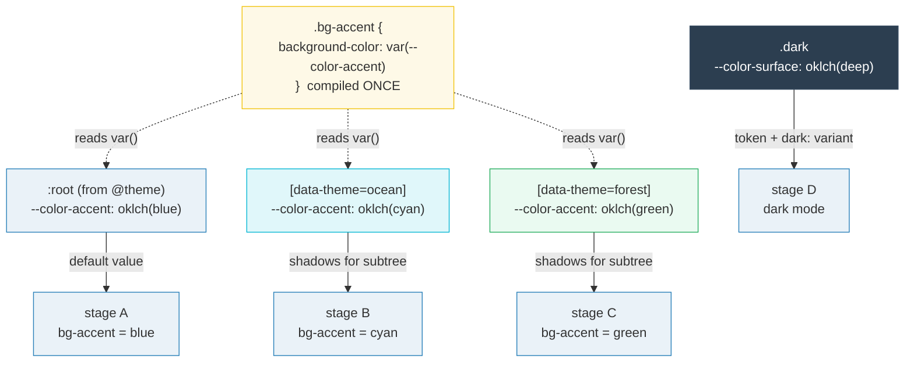
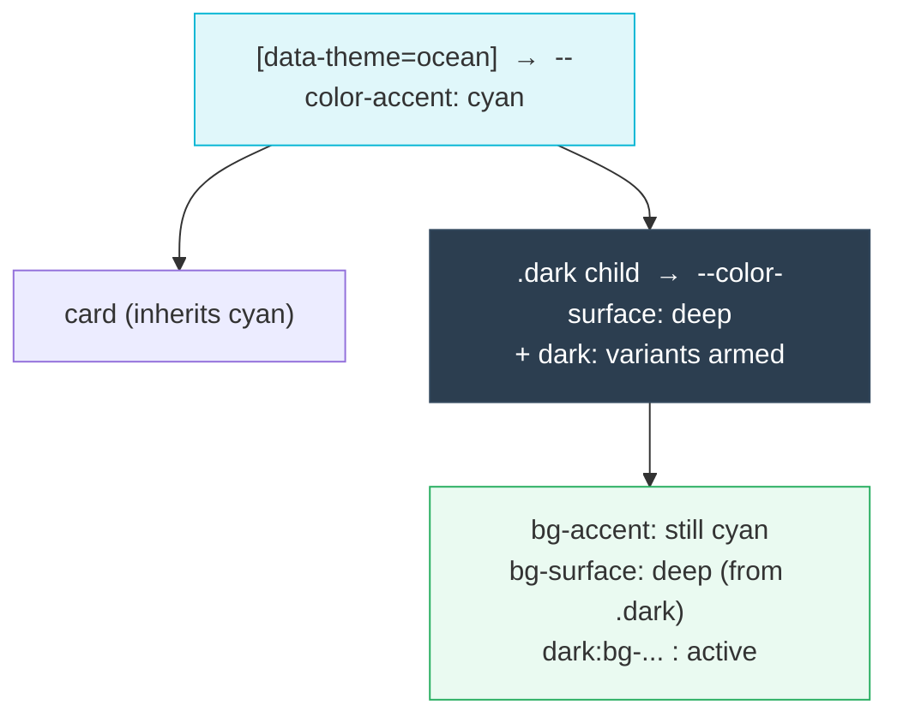

# Multi-Theme Systems

> **Companion demo:** [`multi_theme.html`](./multi_theme.html) — open in a browser.
> **Tailwind version:** v4.3.x via `@tailwindcss/browser@4` Play CDN.

---

## 0. TL;DR — the one idea

> **The analogy:** `@theme` is your *master* palette — one definition, emitted to
> `:root`, that every utility reads through a variable. "Multi-theme" is not a
> second `@theme`; it's **CSS variable scoping**. Because `bg-accent` compiles to
> `background-color: var(--color-accent)`, overriding `--color-accent` under
> `[data-theme="ocean"]` re-skins that whole subtree with **zero recompilation**.
> One compiled stylesheet, N live palettes — default, ocean, forest, dark — all
> driven by which ancestor declares the variable.



```
@theme      → emits --color-* to :root  +  .bg-* { ... var(--color-*) }
[selector]  → re-declares the SAME --color-* for a narrower subtree
result      → one compiled utility, many cascaded values
```

---

## 1. The mechanism — why this works at all

`@theme` does **two** things, and the second is what makes multi-theme possible:

1. **Registers tokens** → `--color-accent` becomes a real CSS custom property on
   `:root`, and `accent` becomes a color name Tailwind knows about.
2. **Generates utilities that read the token indirectly**:

```css
/* What the JIT emits for class="bg-accent" */
.bg-accent { background-color: var(--color-accent); }
```

That `var(--color-accent)` is the whole game. Custom properties cascade by DOM
subtree: an element inherits the value from its **nearest ancestor that declares
the property**. `:root` is the global default; a closer `[data-theme="ocean"]`
shadows it for that branch only.

```css
@theme {
  --color-accent:  oklch(0.70 0.15 250);   /* global default → :root */
  --color-surface: oklch(0.25 0.03 250);
}

/* Same variable name, narrower scope. The utility is unchanged. */
[data-theme="ocean"]  { --color-accent: oklch(0.72 0.14 215); }
[data-theme="forest"] { --color-accent: oklch(0.62 0.17 150); }
```

```html
<!-- Every subtree picks up its nearest ancestor's value -->
<section data-theme="ocean">  <div class="bg-accent"></div>  <!-- cyan  --></section>
<section data-theme="forest"> <div class="bg-accent"></div>  <!-- green --></section>
<div class="bg-accent"></div>                                 <!-- blue (root) -->
```

**No utility is recompiled.** The Play CDN / build already produced
`.bg-accent { background-color: var(--color-accent) }`. Switching theme is a pure
CSS cascade — flip one `data-theme` attribute (or one `.dark` class) and the
browser restyles the subtree.

---

## 2. `@theme` inside selectors — the v4.1 scoped form

Tailwind v4.1 also lets you nest `@theme` directly inside a selector so the
override lives next to the token definition:

```css
[data-theme="ocean"] {
  @theme {
    --color-accent: oklch(0.72 0.14 215);
  }
}
```

Semantically this is equivalent to overriding the emitted `--color-*` variable by
hand (§1). Two practical caveats:

- **Build vs Play CDN:** the build pipeline (`@import "tailwindcss"`) supports
  this reliably. The **Play CDN's** runtime JIT support for selector-nested
  `@theme` is less consistent, so for live-CDN demos the plain variable-override
  form (what `multi_theme.html` uses) is the portable, bulletproof choice — it
  cannot fail because it's just CSS.
- **What it does NOT change:** it still only re-scopes the *value*. It does not
  create new utilities; `bg-accent` must already exist.

> The companion demo asserts this via `getComputedStyle`: setting
> `data-theme="ocean"` changes the swatch's computed `background-color` — proof
> the scoped override flows through the compiled utility.

---

## 3. data-theme switching — brand palettes at runtime

The switch is one line of JavaScript. Because the override is pure CSS, there is
no rebuild, no class-swap on every element, and no `dark:`-variant spam:

```js
// Re-skin an entire subtree by flipping one attribute
stage.dataset.theme = "ocean";   // → --color-accent cascades to cyan
stage.dataset.theme = "forest";  // → green
stage.removeAttribute("data-theme"); // → back to :root default
```

| Switching style | HTML change | When to use |
|----------------|-------------|-------------|
| **data-theme attribute** | `container.dataset.theme = "ocean"` | Brand/route palettes — multiple distinct looks that coexist |
| **.dark class** | `root.classList.toggle("dark")` | Binary light/dark — pairs with `@custom-variant dark` |
| **media query (default)** | none — OS-driven | "Follow the system" with no JS |

The demo's gold-check records the default theme's computed color, sets
`data-theme="ocean"`, and asserts the two RGB strings differ.

---

## 4. Class-based dark mode via `@custom-variant`

Out of the box, `dark:` follows the OS `prefers-color-scheme` media query. To make
it **class-driven** (so a toggle button or `<html class="dark">` controls it),
override the `dark` variant — verified verbatim from
[tailwindcss.com/docs/dark-mode](https://tailwindcss.com/docs/dark-mode):

```css
/* Class-based: dark: fires when .dark is anywhere up the tree */
@custom-variant dark (&:where(.dark, .dark *));

/* Or: data-attribute dark mode */
@custom-variant dark (&:where([data-theme=dark], [data-theme=dark] *));
```

```html
<html class="dark">
  <div class="bg-white dark:bg-slate-900 text-slate-900 dark:text-white">
    dark: utilities compiled once — they activate on .dark ancestry
  </div>
</html>
```

`dark:` variants and token overrides compose: under `.dark` you can **both** use
`dark:bg-slate-900` (per-utility) **and** re-scope a token
(`.dark { --color-surface: oklch(0.16 0.01 250) }`) so every `bg-surface` darkens
automatically. Pick one style per token to avoid confusion.

---

## 5. CSS variable scoping — the cascade rules

Custom properties follow normal CSS cascade rules, with one twist: they inherit
through the DOM tree, not through CSS selector nesting.

| Selector | Applies to | Effect |
|----------|-----------|--------|
| `:root` (from `@theme`) | whole document | global default token values |
| `[data-theme="ocean"]` | that subtree | shadows `--color-*` for descendants |
| `[data-theme="forest"]` | that subtree | an independent palette — coexists with ocean elsewhere |
| `.dark` | that subtree | shadows tokens **and** arms `dark:` variants |
| `[data-theme="ocean"].dark` | intersection | both apply; per-property, the later/more-specific declaration wins |



Key consequence: **two themes can coexist on one page** — an ocean sidebar and a
forest hero render side-by-side from the *same* compiled CSS, because each
container scopes its own variable values.

---

## Killer Gotchas

| Trap | Symptom | Fix |
|------|---------|-----|
| **Put overrides in plain `<style>`, not `@theme`** | `bg-accent` ignores the new value | The reliable pattern is `@theme` for the *default* (in `text/tailwindcss`), then **plain CSS** `[data-theme="ocean"] { --color-accent: … }` to re-scope. Don't try to nest `@theme` in selectors on the Play CDN. |
| **Reading computed color too early** | gold-check sees `rgba(0,0,0,0)` | The CDN compiles async. Poll with `requestAnimationFrame` until `getComputedStyle(swatch).backgroundColor` is non-transparent, *then* assert. |
| **`getComputedStyle` returns `rgb()`, not `oklch()`** | string compare against your `oklch()` fails | Browsers normalize to `rgb()`/`color()`. Assert the value **changed between themes**, not that it equals a literal `oklch(...)` string. |
| **Scoped override on the wrong element** | swatch still shows root color | The declaring element must be an **ancestor** of the utility-bearing element. Setting `data-theme` on a sibling does nothing. |
| **Forgetting `@custom-variant dark`** | `.dark` class does nothing; `dark:` still follows the OS | Class-based dark mode *requires* overriding the variant. Without it, `dark:` keys off `prefers-color-scheme` and your toggle is inert. |
| **`@theme inline` breaks scoped overrides** | token resolves to the default everywhere | `inline` inlines the *value* into the utility (`bg-accent { background: oklch(blue) }`), bypassing `var()` — so per-subtree overrides can't reach it. Use plain `@theme` for switchable tokens. See [theme_inline](./theme_inline.html). |
| **Specificity wars between `.dark` and `[data-theme]`** | the "wrong" palette wins when both apply | They're different properties unless they collide. If both override `--color-accent`, the more specific / later rule wins — order your `<style>` deliberately. |
| **FOUC on load** | page flashes the default theme before the saved one applies | Set `data-theme`/`.dark` on `<html>` inline in `<head>` (before paint), driven by `localStorage`/`matchMedia`. Don't wait for a framework hydration. |

### Cheat sheet

```css
/* 1. Global tokens — emitted to :root, utilities read via var() */
@theme {
  --color-accent:  oklch(0.70 0.15 250);
  --color-surface: oklch(0.25 0.03 250);
}

/* 2. Scoped palettes — re-declare the SAME vars under a selector */
[data-theme="ocean"]  { --color-accent: oklch(0.72 0.14 215); }
[data-theme="forest"] { --color-accent: oklch(0.62 0.17 150); }

/* 3. Class-based dark mode — override the variant + scope tokens */
@custom-variant dark (&:where(.dark, .dark *));
.dark { --color-surface: oklch(0.16 0.01 250); }
```

```js
// 4. Runtime switching — one attribute / class flip, no rebuild
stage.dataset.theme = "ocean";          // brand palette
document.documentElement.classList.toggle("dark"); // dark mode
```

```html
<!-- 5. Two palettes coexisting from the same compiled CSS -->
<aside data-theme="ocean">  <div class="bg-accent"></div> </aside>
<main  data-theme="forest"> <div class="bg-accent"></div> </main>
```

---

## 🔗 Cross-references

- [theme_inline](/tailwind/theme_inline.html) — `@theme inline` and why it *breaks* scoped variable overrides (values get inlined, bypassing `var()`)
- [oklch_colors](/tailwind/oklch_colors.html) — the OKLCH color space your `--color-*` token values live in; perceptual uniformity across palettes
- [color_mix_opacity](/tailwind/color_mix_opacity.html) — `color-mix(in oklab, …)` tints stay perceptually correct inside any scoped theme
- [frontend/tailwind: design tokens](/frontend/tailwind/tailwind_design_tokens.html) — the `@theme` `--color-*` namespace these overrides re-scope
- [frontend/tailwind: responsive variants](/frontend/tailwind/tailwind_responsive_variants.html) — the default `dark:` (media-query) variant this bundle makes class-driven

---

## Sources

1. **Tailwind CSS — Dark mode (v4.3, official docs)**: https://tailwindcss.com/docs/dark-mode — `@custom-variant dark (&:where(.dark, .dark *))` for class-based and `(&:where([data-theme=dark], …))` for data-attribute dark mode
2. **Tailwind CSS — Theme variables (v4.3, official docs)**: https://tailwindcss.com/docs/theme — `@theme` emits tokens to `:root`; utilities reference them via `var(--color-*)`
3. **GitHub Discussion #16292 — Targeting @theme with a data-theme attribute**: https://github.com/tailwindlabs/tailwindcss/discussions/16292 — the canonical community thread on swapping palettes via `data-theme`
4. **Tailwind CSS v4.0 release notes**: https://tailwindcss.com/blog/tailwindcss-v4 — CSS-first config, `@theme` directive, `@custom-variant` semantics
