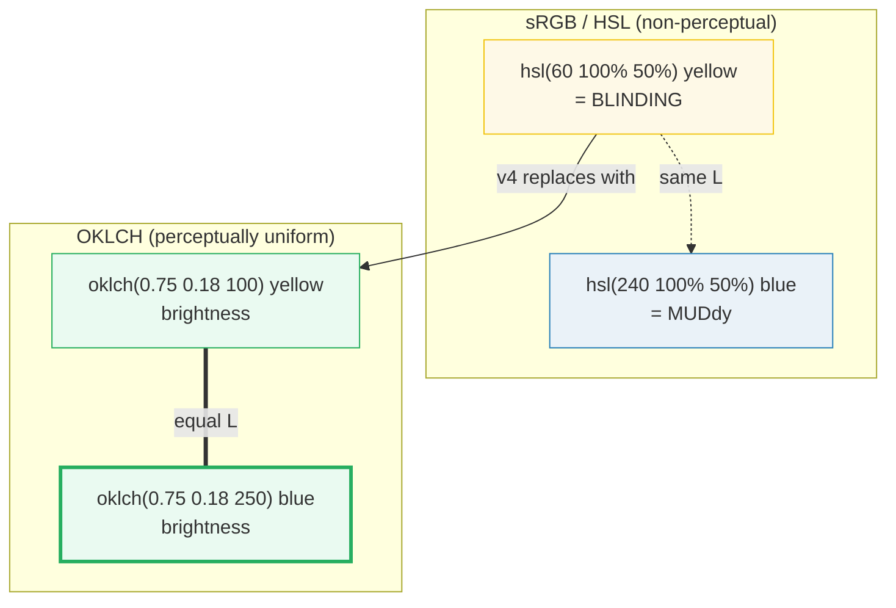

# OKLCH Colors

> **Companion demo:** [`oklch_colors.html`](./oklch_colors.html) — open in a browser.
> **Tailwind version:** v4.3.x via `@tailwindcss/browser@4` Play CDN.

---

## 0. TL;DR — the one idea

> **The analogy:** sRGB (`#hex`) and HSL (`hsl()`) measure color with a broken
> ruler — a "50% lightness" yellow is glaringly brighter than a "50% lightness"
> blue. **OKLCH** (OK Lightness Chroma Hue) is calibrated to human vision: equal
> lightness numbers look equally bright across every hue. Tailwind v4 switched
> its entire default palette to OKLCH so its `50…950` ramps are visually
> consistent for every color.



```
oklch(L C H)          L: 0..1 lightness   C: 0..~0.4 chroma   H: 0..360 hue
oklch(L C H / alpha)  alpha: 0..1 (or %)
```

---

## 1. The three OKLCH axes

OKLCH is a **cylindrical** color space — Lightness is the vertical axis, Chroma
is the radius, Hue is the angle. It is the polar form of **OKLab**, a model
fitted against human color-difference experiments (the "OK" = "perceptually OK").

| Axis | Range | Controls | Notes |
|------|-------|----------|-------|
| **L** — Lightness | `0`–`1` (or `0%`–`100%`) | perceived brightness | `0` = black, `1` = white. Fitted to vision, so L=0.5 looks the same brightness for every hue. |
| **C** — Chroma | `0`–`~0.4` | colorfulness / saturation | `0` = pure gray. Capped by the target gamut — high-C colors may clip when an sRGB display can't render them. |
| **H** — Hue | `0`–`360` | the color wheel angle | `0`/`360` = red, `90` = yellow-green, `180` = cyan, `270` = blue. Changing H with fixed L,C preserves perceived brightness. |
| `/ alpha` | `0`–`1` | opacity | Tailwind v4 emits `color-mix(in oklab, ...)` for `/40` modifiers — perceptually correct transparency. |

```mermaid
graph LR
    subgraph "OKLCH cylinder"
        L["L axis (vertical)<br/>0 black → 1 white"] --- CENTER["axis"]
        CENTER --- C["C radius (0 gray → vivid)"]
        C --- H["H angle 0°→360°<br/>the color wheel"]
    end
    style CENTER fill:#30363d,stroke:#30363d
    style L fill:#eafaf1,stroke:#27ae60
    style C fill:#fef9e7,stroke:#f1c40f
    style H fill:#eaf2f8,stroke:#2980b9
```



---

## 2. Why perceptual uniformity matters

### The HSL lie
In HSL, `hsl(60, 100%, 50%)` (yellow) and `hsl(240, 100%, 50%)` (blue) share the
*same* Lightness=50% and Saturation=100%. But to your eye, the yellow is
~4.5× brighter. HSL was designed for easy RGB editing, not for vision.

### The OKLCH fix
`oklch(0.75 0.18 100)` (yellow) and `oklch(0.75 0.18 250)` (blue) share the same
**perceived** lightness. Swap hues freely — brightness stays constant. This is
why Tailwind v4's `green-500` (L=0.723) and `cyan-500` (L=0.715) look equally
bright side-by-side, by design.

| Property | sRGB (`#hex`, `rgb()`) | HSL (`hsl()`) | **OKLCH (`oklch()`)** |
|----------|------------------------|---------------|------------------------|
| Lightness meaning | physical, not visual | arbitrary — yellow "50%" ≠ blue "50%" | **calibrated to human vision** |
| Equal-L swap of hue | brightness shifts wildly | brightness shifts wildly | **brightness preserved** |
| Gradient midpoint | stays saturated (sRGB is the gamut) | desaturated dead zone | **stays vivid** (`in oklch` interpolation) |
| Wide gamut (P3) | ❌ clipped to sRGB | ❌ clipped to sRGB | **✅ expresses P3 colors** |
| Opacity modifier | alpha on raw rgb | alpha on raw rgb | **perceptual alpha via `color-mix`** |
| Tailwind v4 default | used for hex overrides | not used | **✅ every `--color-*` token** |

---

## 3. Wide gamut — OKLCH reaches colors sRGB can't

sRGB (`#hex`) describes only ~35% of human-visible color. P3 (used by modern
displays, Apple gear) and Rec.2020 are wider. OKLCH can *express* those colors —
a value like `oklch(0.7 0.32 150)` is a saturated green that has **no exact
`#hex` equivalent** (it clips to the nearest sRGB green). On a P3 display it
renders in full; on an sRGB display the browser gracefully clips.

```css
/* This green is outside sRGB — #hex can't represent it faithfully */
.vivid-green { background: oklch(0.7 0.32 150); }
```

Practical impact: your brand color defined in OKLCH looks richer on capable
screens without breaking on old ones.

---

## 4. Tailwind v4's default palette — every token is OKLCH

All `--color-*` theme variables ship as `oklch()` values. Here are the actual
`-500` stops (verified against `tailwindcss.com/docs/colors`, v4.3):

| Token | OKLCH value | Approx sRGB (clipped) |
|-------|-------------|-----------------------|
| `--color-red-500` | `oklch(0.637 0.237 25.331)` | `#ef4444` |
| `--color-orange-500` | `oklch(0.705 0.213 47.604)` | `#f97316` |
| `--color-amber-500` | `oklch(0.769 0.188 70.080)` | `#f59e0b` |
| `--color-yellow-500` | `oklch(0.795 0.184 86.047)` | `#eab308` |
| `--color-lime-500` | `oklch(0.768 0.233 130.850)` | `#84cc16` |
| `--color-green-500` | `oklch(0.723 0.219 149.579)` | `#22c55e` |
| `--color-emerald-500` | `oklch(0.696 0.170 162.480)` | `#10b981` |
| `--color-teal-500` | `oklch(0.704 0.140 182.503)` | `#14b8a6` |
| `--color-cyan-500` | `oklch(0.715 0.143 215.221)` | `#06b6d4` |
| `--color-sky-500` | `oklch(0.685 0.169 237.323)` | `#0ea5e9` |
| `--color-blue-500` | `oklch(0.623 0.214 259.815)` | `#3b82f6` |
| `--color-indigo-500` | `oklch(0.585 0.233 277.117)` | `#6366f1` |
| `--color-violet-500` | `oklch(0.606 0.250 292.717)` | `#8b5cf6` |
| `--color-purple-500` | `oklch(0.627 0.265 303.900)` | `#a855f7` |
| `--color-fuchsia-500` | `oklch(0.667 0.295 322.150)` | `#d946ef` |
| `--color-pink-500` | `oklch(0.656 0.241 354.308)` | `#ec4899` |
| `--color-rose-500` | `oklch(0.645 0.246 16.439)` | `#f43f5e` |
| `--color-gray-500` | `oklch(0.551 0.027 264.364)` | `#6b7280` |

Note the engineered consistency: `green-500` (L=0.723), `cyan-500` (L=0.715) and
`sky-500` (L=0.685) cluster near L≈0.7 — they read as the same brightness tier.
In HSL the same family would be all over the map.

### Defining your own OKLCH color
```css
@theme {
  --color-brand: oklch(0.7 0.15 250);   /* enables bg-brand, text-brand, border-brand */
}
```

---

## 5. Opacity via `color-mix` (the `/40` modifier)

When you write `bg-blue-500/40`, Tailwind v4 does **not** just slap an alpha
channel on the raw rgb. It emits:
```css
.bg-blue-500\/40 {
  background-color: color-mix(in oklab, var(--color-blue-500) 40%, transparent);
}
```
The `in oklab` interpolation means the 40% tint is **perceptually** 40% lighter
— it doesn't gray-out as badly as raw alpha does on saturated colors. This is
the practical payoff of the OKLab family that OKLCH belongs to.

---

## Killer Gotchas

| Trap | Symptom | Fix |
|------|---------|-----|
| **High chroma clips on sRGB screens** | `oklch(0.7 0.35 150)` looks dull/muddy | Chroma > ~0.15 often exceeds sRGB. Either accept the clip, target P3, or lower C. Test on real hardware. |
| **`getComputedStyle` returns `rgb()` not `oklch()`** | You expected `oklch(...)` back | Browsers normalize computed colors. Most return `rgb()`/`color(...)`; Safari may keep `oklch()`. Don't assert the literal string — assert non-transparent + correct channel ratios. |
| **Gradient still looks muddy** | `from-red-500 to-blue-500` has a gray midpoint | You're interpolating in sRGB. v4 stops are OKLCH so the engine interpolates `in oklch` by default — ensure you're not overriding with raw `rgb()` stops. |
| **Hue wraps differently than HSL** | "blue" isn't where you expect on the wheel | OKLCH hue ≈ HSL hue but not identical. Use the table above; `250` ≈ blue, `25` ≈ red. |
| **`@theme` in a regular `<style>` does nothing** | `bg-brand` is an unknown class | Use `<style type="text/tailwindcss">` (Play CDN) or `@import "tailwindcss"` (build). Plain `<style>` isn't JIT-compiled. |
| **Lightness 0–1 vs 0–100%** | `oklch(70 0.15 250)` is blinding white | Lightness has no unit. `0.7` = `70%`; a bare `70` means 7000% → clamps to white. Always use a fraction or `%`. |
| **OKLCH browser support** | Old browsers ignore the value | Supported in all modern browsers (2023+): Chrome 111+, Safari 15.4+, Firefox 113+. For legacy, provide an `rgb()` fallback before the `oklch()` line. |
| **`color-mix` opacity needs `in oklab`** | `/50` tint looks washed-out gray | v4 handles this automatically. If hand-writing, use `color-mix(in oklab, …)`, not `in srgb`. |

### Cheat sheet

```css
/* 1. Custom OKLCH token → bg-brand, text-brand, border-brand */
@theme {
  --color-brand: oklch(0.7 0.15 250);
}

/* 2. Perceptually-correct 50% tint (what bg-brand/50 compiles to) */
.tint { background-color: color-mix(in oklab, var(--color-brand) 50%, transparent); }

/* 3. Override a default ramp value */
@theme {
  --color-gray-500: oklch(0.551 0.027 264.364);
}

/* 4. Vivid gradient — OKLCH interpolation avoids the gray dead zone */
.grad { background-image: linear-gradient(in oklch to right,
           oklch(0.6 0.22 25), oklch(0.6 0.22 250)); }

/* 5. Fallback for legacy browsers */
.legacy {
  background-color: #3b82f6;            /* sRGB fallback */
  background-color: oklch(0.623 0.214 259.815); /* progressive enhancement */
}
```

```html
<!-- Arbitrary one-off OKLCH (underscores = spaces) -->
<div class="bg-[oklch(0.7_0.15_250)]">…</div>

<!-- Opacity modifier → color-mix(in oklab, …) -->
<div class="bg-brand/40">…</div>
```

---

## 🔗 Cross-references

- [color_mix_opacity](/tailwind/color_mix_opacity.html) — how `/40` opacity modifiers compile to `color-mix(in oklab, …)` and why perceptual alpha looks better
- [theme_inline](/tailwind/theme_inline.html) — when `@theme` (not `inline`) breaks variable resolution for OKLCH tokens referencing other vars
- [multi_theme](/tailwind/multi_theme.html) — scoped `[data-theme]` systems that swap OKLCH palettes per theme
- [gradients_v4](/tailwind/gradients_v4.html) — `bg-linear-*` stops interpolate in OKLCH, killing the sRGB gray dead zone
- [frontend/tailwind: design tokens](/frontend/tailwind/tailwind_design_tokens.html) — the `@theme` `--color-*` namespace these OKLCH values live in

---

## Sources

1. **Tailwind CSS — Colors (v4.3, official docs)**: https://tailwindcss.com/docs/colors — full default OKLCH palette reference + `@theme` color customization
2. **Evil Martians — OKLCH in CSS: why we moved from RGB and HSL**: https://evilmartians.com/chronicles/oklch-in-css-why-quit-rgb-hsl — the canonical explainer on perceptual uniformity and why OKLCH replaced sRGB/HSL
3. **MDN — `oklch()` color function**: https://developer.mozilla.org/en-US/docs/Web/CSS/color_value/oklch — L/C/H axis semantics and browser support
4. **OKLCH.com — color picker & converter**: https://oklch.com/ — interactive OKLCH picker by Evil Martians, with gamut visualization
