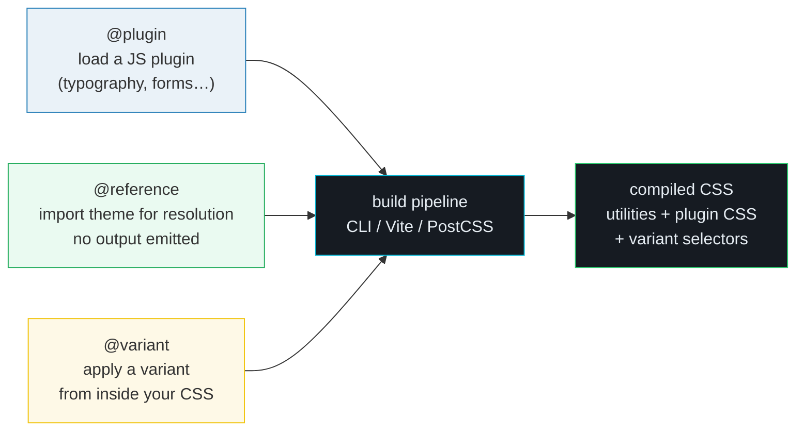
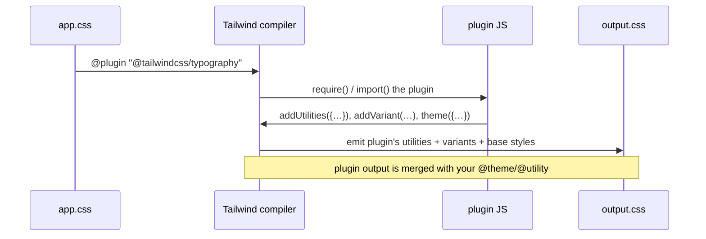

# Plugins & Directives — `@plugin` / `@reference` / `@variant`

> **Companion demo:** [`plugins_ecosystem.html`](./plugins_ecosystem.html) — open in a browser.
> The HTML is the rendered ground truth: `@variant` runs live in the Play CDN,
> while `@plugin` and `@reference` are simulated (they require a real build).

---

## 0. TL;DR — the one idea

Tailwind v4 is configured in **CSS**, not JavaScript. Three at-rules are the
"wiring" between your stylesheet and a real build pipeline (CLI / Vite /
PostCSS). None of them produce classes on their own — they change what Tailwind
**knows** or **emits**.



| directive | one-line job | replaces (v3) | runs in CDN? |
|---|---|---|---|
| `@plugin` | load a JS plugin + optional options | `plugins: ["@tailwindcss/typography"]` in config | ❌ needs npm |
| `@reference` | make `@apply`/`theme()` work in scoped styles | no equivalent — needed hacks | ❌ needs a build graph |
| `@variant` | apply a variant from inside your CSS | leaving CSS for a `hover:` utility | ✅ yes |

---

## 1. How it works — `@plugin`

`@plugin` loads a **JavaScript** plugin and runs its `addUtilities` /
`addVariant` / `addBase` / `theme` callbacks at build time. It accepts a
package name **or** a local file path, and an optional brace block of options.

```css
@import "tailwindcss";

/* Official plugin — adds .prose and friends */
@plugin "@tailwindcss/typography";

/* Pass options (the plugin's own options object) */
@plugin "@tailwindcss/typography" {
  className: "wysiwyg";   /* rename .prose → .wysiwyg everywhere */
}

/* Local custom plugin (v3 API still works) */
@plugin "./plugins/rainbow-utility.js";
```

### Mechanism



1. The compiler **resolves** the specifier via Node module resolution (npm /
   local path) — this is why the Play CDN can't run `@plugin`.
2. The plugin's exported function is called with the v3 plugin API
   (`addUtilities`, `addVariant`, `matchUtilities`, `theme`, …).
3. Whatever the plugin registers is merged into the build, **alongside** your
   own `@theme` / `@utility` / `@custom-variant`. CSS-defined values take
   precedence on conflict.

### Official plugins

| plugin | installs | v4 status |
|---|---|---|
| `@tailwindcss/typography` | `.prose`, `prose-sm…prose-xl`, `prose-invert`, `prose-{color}` — opinionated long-form text | JS plugin — load via `@plugin` |
| `@tailwindcss/forms` | cross-browser resets + styling for `input`, `select`, `checkbox`, `radio` | JS plugin — load via `@plugin` |
| `@tailwindcss/aspect-ratio` | `aspect-w-*` / `aspect-h-*` (legacy `padding-bottom` shim) | largely obsolete — use built-in `aspect-*` |
| `@tailwindcss/line-clamp` | `line-clamp-*` | **built into v4 core — do not install** |
| `@tailwindcss/container-queries` | `@container` + `@sm:`…`@7xl:` variants | **built into v4 core — do not install** |

> ⚠️ The official docs classify `@plugin` (and `@config`) under "compatibility"
> because they bridge v3-era JS plugins. They are still the **canonical** way to
> load the official plugins above, which are themselves JS-based. For new,
> static behavior prefer the CSS-first directives (`@utility`,
> `@custom-variant`, `@theme`) — they need no JS and run everywhere.

### Custom plugins (the JS API)

A custom plugin is a JS file default-exporting a function:

```js
// plugins/rainbow-utility.js
export default function ({ addUtilities }) {
  addUtilities({
    '.text-rainbow': {
      'background-image': 'linear-gradient(90deg,red,orange,yellow,green,blue,violet)',
      '-webkit-background-clip': 'text',
      'background-clip': 'text',
      color: 'transparent',
    },
  });
}
```

```css
@plugin "./plugins/rainbow-utility.js";
```

Then `<span class="text-rainbow">hi</span>` works. For most new utilities,
though, a plain `@utility` block in CSS is simpler and CDN-portable — see
[`FUNCTIONAL_UTILITY.md`](./FUNCTIONAL_UTILITY.md).

---

## 2. `@reference` — scoped styles in component frameworks

Vue SFCs, Svelte, and CSS modules compile each `<style>` block **in isolation**.
If you write `@apply text-cyan-400` inside a `<style scoped>`, the compiler has
no idea what `text-cyan-400` is — that symbol lives in your root
`@import "tailwindcss"` entry, which the scoped block never sees.

`@reference` imports the theme + utilities + custom variants **for resolution
only**. Symbols become visible, but **no CSS is emitted** — so you don't
duplicate Tailwind across every component file.

```html
<!-- ProfileCard.vue -->
<template>
  <h1 class="title">Hello</h1>
</template>

<style scoped>
  /* WITHOUT this line: "@apply text-cyan-400" → "unknown utility" error */
  @reference "tailwindcss";

  .title {
    @apply text-2xl font-bold text-cyan-400;
  }
</style>
```

| you write | when |
|---|---|
| `@reference "tailwindcss";` | scoped style that only needs the **default** theme |
| `@reference "../../app.css";` | scoped style that needs **your** tokens — point at the file that does `@import "tailwindcss"` + your `@theme`/`@plugin`/`@custom-variant` |
| `@reference "#app.css";` | subpath import via `package.json` `"imports"` map (CLI / Vite / PostCSS only) |

> ⚠️ `@reference` is **not** `@import`. `@import "tailwindcss"` emits Tailwind's
> full CSS wherever it appears (you'd duplicate it per component).
> `@reference` emits **nothing** — it only teaches the local compiler about the
> symbols. That single distinction is the whole reason the directive exists.

---

## 3. `@variant` — apply a variant from inside your CSS

Instead of leaving your stylesheet for a `hover:` / `dark:` / `md:` utility
class, use `@variant` inline. It accepts any variant — built-in or one you
registered with `@custom-variant`.

```css
@custom-variant pressed (&:active);

.demo-btn {
  background-color: var(--color-cyan-600);
  color: white;
  /* …base styles… */
  @variant hover {
    background-color: var(--color-cyan-400);
  }
  @variant pressed {
    transform: scale(0.97);
  }
}
```

The compiler rewrites each `@variant` block into the selector the variant
resolves to:

```css
.demo-btn { background-color: var(--color-cyan-600); color: #fff; … }
.demo-btn:hover { background-color: var(--color-cyan-400); }
.demo-btn:active { transform: scale(.97); }
```

This is the **in-CSS twin** of the `variant:` class prefix. Use it when you're
already writing a component class (e.g. a BEM-style `.card__title`) and want
hover/dark behavior without dropping into the HTML to add `hover:text-white`.

> Unlike `@plugin`/`@reference`, `@variant` **does** run in the Play CDN — the
> live demo in [`plugins_ecosystem.html`](./plugins_ecosystem.html) Panel 4
> uses it and the gold-check proves the selectors were emitted.

---

## 4. Killer Gotchas

| trap | symptom | fix |
|---|---|---|
| `@plugin` in the Play CDN | `@plugin is not supported in the browser build` or silently ignored | `@plugin` needs Node resolution — use a real build (CLI/Vite/PostCSS). The CDN is for utilities only. |
| installing `@tailwindcss/container-queries` in v4 | duplicate/broken `@container` output, or "already registered" error | it's built into v4 core — **don't** install or `@plugin` it. Same for `@tailwindcss/line-clamp`. |
| `@apply` in a Vue `<style scoped>` fails with "unknown utility" | compiler can't see Tailwind from the isolated block | add `@reference "tailwindcss";` (default theme) or `@reference "../../app.css";` (your tokens) at the top of the block. |
| using `@import "tailwindcss"` instead of `@reference` in scoped styles | Tailwind's full CSS gets duplicated into **every** component file — huge bundle bloat | `@import` emits CSS; `@reference` emits nothing. In scoped blocks always use `@reference`. |
| `@plugin { className: "…" }` options silently ignored | plugin still emits `.prose` | options only work for plugins that **read** them in their JS. Verify the plugin supports the option (typography does support `className`). |
| "Unknown at-rule @plugin / @variant" warning in the IDE | editor error squiggle | install the official **Tailwind CSS IntelliSense** extension / enable Tailwind language server — plain CSS LSPs don't know v4 at-rules. |
| `@variant` block at the top level (not nested in a rule) | nothing happens / parse error | `@variant` only makes sense **inside** a rule. To define a *new* variant use `@custom-variant`, not `@variant`. |
| mixing JS config and CSS config precedence | config value wins when you expected `@theme` to | `@theme`/`@utility` take precedence over `tailwind.config.js` (loaded via `@config`) on conflict. Drop the JS config to remove ambiguity. |

---

## 5. Cheat sheet

```css
@import "tailwindcss";

/* ── @plugin: load JS plugins ───────────────────────────────────── */
@plugin "@tailwindcss/typography";               /* official */
@plugin "@tailwindcss/forms";
@plugin "@tailwindcss/typography" {              /* with options */
  className: "wysiwyg";
}
@plugin "./plugins/my-plugin.js";                /* local custom */

/* ── @reference: scoped styles (Vue/Svelte/CSS modules) ─────────── */
/* in a <style scoped> block: */
@reference "tailwindcss";          /* default theme only */
@reference "../../app.css";        /* your @theme/@plugin/@custom-variant */

/* ── @variant: apply a variant from inside CSS ──────────────────── */
@custom-variant pressed (&:active);              /* define a new variant */

.demo-btn {
  background: var(--color-cyan-600);
  @variant hover   { background: var(--color-cyan-400); }  /* built-in */
  @variant pressed { transform: scale(.97); }              /* custom    */
  @variant dark    { background: var(--color-cyan-800); }
}
```

| intent | use |
|---|---|
| load the typography plugin | `@plugin "@tailwindcss/typography";` |
| rename `.prose` → custom class | `@plugin "@tailwindcss/typography" { className: "wysiwyg"; }` |
| `@apply` inside Vue `<style scoped>` | `@reference "tailwindcss";` |
| `@apply` with your own tokens in scoped styles | `@reference "../../app.css";` |
| apply `hover` from inside CSS | `.x { @variant hover { … } }` |
| define + apply a custom variant | `@custom-variant pressed (&:active);` then `@variant pressed { … }` |
| add a brand-new static utility (no JS) | `@utility tab-4 { tab-size: 4; }` — see [`FUNCTIONAL_UTILITY.md`](./FUNCTIONAL_UTILITY.md) |

---

## 🔗 Cross-references

- [`SOURCE_DETECTION.md`](./SOURCE_DETECTION.md) — `@source` & content detection:
  the *other* build-time directive. `@source` controls **which files Tailwind
  scans**; `@plugin` controls **what extra CSS gets generated**.
- [`BUILD_TOOLING.md`](./BUILD_TOOLING.md) — CLI / Vite / PostCSS: the build
  pipelines where `@plugin` actually resolves npm packages and `@reference`
  resolves the entry graph.
- [`PREFLIGHT_RESET.md`](./PREFLIGHT_RESET.md) — Tailwind's base reset. Plugins
  that call `addBase()` inject rules **into** preflight's layer; understanding
  the reset explains why form/typography plugins exist.
- [`FUNCTIONAL_UTILITY.md`](./FUNCTIONAL_UTILITY.md) — `@utility`: the
  CSS-first, CDN-portable alternative to writing a JS plugin for static
  utilities. Prefer it over `@plugin` for new code.
- [`plugins_ecosystem.html`](./plugins_ecosystem.html) — the live companion
  (`@variant` runs; `@plugin`/`@reference` simulated with honest labels).

---

## Sources

1. **Tailwind CSS — Functions and directives (v4.3 docs).** Canonical reference
   for `@plugin`, `@reference`, `@variant`, `@config`, `@import`, `@theme`,
   `@utility`, `@custom-variant`, and the compatibility note classifying
   `@plugin`/`@config` as v3 bridges.
   <https://tailwindcss.com/docs/functions-and-directives>
2. **Tailwind CSS v4.0 blog post.** Announces the CSS-first configuration model,
   the `@plugin` directive replacing the `plugins:[]` array, and built-in
   container queries / line-clamp (no plugin needed).
   <https://tailwindcss.com/blog/tailwindcss-v4>
3. **Tailwind CSS — Adding custom styles (v4 docs).** Documents `@variant` and
   `@custom-variant` usage from inside CSS, and the `@reference` pattern for
   Vue/Svelte scoped styles.
   <https://tailwindcss.com/docs/adding-custom-styles>
4. **`@tailwindcss/typography` — npm/GitHub.** Plugin options reference
   (`className`, element modifiers) used in the `@plugin { … }` examples.
   <https://github.com/tailwindlabs/tailwindcss/tree/main/packages/%40tailwindcss-typography>
