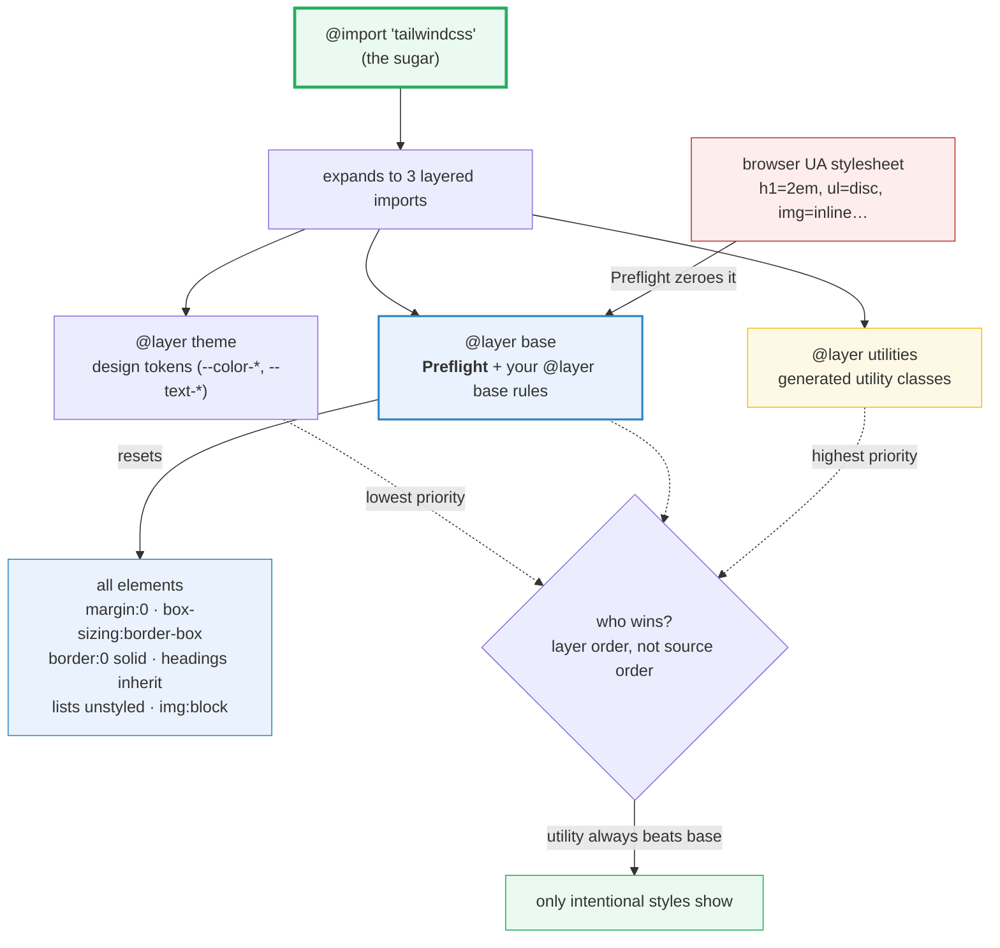

# Preflight & CSS Reset

> **Companion demo:** [`preflight_reset.html`](./preflight_reset.html) — open in a browser.
> **Tailwind version:** v4.3.x. Preflight ships in the `base` cascade layer the
> moment you write `@import "tailwindcss";`. The Play CDN injects it into the
> page, so the demo's `getComputedStyle()` reads are live ground truth.

---

## 0. TL;DR — the one idea

> **The analogy:** every browser ships a *user-agent stylesheet* full of
> opinionated defaults — `<h1>` is 2em bold, `<ul>` has disc bullets, images are
> `inline` (the mysterious under-image gap), `<button>` doesn't inherit your
> font. Preflight is Tailwind's **eraser**: built on
> [modern-normalize](https://github.com/sindresorhus/modern-normalize), it zeroes
> those defaults so the **only** visible styling on the page is a utility you
> consciously chose. Headings collapse to body text, lists lose their markers,
> borders become `0 solid currentColor`, and `box-sizing: border-box` becomes
> universal. You then *opt back in* — `list-disc` for a real list, `@layer base`
> to restore a type scale, or disable Preflight entirely by omitting one import.



```
@import "tailwindcss";                       /* Preflight ON (default) */

@layer theme, base, components, utilities;   /* priority: lowest → highest */
@import "tailwindcss/theme.css"      layer(theme);
@import "tailwindcss/preflight.css"  layer(base);     /* ← Preflight */
@import "tailwindcss/utilities.css"  layer(utilities);
```

---

## 1. How it works — Preflight in the cascade

Tailwind v4 is built on **native CSS cascade layers**. `@import "tailwindcss";`
declares four layers in priority order — `theme, base, components, utilities` —
then imports Preflight into `base`. Layer order (not source order, not
specificity) decides the winner when rules collide:

- A **utility** (`text-2xl`) lives in the highest layer → it always beats a
  Preflight rule (`h1 { font-size: inherit }`) on the same element. No
  `!important` required.
- Your **`@layer base`** additions ride *inside the same `base` layer* as
  Preflight, so normal specificity + source order decide between them — a class
  like `.restore-h1` beats the bare `h1` selector.
- The **`theme`** layer holds design tokens as plain CSS variables
  (`--color-cyan-500`, `--text-2xl`); Preflight can reference them, and your
  `@layer base` overrides can too (`font-size: var(--text-2xl)`).

This is why "utility classes just work" without specificity wars: the cascade is
partitioned, and utilities own the top partition.

---

## 2. What Preflight resets

The actual Preflight ruleset (abridged from
[`preflight.css`](https://github.com/tailwindlabs/tailwindcss/blob/main/packages/tailwindcss/preflight.css)):

```css
*, ::after, ::before, ::backdrop, ::file-selector-button {
  margin: 0; padding: 0;           /* kill UA margins on everything        */
  box-sizing: border-box;          /* width includes padding + border      */
  border: 0 solid;                 /* border-style:solid, color:currentColor */
}
h1, h2, h3, h4, h5, h6 { font-size: inherit; font-weight: inherit; }
ol, ul, menu { list-style: none; }
img, svg, video, canvas, audio, iframe, embed, object {
  display: block; vertical-align: middle;     /* no inline baseline gap   */
}
img, video { max-width: 100%; height: auto; } /* responsive by default    */
button, input, optgroup, select, textarea { font: inherit; }   /* v4       */
[hidden]:where(:not([hidden="until-found"])) { display: none !important; }
```

| Element / selector | Browser default | After Preflight | Why |
|---|---|---|---|
| `*` (all) | `margin:` various; `box-sizing: content-box` | `margin:0; padding:0; box-sizing: border-box` | spacing comes only from your scale; widths include padding + border |
| `*` borders | `0 none currentColor` | `0 solid` (color → `currentColor`) | so `class="border"` alone draws 1px solid currentColor |
| `h1`–`h6` | big + bold (`h1` ≈ 2em) | `font-size: inherit; font-weight: inherit` | avoid sizes outside your type scale; style headings deliberately |
| `ol, ul, menu` | disc / decimal markers + padding | `list-style: none` | most UI "lists" are layout, not outlines |
| `img, svg, video…` | `display: inline` (baseline gap) | `display: block; vertical-align: middle` | kills the mysterious under-image whitespace |
| `img, video` | intrinsic size (can overflow) | `max-width: 100%; height: auto` | responsive by default — never wider than parent |
| `button, input…` | system font, doesn't inherit | `font: inherit` (v4) | form controls match your typography |
| `[hidden]` | `display: none` | `display: none !important` (unless `hidden="until-found"`) | a utility can't accidentally reveal a hidden element |

> **The live demo proves it:** a bare `<h1>` inside the Tailwind page measures
> ~15–16px (inherited from body), **not** the UA 2em (32px). The same markup in
> an `<iframe>` with no Tailwind renders the big default. See
> [`preflight_reset.html`](./preflight_reset.html) panel 2.

---

## 3. Overriding Preflight in `@layer base`

Preflight is a starting point, not a cage. Add your own base styles in the same
`base` layer and they compose with Preflight by normal CSS rules:

```css
@layer base {
  h1 { font-size: var(--text-2xl); font-weight: 700; }   /* restore headings  */
  h2 { font-size: var(--text-xl);  font-weight: 700; }
  a  { color: var(--color-blue-600); text-decoration: underline; }

  /* keep VoiceOver announcing a list while it stays unstyled: */
  ul[role="list"] { list-style: disc; padding-left: 1.5rem; }

  /* scope Preflight's border reset away from a fragile third-party widget: */
  .google-map * { border-style: none; }
}
```

**Why this works without `!important`:** your rules and Preflight share the
`base` layer, so the winner is decided by specificity (a class beats the `h1`
type selector) and source order (a later same-specificity rule wins). Utilities
in the higher `utilities` layer still beat everything in `base` — so
`text-3xl` on an `<h1>` overrides both Preflight *and* your `@layer base` rule.

### Disabling Preflight entirely

Embedding Tailwind into an existing design system? Omit the Preflight import and
keep the rest — you get theme tokens + utilities but no reset:

```css
@layer theme, base, components, utilities;
@import "tailwindcss/theme.css"      layer(theme);
/* @import "tailwindcss/preflight.css" layer(base);  ← DROPPED: Preflight OFF */
@import "tailwindcss/utilities.css"  layer(utilities);
```

> **Gotcha:** when importing the pieces individually, modifiers attach to their
> relevant import — `source(...)` and `important` go on `utilities.css`,
> `theme(static)` / `prefix(...)` go on `theme.css`. See
> [functions-and-directives](https://tailwindcss.com/docs/functions-and-directives).

---

## 4. v3 → v4 Preflight changes

The reset itself was re-opinionated in v4. The headline change — **default border
color is now `currentColor`** — bites almost every upgrade:

| Behavior | v3 | v4 | Migration note |
|---|---|---|---|
| default border color | `gray-200` (Preflight forced it) | `currentColor` (CSS default, no override) | borders now follow text color; add `border-gray-200` to restore the old look. **Affects `divide-*` too.** |
| button / form font | partly inherited | `font: inherit` fully | form controls match body type — fewer `font-sans` overrides needed |
| `::placeholder` | color forced to `gray-400`, `opacity: 1` | `opacity: 1`, color inherits | placeholders inherit text color; set `placeholder:text-gray-400` explicitly |
| `ring` default width | `3px` with offset | `1px`, uses `currentColor` | `ring` draws a hairline now — use `ring-4` for old thickness |
| architecture | `@layer` (Tailwind-emulated) | native cascade layers (`theme, base, components, utilities`) | theme tokens are first-class CSS variables in their own layer |

The border-color change is the one most likely to silently change your UI on
upgrade: every `class="border"` that used to be light gray is now the element's
text color. The official
[upgrade guide](https://tailwindcss.com/docs/upgrade-guide) flags it first.

---

## Killer Gotchas

| Trap | Symptom | Fix |
|------|---------|-----|
| **"My borders turned black/dark after upgrading to v4"** | `class="border"` elements now draw `currentColor` borders (was `gray-200` in v3) | Add `border-gray-200` (or your chosen color) explicitly, or restore the v3 default globally: `@layer base { *, ::before, ::after { border-color: var(--color-gray-200); } }` |
| **"My headings are all the same size!"** | `<h1>` looks like body text — Preflight reset it to `font-size: inherit` | Restore a scale in `@layer base { h1 { font-size: var(--text-2xl) } }`, or just use utilities (`text-2xl font-bold`) |
| **"My list has no bullets"** | `<ul><li>` renders flat — Preflight set `list-style: none` | Use `list-inside list-disc`, or `@layer base { ul { list-style: disc; padding-left: 1.5rem } }`. Keep `role="list"` for VoiceOver. |
| **"Images in a flex row have a weird gap / baseline space"** | You're fighting Preflight's `display: block` on media, OR you expected the old `inline` behavior | That's Preflight killing the inline baseline gap (a *feature*). To revert one image: `class="inline"`. |
| **Third-party widget (Google Maps, rich text editor) looks broken** | Preflight's universal `border: 0 solid` + `box-sizing` clobbers the widget's own styles | Scope Preflight away: `@layer base { .widget-root * { border-style: none; box-sizing: content-box; } }` |
| **"I disabled Preflight but now nothing is styled"** | You dropped the Preflight import but kept `@import "tailwindcss"` somewhere, or forgot utilities still need their import | Disable by importing theme + utilities **individually** (see §3), not by deleting a line from the sugar import. |
| **"My `@layer base` override isn't applying"** | A utility class on the same element lives in the higher-priority `utilities` layer and wins | That's by design — utilities beat base. Either remove the utility or move your rule to a higher layer. Don't reach for `!important`. |
| **"`hidden` attribute element is still visible"** | A utility set `display:flex` etc., but Preflight forces `[hidden] { display:none !important }` — so it *should* be hidden | Check the element actually has the `hidden` attribute at render time (JS may have removed it). `hidden="until-found"` is the only exception. |
| **"Form controls don't match my font"** (v3 muscle memory) | In v3 you needed `font-sans` on `<input>`; in v4 Preflight does `font: inherit` | In v4 this is automatic. If you disabled Preflight, re-add `@layer base { button, input, textarea, select { font: inherit } }`. |
| **Expecting the Play CDN to honor a disabled Preflight** | Your `/* no preflight */` CSS comment does nothing in the browser demo | The CDN always injects Preflight. Disabling it is a **build-time** concern (real `@import` composition). Demos show Preflight ON. |

### Cheat sheet

```css
/* 1. Default — Preflight ON (the sugar) */
@import "tailwindcss";

/* 2. Restore a heading type scale */
@layer base {
  h1 { font-size: var(--text-2xl); font-weight: 700; }
  h2 { font-size: var(--text-xl);  font-weight: 700; }
  h3 { font-size: var(--text-lg);  font-weight: 600; }
}

/* 3. Give real lists their bullets back */
@layer base { ul[role="list"] { list-style: disc; padding-left: 1.5rem; } }
/* or per-element:  <ul class="list-inside list-disc">                      */

/* 4. Scope Preflight away from a fragile widget */
@layer base { .google-map * { border-style: none; } }

/* 5. Restore the v3 gray border default globally */
@layer base { *, ::before, ::after { border-color: var(--color-gray-200); } }

/* 6. DISABLE Preflight entirely (import the pieces yourself) */
@layer theme, base, components, utilities;
@import "tailwindcss/theme.css"     layer(theme);
/* preflight import omitted */
@import "tailwindcss/utilities.css" layer(utilities);
```

```html
<!-- day-to-day HTML patterns under Preflight -->
<h1 class="text-2xl font-bold">Restored heading (utility beats base)</h1>
<ul class="list-inside list-disc"><li>bulleted</li></ul>   <!-- opt markers in -->
                      <!-- revert block + constrain -->
<div class="hidden">never shown (display:none !important)</div>
```

---

## 🔗 Cross-references

- [build_tooling](/tailwind/build_tooling.html) — Preflight is just another
  `@import` the build pipeline (`@tailwindcss/vite`, `@tailwindcss/postcss`,
  CLI) resolves and bundles. This bundle is the *what*; that one is the *how*
  the three layered CSS files become one stylesheet.
- [v3_migration](/tailwind/v3_migration.html) — the v3→v4 Preflight changes
  (border `currentColor`, `font: inherit`, `ring` 1px) are the headline
  breaking changes covered in detail there. Run the upgrade tool first; it
  rewrites affected classes automatically.
- [source_detection](/tailwind/source_detection.html) — Preflight ships
  **unconditionally** (it's a static CSS file, not detected from your source).
  Content detection decides which *utility* classes ship on top of it.
- [plugins_ecosystem](/tailwind/plugins_ecosystem.html) — `@plugin` (e.g.
  `@tailwindcss/typography`) layers *additional* base styles alongside
  Preflight via `@layer base`, exactly like your own overrides.

---

## Sources

1. **Tailwind CSS — Preflight (v4.3)**: https://tailwindcss.com/docs/preflight —
   the canonical reference: built on modern-normalize, injection into the
   `base` layer via `@import "tailwindcss/preflight.css" layer(base)`, and every
   reset (margins, borders, headings, lists, images, `[hidden]`) with the
   exact CSS. Covers extending (`@layer base`) and disabling Preflight.
2. **Tailwind CSS — Upgrade guide (v3 → v4)**: https://tailwindcss.com/docs/upgrade-guide —
   documents the breaking Preflight changes: default border color
   `gray-200` → `currentColor`, button/form `font: inherit`, `::placeholder`
   color, and `ring` default width `3px` → `1px`.
3. **Tailwind CSS — preflight.css source**: https://github.com/tailwindlabs/tailwindcss/blob/main/packages/tailwindcss/preflight.css —
   the actual rulesheet (the ground truth behind the abridged table in §2).
4. **modern-normalize**: https://github.com/sindresorhus/modern-normalize —
   the cross-browser-consistency base Preflight is built on top of.
