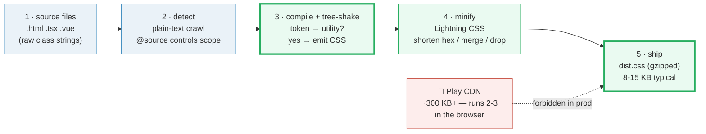
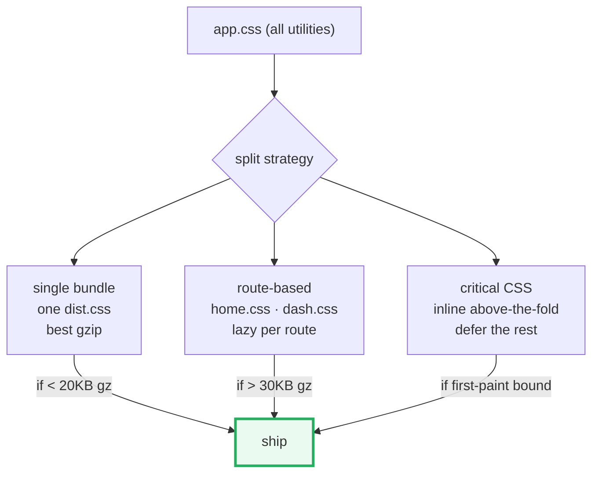

# Production Optimization

> **Companion demo:** [`production_optimization.html`](./production_optimization.html) — open in a browser.
> **Tailwind version:** v4.3.x. The build numbers in this guide reflect a typical
> marketing site (~350 unique utilities). Your mileage will vary — measure your
> own `dist.css` rather than trusting these as ceilings.
> The Play CDN does **not** minify or pin — it is the JIT engine itself and must
> never ship to users. This guide is about the build step that replaces it.

---

## 0. TL;DR — the one idea

> **The analogy:** shipping Tailwind to production is a **5-stage funnel** where
> every stage removes bytes. You start with the *entire* generatable framework
> (~10,000 utilities, ~2 MB minified) and end with *only the CSS your source
> actually references* (~350 utilities, ~8-15 KB gzipped). The build step
> (`@tailwindcss/cli`) is what runs that funnel ahead-of-time — the Play CDN
> runs stages 2-3 *in the user's browser at runtime*, which is why it is
> ~300 KB+ and is forbidden in production.



The CLI command that does it all:

```bash
# Pin the exact version for byte-reproducible builds (never @latest in CI)
npx @tailwindcss/cli@4.3.1 -i app.css -o dist.css --minify
```

---

## 1. Content detection (tree-shaking)

Tailwind only generates utilities it can **see** in your source files. This is
the single largest optimization in the pipeline — it is what separates a ~200 KB
"full framework" dump from a ~8 KB "what you actually use" build.

### How detection works

1. **Base path auto-detection.** v4 infers the root from where your CSS file
   lives and crawls every file beneath it as **plain text** (no AST — just
   class-like token extraction).
2. **Smart skipping.** `.gitignore`, `node_modules`, binaries, CSS files, and
   lockfiles are excluded automatically.
3. **One CSS-first knob:** the [`@source`](./source_detection.html) directive.
   Add paths, exclude them (`@source not`), force-generate classes that never
   literally appear in markup (`@source inline("...")` — the v4 safelist), or
   switch auto-detection off entirely.

```css
/* app.css */
@import "tailwindcss";                 /* auto-detect from this file's base path */

@source "../templates/**/*.html";      /* add a path outside the base */
@source not "./legacy/";               /* exclude a subtree */
@source inline("bg-pro-error");        /* safelist a runtime-constructed class */
@import "tailwindcss" source(none);    /* turn auto-detection OFF — only @source paths */
```

> The Play CDN does **not** read `@source` — it scans the live DOM via a
> `MutationObserver`, which is the runtime mirror of the same idea.

---

## 2. Minification — Lightning CSS

v4 replaced its PostCSS-based minifier with **Lightning CSS** (a Rust-native
CSS transformer). It does everything the old minifier did, plus structural
optimizations PostCSS couldn't safely attempt:

| optimization | example | savings |
|---|---|---|
| shorten hex colors | `#ffffff` → `#fff` | ~50% per value |
| merge duplicate rules | two `.a { color:red }` blocks → one | dedupe |
| drop duplicate selectors | `.x,.x { … }` → `.x { … }` | dedupe |
| shorter property equivalents | `margin: 0 0 0 0` → `margin: 0` | ~60% |
| remove trailing semicolons | `.a{color:red;}` → `.a{color:red}` | 1 byte ea |
| convert longhand → shorthand (safe cases) | `margin-top:0;margin-right:0;…` → `margin:0` | large |
| remove unused `@media` wrappers | empty `@media (min-width:…)` blocks dropped | cleanup |
| shorten `calc()` / nest math | `calc(100% - 0px)` → `100%` | variable |

The combined effect is typically **~10-15% smaller** than the equivalent v3
PostCSS minified output for the same utility set.

### When minify is NOT wanted

```bash
# Dev: keep the output readable (for source-map inspection)
npx @tailwindcss/cli@4.3.1 -i app.css -o dist.css
# (no --minify flag — output stays multi-line with comments stripped only)
```

---

## 3. Browser targeting — Browserslist + Lightning CSS

Lightning CSS reads the `browserslist` field in your `package.json` (or a
`.browserslistrc` file) and **down-levels** modern CSS only when a targeted
browser lacks native support. Target newer → smaller output.

```json
{
  "browserslist": [ "defaults", "fully supports es6-module" ]
}
```

### What gets polyfilled, by target

| modern CSS feature | Chrome 120+ | Safari 17+ | Safari 15.4 | Firefox 115 ESR |
|---|---|---|---|---|
| `oklch()` colors | native | native | → `rgb()` / `hsl()` | native |
| CSS nesting (`&`) | native | → expanded | → expanded | → expanded |
| `:has()` selector | native | native | native | **unsupported** (FF 121+) |
| `@layer` cascade | native | native | native | native |
| `color-mix()` | native | native | → flattened | native |
| relative color syntax | native | → flattened | → flattened | → flattened |

**Implication:** if your `browserslist` only targets evergreen browsers from the
last ~2 years, Lightning CSS emits almost no polyfills and your build is at its
smallest. Targeting Safari 15.4 re-expands nesting and `oklch()` across the whole
stylesheet — expect ~20-40% growth depending on how much modern CSS you use.

> v4 **dropped IE entirely**. Lightning CSS will not polyfill for it; including
> IE in `browserslist` produces a warning and the targets are skipped.

---

## 4. CSS splitting strategies

When your single bundle grows past ~30 KB gzipped, or when different routes use
very different utilities, consider splitting:



| strategy | how | when to use | tradeoff |
|---|---|---|---|
| **single bundle** (default) | one `dist.css` | total < 20 KB gzipped | simplest; best gzip; one request |
| **route-based splitting** | bundler splits via dynamic `import()` | > 30 KB gz; routes diverge | extra request on nav; shared utils dedupe |
| **critical CSS extraction** | inline above-the-fold in `<style>`, defer rest | first-paint is the metric | tooling complexity (critters, penthouse) |
| **lazy-load non-critical** | `<link rel="preload" as="style" onload>` | below-the-fold only | defers render-blocking; needs no-JS fallback |

**Rule of thumb:** don't split if your single gzipped bundle is under ~20 KB —
the HTTP request overhead outweighs the byte savings.

---

## 5. Bundle analysis — measure, don't estimate

The numbers in this guide are *typical*. Your app is not typical. Always measure
the real artifact:

```bash
# Build with minify
npx @tailwindcss/cli@4.3.1 -i app.css -o dist.css --minify

# Raw bytes
ls -l dist.css | awk '{print $5}'

# Gzipped bytes (the number that ships)
gzip -c dist.css | wc -c

# Brotli bytes (often 10-15% smaller than gzip)
brotli -c -Z dist.css | wc -c

# What's inside? (top utilities by byte size)
npx css-stats dist.css
# or: head -c 2000 dist.css   # eyeball the compressed output
```

### Expected ranges (marketing site, ~350 utilities)

| artifact | raw | minified | gzipped |
|---|---|---|---|
| Play CDN `<script>` (the engine) | ~1.2 MB | ~650 KB | **~300 KB+** |
| v4 CLI build `--minify` | ~30 KB | ~12 KB | **~4-8 KB** |
| v4 CLI build (no `--minify`) | ~30 KB | — | ~10 KB |
| full Tailwind (detection off) | ~2 MB | ~600 KB | ~200 KB |
| Preflight reset (floor) | ~8 KB | ~6 KB | ~3 KB |

The gzipped production build is **~40-75× smaller** than the Play CDN. That gap
is the entire reason a build step exists.

---

## 6. Killer Gotchas

| trap | symptom | fix |
|---|---|---|
| Shipping the Play CDN to production | ~300 KB download; flash of unstyled utilities; runtime CPU spike | Always run `@tailwindcss/cli` in CI; the CDN `<script>` is dev-only |
| `@source` path wrong → empty CSS | `dist.css` only contains preflight; site is unstyled | check the base path; `@source` is relative to the CSS file, not `cwd` |
| Dynamic classes not detected | `bg-${status}` classes missing from build | `@source inline("bg-pro-error bg-pro-ok")` — the v4 safelist |
| `@latest` in CI → flaky output | byte diffs between two runs of the same commit | pin `@tailwindcss/cli@4.3.1` exactly |
| `browserslist` too old → CSS bloat | nesting + `oklch()` re-expanded; build grew 30% | drop Safari 15.4 / FF ESR if you don't need them |
| `@layer` polyfilled away | cascade ordering differs between dev (native) and prod (polyfilled) | keep `browserslist` modern; `@layer` support is universal in evergreen |
| Splitting under 20 KB gz | more HTTP overhead than bytes saved | keep one bundle until you cross ~30 KB gzipped |
| Forgetting preflight | expected reset (margin:0 on body, etc.) missing | preflight is always included unless you `@import "tailwindcss/preflight" source(none)` |
| `source(none)` with no `@source` | nothing generates — output is empty | every path must be explicit when auto-detect is off |

---

### Cheat sheet

```bash
# Production build (the one you ship)
npx @tailwindcss/cli@4.3.1 -i app.css -o dist.css --minify

# Watch mode (dev)
npx @tailwindcss/cli@4.3.1 -i app.css -o dist.css --watch

# Measure the real shipped bytes
gzip -c dist.css | wc -c

# Pin in package.json (byte-reproducible CI)
"devDependencies": { "@tailwindcss/cli": "4.3.1" }
```

```css
/* app.css — content detection knobs */
@import "tailwindcss";                       /* auto-detect (default) */
@source "../templates/**/*.html";           /* add a path */
@source not "./legacy/";                    /* exclude a subtree */
@source inline("bg-pro-error");             /* safelist (runtime classes) */
@import "tailwindcss" source(none);         /* auto-detect OFF */
```

```json
/* package.json — browser targeting */
{
  "browserslist": [ "defaults", "fully supports es6-module" ]
}
```

```html
<!-- Critical CSS (inline above-the-fold; defer the rest) -->
<style>/* …critical bytes here… */</style>
<link rel="preload" href="/dist.css" as="style" onload="this.rel='stylesheet'">
<noscript><link rel="stylesheet" href="/dist.css"></noscript>
```

| intent | pattern |
|---|---|
| smallest CSS | `--minify` + modern `browserslist` + tree-shake (default) |
| reproducible CI | pin `@tailwindcss/cli@4.3.1` |
| runtime class survives detection | `@source inline("…")` |
| tighter scope | `@source "../path"` (see [`source_detection`](./source_detection.html)) |
| split > 30 KB gz | route-based `import()` or critical CSS extraction |

---

## 🔗 Cross-references

- **[`build_tooling.md`](./build_tooling.html)** — the CLI / Vite / PostCSS
  pipeline this page measures. Start there if you don't yet have a build step.
- **[`source_detection.md`](./SOURCE_DETECTION.md)** — the `@source` directive
  that decides what gets tree-shaken. Stage 2 of this pipeline, in depth.
- **[`v3_migration.md`](./v3_migration.html)** — v3 → v4 changes; the switch
  from `content: [...]` in `tailwind.config.js` to auto-detection + `@source`,
  and from PostCSS minify to Lightning CSS.
- **[`preflight_reset.md`](./preflight_reset.html)** — the ~3 KB gzipped floor
  you can never drop below (the CSS reset that is always included).
- **Companion demo:** [`production_optimization.html`](./production_optimization.html)
  — the interactive size estimator + gold-check.

---

## Sources

1. **Tailwind CSS v4 — Production builds.** `https://tailwindcss.com/docs/installation`
   (CLI usage, `--minify`, `--watch`; verified 2026-06). See also
   `https://tailwindcss.com/blog/tailwindcss-v4` (Lightning CSS engine, content
   detection redesign).
2. **Tailwind CSS v4 — Content detection & `@source`.**
   `https://tailwindcss.com/docs/detecting-classes-in-source-files`
   (auto-detection, `@source`, `source(none)`, `@source inline()`; verified 2026-06).
3. **Lightning CSS — minification & browser targets.**
   `https://lightningcss.dev/docs.html` (shorten hex, merge rules, Browserslist
   down-leveling; verified 2026-06).
4. **Browserslist — shared browser target config.**
   `https://browsersl.ist/` (query syntax, `defaults`, ESR; verified 2026-06).
