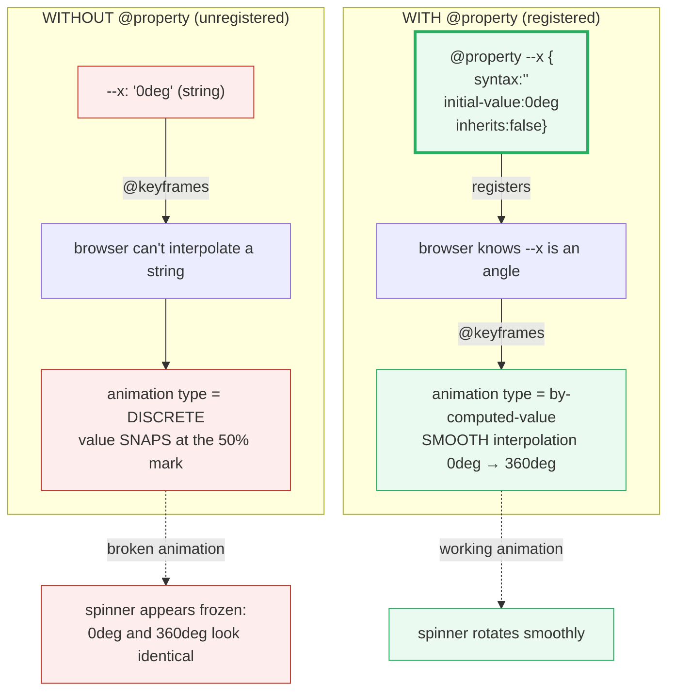
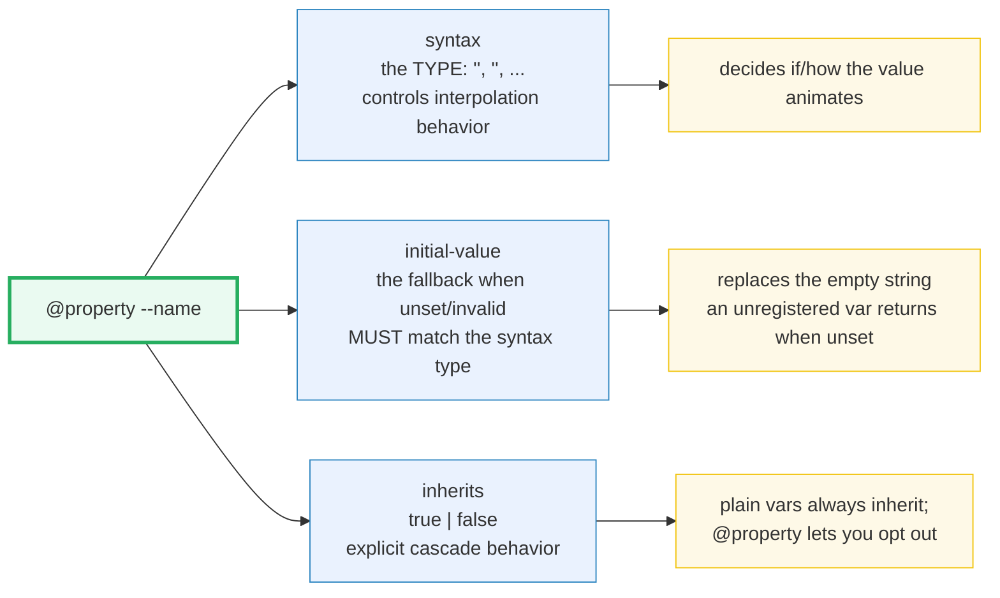

# @property Directive

> **Companion demo:** [`property_directive.html`](./property_directive.html) — open in a browser.
> **Tailwind version:** v4.3.x via `@tailwindcss/browser@4` Play CDN.
> **Spec status:** `@property` is **native CSS** (Houdini CSS Properties & Values
> API, Level 1). It is not a Tailwind feature — but Tailwind v4 leans on it
> heavily for its theme tokens.

---

## 0. TL;DR — the one idea

> **The analogy:** a plain CSS custom property (`--x: 200px`) is stored by the
> browser as an **opaque string**. The engine cannot tell `200px` from `banana`,
> so when you try to animate it the value just **snaps** between keyframes (the
> "discrete" animation type). **`@property`** registers the property with the
> engine — giving it a **type** (`<angle>`, `<color>`, `<length>`…), an
> **initial value**, and an explicit **inherits** flag. Once registered, the
> browser knows *how* to interpolate the value, so animations and transitions
> glide smoothly. Tailwind v4 emits `@property` for its theme tokens for exactly
> this reason.



```
@property --angle {
  syntax:        '<angle>';   /* the TYPE — tells the browser how to interpolate */
  initial-value: 0deg;        /* fallback when unset or invalid */
  inherits:      false;       /* explicit (plain vars always inherit) */
}
```

---

## 1. The registration flow

`@property` is a top-level **at-rule** that registers one custom property with
the browser. It must live at the top level of a stylesheet (not nested inside a
selector). Each registration has three descriptors:



| Descriptor | Required? | What it does |
|------------|-----------|--------------|
| `syntax` | **yes** | The value type — `'<angle>'`, `'<color>'`, `'<length>+'`, `'*`, etc. Decides the animation type (smooth vs discrete). |
| `initial-value` | **yes** (unless syntax is `*`) | The fallback used when the property is unset, invalid, or being registered mid-transition. Must match `syntax`. |
| `inherits` | **yes** | `true` or `false`. Plain vars always inherit; `@property` makes this explicit so a per-element var doesn't leak to children. |

### Two ways to register

```css
/* 1. Declarative — in CSS (design-time tokens) */
@property --angle {
  syntax: '<angle>';
  initial-value: 0deg;
  inherits: false;
}
```

```js
// 2. Imperative — in JS (runtime-defined properties)
CSS.registerProperty({
  name: '--angle',
  syntax: '<angle>',
  initialValue: '0deg',
  inherits: false
});
// Throws InvalidModificationError if '--angle' is already registered.
```

Both forms are equivalent. The CSS form is preferred for static tokens (it ships
with the stylesheet, no JS needed); the JS form is for genuinely dynamic cases
(rare).

---

## 2. Syntax types — the heart of @property

The `syntax` descriptor accepts a single type, a list (`+` or `#`), a union
(`|`), or the universal `*`.

| `syntax` | Example values | Animates as | Notes |
|----------|----------------|-------------|-------|
| `<length>` | `200px`, `1.5rem`, `0` | smooth (real-number distance) | the most common type for layout tokens |
| `<percentage>` | `50%`, `0%` | smooth (0–1 ratio) | used in the demo's gradient `--grad-pos` |
| `<angle>` | `0deg`, `1.5turn`, `200grad` | smooth (degree value) | the demo's `--angle` |
| `<time>` | `0.3s`, `250ms` | smooth (seconds) | animate durations |
| `<number>` | `0`, `1.5`, `42` | smooth (plain number) | weights, multipliers, opacity-as-number |
| `<integer>` | `0`, `7`, `-3` | **discrete** (whole steps) | can't blend 3 → 7 smoothly |
| `<color>` | `#06b6d4`, `oklch(0.7 0.15 250)` | smooth (color-space blend) | Tailwind's `--color-*` tokens |
| `<image>` | `url(a.png)`, `linear-gradient(...)` | smooth (cross-fade) | rare but powerful |
| `<url>` | `url(icon.svg)` | **discrete** | can't blend two URLs |
| `<resolution>` | `2dppx`, `96dpi` | smooth | device-pixel-ratio tokens |
| `<length> \| <percentage>` | `200px` or `50%` | smooth (union of two types) | "either-or" typing |
| `<length>+` | `10px 20px 30px` | smooth (each term interpolates) | `+` = space-separated list; `#` = comma-separated |
| `*` | *anything* | **discrete** | the universal type — browser can't assume anything |

### Why some registered types still "snap"

Even with `@property`, `<integer>`, `<url>`, and `*` animate **discretely** —
there is no smooth path between two URLs or two integers. If you want smooth
numeric steps, register as `<number>` instead and convert where you consume it.

---

## 3. Animatable custom properties — the killer feature

This is the entire reason `@property` exists. Without it, animating a custom
property is impossible — the value jumps. With it, you can:

1. **Animate the value itself** (`@keyframes { to { --angle: 360deg; } }`)
2. **Transition on state change** (`transition: --grad-pos .6s ease; ...:hover { --grad-pos: 60%; }`)
3. **Drive multiple consumers from one value** (one `--angle` can feed a
   `transform: rotate()`, a `clip-path`, and a `mask-position` simultaneously)

### The demo's two spinners

```css
/* LEFT — registered: smooth rotation */
@property --angle {
  syntax: '<angle>'; initial-value: 0deg; inherits: false;   /* THE ONLY DIFFERENCE */
}
@keyframes spin-typed { to { --angle: 360deg; } }
.spinner-typed {
  --angle: 0deg;
  animation: spin-typed 1.4s linear infinite;
  transform: rotate(var(--angle));   /* glides through ~84 distinct values */
}

/* RIGHT — unregistered: --raw-angle is a string, animates DISCRETELY */
@keyframes spin-raw { to { --raw-angle: 360deg; } }   /* no @property! */
.spinner-raw {
  --raw-angle: 0deg;
  animation: spin-raw 1.4s linear infinite;
  transform: rotate(var(--raw-angle, 0deg));   /* snaps: 0deg → 360deg (looks frozen) */
}
```

The registered spinner samples ~80+ distinct angle values over its 1.4s cycle;
the unregistered one yields exactly **2** (`0deg` then `360deg`). Because those
two are visually identical rotations, the unregistered spinner appears
**completely frozen** — the most dramatic possible demonstration of why
registration matters.

### Animating inside `linear-gradient()`

You cannot directly animate `linear-gradient(...)` — the browser has no
interpolation path between two gradient definitions. But you CAN animate a
**registered variable that lives inside the gradient**:

```css
@property --grad-pos {
  syntax: '<percentage>'; initial-value: 0%; inherits: false;
}
.grad-card {
  --grad-pos: 0%;
  background: linear-gradient(90deg,
    oklch(0.72 0.18 215) 0%,
    oklch(0.65 0.22 250) var(--grad-pos),    /* ← this stop glides */
    oklch(0.55 0.25 290) 100%);
  transition: --grad-pos 0.6s ease;          /* ← animates the variable, not the gradient */
}
.grad-card:hover { --grad-pos: 60%; }
```

The unregistered twin (`.grad-card-raw`) has the same `transition` rule but it
is silently ignored — the stop snaps instantly on hover.

---

## 4. How Tailwind v4 uses @property

`@property` is native CSS, but Tailwind v4's generated output emits it for
every theme token. Approximation of what the v4 build produces:

```css
@property --color-blue-500 {
  syntax: '<color>';
  inherits: false;
  initial-value: oklch(0.623 0.214 259.815);   /* the OKLCH palette value */
}
@property --spacing {
  syntax: '<length>';
  inherits: false;
  initial-value: 0.25rem;                       /* the base spacing multiplier */
}
```

Practical consequences:

- `bg-blue-500` resolves to a **typed color** — safe to interpolate (gradients,
  transitions).
- `var(--color-blue-500)` has a **guaranteed fallback** (`initial-value`) when
  unset — no empty-string surprises.
- `--spacing` is scoped with `inherits: false`, so a local override on one
  element doesn't leak to its descendants.
- Utilities like `p-4` (= `calc(var(--spacing) * 4)`) rest on a typed base.

You usually don't write `@property` yourself in a Tailwind project — `@theme`
does it for you:

```css
@theme {
  --color-brand: oklch(0.7 0.15 250);   /* Tailwind wraps this in @property */
}
```

But when you write **custom animations on your own vars** (a rotating loader, a
gradient shift, a clip-path reveal), you need `@property` directly — that is
where this demo lives.

---

## 5. Browser support

`@property` (and `CSS.registerProperty`) shipped in:

| Browser | Version | Date |
|---------|---------|------|
| Chrome / Edge | 85+ | Aug 2020 |
| Safari | 16.4+ | Mar 2023 |
| Firefox | 128+ | Jul 2024 |
| Safari iOS | 16.4+ | Mar 2023 |

As of 2026 this is **universal modern-browser support** — safe to use without a
fallback in any current project. For legacy browsers, the worst case is graceful
degradation: unregistered vars still *work*, they just don't animate (they snap
to the discrete value). No crash, no broken layout — only lost smoothness.

### Feature detection

```css
@supports (background: paint(houdini)) {
  /* @property is supported (Houdini Paint API is a good proxy) */
}
@supports (--a: 0) {
  /* custom properties work — but @property might not (very old browsers) */
}
```

```js
if (window.CSS && CSS.registerProperty) {
  CSS.registerProperty({ name: '--x', syntax: '<angle>', initialValue: '0deg', inherits: false });
}
```

---

## Killer Gotchas

| Trap | Symptom | Fix |
|------|---------|-----|
| **Forgot to register before animating** | `@keyframes { to { --x: 360deg; } }` snaps instead of gliding | Add the `@property --x { syntax: '<angle>'; … }` block. Registration must happen before the animation starts. |
| **`@property` nested inside a selector** | The rule is ignored; property stays unregistered | `@property` is a **top-level at-rule**. Put it at the stylesheet root, not inside `.foo { … }`. |
| **`initial-value` doesn't match `syntax`** | Registration fails silently (or throws in the JS form) | `syntax: '<angle>'` ⟹ `initial-value: 0deg`. A mismatch like `syntax: '<angle>'` + `initial-value: 200px` is invalid. |
| **Plain `<style>` vs `<style type="text/tailwindcss">`** | Confused about where `@property` goes | `@property` is **native CSS** — put it in a plain `<style>` block. Tailwind's JIT block is for `@theme`/`@utility`. (In a real v4 build, `@property` works in your main CSS file alongside `@import "tailwindcss"`.) |
| **Re-registering an already-registered property** | `CSS.registerProperty()` throws `InvalidModificationError` | Registration is one-time and permanent for the page lifetime. The CSS `@property` form is idempotent (re-declaring is fine); the JS form is not. |
| **`inherits: false` surprises you** | A child element doesn't see the parent's `--x` value | Plain vars always inherit. `@property` defaults to your stated `inherits`. Use `inherits: true` for theme-level vars (like Tailwind's `--color-*`), `false` for per-element vars (like a spinner's `--angle`). |
| **`<integer>` / `<url>` / `*` still snap** | Registered but animation is still discrete | These types have no smooth interpolation path. Use `<number>` (and round where you consume) for smooth numeric steps. |
| **Tailwind `<style type="text/tailwindcss">` strips `@property`?** | Custom `@property` inside the JIT block behaves oddly | Keep `@property` in a plain `<style>` (Play CDN) or your main CSS (build). The JIT block is for Tailwind directives only. |
| **Animation pauses when tab is hidden** | The spinner freezes when you switch tabs | Browsers throttle `requestAnimationFrame` and CSS animations in background tabs. This is expected — the demo resumes on focus. |
| **`getComputedStyle().getPropertyValue('--angle')` returns empty** | Your gold-check reads `""` | Either the property isn't set on that element, or you're reading before the first animation frame. Poll via `requestAnimationFrame`. |

### Cheat sheet

```css
/* 1. Register an animatable angle (the demo's --angle) */
@property --angle {
  syntax: '<angle>';
  initial-value: 0deg;
  inherits: false;
}
@keyframes spin { to { --angle: 360deg; } }
.spinner { --angle: 0deg; animation: spin 1.4s linear infinite;
           transform: rotate(var(--angle)); }

/* 2. Transition on hover (the demo's --grad-pos) */
@property --grad-pos {
  syntax: '<percentage>'; initial-value: 0%; inherits: false;
}
.card { --grad-pos: 0%;
        background: linear-gradient(90deg, blue 0%, cyan var(--grad-pos), white 100%);
        transition: --grad-pos .6s ease; }
.card:hover { --grad-pos: 60%; }

/* 3. Opt out of inheritance (scope a var to one element) */
@property --local-x { syntax: '<length>'; initial-value: 0px; inherits: false; }

/* 4. A typed color token with a safe fallback (what Tailwind v4 emits) */
@property --color-brand {
  syntax: '<color>'; inherits: false;
  initial-value: oklch(0.7 0.15 250);
}

/* 5. List type — each term interpolates independently */
@property --steps { syntax: '<length>+'; initial-value: 10px 20px; inherits: false; }
```

```js
// JS twin of the @ declarative form (one-time, throws on duplicate)
CSS.registerProperty({
  name: '--js-angle',
  syntax: '<angle>',
  initialValue: '0deg',
  inherits: false
});

// Feature-detect before using the JS form
if (window.CSS && CSS.registerProperty) { /* safe to register */ }
```

```html
<!-- In a Tailwind v4 build, @theme tokens are auto-wrapped in @property -->
<style type="text/tailwindcss">
  @theme { --color-brand: oklch(0.7 0.15 250); }
</style>
<!-- → bg-brand, text-brand, border-brand all resolve to a typed color -->
```

---

## 🔗 Cross-references

- [arbitrary_properties](/tailwind/arbitrary_properties.html) — inline `[--x:200px]` sets a custom property on an element, but does NOT type it. Combine with `@property` when you want that inline var to animate.
- [keyframes_animate](/tailwind/keyframes_animate.html) — the `--animate-*` namespace and `@keyframes` in v4. Animations on custom properties only work when those vars are registered via `@property` (this bundle).
- [oklch_colors](/tailwind/oklch_colors.html) — the OKLCH color values Tailwind's `--color-*` tokens carry; `@property` wraps them so they have a type (`<color>`) and a safe fallback.
- [theme_inline](/tailwind/theme_inline.html) — `@theme inline` and cross-variable references; interacts with `@property` registration of theme tokens.
- [frontend/tailwind: design tokens](/frontend/tailwind/tailwind_design_tokens.html) — the `@theme` namespace that v4 wraps in `@property` under the hood.

---

## Sources

1. **MDN — `@property`**: https://developer.mozilla.org/en-US/docs/Web/CSS/@property — at-rule reference, descriptors (`syntax`, `initial-value`, `inherits`), and the CSSPropertyRule interface.
2. **web.dev — Interoperable custom properties with `@property`**: https://web.dev/articles/at-property — the canonical explainer on why typed custom properties enable smooth animation and predictable theming.
3. **MDN — CSS Properties and Values API (Houdini)**: https://developer.mozilla.org/en-US/docs/Web/API/CSS_Properties_and_Values_API — the `CSS.registerProperty()` JS twin and the underlying API.
4. **Chrome for Developers — CSS `@property`**: https://developer.chrome.com/docs/css-ui/at-property — Chromium implementation notes, animation-type behavior, and gotchas.
5. **W3C — CSS Properties and Values API Level 1 (Editor's Draft)**: https://drafts.css-houdini.org/css-properties-values-api/ — the normative spec for `syntax` strings, the `+`/`#`/`|`/`*` forms, and registration semantics.
