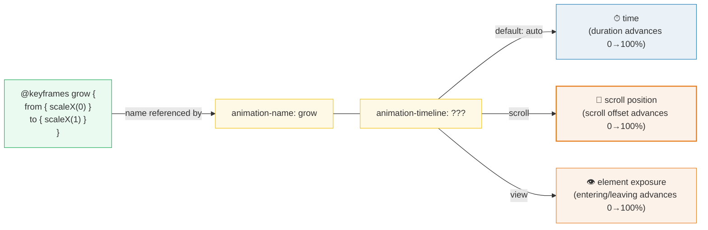
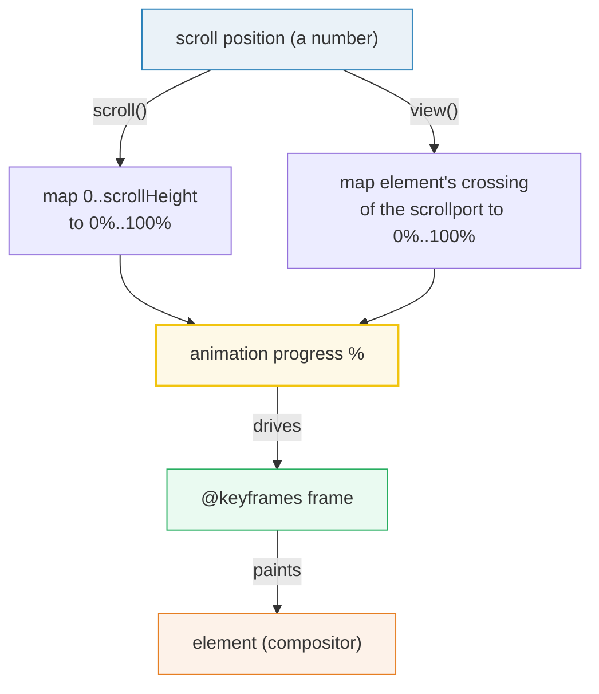

# Scroll-Driven Animations (`animation-timeline`)

> **Companion demo:** [`scroll_driven.html`](./scroll_driven.html) — open in a browser.
> Renders a page scroll-progress bar, `view()` reveal cards, and a parallax layer —
> all driven by `animation-timeline` with zero JavaScript. A `getComputedStyle().animationTimeline`
> gold-check confirms the binding is live (and reports N/A on unsupported browsers).

---

## 0. TL;DR — the one idea

`animation-timeline` **retargets an ordinary `@keyframes` animation from a clock to the
scroll position**. The keyframes are unchanged — you already know how to write them. The
timeline just swaps the *thing that advances 0%→100%* from "elapsed milliseconds" to "how
far you've scrolled". Result: buttery, JS-free scroll progress bars, reveal-on-scroll, and
parallax — all on the compositor, so they stay smooth even when the main thread is busy.



The contract is **"same keyframes, different clock"**. That's why this bundle is a direct
sibling of [`keyframes_animate`](./keyframes_animate.html) — once you've registered
`@keyframes`, you can play them over *time* (`animate-[wiggle_1s]`) **or** over *scroll*
(`[animation-timeline:scroll()]`). The two halves (what to draw vs when to draw it) are
independent.

---

## 1. How it works — three timeline sources



| timeline | what it tracks | syntax | canonical use |
|---|---|---|---|
| **`scroll()`** | the nearest scrollable ancestor's offset | `animation-timeline: scroll()` | progress bars, parallax, scroll-spy underlines |
| **`view()`** | the element's own position crossing the scrollport | `animation-timeline: view()` | reveal/fade-in on enter, exit animations |
| **named** | a timeline declared elsewhere, hoisted via `timeline-scope` | `view-timeline-name: --x; timeline-scope: --x;` | element A's scroll drives element B |

### The `scroll()` timeline

Maps the scroll container's offset, top→bottom, onto 0%→100%. Two optional args:

```css
animation-timeline: scroll(<scroller> <axis>);
/* scroller: nearest (default) | root          axis: block (default) | inline | x | y */
```

For a `position: fixed` progress bar, the nearest scrollable ancestor is the **root
scroller**, so `scroll()` with no arguments tracks the whole page. For an element inside an
`overflow: auto` box, `scroll()` tracks *that box*. Pick the axis for horizontal scrollers.

```css
@keyframes grow-progress { from { transform: scaleX(0); } to { transform: scaleX(1); } }

.progress-bar {
  animation-name: grow-progress;
  animation-timing-function: linear;
  animation-timeline: scroll();     /* ← the only new line vs a time animation */
  transform-origin: left center;
  /* duration is IGNORED — the timeline paces everything. Use linear. */
}
```

> ⚠️ **Duration is ignored.** Because the timeline controls pacing, `animation-duration` has
> no effect. Always use `animation-timing-function: linear` (non-linear easings distort the
> scroll mapping and feel laggy).

### The `view()` timeline

Binds progress to **this element's** journey through the scrollport — 0% as it enters, 100%
as it leaves (the default `cover` range). Each element gets its own timeline, so a list of
reveal cards stagger *naturally* by their scroll position with a single shared `@keyframes`.

```css
@keyframes reveal-up {
  from { opacity: 0; transform: translateY(52px) scale(.92); }
  to   { opacity: 1; transform: translateY(0)    scale(1); }
}

.card {
  animation-name: reveal-up;
  animation-timing-function: linear;
  animation-fill-mode: both;        /* hold `from` state before the card enters */
  animation-range: entry;           /* finish revealing during the ENTER leg only */
  animation-timeline: view();
}
```

`animation-range` picks **which leg** animates — this is the `view()` superpower that `scroll()`
lacks:

| range keyword | 0% → 100% spans… | use when |
|---|---|---|
| `cover` (default) | the entire crossing (enter + leave) | continuous effects tied to position |
| `entry` | entering the scrollport only | reveal/fade-in — done as soon as it's on screen |
| `exit` | leaving the scrollport only | fade-out / shrink as it scrolls away |
| `contain` | while fully contained | highlight only while fully visible |

### Named timelines (`timeline-scope`)

`scroll()` and `view()` only reach the nearest scroller / the element itself. To let an
element's scroll drive a **sibling elsewhere** in the tree, name the timeline and hoist its
scope to a common ancestor:

```css
/* the source element names a view timeline */
.hero   { view-timeline-name: --hero; }

/* a common ancestor declares it can see that name */
.layout { timeline-scope: --hero; }

/* any descendant of .layout can now animate on the hero's exposure */
.badge  { animation-timeline: --hero; animation-name: fade; }
```

This is how a sticky header shrinks based on a hero section's scroll, or a reading-progress
ring fills from an unrelated article element — no shared parent scroller required.

---

## 2. Mechanism / internals — why it's jank-free

A time-driven animation runs on the **main thread** unless it only animates
compositor-friendly properties (`transform`, `opacity`). A scroll listener that sets
`element.style.transform = 'scaleX(' + pct + ')'` on every `scroll` event forces layout and
chokes under JS load.

`animation-timeline` is different: the browser binds the `@keyframes` to scroll progress
**inside the compositor**. Scrolling doesn't fire main-thread work; the compositor samples
the timeline and paints the frame directly. Two practical consequences:

1. **Smooth under load** — even a busy main thread can't make the progress bar stutter.
2. **Naturally reversible** — scroll up and the animation scrubs backwards. No state machine,
   no `IntersectionObserver` bookkeeping.

The `@keyframes` are identical to a time animation. The only new property is
`animation-timeline` (plus optionally `animation-range` for `view()`). Tailwind v4 ships no
dedicated utility for it yet, so you bind it via **arbitrary properties**:

```html
<!-- Longhands only. Do NOT use animate-[grow_linear] here — see Gotcha #1. -->
<div class="fixed top-0 left-0 right-0 h-1.5 bg-cyan-400
            [transform-origin:left_center]
            [animation-name:grow-progress]
            [animation-timing-function:linear]
            [animation-timeline:scroll()]"></div>
```

---

## 3. Killer Gotchas

| # | trap | symptom | fix |
|---|---|---|---|
| 1 | **The `animation` shorthand resets `animation-timeline`.** Writing `animation: grow 1s linear; animation-timeline: scroll();` works *only* in the right source order; the shorthand expands to and clobbers `animation-timeline: auto`. | progress bar sits at the end state, gold-check sees `auto` not `scroll` | set **longhands** (`[animation-name:…] [animation-timing-function:…] [animation-timeline:…]`), or declare `animation-timeline` *after* the shorthand in the same rule. Never trust Tailwind class order to save you. |
| 2 | **`animation-duration` is ignored** but people keep setting it expecting it to matter. | confusion / "why isn't my 2s duration respected?" | the timeline paces everything; use `linear` timing and drop `duration`. |
| 3 | **Non-`linear` easings feel broken.** `ease-in-out` distorts the scroll→progress map so the bar lags then snaps. | bar looks disconnected from scroll | always use `animation-timing-function: linear` for scroll-bound animations. |
| 4 | **`scroll()` picks the *nearest* scroller**, which may be a nested `overflow:auto` box, not the page. | bar tracks the wrong container | use `scroll(root)` to force the page, or confirm the ancestor chain. |
| 5 | **Reveal cards flash at full opacity before entering.** Without `fill-mode`, the element shows its natural state until the range begins. | cards visible then "jump" to hidden as they animate | add `animation-fill-mode: both` (or `backwards`) so the `from` state applies pre-entry. |
| 6 | **Safari pre-26 / Firefox (off-flag) silently no-op.** The keyframes never bind. | nothing animates, no error | progressive-enhance: make the element's resting CSS the "finished" look so unsupported browsers degrade gracefully; gate with `@supports (animation-timeline: scroll())`. |
| 7 | **Animating non-compositor properties** (`width`, `top`, `margin`) on a scroll timeline runs on the main thread and re-lays-out every frame. | jank precisely where you wanted smoothness | stick to `transform` / `opacity` / `clip-path`; they composite. |
| 8 | **Mixing with `prefers-reduced-motion`.** Scroll-bound motion can still be vestibular-triggering. | accessibility regression | wrap in `@media (prefers-reduced-motion: no-preference)` and provide a static fallback. |

---

## Cheat sheet

```css
/* Reusable keyframes — shared by time-driven AND scroll-driven animations. */
@keyframes grow   { from { transform: scaleX(0); }     to { transform: scaleX(1); } }
@keyframes reveal { from { opacity: 0; transform: translateY(52px) scale(.92); }
                    to   { opacity: 1; transform: translateY(0)    scale(1);  } }
@keyframes drift  { from { transform: translateY(0); } to { transform: translateY(-200px); } }
```

```html
<!-- 1. page scroll progress bar (fixed → nearest scroller is the root) -->
<div class="fixed top-0 left-0 right-0 h-1.5 bg-cyan-400
            [transform-origin:left_center]
            [animation-name:grow] [animation-timing-function:linear]
            [animation-timeline:scroll()]"></div>

<!-- 2. reveal on enter (view timeline, entry range only) -->
<div class="[animation-name:reveal] [animation-timing-function:linear]
            [animation-fill-mode:both] [animation-range:entry]
            [animation-timeline:view()]">…</div>

<!-- 3. parallax (sticky bg drifts slower than 1:1 foreground) -->
<div class="sticky top-0 [animation-name:drift] [animation-timing-function:linear]
            [animation-timeline:scroll()]">…</div>

<!-- 4. horizontal-scroller progress -->
<div class="[animation-name:grow] [animation-timeline:scroll(inline)]">…</div>

<!-- 5. named timeline for cross-element binding -->
<section class="[timeline-scope:--hero]">
  <div class="[view-timeline-name:--hero]">hero</div>
  <div class="[animation-timeline:--hero] [animation-name:fade]">badge elsewhere</div>
</section>
```

| intent | pattern |
|---|---|
| page progress bar | `fixed … [animation-timeline:scroll()]` + longhands |
| reveal on scroll-in | `[animation-range:entry] [animation-fill-mode:both] [animation-timeline:view()]` |
| parallax | `sticky … [animation-timeline:scroll()]` on a bg layer |
| horizontal scroll | `[animation-timeline:scroll(inline)]` |
| exit-only animation | `[animation-range:exit]` |
| cross-element binding | parent `[timeline-scope:--x]`, source `[view-timeline-name:--x]`, driver `[animation-timeline:--x]` |
| reduced-motion safe | wrap in `@media (prefers-reduced-motion: no-preference)` |

---

## 🔗 Cross-references

- **[`keyframes_animate`](./keyframes_animate.html)** — scroll-driven animations reuse the
  *exact same* `@keyframes` as time-driven ones; `animation-timeline` only swaps the clock.
  Read this first if the keyframes half is unfamiliar.
- **[`transitions_timing`](./transitions_timing.html)** — transitions are the *state-change*
  half of motion (hover/focus), `--animate-*` is the *time* half, and scroll-driven is the
  *scroll* half. Three independent triggers, one mental model.
- **[`starting_style`](./starting_style.html)** — `@starting-style` solves the *enter-DOM*
  transition (the first paint). `view()` solves the *enter-scrollport* animation. They're the
  dual entry problems: one for elements appearing in the tree, one for elements scrolling into view.
- **[`view_transitions_tw`](./view_transitions_tw.html)** — View Transitions animate
  *discrete* state swaps (route changes, list reorders) via snapshot crossfades; scroll-driven
  animations animate *continuous* scroll progress. Combine them: a view transition can fire
  when a `view()`-bound element reaches a threshold.
- **[`property_directive`](./property_directive.html)** — to animate a *custom property*
  inside a scroll-bound `@keyframes` (e.g. a gradient position), `@property` must declare its
  type, or the value snaps instead of interpolating.

---

## Sources

1. **Chrome Developers — Scroll-driven animations (Bramus Vanhoutte)**:
   https://developer.chrome.com/docs/css-ui/scroll-driven-animations — the canonical
   walkthrough of `animation-timeline: scroll()` / `view()`, `animation-range` keywords
   (`entry`/`exit`/`cover`/`contain`), `timeline-scope`, the compositor-performance rationale,
   and progressive-enhancement with `@supports (animation-timeline: scroll())`.
2. **MDN — CSS scroll-driven animations**:
   https://developer.mozilla.org/en-US/docs/Web/CSS/CSS_scroll-driven_animations — the spec
   overview covering `scroll()` / `view()` functional notations, `animation-range`, named
   view timelines, and per-browser support (Chrome 115, Edge 115, Safari in development,
   Firefox behind `layout.css.scroll-driven-animations.enabled`).
3. **MDN — `animation-timeline`**:
   https://developer.mozilla.org/en-US/docs/Web/CSS/animation-timeline — the property
   reference: accepted values (`auto`, `scroll()`, `view()`, `<timeline-name>`), the rule that
   `animation-duration` is ignored, and that the `animation` shorthand resets the longhand.
4. **web.dev — Scroll-driven animations retrospective (Bramus, 2023)**:
   https://web.dev/articles/scroll-driven-animations — origin and shipping story (Chrome 115,
   Aug 2023), why these run off the compositor, and the performance comparison vs
   `scroll`-event + `requestAnimationFrame` listeners.
