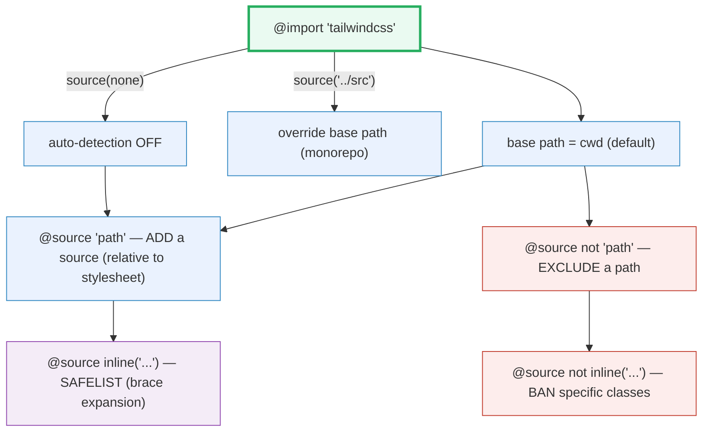
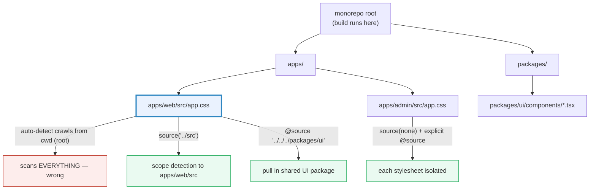

# @source Directive & Content Detection

> **Companion demo:** [`source_detection.html`](./source_detection.html) — open in a browser.
> **Tailwind version:** v4.3.x. At build time this is governed by `@source` in your CSS.
> The Play CDN does **not** read `@source` — it scans the live DOM via a
> `MutationObserver`, which is the runtime mirror of the same idea.

---

## 0. TL;DR — the one idea

> **The analogy:** Tailwind only ships CSS for classes it can **see**. v3 made
> you enumerate every file in `tailwind.config.js` → `content: [...]`. v4
> **auto-detects** your source files (a plain-text crawl from the stylesheet's
> base path, skipping `.gitignore`, `node_modules`, binaries, CSS, and lockfiles)
> and gives you one CSS-first knob to override it: the **`@source`** directive.
> Add paths, exclude paths (`@source not`), force-generate classes that never
> literally appear (`@source inline(...)` — the v4 **safelist**), or switch
> auto-detection off entirely (`source(none)`). No more config file for this.

```mermaid
graph LR
    BASE["@import tailwindcss<br/>(base path = cwd)"] --> AUTO{"auto-detect?<br/>default: yes"}
    AUTO -->|yes| CRAWL["crawl every file as PLAIN TEXT<br/>skip .gitignore / node_modules / binaries / CSS / lockfiles"]
    AUTO -->|source(none)| ONLY["@source paths only<br/>(explicitly registered)"]
    CRAWL --> SRC["@source add<br/>@source not exclude"]
    ONLY --> SRC
    SRC --> TOK["extract candidate tokens<br/>(no AST — just class-like strings)"]
    TOK --> MAP{"token maps<br/>to a utility?"}
    MAP -->|yes| CSS["emit the CSS rule"]
    MAP -->|no| DROP["throw it away"]
    INLINE["@source inline('...')<br/>brace expansion"] -.safelist.-> CSS
    style BASE fill:#eafaf1,stroke:#27ae60,stroke-width:3px
    style CRAWL fill:#eaf2fe,stroke:#2e86c1
    style SRC fill:#eaf2fe,stroke:#2e86c1
    style TOK fill:#fef9e7,stroke:#f1c40f
    style CSS fill:#eafaf1,stroke:#27ae60
    style DROP fill:#fdedec,stroke:#c0392b
    style INLINE fill:#f4ecf7,stroke:#8e44ad
```

```
@import "tailwindcss";
@source "../node_modules/@acme/ui";              /* add a gitignored dep            */
@source "../../packages/shared";                 /* monorepo sibling                */
@source not "../legacy";                         /* exclude a dir                   */
@import "tailwindcss" source(none);              /* (alt) disable auto-detection    */
@source inline("{hover:,}bg-red-{100,500,900}"); /* safelist via brace expansion    */
```

---

## 1. How detection works

Tailwind treats every source file as **plain text**. It does **not** parse your
JSX/HTML/Vue/Svelte as code — it just hunts for tokens that *could* be class
names based on the characters Tailwind allows. Each candidate is then checked
against the utility registry: if it maps, the CSS is emitted; if not, it's
discarded. This is why arbitrary values like `bg-[url(/x.png)]` "just work" —
the literal string is sitting in your source.

### Which files are scanned (auto-detection)

By default Tailwind scans **every file** from the base path (the current working
directory, or the `source(...)` you pass to `@import`), **except**:

| Excluded automatically | Why |
|---|---|
| anything matched by your `.gitignore` | build artifacts, env files, deps |
| `node_modules/` | third-party code — opt in per-package with `@source` |
| binary files (images, video, zips) | not text — no classes to find |
| `.css` files | avoid scanning generated output recursively |
| package-manager lockfiles | huge, no classes, slow |

If you need to scan something Tailwind skips (a Tailwind-built library that
lives in `node_modules`, or a generated directory outside your repo), that is
exactly what explicit `@source` is for.

---

## 2. The `@source` directive — every form



| Form | Purpose | Example |
|---|---|---|
| `@source "..."` | add a source path (relative to the **stylesheet**) | `@source "../src/components";` |
| `@source not "..."` | exclude a path | `@source not "../legacy";` |
| `@import "tailwindcss" source("...")` | set the **base path** for auto-detection | `source("../src")` |
| `@import "tailwindcss" source(none)` | **disable** auto-detection entirely | then only explicit `@source`s count |
| `@source inline("...")` | **safelist** — force-generate classes | `@source inline("underline");` |
| `@source not inline("...")` | ban specific classes from ever being emitted | `@source not inline("container");` |

> **Paths are relative to the stylesheet**, not the project root. The
> `source(...)` argument on `@import "tailwindcss"` sets the **base path** that
> auto-detection crawls from — useful in monorepos where the build runs from the
> repo root.

---

## 3. `@source inline()` — the v4 safelist

When classes are assembled dynamically (a CMS color picker, a server-rendered
theme, a props-to-class map that lives outside your scanned files), the literal
strings may never appear in source. `@source inline()` forces them to be
generated. The argument is **brace-expanded** (Bash-style):

| Pattern | Expands to |
|---|---|
| `@source inline("underline")` | `underline` |
| `@source inline("{hover:,focus:,}underline")` | `underline`, `hover:underline`, `focus:underline` |
| `@source inline("{hover:,}bg-red-{50,{100..900..100},950}")` | `bg-red-50`…`bg-red-950` (step 100), each also with `hover:` |

- **Comma set** `{a,b,c}` → each option.
- **Range** `{100..900..100}` → `100 200 300 … 900` (start..end..step).
- Combine them nested, as above.

### The live demo (why a browser demo for a build feature?)

The Play CDN cannot read `@source` (it has no filesystem). Instead it watches
the DOM with a **`MutationObserver`** — when a new class token appears, it
re-scans and compiles it. That is the *runtime twin* of the build-time
safelist. The demo proves both halves:

1. **Auto-detection analog** — `bg-cyan-500` is present at load → the CDN's
   initial scan compiles it (gold-check reads the computed cyan background).
2. **Safelist analog** — click *inject* and `bg-fuchsia-500` is added to the
   DOM *after* load → the `MutationObserver` detects the new token and compiles
   it (gold-check reads the computed fuchsia background).

This is exactly the promise of `@source inline("bg-fuchsia-500")`: a class that
was never statically present still gets emitted.

---

## 4. Monorepo patterns



| Situation | Pattern |
|---|---|
| Build runs from repo root, but this app lives in `apps/web` | `@import "tailwindcss" source("../src");` — scope auto-detection to the app |
| A shared Tailwind UI package in `packages/ui` | `@source "../../packages/ui";` — relative to the stylesheet |
| Two apps, each with its own CSS, must not bleed classes | `@import "tailwindcss" source(none);` + explicit `@source` per stylesheet |
| A published component lib in `node_modules` | `@source "../node_modules/@acme/ui";` (deps are skipped by default) |

---

## Killer Gotchas

| Trap | Symptom | Fix |
|------|---------|-----|
| **Constructing class names with interpolation** | `class="text-{{ err ? 'red' : 'green' }}-600"` → `text-red-600` never exists literally → not emitted → unstyled | Keep class names **complete & literal** in source. Map props to full strings: `{ red: "text-red-600", green: "text-green-600" }`. Use `@source inline()` only when you truly can't. |
| **Expecting the Play CDN to honor `@source`** | Your `@source "../src"` in a `<style type="text/tailwindcss">` block does nothing in the browser demo | The CDN scans the **DOM**, not files. For demos, put the classes in the HTML. `@source` only matters in a real build. |
| **`@source` path relative to the wrong root** | "I wrote `@source "src"` but nothing is detected" | Paths are relative to the **stylesheet**, not `cwd`. Use `@source "../src"`. To change the crawl root, use `@import "tailwindcss" source("...")`. |
| **Forgetting `node_modules` is skipped** | A Tailwind-built third-party component ships no styles | `@source "../node_modules/that-lib";` — opt the package back in explicitly. |
| **Safelisting with wrong brace syntax** | `@source inline("bg-red-{100..900}")` emits nothing / errors | Ranges need a step: `{100..900..100}`. Comma sets are `{a,b,c}`. Test the expansion. |
| **`source(none)` but no explicit `@source`** | Zero utilities emitted — blank page | `source(none)` kills auto-detection; you must list every source yourself. |
| **Scanning generated/huge dirs slows the build** | Build times creep up | `@source not` the offenders (legacy code, vendored non-Tailwind libs, build output). |
| **Expecting AST-level detection** | `bg-blue-` + `500` concatenated in JS is missed | Detection is **plain text**. The joined string must appear literally somewhere — or use `@source inline`. |
| **Dynamic `data-*` / variant combos assembled at runtime** | `hover:` + a class assembled in the browser never compiles in a real build | These only work under the Play CDN (DOM scan). In production, safelist with `@source inline("{hover:,}...")`. |
| **`.gitignore`d files you DO need** | A generated `dist/` or a checked-out theme is ignored → not scanned | Explicit `@source` overrides the ignore for that path. |

### Cheat sheet

```css
/* 1. Default — auto-detect from cwd, skip gitignored/node_modules/binaries/CSS/lockfiles */
@import "tailwindcss";

/* 2. Add a source (relative to THIS stylesheet) */
@source "../src/components";
@source "../node_modules/@acme/ui";        /* gitignored dep — opt back in */

/* 3. Exclude a path */
@source not "../legacy";
@source not "../src/**/*.stories.tsx";

/* 4. Set the base path (monorepo: build runs from root) */
@import "tailwindcss" source("../src");

/* 5. Disable auto-detection entirely — register everything by hand */
@import "tailwindcss" source(none);
@source "../admin";
@source "../shared";

/* 6. Safelist — force-generate classes that never appear literally */
@source inline("underline");
@source inline("{hover:,focus:,}underline");
@source inline("{hover:,}bg-red-{50,{100..900..100},950}");

/* 7. Ban a class outright even if it's detected */
@source not inline("container");
```

```js
// JS equivalences (v3 -> v4 mental model)
// v3:  tailwind.config.js -> content: ['./src/**/*.{tsx,jsx}', './index.html']
// v4:  @source "../src/**/*.{tsx,jsx}";   (or just let auto-detection handle it)
// v3:  tailwind.config.js -> safelist: ['bg-red-100','bg-red-500']
// v4:  @source inline("bg-red-{100,500}");
// v3:  (no equivalent)                    source(none) + explicit @source
// v4:  @import "tailwindcss" source(none);
```

---

## 🔗 Cross-references

- [build_tooling](/tailwind/build_tooling.html) — the build pipeline (`@tailwindcss/vite`, `@tailwindcss/postcss`, CLI) that actually *performs* the `@source` scan at compile time. This bundle is the *what*; that one is the *how*.
- [plugins_ecosystem](/tailwind/plugins_ecosystem.html) — `@plugin`, `@reference`, `@variant`: the other CSS-first directives of Phase 7. `@source` is the file-detection directive; these are the feature-extension directives.
- [production_optimization](/tailwind/production_optimization.html) — content detection is the foundation of tree-shaking: only emitted classes ship. Safelist sparingly — every `@source inline()` entry is unconditional bytes.
- [preflight_reset](/tailwind/preflight_reset.html) — `@source not inline("container")` is one way to opt a single utility out; Preflight is the broader base-reset layer that also ships unconditionally.

---

## Sources

1. **Tailwind CSS — Detecting classes in source files (v4.3)**: https://tailwindcss.com/docs/detecting-classes-in-source-files — the canonical reference for auto-detection, `@source`, `source(...)`, `source(none)`, `@source not`, `@source inline()` with brace expansion, and the "don't construct class names dynamically" guidance.
2. **Tailwind CSS — Functions and directives**: https://tailwindcss.com/docs/functions-and-directives — the `@source` at-rule entry, `@import ... source(...)` import modifier, and how directives compose in a v4 stylesheet.
3. **Tailwind CSS — Upgrade guide (v3 → v4)**: https://tailwindcss.com/docs/upgrade-guide — documents the replacement of `content: [...]` / `safelist: [...]` in `tailwind.config.js` by the CSS-first `@source` / `@source inline()`.
4. **GNU Bash Manual — Brace Expansion**: https://www.gnu.org/software/bash/manual/html_node/Brace-Expansion.html — the `{a,b,c}` set and `{start..end..step}` range syntax that `@source inline()` reuses for safelisting.
