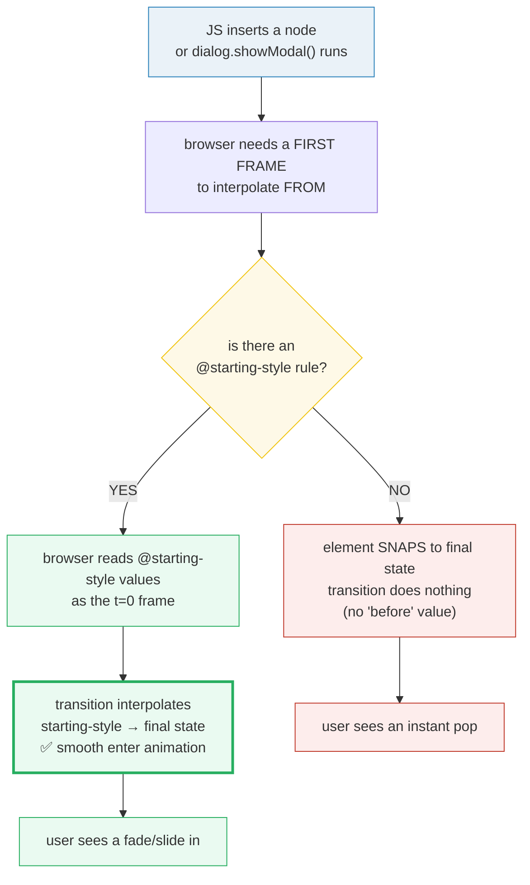
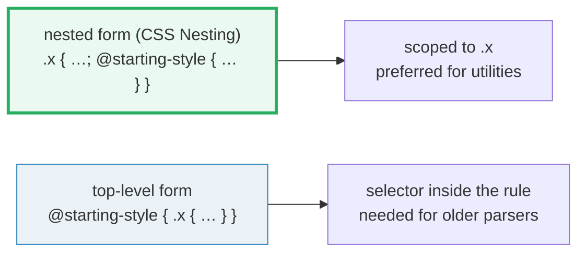
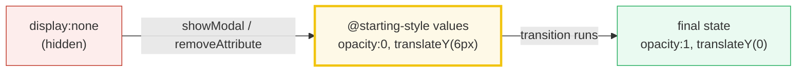
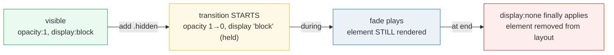

# @starting-style — Enter / Exit Transitions

> **Companion demo:** [`starting_style.html`](./starting_style.html) — open in a browser.
> **Tailwind version:** v4.x via `@tailwindcss/browser@4` Play CDN.
> **Spec status:** `@starting-style` is **native CSS** (CSS Transitions Level 2). It is
> not a Tailwind feature — Tailwind v4 simply ships an `[@starting-style]:` variant
> and lets you nest it inside `@utility`. Browser support: **Chrome 117+** (Aug 2023),
> **Safari 17.5+** (May 2024), **Firefox 129+** (Aug 2024).

---

## 0. TL;DR — the one idea

> **The analogy:** a CSS `transition` is a **before → after** interpolation. The instant
> you mount a DOM node it has *only* an *after* value, so `opacity:1; transition:opacity .3s;`
> on a brand-new element does nothing — it just snaps to 1. There was no "before" for the
> browser to interpolate *from*. **`@starting-style`** is the at-rule that hands the browser
> the missing **first frame**. It is also the only way to animate
> `display:none → display:block` (paired with `transition-behavior: allow-discrete`).



```css
.fade-in {
  opacity: 1;                                  /* final state */
  transform: translateY(0);
  transition: opacity .45s, transform .45s;
  @starting-style {                            /* the FIRST frame this element exists */
    opacity: 0;
    transform: translateY(8px);
  }
}
```

---

## 1. How @starting-style works

`@starting-style` is a **single-shot "before" snapshot** that the browser consults exactly
**once**: the first style recalculation after an element transitions out of
`display:none` (or appears for the first time). It is read-only on subsequent frames —
it is **not** a state you can toggle.

### 1.1 The two syntactic forms



```css
/* Form A — nested (modern, recommended) */
.fade-in {
  opacity: 1;
  transition: opacity .3s;
  @starting-style { opacity: 0; }
}

/* Form B — top-level (works in older parsers, also for non-nested stylesheets) */
@starting-style {
  .fade-in { opacity: 0; }
}
```

Both produce the same `CSSStartingStyleRule` in the CSSOM — the demo's gold-check finds
either.

### 1.2 The lifecycle of one enter animation

| frame | what the browser does | values used |
|---|---|---|
| t−1 | element does not exist (or `display:none`) | — |
| t0 | JS inserts node / `showModal()` runs | browser reads **@starting-style** → opacity:0 |
| t0+ | first paint of the element | opacity:0 (invisible, transition armed) |
| t0→t1 | style recalc to final state | interpolates opacity 0 → 1 |
| t1+ | element sits at final state | opacity:1 |

The rule is **consulted exactly at t0** and never again. Toggling classes on an
already-mounted element does not re-trigger @starting-style — that's classic
transition territory.

---

## 2. Enter animations (display:none → visible)

This is the headline use case. Without @starting-style, opening a `<dialog>`, mounting
a React component, or un-hiding a tooltip all produce an **instant pop** with no motion.

```css
.tooltip {
  opacity: 1;
  transform: translateY(0);
  transition: opacity .25s ease, transform .25s ease;
  @starting-style {
    opacity: 0;
    transform: translateY(6px);
  }
}
.tooltip[hidden] { display: none; }     /* restore this and the enter replays each time */
```



### In Tailwind v4 — three ways

```css
/* 1. Custom utility via @utility (reusable) */
@utility enter-fade {
  opacity: 1;
  transition: opacity .45s, transform .45s;
  @starting-style { opacity: 0; transform: translateY(8px); }
}
/* use: <div class="enter-fade"> … */

/* 2. Built-in Tailwind variant (one-off) */
/* <div class="opacity-100 transition-opacity duration-300 [@starting-style]:opacity-0"> */

/* 3. Plain CSS in your stylesheet (no Tailwind processing needed) */
```

The demo's `<style type="text/tailwindcss">` block demonstrates form #1
(`@utility enter-fade-tw`). The native `<style id="lesson-css">` block uses plain CSS —
both produce real `CSSStartingStyleRule`s in the CSSOM.

---

## 3. Exit animations (visible → display:none)

`@starting-style` only solves **enter**. Exit is a different problem: going TO
`display:none` is normally instant — the element vanishes before the transition can play.

The fix is `transition-behavior: allow-discrete` (or the shorthand
`display .3s allow-discrete`). This tells the engine to **hold** the old `display` value
until the **end** of the transition, so the fade-out is visible.

```css
.card {
  opacity: 1;
  transition: opacity .3s ease,
              display .3s ease allow-discrete;   /* ← the magic keyword */
}
.card.hidden {
  opacity: 0;
  display: none;        /* held until end of transition by allow-discrete */
}
```



### Why `display` and `overlay` both need `allow-discrete`

For **`<dialog>` / popovers** (which live in the **top layer**), the exit also has to
animate the `overlay` property. Without `overlay .3s allow-discrete`, the top-layer
removal is instant and the dialog disappears under its backdrop before the fade finishes.

```css
dialog[open] {
  opacity: 1; transform: scale(1);
  transition: opacity .35s, transform .35s,
              overlay .35s allow-discrete,   /* top-layer exit */
              display  .35s allow-discrete;
  @starting-style {
    opacity: 0; transform: scale(.96) translateY(-24px);
  }
}
dialog {                                     /* closed end-state */
  opacity: 0; transform: scale(.96) translateY(-24px);
}
```

---

## 4. transition-behavior — the keyword that makes discrete properties animatable

`display`, `overlay`, and a handful of others are **discrete** properties: they have no
intermediate values, so the engine normally swaps them at frame 0. `transition-behavior`
controls that:

| value | effect on discrete props (`display`, `overlay`) |
|---|---|
| `normal` (default) | value swaps at the **start** of the transition → element vanishes instantly on exit |
| `allow-discrete` | value swaps at the **end** of the transition → exit fade is visible |

You can set it standalone or as part of the `transition` shorthand:

```css
.longhand { transition-property: display; transition-behavior: allow-discrete; transition-duration: .3s; }
.shorthand { transition: display .3s allow-discrete; }
```

Browser support for `transition-behavior` tracks @starting-style exactly
(Chrome 117+, Safari 17.5+, Firefox 129+) — they shipped together because they only make
sense as a pair.

---

## 5. Killer Gotchas

| trap | symptom | fix |
|---|---|---|
| Using `@starting-style` to animate **exit** | exit still snaps | @starting-style is **enter-only**. For exit, use `allow-discrete` on `display` (and `overlay` for top-layer). |
| Forgetting `allow-discrete` on `display` | element disappears instantly when `.hidden` is added | add `display .3s allow-discrete` to the transition list. |
| Forgetting `allow-discrete` on `overlay` for `<dialog>`/popover | dialog exit plays *behind* the backdrop or is invisible | `overlay .3s allow-discrete` must be in the transition list. |
| Toggling a class on an already-mounted element and expecting @starting-style to re-fire | nothing animates the second time | @starting-style fires **once**, at mount. Use classic transitions / class swaps for subsequent state changes. |
| Putting `@starting-style` at the top level when you meant it scoped | rule applies to too many elements, or never matches | prefer the **nested** form: `.x { …; @starting-style { … } }` — modern parsers scope it correctly. |
| `node --check` failing on the inline script | ESM-only syntax or `import` in a classic script | keep the script classic: `var`, `function`, `forEach`. The demo's script passes `node --check`. |
| Browser support in old Safari / old Firefox | rule silently ignored, element just snaps | @starting-style degrades gracefully (no error, just no animation). Feature-detect if you must: `CSS.supports('selector(&::before)')` is *not* the right check — use `@supports (transition-behavior: allow-discrete)` instead. |
| Tailwind variant spelled wrong | `starting-style:opacity-0` does nothing | Tailwind v4 spelling is `[@starting-style]:opacity-0` (with the `@` and the square brackets — it's an at-rule variant). |
| Animating `display` *without* also having the element be `display:none` in some state | nothing visible happens | `allow-discrete` only matters when `display` is actually changing in the transition — both the start and end states need a real `display` value. |

---

## 6. Cheat sheet

```css
/* ── ENTER ────────────────────────────────────────────────────── */
.fade-in {
  opacity: 1; transform: translateY(0);
  transition: opacity .45s, transform .45s;
  @starting-style { opacity: 0; transform: translateY(8px); }
}

/* ── ENTER + EXIT (same element) ──────────────────────────────── */
.toast {
  opacity: 1; transform: translateX(0);
  transition: opacity .3s, transform .3s,
              display .3s allow-discrete;
  @starting-style { opacity: 0; transform: translateX(20px); }
}
.toast.leaving { opacity: 0; transform: translateX(20px); display: none; }

/* ── DIALOG / POPOVER (top layer) ─────────────────────────────── */
dialog[open] {
  opacity: 1; transform: scale(1);
  transition: opacity .35s, transform .35s,
              overlay .35s allow-discrete,
              display  .35s allow-discrete;
  @starting-style { opacity: 0; transform: scale(.96); }
}
dialog { opacity: 0; transform: scale(.96); }

/* ── TAILWIND v4 ──────────────────────────────────────────────── */
@utility fade-in {
  opacity: 1; transition: opacity .3s;
  @starting-style { opacity: 0; }
}
/* one-off variant:    [@starting-style]:opacity-0  */
/* feature-detect:     @supports (transition-behavior: allow-discrete) { … } */
```

| want | write |
|---|---|
| first-frame value for a freshly mounted element | `.x { …; @starting-style { … } }` |
| exit fade before `display:none` | `transition: …, display .3s allow-discrete;` |
| animated `<dialog>` close | also add `overlay .3s allow-discrete` |
| Tailwind v4 utility form | `@utility name { …; @starting-style { … } }` |
| Tailwind v4 one-off variant | `[@starting-style]:opacity-0` |
| feature-detect | `@supports (transition-behavior: allow-discrete)` |

---

## 🔗 Cross-references

- [`transitions_timing.html`](./transitions_timing.html) — the `transition-*`, `duration-*`,
  `ease-*`, `delay-*` family. `@starting-style` is what makes those transitions actually
  **fire** on a freshly-mounted element.
- [`keyframes_animate.html`](./keyframes_animate.html) — `@keyframes` + the `--animate-*`
  namespace. `@keyframes` runs an animation on a loop or once; `@starting-style` is the
  **run-once-on-mount** complement that needs no `animation-*` machinery.
- [`transforms_3d.html`](./transforms_3d.html) — `transform` + `perspective`. The classic
  @starting-style pair is `opacity` + `transform` (scale / translateY) for the " Material
  Design elevation" enter feel.
- [`property_directive.html`](./property_directive.html) — `@property` for typed custom
  properties. If you @starting-style-animate a custom property (e.g. `--angle`), it must
  be `@property`-registered or it will snap discretely.
- [`container_basics.html`](./container_basics.html) — same house style, different feature.
  Container queries ask "how wide is my parent?"; @starting-style answers "what was I,
  the frame before I existed?".

---

## Sources

- **MDN Web Docs**, *[@starting-style](https://developer.mozilla.org/en-US/docs/Web/CSS/@starting-style)* —
  CSS Transitions Level 2 spec, syntax, browser compat matrix (Chrome 117, Safari 17.5, Firefox 129).
- **Chrome Developers**, *[@starting-style: styling-before-elements-exist* (una.kr, Aug 2023)](https://developer.chrome.com/blog/starting-style) —
  the launch post; explains the enter + exit + allow-discrete triad and the `<dialog>`/popover
  top-layer `overlay` interaction.
- **MDN Web Docs**, *[transition-behavior](https://developer.mozilla.org/en-US/docs/Web/CSS/transition-behavior)* —
  the `allow-discrete` keyword that makes `display` and `overlay` animatable for exit transitions.
- **W3C**, *[CSS Transitions Level 2 — §3 The @starting-style rule](https://drafts.csswg.org/css-transitions-2/#defining-before-change-style)* —
  normative spec text defining the before-change style fragment.
