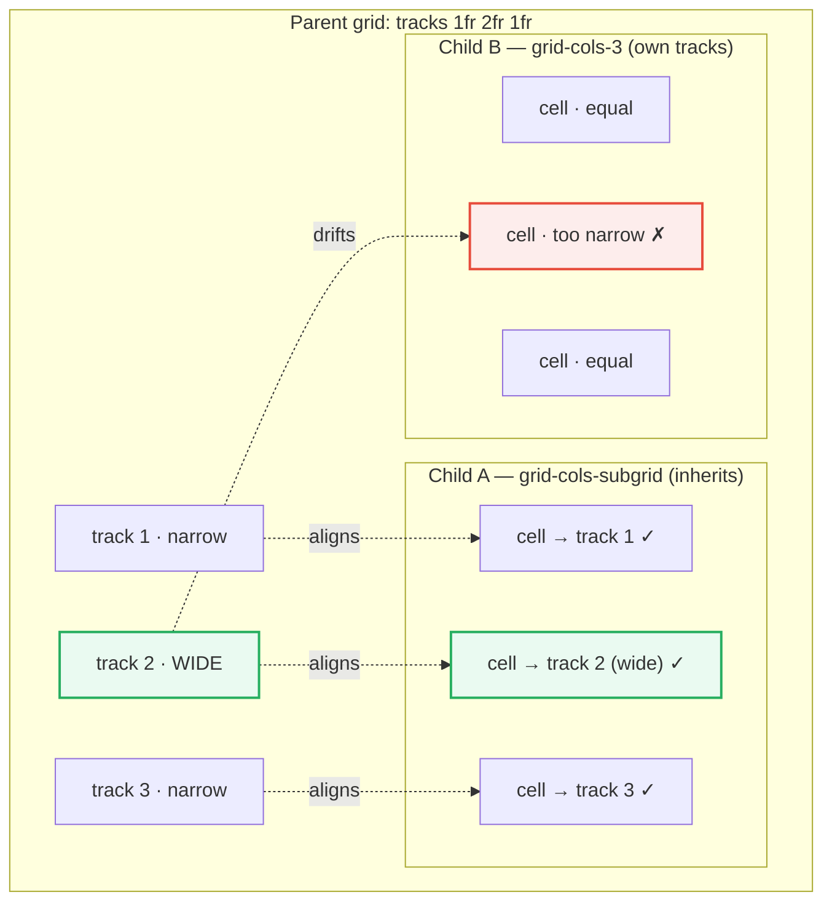

# Subgrid Layout

> **Companion demo:** [`subgrid_layout.html`](./subgrid_layout.html) — open in a browser.
> **Tailwind version:** v4.3.x via `@tailwindcss/browser@4` Play CDN.

---

## 0. TL;DR — the one idea

> **The analogy:** a normal nested grid is a tenant who redraws the walls of
> their apartment. A subgrid is a tenant who keeps the landlord's walls and just
> moves furniture into the existing rooms. `grid-template-columns: subgrid`
> makes a child grid **inherit the parent's column tracks** instead of inventing
> its own — so the two always line up, even when the parent uses unequal tracks,
> gaps, or named lines.



Child A (subgrid) always matches the parent; Child B (plain grid) only matches
by coincidence and drifts the moment the parent uses unequal tracks.

---

## 1. How subgrid works

A grid container's `grid-template-columns` defines its **track list** — the
sized columns its children flow into. A *nested* grid normally gets its **own**
fresh track list, disconnected from the outer grid. The two grids share width
only because the child happens to be as wide as the parent gave it; their
internal columns do not correspond.

`subgrid` changes that contract. When a grid item is itself a grid and declares
`grid-template-columns: subgrid`, the browser **does not create new tracks**.
Instead it **reuses the parent's tracks that this item spans**. The child's
column N *is* the parent's column N (within the spanned range) — same size,
same gap, same line names.

### The two CSS facts Tailwind generates

| Tailwind class | Generated CSS | Effect |
|---|---|---|
| `grid-cols-subgrid` | `grid-template-columns: subgrid;` | inherit parent **column** tracks |
| `grid-rows-subgrid` | `grid-template-rows: subgrid;` | inherit parent **row** tracks |

The child must also **span** the parent tracks it wants to inherit:

```html
<!-- Parent: 3 unequal columns -->
<div class="grid grid-cols-[1fr_2fr_1fr] gap-2">
  <div>A1</div><div>A2 (wide)</div><div>A3</div>

  <!-- Child spans all 3 parent columns, then inherits them -->
  <div class="col-span-3 grid grid-cols-subgrid gap-2">
    <div>B1 → track 1</div>
    <div>B2 → track 2 (wide)</div>
    <div>B3 → track 3</div>
  </div>
</div>
```

With subgrid, B2 is exactly as wide as A2. Without it (`grid-cols-3` instead),
B2 would be one third of the child's width — visibly narrower than A2.

### What gets inherited

- **Track sizes** (the column widths) — always.
- **Gaps** between the inherited tracks — yes, the parent's `gap` applies.
- **Line names** — if the parent names a line (`[mid]`), the child can address
  it with `col-start-mid`.
- **Track count** — fixed by how many parent columns the child spans. You cannot
  add or remove columns inside a subgrid; it has exactly as many as it inherits.

---

## 2. `grid-cols-subgrid` in Tailwind v4

Tailwind v4 ships both subgrid utilities as first-class classes — no `@utility`
or arbitrary-value plumbing needed:

```html
<!-- columns -->
<div class="col-span-3 grid grid-cols-subgrid">…</div>

<!-- rows (vertical tracks) -->
<div class="row-span-3 grid grid-rows-subgrid">…</div>
```

### Matching the parent's tracks

The child's `col-span-N` must equal the number of columns you want to inherit.
Span fewer to consume a subset of the parent's tracks:

```html
<div class="grid grid-cols-4 gap-2">
  <!-- inherits only the first 2 parent columns -->
  <div class="col-span-2 grid grid-cols-subgrid">
    <div>track 1</div><div>track 2</div>
  </div>
</div>
```

### Named lines flow through subgrid

```html
<div class="grid grid-cols-[1fr_2fr_[mid]_1fr] gap-2">
  <!-- child can use the parent's named line 'mid' -->
  <div class="col-span-3 grid grid-cols-subgrid">
    <div class="col-start-mid">starts at parent's [mid] line</div>
  </div>
</div>
```

### No arbitrary values needed

Because `subgrid` is a keyword (not a length), there is no
`grid-cols-[subgrid]` form — just use `grid-cols-subgrid`. (For sizing the
*parent's* tracks arbitrarily, see
[`arbitrary_values`](./arbitrary_values.html) — e.g. `grid-cols-[1fr_2fr_1fr]`.)

---

## 3. Use cases

| Use case | Why subgrid earns its keep |
|---|---|
| **Nested cards aligned to parent columns** | A card's header/body/footer stay locked to the page's column rhythm even when siblings have very different content lengths. |
| **Form label / input pairs across columns** | Labels and inputs share the parent grid's tracks, so a two-column form stays in lock-step at every breakpoint. |
| **Header row + data rows sharing geometry** | Both rows are subgrid children of one parent grid — column widths are guaranteed identical, no JS measuring. |
| **Responsive columns that reflow** | Restyle only the parent (`grid-cols-2` → `grid-cols-[1fr_2fr_1fr]`); every subgrid child re-aligns with zero per-child overrides. |
| **Deeply nested layouts** | Chain `grid-cols-subgrid` down the nesting — alignment propagates through the whole tree, card-inside-card-inside-grid. |
| **Magazine / dashboard panels** | Mixed panel widths (sidebar + main + aside) where inner widgets must line up with the outer grid. |

**When NOT to use it:** if the parent and child both genuinely want the *same*
equal columns (e.g. a plain 3-card row), `grid-cols-3` already aligns and
subgrid adds nothing but ceremony. Reach for subgrid when the parent tracks are
**unequal, dynamic, or named** — that's where plain nesting breaks.

---

## 4. Browser support

Subgrid shipped across all major engines by late 2023 — it is **Baseline
 Newly available** (Baseline 2023).

| Browser | First supporting version |
|---|---|
| Firefox | 71 (2019) — the original reference implementation |
| Safari | 16.0 (2022) |
| Chrome / Edge | 117 (2023) |
| All evergreen browsers | ✅ since Sep 2023 |

**Progressive enhancement:** gate the enhancement behind `@supports` so older
engines get a plain grid:

```css
@supports (grid-template-columns: subgrid) {
  .my-card { grid-template-columns: subgrid; }
}
```

In Tailwind v4 you can wrap a whole block with the `subgrid` variant or use an
arbitrary `[@supports(grid-template-columns:subgrid)]:` prefix.

---

## Killer Gotchas

| Trap | Symptom | Fix |
|------|---------|-----|
| **Forgot `col-span-N` on the subgrid child** | `grid-template-columns: subgrid` computes but the child only spans 1 column → it inherits 1 track, not N | Always pair `grid-cols-subgrid` with `col-span-N` (N = columns to inherit) |
| **Child cell count ≠ spanned columns** | Layout collapses or cells overflow | A subgrid child must place exactly N grid items (one per inherited track) — you can't add extras |
| **Expecting subgrid on a non-grid item** | Nothing happens — `display: grid` is required | The child needs `grid` (Tailwind's `grid-cols-subgrid` sets `display:grid` for you) AND its parent must be a grid |
| **Thinking subgrid re-sizes the parent** | Parent tracks don't change | Subgrid is one-way: child follows parent, never the reverse. To change tracks, restyle the parent |
| **Gap mismatch** | Child looks misaligned despite subgrid | The parent's `gap` is inherited automatically — don't add a *different* gap on the child. Keep `gap-2` consistent, or omit it on the child |
| **Named lines not resolving** | `col-start-mid` does nothing on the child | The parent must actually *define* the line (`grid-cols-[1fr_[mid]_1fr]`); subgrid only inherits names that exist |
| **Old browser silently ignores it** | Firefox < 71 / Safari < 16 / Chrome < 117 falls back to a 1-column stack | Wrap in `@supports (grid-template-columns: subgrid)` and ship a plain grid fallback |
| **Subgrid inside a flex parent** | No effect — flex has no tracks to inherit | Subgrid only works grid → grid. A flex item cannot subgrid |

### Cheat sheet

```html
<!-- 1. Parent defines the tracks (unequal, so alignment is non-trivial) -->
<div class="grid grid-cols-[1fr_2fr_1fr] gap-2">
  <div>col 1</div><div>col 2 (wide)</div><div>col 3</div>

  <!-- 2. Child inherits all 3 parent column tracks -->
  <div class="col-span-3 grid grid-cols-subgrid gap-2">
    <div>aligned to col 1</div>
    <div>aligned to col 2</div>
    <div>aligned to col 3</div>
  </div>

  <!-- 3. Inherit ROW tracks too -->
  <div class="row-span-3 grid grid-rows-subgrid">
    <div>r1</div><div>r2</div><div>r3</div>
  </div>

  <!-- 4. Inherit only a SUBSET of parent columns -->
  <div class="col-span-2 grid grid-cols-subgrid">
    <div>track 1</div><div>track 2</div>
  </div>
</div>

<!-- 5. Progressive enhancement for old browsers -->
<div class="grid grid-cols-3 [@supports(grid-template-columns:subgrid)]:grid-cols-subgrid">
  …
</div>
```

---

## 🔗 Cross-references

- [frontend/foundations: CSS Grid](/frontend/foundations/css_grid.html) — parent grid tracks, `grid-template-columns`, line names — the substrate subgrid inherits from
- [arbitrary_values](/tailwind/arbitrary_values.html) — sizing the *parent's* unequal tracks via `grid-cols-[1fr_2fr_1fr]` (subgrid itself takes no value)
- [gap_spacing](/tailwind/gap_spacing.html) — the `gap`/`--spacing` scale that subgrid children inherit from the parent
- [css_nesting](/tailwind/css_nesting.html) — `@supports`/nested blocks for clean progressive-enhancement fallbacks
- [container_patterns](/tailwind/container_patterns.html) — responsive layouts that pair naturally with subgrid (parent reflows → subgrid children re-align)

---

## Sources

1. **MDN — Subgrid**: https://developer.mozilla.org/en-US/docs/Web/CSS/CSS_grid_layout/Subgrid (mechanism, named lines, browser support)
2. **MDN — `grid-template-columns` (subgrid value)**: https://developer.mozilla.org/en-US/docs/Web/CSS/grid-template-columns#subgrid
3. **web.dev — CSS Subgrid**: https://web.dev/articles/css-subgrid (use cases, alignment, gap inheritance)
4. **Tailwind CSS v4 — Grid Template Columns**: https://tailwindcss.com/docs/grid-template-columns (`grid-cols-subgrid` utility)
5. **Can I use — CSS subgrid**: https://caniuse.com/css-subgrid (Baseline 2023, Chrome 117 / Safari 16 / Firefox 71)
