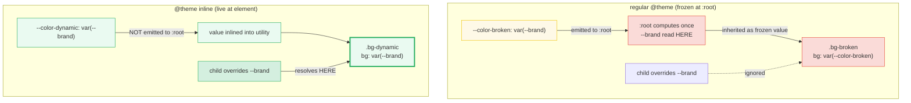
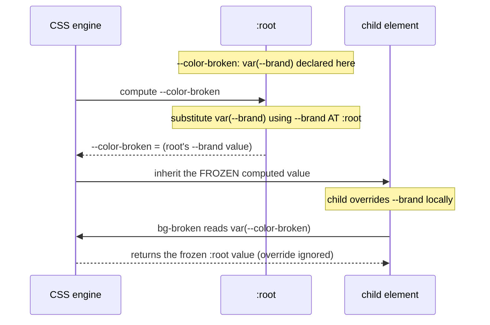

# @theme inline

> **Companion demo:** [`theme_inline.html`](./theme_inline.html) — open in a browser.
> **Tailwind version:** v4.3.x via `@tailwindcss/browser@4` Play CDN.

---

## 0. TL;DR — the one idea

> **The analogy:** a regular `@theme` block writes your design tokens to
> `:root` <i>once</i>, like carving them into stone. Utilities read those carved
> values. **`@theme inline`** hands each utility a *live wire* — the value is
> pasted into the utility itself, so it resolves wherever the utility is used.

In Tailwind v4, `@theme { --color-x: <value> }` emits `--color-x` to `:root` and
generates utilities that reference it (`bg-x → background: var(--color-x)`).
When `<value>` is a **literal** (an oklch color, a pixel length), this is exactly
right. But when `<value>` is **another CSS variable** — `var(--brand)` — the
inner `var()` is resolved *once at `:root` computed-value time*, and the result
is inherited. Override `--brand` on a child element and the utility **does not
follow** — its value was already frozen.

`@theme inline` flips this: it does **not** emit a new `:root` variable. Instead
it **inlines the value into each utility**. So `bg-x` compiles to
`background: var(--brand)` directly, and that `var()` resolves at the **element**
using the utility — picking up whatever `--brand` is in scope there. Dynamic.



```
@theme        { --color-x: <literal>; }    → :root var + var() reference  (static)
@theme inline { --color-x: var(--other); } → value inlined into utility   (dynamic)
```

---

## 1. How it works

### Regular `@theme` — the :root emission

```css
@theme {
  --color-primary: oklch(0.7 0.15 250);   /* literal — fine */
}
```
The compiler emits `:root { --color-primary: oklch(0.7 0.15 250) }` and generates
`.bg-primary { background-color: var(--color-primary) }`. The utility always reads
the shared `:root` variable. This is perfect for **static** tokens.

### The problem: a `var()` inside the value

```css
@theme {
  --color-primary: var(--brand);          /* references ANOTHER var */
}
```
This still emits `:root { --color-primary: var(--brand) }`. But now CSS custom
property semantics bite: `--color-primary` is computed on `:root`, which means
`var(--brand)` is substituted using `--brand`'s value **at `:root`**. That
substituted result is what gets inherited by every descendant. If `--brand` is
later overridden on a child, it is **too late** — descendants inherit the
already-resolved `:root` value.

Two concrete failure modes:

| `--brand` location | symptom with regular `@theme` |
|---|---|
| not defined at `:root` at all | `--color-primary` computes to the *guaranteed-invalid value* → `bg-primary` produces no background anywhere |
| defined at `:root`, overridden on a descendant | `bg-primary` shows the **`:root` value**, ignoring the descendant override |

### The fix: `@theme inline`

```css
@theme inline {
  --color-primary: var(--brand);
}
```
The `inline` keyword tells the compiler: **don't emit a `:root` variable — paste
the value directly into each utility.** So `.bg-primary` becomes
`background-color: var(--brand)`. Now `var(--brand)` resolves at the **element
using `.bg-primary`**, honoring whatever `--brand` is in scope there. Dynamic
theming, JS-controlled theming, and `data-theme` palettes all work.

---

## 2. Mechanism / internals

### Why `:root` resolution freezes (CSS spec, not a Tailwind quirk)

CSS custom properties are inherited as **computed values**. Per the CSS Custom
Properties spec, when a custom property's value contains a `var()`, that
reference is substituted at computed-value time **on the element where the
custom property is declared**, using the computed value of the referenced
property **on that same element**. So:



This is **not** a bug — it's how the cascade is defined. `@theme inline` is
Tailwind's opt-out: by not emitting the intermediate `:root` variable, the
`var()` lives in the utility itself and is resolved per-element.

### What the compiler emits

```css
/* INPUT */
@theme {
  --color-broken: var(--brand);
}
@theme inline {
  --color-dynamic: var(--brand);
}

/* COMPILED OUTPUT (simplified) */
:root {
  --color-broken: var(--brand);          /* emitted — and frozen at :root */
  /* NOTE: --color-dynamic is NOT here */
}
.bg-broken  { background-color: var(--color-broken); }   /* → resolves at :root */
.bg-dynamic { background-color: var(--brand); }          /* → resolves at element */
```

The only difference is the **right-hand side of the utility**:
`var(--color-broken)` (an indirection that was already resolved at `:root`) vs
`var(--brand)` (the raw leaf, resolved at the element).

### CSS var chaining

With `@theme inline`, a multi-hop chain stays live all the way to the leaf:

```css
:root     { --brand: oklch(0.7 0.15 250); }               /* leaf */
@theme inline {
  --color-brand: var(--brand);          /* link 1 */
  --color-link:  var(--color-brand);    /* link 2 */
}
/* .text-link → color: var(--color-brand) → (element scope) → var(--brand) → live */

[data-theme="night"] { --brand: oklch(0.4 0.12 250); }    /* leaf override */
/* text-link inside [data-theme="night"] reads the night brand automatically. */
```

With regular `@theme`, the entire chain collapses at `:root` on first compute —
the leaf is baked in and later overrides are invisible to the utilities.

---

## 3. When to use `@theme` vs `@theme inline`

| Value shape | Example | Use | Why |
|---|---|---|---|
| literal color | `oklch(0.7 0.15 250)`, `#06b6d4` | `@theme` | static — emit once, cache forever |
| literal length | `0.25rem`, `calc(100% - 1px)` | `@theme` | static |
| font stack | `"Inter", sans-serif` | `@theme` | static |
| references an external var | `var(--user-brand)` | `@theme inline` | must resolve at element so runtime/JS updates land |
| aliases another token | `var(--color-brand)` | `@theme inline` | keep the alias live — editing the source propagates |
| driven by `data-theme` | `var(--bg)` swapped per `[data-theme]` | `@theme inline` | per-scope resolution — theme overrides cascade into utilities |
| component-local override | each instance sets its own `--accent` | `@theme inline` | utilities read the component's value, not `:root`'s |

**Rule of thumb:** if the value is a **literal**, use `@theme`. If the value
**contains `var()`** and that variable can change per scope/JS/theme, use
`@theme inline`.

### Dynamic theming with `data-theme`

```css
@theme inline {
  --color-bg:     var(--bg);
  --color-surface: var(--surface);
  --color-ink:    var(--ink);
}

[data-theme="light"] { --bg: #fff; --surface: #f4f4f5; --ink: #18181b; }
[data-theme="dark"]  { --bg: #0d1117; --surface: #161b22; --ink: #e6edf3; }
[data-theme="dim"]   { --bg: #1a1d23; --surface: #22262e; --ink: #c9d1d9; }
```
Now `bg-bg`, `bg-surface`, `text-ink` follow whichever theme scope an element
lives in. Wrap `<html data-theme="dark">` and every utility updates — no
recompile, no `dark:` variants needed.

### JS-controlled theming

```js
// user picks a brand color → all bg-brand / text-brand utilities update live
document.documentElement.style.setProperty('--user-brand', pickedColor);
```
With `@theme inline { --color-brand: var(--user-brand); }`, this one line
re-themes every element using `bg-brand` — no class swapping, no rebuild.

---

## Killer Gotchas

| Trap | Symptom | Fix |
|------|---------|-----|
| **Using `@theme` for a `var()` value** | `bg-brand` shows the `:root` value; descendant/JS overrides ignored | Switch to `@theme inline`. The tell-tale: the utility works but never updates when you change the source var. |
| **`--brand` not defined at `:root`** (regular `@theme`) | `bg-broken` is transparent/empty everywhere | With `@theme`, the `:root` compute fails → guaranteed-invalid → no background. Either define a `:root` default, or use `@theme inline` (no `:root` compute step). |
| **Forgetting `<style type="text/tailwindcss">`** | `bg-brand` is unknown; `@theme inline` ignored | `@theme` directives only work inside a Tailwind-processed style block (Play CDN) or `@import "tailwindcss"` (build). A plain `<style>` is not JIT-compiled. |
| **Mixing up the inlined var name** | expecting `.bg-x { background: var(--color-x) }` but got `var(--brand)` | That's the *whole point* of `inline` — the **value**, not the token name, is inlined. The utility references the leaf var directly. |
| **Expecting `--color-x` in `:root` after `@theme inline`** | `var(--color-x)` in your own CSS resolves to nothing | `@theme inline` does **not** emit the `:root` variable. If you need both a `:root` var AND live utilities, declare the token twice: once in `@theme` (for `:root`) and once in `@theme inline` (for utilities), or just reference the leaf var directly. |
| **`getComputedStyle` returns `rgb()`, not `oklch()`** | gold-check string compare fails | Browsers normalize computed colors to `rgb()`/`color()`. Compare before/after `rgb()` strings, or check that the value **changed** — don't assert the literal oklch. |
| **CDN compiles async** | gold-check reads UA defaults right after load | Poll via `requestAnimationFrame` (~2s). See [`HOW_TO_RESEARCH.md`](./HOW_TO_RESEARCH.md) §4. |
| **`inline` ≠ inlining files/import** | name collision confusion | `@theme inline` is about *value inlining into utilities*, unrelated to `@import`/build inlining. Don't conflate them. |
| **Long var chains with `@theme`** | editing the source token doesn't propagate to aliases | Each `var()` in a regular `@theme` chain freezes at `:root`. Use `@theme inline` for the alias so the chain resolves at the element. |

---

### Cheat sheet

```css
/* 1. Static token — literal value, emit to :root */
@theme {
  --color-brand: oklch(0.7 0.15 250);
  --spacing-tab: 4;
}

/* 2. Bridge an external CSS var — must resolve at element */
@theme inline {
  --color-brand: var(--user-brand);   /* JS/runtime controlled */
}

/* 3. data-theme palettes — utilities follow the active theme scope */
@theme inline {
  --color-bg:      var(--bg);
  --color-surface: var(--surface);
  --color-ink:     var(--ink);
}
[data-theme="dark"] { --bg:#0d1117; --surface:#161b22; --ink:#e6edf3; }

/* 4. Alias one token to another, keep it live */
@theme inline {
  --color-link: var(--color-brand);   /* editing --color-brand propagates */
}

/* 5. Runtime gold-check (does my inline token actually resolve live?) */
// getComputedStyle(elByClassBgBrand).backgroundColor  // before
// container.style.setProperty('--user-brand', cyan)
// getComputedStyle(elByClassBgBrand).backgroundColor  // after — must differ
```

```html
<!-- bg-dynamic updates when --brand changes on an ancestor -->
<div style="--brand: oklch(0.7 0.15 195)">
  <span class="bg-dynamic text-white px-2 py-1">follows --brand</span>
</div>
```

| Intent | Snippet |
|---|---|
| literal token | `@theme { --color-x: oklch(...); }` |
| var-bridged token | `@theme inline { --color-x: var(--brand); }` |
| data-theme system | `@theme inline` + `[data-theme] { --brand: ... }` |
| JS theming | `@theme inline` + `el.style.setProperty('--brand', v)` |
| runtime verify | `getComputedStyle(el).backgroundColor` changes after var set |

---

## 🔗 Cross-references

- [oklch_colors](/tailwind/oklch_colors.html) — static `@theme` color tokens (the literal-value case); this bundle is the dynamic-`var()` counterpart
- [color_mix_opacity](/tailwind/color_mix_opacity.html) — how `/40` opacity modifiers compile to `color-mix(in oklab, …)` over `@theme` color tokens
- [multi_theme](/tailwind/multi_theme.html) — scoped `[data-theme]` systems that swap palettes; `@theme inline` is what makes utilities follow those swaps
- [gradients_v4](/tailwind/gradients_v4.html) — `bg-linear-*` stops interpolate in OKLCH; gradient stops can reference `@theme inline` tokens for theme-aware gradients
- [frontend/tailwind: design tokens](/frontend/tailwind/tailwind_design_tokens.html) — the `@theme` namespace (`--color-*`, `--spacing-*`) that `@theme inline` operates on

---

## Sources

1. **Tailwind CSS — Theme variables (v4.3, official docs)**: https://tailwindcss.com/docs/theme — `@theme` syntax, the `inline` option, and "Referencing other variables" guidance
2. **Tailwind CSS — Adding custom styles / @theme**: https://tailwindcss.com/docs/theme — canonical description of `@theme inline` vs `@theme` value emission
3. **MDN — Using CSS custom properties (variables)**: https://developer.mozilla.org/en-US/docs/Web/CSS/Using_CSS_custom_properties — computed-value-time `var()` substitution and inheritance semantics (why `:root` resolution freezes)
4. **W3C — CSS Custom Properties for Cascading Variables Level 1**: https://www.w3.org/TR/css-variables-1/ — the spec text on `var()` resolution at computed-value time and the guaranteed-invalid value
