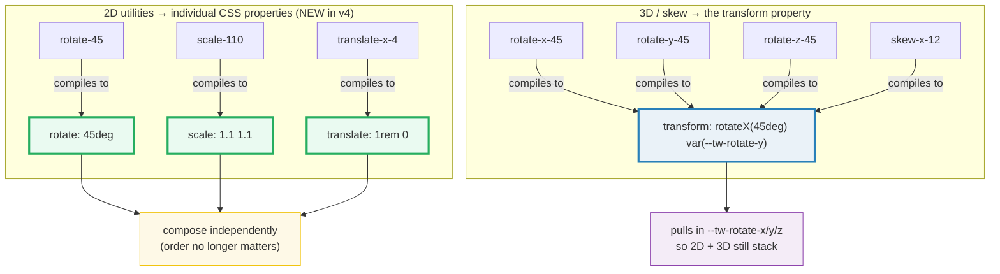
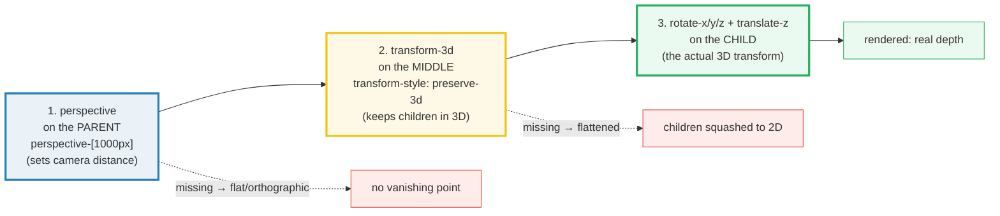
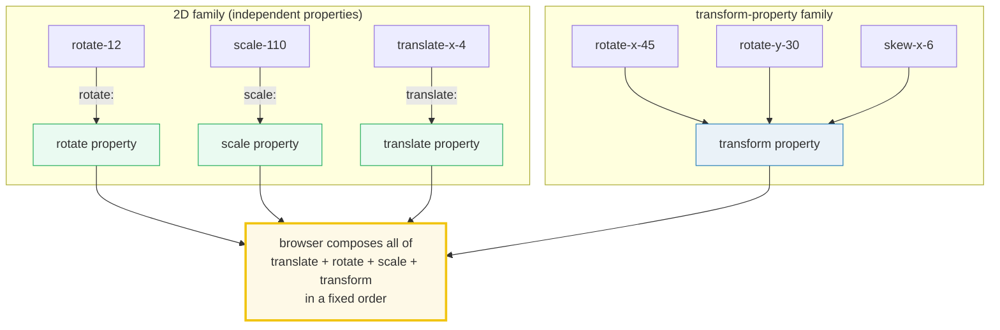

# 2D & 3D Transforms in Tailwind v4 — rotate · scale · skew · translate · perspective

> **Companion demo:** [`transforms_3d.html`](./transforms_3d.html) — open in a browser.
> **Tailwind version:** v4.3.x via `@tailwindcss/browser@4` Play CDN.

---

## 0. TL;DR — the one idea

> Tailwind v4 **split transforms across two CSS worlds**. The 2D utilities
> (`rotate-*`, `scale-*`, `translate-*`) now compile to the modern **individual
> CSS properties** (`rotate:`, `scale:`, `translate:`) — NOT to the `transform`
> shorthand like they did in v3. Only **3D rotation** (`rotate-x/y/z-*`), **3D
> translation** (`translate-z-*`), and **skew** still use `transform`, because
> CSS has no individual-property equivalents for those yet. This split is why you
> can finally combine `rotate-45 scale-110 translate-x-4` in **any order** — each
> targets a different property, so nothing overwrites anything.



The 3D rendering pipeline is three ingredients stacked in order — get any of them
wrong and the depth collapses:



```
rotate-45                 → rotate: 45deg           (individual property)
scale-110                 → scale: 1.1 1.1          (individual property)
translate-x-4             → translate: 1rem 0       (individual property)
skew-x-12                 → transform: matrix(...)  (transform property)
rotate-x-45               → transform: rotateX(45deg) var(--tw-rotate-y)
rotate-y-45               → transform: var(--tw-rotate-x) rotateY(45deg)
perspective-[1000px]      → perspective: 1000px     (PARENT element)
transform-3d              → transform-style: preserve-3d
backface-hidden           → backface-visibility: hidden
```

---

## 1. 2D transforms — the individual-property revolution

The headline v4 change: `rotate-45` no longer emits
`transform: rotate(45deg)`. It emits the standalone **`rotate: 45deg`** property
(CSS Transforms Level 2). Same for `scale-*` (`scale:`) and `translate-*`
(`translate:`). The compiler output from the [official rotate docs](https://tailwindcss.com/docs/rotate):

| Class | Compiled CSS | Property |
|-------|--------------|----------|
| `rotate-45` | `rotate: 45deg` | individual `rotate` |
| `-rotate-90` | `rotate: calc(90deg * -1)` | individual `rotate` |
| `scale-110` | `scale: 1.1 1.1` | individual `scale` |
| `scale-x-150` | `scale: 1.5 1` | individual `scale` |
| `translate-x-4` | `translate: 1rem 0` | individual `translate` |
| `skew-x-12` | `transform: matrix(...)` | **`transform`** (no skew prop) |

### Why it matters: composition order

In v3, `transform: translate() rotate() scale()` is **order-dependent** — a rotate
then translate orbits the element around the origin; translate then rotate slides
it then spins in place. Because v3 packed everything into one `transform`, the
class order on the element determined the math order.

In v4, `rotate:`, `scale:`, `translate:` are three **independent** properties the
browser composes for you in a defined way. The order you write the classes no
longer changes the visual result:

```html
<!-- v4: these three are EQUIVALENT regardless of order -->
<div class="rotate-45 scale-110 translate-x-4">…</div>
<div class="translate-x-4 rotate-45 scale-110">…</div>
<div class="scale-110 translate-x-4 rotate-45">…</div>
```

### The gold-check gotcha this creates

Because 2D rotation lives on `rotate:`, **`getComputedStyle(el).transform`
returns `"none"` for a `rotate-45` element.** You must read the individual
property instead:

```javascript
// v3 mental model — BROKEN in v4:
getComputedStyle(el).transform;   // "none"  ← surprising!

// v4 correct reads:
getComputedStyle(el).rotate;      // "45deg"
getComputedStyle(el).scale;       // "1.1 1.1"
getComputedStyle(el).translate;   // "1rem 0px"

// 3D + skew still live on transform:
getComputedStyle(el).transform;   // "rotateX(45deg) ..." for rotate-x-45
```

The live demo's gold-check asserts exactly this split — probe A (`rotate-45`)
checks `computedStyle.rotate === "45deg"`, probe B (`rotate-x-45`) checks
`computedStyle.transform` contains `rotateX(45deg)`.

---

## 2. 3D transforms — rotate-x / rotate-y / rotate-z + perspective

3D rotations go on the **`transform`** property. Tailwind v4 (new — v3 had no
3D axis utilities without a plugin) emits:

| Class | Compiled CSS |
|-------|--------------|
| `rotate-x-45` | `transform: rotateX(45deg) var(--tw-rotate-y)` |
| `rotate-y-45` | `transform: var(--tw-rotate-x) rotateY(45deg)` |
| `rotate-z-45` | `transform: var(--tw-rotate-x) var(--tw-rotate-y) rotateZ(45deg)` |
| `translate-z-12` | `transform: translateZ(0.75rem)` |

Notice the `--tw-rotate-x/y/z` variables: each axis utility leaves the other axes
as variables so multiple axes compose without clobbering each other.

### Perspective — the camera (parent-side)

3D rotation is invisible without a vanishing point. `perspective-*` goes on the
**parent** and sets how far the "camera" sits from the z=0 plane:

| Utility | Value | Feel |
|---------|-------|------|
| `perspective-dramatic` | `100px` | extreme close-up, heavy foreshortening |
| `perspective-near` | `300px` | obvious depth |
| `perspective-normal` | `500px` | balanced default |
| `perspective-midrange` | `800px` | mild depth |
| `perspective-distant` | `1200px` | near-orthographic, subtle |
| `perspective-[1000px]` | arbitrary | any exact value |
| `perspective-(--my-cam)` | `var(--my-cam)` | CSS-variable shorthand |

Small perspective = close camera (objects at +z balloon toward you, strong
warping). Large perspective = far camera (everything reads almost flat, like a
telephoto lens). The demo's Panel 3 shows the **same** `rotate-y-45` tile under
near/normal/distant so you can see the foreshortening difference on one screen.

```html
<!-- 3D depth = parent perspective + child 3D rotation -->
<div class="perspective-normal">
  <div class="rotate-y-45">tilted toward you</div>
</div>

<!-- arbitrary camera distance -->
<div class="perspective-[1000px]">
  <div class="rotate-x-12 rotate-y-[-8deg]">custom pose</div>
</div>
```

> **Customize:** add your own tiers in `@theme { --perspective-tele: 2400px; }`
> and use `perspective-tele` like any built-in.

### transform-3d — preserve-3d (the nesting switch)

By default, a transformed element's children render **flattened** to its plane
(`transform-style: flat`). To nest real 3D children (a cube, a multi-face card),
the middle wrapper needs `transform-3d` = `transform-style: preserve-3d`. Without
it, every child face collapses onto the parent's 2D plane.

| Utility | Compiled CSS | Use |
|---------|--------------|-----|
| `transform-3d` | `transform-style: preserve-3d` | children stay in 3D space |
| `transform-flat` | `transform-style: flat` | flatten children (the default) |

```html
<div class="perspective-[800px]">           <!-- camera on parent -->
  <div class="transform-3d rotate-y-45">    <!-- preserve-3d so faces keep depth -->
    <div class="backface-hidden translate-z-24">front face</div>
    <div class="backface-hidden -translate-z-24 rotate-y-180">back face</div>
  </div>
</div>
```

---

## 3. Backface visibility — hiding the mirror

`backface-visibility` controls whether you can see the reverse of a 3D-rotated
element. When an element rotates past 90° on X or Y, its back faces the camera;
by default that back is **visible** (you see a mirrored version of the content).
For flip cards you almost always want it hidden.

| Utility | Compiled CSS |
|---------|--------------|
| `backface-hidden` | `backface-visibility: hidden` |
| `backface-visible` | `backface-visibility: visible` (default) |

### The flip card recipe

```html
<div class="group [perspective:1000px]">
  <div class="relative transform-3d transition-transform duration-700 group-hover:rotate-y-180">
    <!-- front: faces camera at 0° -->
    <div class="backface-hidden absolute inset-0">FRONT</div>
    <!-- back: pre-rotated 180° so it sits correctly BEHIND the front -->
    <div class="backface-hidden rotate-y-180 absolute inset-0">BACK</div>
  </div>
</div>
```

Four pieces, all required:
1. **`group` + `[perspective:1000px]`** on the parent — the camera.
2. **`transform-3d`** on the flipper — keep faces in 3D (else they flatten).
3. **`backface-hidden`** on both faces — so the front's mirror never bleeds
   through during the flip, and the back doesn't show through the front at rest.
4. **`rotate-y-180`** pre-applied to the back — it lives behind, pre-flipped, so
   when the whole flipper rotates 180° the back swings to face the camera.

> **Why both faces need `backface-hidden`:** without it, at exactly 90° through
> the flip you'd see the front edge-on AND the back's mirror bleeding through — a
> messy double-image. Hiding both faces means only the face pointing at the camera
> is ever drawn.

---

## 4. Transform composition — making them stack

Because v4 splits 2D transforms across individual properties, "combining
transforms" now has two distinct paths:



The final rendered transform is the browser's composition of `translate`, then
`rotate`, then `scale`, then `transform` (per the [CSS Transforms spec](https://www.w3.org/TR/css-transforms-2/)).
So a single element can freely mix 2D individual-property utilities with 3D
`transform`-property utilities:

```html
<!-- All of these coexist on one element without overwriting each other: -->
<div class="rotate-12 scale-110 translate-x-4 rotate-x-45 perspective-[800px]">
  2D + 3D composed
</div>
```

### Animating transforms — name the properties

To transition a transform on hover/interaction, you must transition **all** the
properties involved (they're separate now), or use `transition-all`:

```html
<!-- GOOD: explicitly name the individual properties + transform -->
<div class="transition-[transform,rotate,scale,translate] duration-300 hover:rotate-45 hover:scale-110">
  smooth
</div>

<!-- ALSO FINE: transition-all covers everything -->
<div class="transition-all duration-300 hover:rotate-12">smooth too</div>
```

Pair with [`transitions_timing`](#-cross-references) for the `duration-*` / `ease-*`
half of the motion.

---

## Killer Gotchas

| Trap | Symptom | Fix |
|------|---------|-----|
| **`getComputedStyle(el).transform` is `"none"` for `rotate-45`** | Your gold-check/animation-detection reads `transform` and sees nothing — appears the utility "didn't apply" | v4 put 2D rotation on the **individual** `rotate:` property. Read `getComputedStyle(el).rotate` instead. Only 3D (`rotate-x-*`) + skew live on `transform`. |
| **3D rotation looks completely flat (no depth)** | `rotate-y-45` tilts but shows zero perspective — looks like a 2D skew | Add `perspective-*` on the **parent**. Perspective on the same element as the rotation does nothing. |
| **Cube/card children collapse to a flat plane** | Each face renders squashed onto the parent, no real 3D nesting | Add `transform-3d` (`transform-style: preserve-3d`) on the **middle** wrapper. Default is `flat`. |
| **Flip card shows a double/mirror image mid-flip** | At 90° you see the front edge-on AND the back's mirror bleeding through | `backface-hidden` on **both** faces — never just one. |
| **Order-dependent transform results (v3 muscle memory)** | You expect swapping class order to change the look; it doesn't anymore | v4 individual properties compose in a fixed browser order. If you truly need order-dependent math, use one `transform` via arbitrary value: `[transform:translateX(1rem)_rotate(45deg)]`. |
| **`transition-transform` doesn't animate a `rotate-*` change** | Hover swaps `rotate-45` but it snaps instead of animating | v4's `transition-transform` transitions the `transform` property, but `rotate-45` sets `rotate:`. Use `transition-[transform,rotate,scale,translate]` or `transition-all`. |
| **`perspective-near` is "too extreme"** | `perspective-dramatic` (100px) warps beyond recognition | Step up the scale: near(300px) → normal(500px) → midrange(800px) → distant(1200px). Most UIs land at normal–midrange. |
| **Flipping with `-scale-100` vs `rotate-y-180`** | A 2D mirror flip (`-scale-100`) looks like a flip but has no depth; users expect a 3D flip | For a real card flip use `rotate-y-180` + perspective + `transform-3d`. Use `-scale-100` only for a flat mirror (e.g. RTL icon flip). |
| **3D rotate + `overflow-hidden` ancestor clips the depth** | Rotated content gets cut at the parent bounds during the flip | Ensure no `overflow-hidden` ancestor between the perspective parent and the rotating child, or give generous padding. |
| **Tailwind CDN compiles async** | `getComputedStyle().transform` returns `none` right at load | Poll via `requestAnimationFrame` for up to ~2.5s (see the demo's gold-check) — same pattern as every Play-CDN demo. |
| **`skew-*` doesn't compose like `rotate-*`** | `skew-x-12 rotate-45` and `rotate-45 skew-x-12` look *different* | Skew uses the `transform` property (with `rotate` var), so it follows transform-property ordering rules, unlike the independent 2D properties. |

### Cheat sheet

```css
/* 1. 2D rotate — individual property (v4) */
.r2 { rotate: 45deg; }

/* 2. 2D scale — individual property (v4) */
.s2 { scale: 1.1 1.1; }   /* scale-x-150 → scale: 1.5 1 */

/* 3. 2D translate — individual property (v4) */
.t2 { translate: 1rem 0; }

/* 4. skew — still transform property */
.sk { transform: skewX(12deg); }

/* 5. 3D rotate — transform property + axis vars */
.rx { transform: rotateX(45deg) var(--tw-rotate-y); }

/* 6. perspective on PARENT */
.cam { perspective: 800px; }

/* 7. preserve-3d for nesting */
.d3 { transform-style: preserve-3d; }

/* 8. hide backface */
.bh { backface-visibility: hidden; }
```

```html
<!-- 2D spin (order-independent in v4) -->
<div class="rotate-45 scale-110 translate-x-4">…</div>

<!-- 2D hover mirror -->
<div class="hover:-scale-100 transition-transform duration-300">flip</div>

<!-- 3D depth: perspective on parent + rotate on child -->
<div class="perspective-normal">
  <div class="rotate-y-45">tilted</div>
</div>

<!-- Arbitrary camera + custom pose -->
<div class="perspective-[1000px]">
  <div class="rotate-x-12 rotate-y-[-8deg]">pose</div>
</div>

<!-- Real 3D nesting (cube/multi-face) -->
<div class="perspective-[800px]">
  <div class="transform-3d rotate-y-30">
    <div class="translate-z-24">front</div>
    <div class="-translate-z-24 rotate-y-180">back</div>
  </div>
</div>

<!-- Flip card (hover) -->
<div class="group [perspective:1000px]">
  <div class="relative transform-3d transition-transform duration-700 group-hover:rotate-y-180">
    <div class="backface-hidden absolute inset-0">FRONT</div>
    <div class="backface-hidden rotate-y-180 absolute inset-0">BACK</div>
  </div>
</div>

<!-- Animate the split properties explicitly -->
<div class="transition-[transform,rotate,scale,translate] duration-300 hover:rotate-12">…</div>
```

---

## 🔗 Cross-references

- [transitions_timing](/tailwind/transitions_timing.html) — transforms are inert without motion; the `transition-*`, `duration-*`, `ease-*` family that animates every demo on this page. Note `transition-transform` alone won't animate v4's individual `rotate:`/`scale:`/`translate:` — you need `transition-[transform,rotate,scale,translate]`.
- [keyframes_animate](/tailwind/keyframes_animate.html) — `@keyframes` + the `--animate-*` namespace for looping/continuous transform motion (spinning cubes, infinite carousels) that goes beyond a simple hover transition.
- [starting_style](/tailwind/starting_style.html) — `@starting-style` enables enter/exit transitions on elements entering the DOM (e.g. a 3D card flipping in on mount), which plain transitions can't reach.
- [filters_masks](/tailwind/filters_masks.html) — `drop-shadow`, `blur`, and `mask-*` compose with transforms for depth-of-field and reveal effects on rotated/flipped elements.
- [property_directive](/tailwind/property_directive.html) — the `@property`-typed `--tw-rotate-x/y/z` custom properties are exactly what make 3D transform vars animatable in v4.
- [arbitrary_values](/tailwind/arbitrary_values.html) — the `perspective-[1000px]`, `rotate-x-[18deg]`, and `[perspective:1000px]` arbitrary-value syntax used throughout this demo.

---

## Sources

1. **Tailwind CSS — Rotate (v4 official docs)**: https://tailwindcss.com/docs/rotate — canonical compiled-CSS table proving `rotate-<number>` → `rotate: <number>deg` (individual property) and `rotate-x/y/z-<number>` → `transform: rotateX/Y/Z(...) var(--tw-rotate-*)`.
2. **Tailwind CSS — Perspective (v4 official docs)**: https://tailwindcss.com/docs/perspective — the `perspective-dramatic/near/normal/midrange/distant` scale (100/300/500/800/1200px) and `perspective-[<value>]` / `perspective-(--var)` arbitrary/custom-property syntax.
3. **Tailwind CSS — Transform-style (v4 official docs)**: https://tailwindcss.com/docs/transform-style — `transform-3d` → `transform-style: preserve-3d` and `transform-flat` → `transform-style: flat`.
4. **Tailwind CSS v4.0 — blog announcement**: https://tailwindcss.com/blog/tailwindcss-v4 — "New 3D transform utilities… `rotate-x-*`, `rotate-y-*`, `scale-z-*`, `translate-z-*`" + the move to the individual `translate`/`rotate`/`scale` properties.
5. **MDN — Using CSS transforms**: https://developer.mozilla.org/en-US/docs/Web/CSS/CSS_transforms/Using_CSS_transforms — documents the individual `translate`/`rotate`/`scale` properties vs the `transform` shorthand, and the `perspective` + `transform-style: preserve-3d` 3D pipeline.
6. **W3C — CSS Transforms Level 2 (Editor's Draft)**: https://www.w3.org/TR/css-transforms-2/ — the spec defining the individual transform properties, their composition order, and `backface-visibility`.
