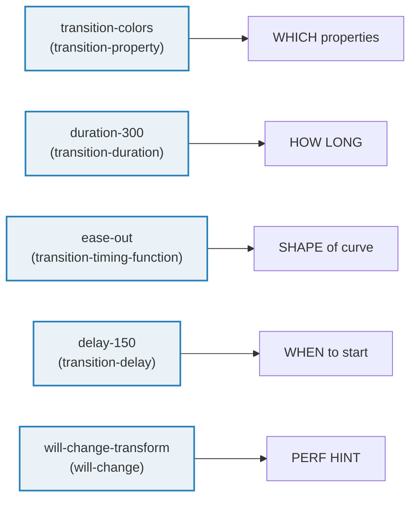
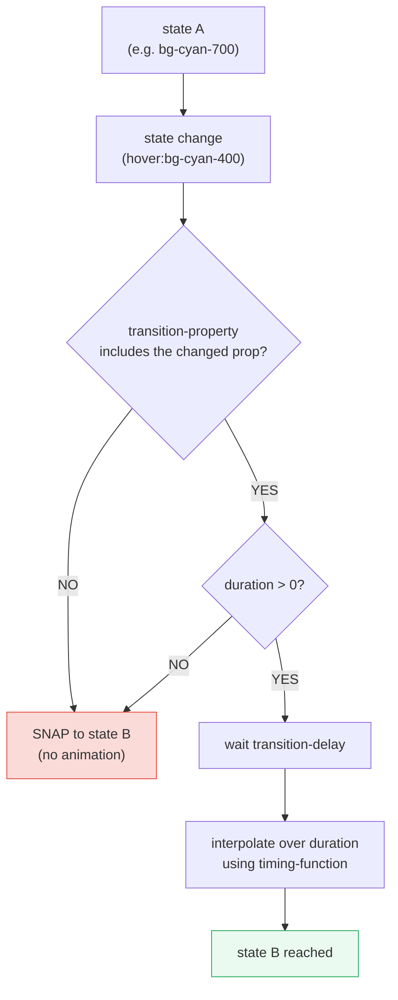
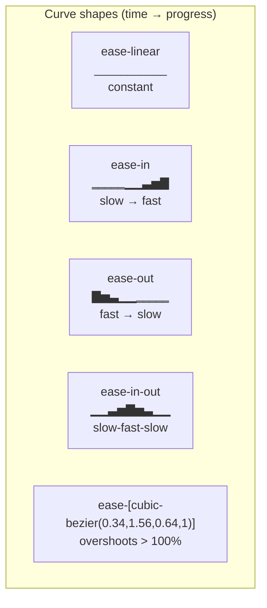
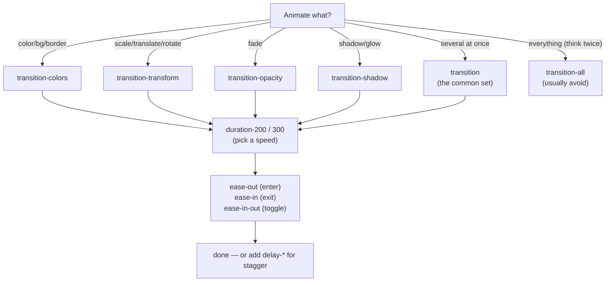

# Transitions & Timing Functions

> **Companion demo:** [`transitions_timing.html`](./transitions_timing.html) — open in a browser.
> Rendered ground truth: a `<div class="transition-colors duration-300">` whose
> computed `transitionDuration` contains `300ms` and whose `transitionProperty`
> includes `color`.

---

## 0. TL;DR — the one idea

A Tailwind transition is **three CSS properties you compose**, not one utility.
Get any one wrong and the effect fails in a confusing way.



```html
<button class="bg-cyan-600 hover:bg-cyan-400 transition-colors duration-300 ease-in-out">
  Smooth color transition
</button>
```

Forget `transition-colors` → nothing animates. Forget `duration-300` → it snaps.
Forget `ease-*` → it uses the browser default `ease` (usually fine, but not
what you asked for).

---

## 1. How it works — the three-knob model

Every Tailwind transition is the composition of these utilities. They map 1:1
onto CSS properties — Tailwind does not invent behavior, it just names the CSS.

| Knob | Tailwind utilities | CSS property | Default if omitted |
|---|---|---|---|
| **which** properties | `transition` · `transition-colors` · `transition-transform` · `transition-opacity` · `transition-shadow` · `transition-none` | `transition-property` | `none` → **nothing animates** |
| **how long** | `duration-75/100/150/200/300/500/700/1000` · `duration-[250ms]` | `transition-duration` | `0s` → **snaps instantly** |
| **shape** of curve | `ease-linear` · `ease-in` · `ease-out` · `ease-in-out` · `ease-[cubic-bezier(...)]` | `transition-timing-function` | `ease` (`cubic-bezier(0.25,0.1,0.25,1)`) |
| **when** to start | `delay-75/100/150/200/300/500/700/1000` · `delay-[1s]` | `transition-delay` | `0s` |
| **perf hint** | `will-change-auto` · `will-change-scroll` · `will-change-contents` · `will-change-transform` · `will-change-[opacity]` | `will-change` | `auto` |

### The transition pipeline



This pipeline is why "my transition doesn't work" almost always has one of two
causes: a missing `transition-*` property group, or a missing `duration-*`.

---

## 2. Mechanism / internals

### 2.1 `transition-property` groups

Tailwind v4 ships six named groups plus the catch-all. Each maps to a fixed
list of CSS properties — **only properties in the list animate**; everything
else snaps.

| Utility | Expands to `transition-property:` |
|---|---|
| `transition` (no suffix) | `color, background-color, border-color, outline-color, text-decoration-color, fill, stroke, opacity, box-shadow, transform, filter, backdrop-filter` — the **common set** |
| `transition-colors` | `color, background-color, border-color, outline-color, text-decoration-color, fill, stroke` |
| `transition-opacity` | `opacity` |
| `transition-shadow` | `box-shadow` |
| `transition-transform` | `transform` |
| `transition-none` | `none` — disables all transitions on the element |
| `transition-all` | `all` (literal) — **avoid**: heavy, can thrash layout |

> **Why `transition` (no suffix) is the safe default:** the common set is exactly
> the set of properties that are cheap to animate (color, opacity, transform,
> shadow). `transition-all` adds layout-affecting properties like `width`,
> `height`, `padding` — animating those triggers reflow on every frame.

### 2.2 `transition-duration` — `duration-*`

Time in milliseconds. Tailwind v4's default scale (from `@theme`):

| Utility | Value |
|---|---|
| `duration-0` | `0ms` |
| `duration-75` | `75ms` |
| `duration-100` | `100ms` |
| `duration-150` | `150ms` |
| `duration-200` | `200ms` |
| `duration-300` | `300ms` |
| `duration-500` | `500ms` |
| `duration-700` | `700ms` |
| `duration-1000` | `1000ms` |
| `duration-[250ms]` | `250ms` (arbitrary) |
| `duration-[2s]` | `2s` (arbitrary) |

> **Default gotcha:** if you write `transition-colors` but forget `duration-*`,
> the duration is `0s` and **nothing animates** — the element snaps to the new
> value. This is the #1 "transition doesn't work" bug.

### 2.3 `transition-timing-function` — `ease-*`

The shape of the curve over the duration. Tailwind v4's defaults (from
`@theme`):

| Utility | Value | Feel |
|---|---|---|
| `ease-linear` | `linear` | constant speed — mechanical, good for spinners/progress |
| `ease-in` | `cubic-bezier(0.4, 0, 1, 1)` | starts slow, ends fast — good for **exits** |
| `ease-out` | `cubic-bezier(0, 0, 0.2, 1)` | starts fast, ends slow — good for **enters** |
| `ease-in-out` | `cubic-bezier(0.4, 0, 0.2, 1)` | slow at both ends — good for **toggles** |
| `ease-[cubic-bezier(0.34,1.56,0.64,1)]` | arbitrary | overshoots (spring/pop) |



### 2.4 Custom easing — arbitrary values & theme tokens

**One-off:** use an arbitrary value inline.

```html
<div class="transition duration-500 ease-[cubic-bezier(0.34,1.56,0.64,1)]">
  Pop with overshoot
</div>
```

**Reusable:** declare a token in `@theme`, then use `ease-<name>`.

```html
<style type="text/tailwindcss">
  @theme {
    --ease-spring: cubic-bezier(0.34, 1.56, 0.64, 1);
    --ease-out-soft: cubic-bezier(0, 0, 0.2, 1);
    --duration-snappy: 150ms;
  }
</style>

<button class="transition duration-snappy ease-spring hover:scale-105">
  Reusable spring
</button>
```

v4 reads `--ease-*` and `--duration-*` tokens from `@theme` and generates the
corresponding `ease-*` and `duration-*` utilities automatically.

### 2.5 `transition-delay` — `delay-*`

Offsets the **start** of the transition (not its length). Same scale as
`duration-*` (`delay-75`, `delay-150`, …, `delay-1000`, `delay-[1s]`).

```html
<!-- All three items use the SAME duration & easing; only the start is offset. -->
<li class="transition duration-300 ease-out delay-0">First</li>
<li class="transition duration-300 ease-out delay-150">Second</li>
<li class="transition duration-300 ease-out delay-300">Third</li>
```

For long lists, compute delay per item rather than hand-authoring:

```html
<li style="--i: 0; transition-delay: calc(var(--i) * 60ms)">…</li>
<li style="--i: 1; transition-delay: calc(var(--i) * 60ms)">…</li>
<li style="--i: 2; transition-delay: calc(var(--i) * 60ms)">…</li>
```

> For **looping** cascades (where the animation replays), `transition-delay`
> won't help — transitions only fire on state change. Use
> [`keyframes_animate`](./keyframes_animate.html) with `animation-delay` instead.

### 2.6 `will-change` — `will-change-*`

A perf **hint** to the browser: "I'm about to animate this property, please
promote the element to its own compositor layer ahead of time." Only useful for
heavy animations (large blurs, big transforms, long-running transitions).

| Utility | Value |
|---|---|
| `will-change-auto` | `auto` (default — browser guesses) |
| `will-change-scroll` | `scroll-position` |
| `will-change-contents` | `contents` |
| `will-change-transform` | `transform` |
| `will-change-[opacity]` | arbitrary |

> **Do not sprinkle `will-change-*` everywhere.** Each hinted element gets its
> own GPU layer — too many layers exhaust video memory and *slow down* the page.
> Set it right before the animation starts, remove it after. For one-off hovers,
> the browser is smart enough without the hint.

---

## 3. Killer Gotchas

| Trap | Symptom | Fix |
|---|---|---|
| **Forgot the property group** — wrote `hover:scale-110 duration-300` with no `transition-transform` | Nothing animates; element snaps | Add `transition` (common set) or `transition-transform` |
| **Forgot `duration-*`** — wrote `transition-colors hover:bg-cyan-400` | Snaps instantly (duration = `0s`) | Add `duration-200` (or any `> 0`) |
| **Wrong property group** — `transition-colors` but you're animating `transform` | Color animates, transform snaps | Use `transition` (common set) or `transition-transform` |
| **`transition-all` on layout properties** | Janky, drops frames — width/height/padding trigger reflow each frame | Animate only `transform`/`opacity`; use `transition` (the scoped common set) |
| **Transition on mount doesn't fire** | Element appears already in end-state | Transitions need a state *change*; for enter animations use `@starting-style` ([starting_style](./starting_style.html)) or keyframes |
| **`will-change-*` left permanently** | RAM bloat, layers never released | Set before, remove after — or skip for trivial hovers |
| **Hover transition reverses instantly** | On mouse-leave, the reverse animation uses the *same* duration but feels off | That's expected — transitions are symmetric. For asymmetric enter/exit, use keyframes |
| **`prefers-reduced-motion` ignored** | Vestibular users get nauseated | Add `motion-reduce:transition-none` (or `motion-safe:` prefix on the transition) |
| **Cubic-bezier y > 1 "broken"** | `cubic-bezier(0.34,1.56,...)` rejected by older tools | It's valid CSS — y-values outside [0,1] produce overshoot. Tailwind & modern browsers accept it |
| **Transition-property list mismatch with multi-property change** | Element animates some props, snaps others | Either use `transition` (common set) or list every property group you need |

### Reduced-motion accessibility

Always gate non-essential motion behind `motion-safe:` or disable it with
`motion-reduce:`:

```html
<!-- Option A: only animate if the user allows motion -->
<button class="motion-safe:transition motion-safe:duration-300 hover:bg-cyan-400">

<!-- Option B: disable transitions if the user prefers reduced motion -->
<button class="transition duration-300 motion-reduce:transition-none hover:bg-cyan-400">
```

---

## Cheat sheet

```html
<!-- 1. Smooth color hover (cheapest) -->
<button class="bg-cyan-700 hover:bg-cyan-400 transition-colors duration-200">Color</button>

<!-- 2. Card lift (GPU-composited) -->
<div class="transition-transform duration-300 ease-out hover:-translate-y-1">Lift</div>

<!-- 3. Fade -->
<div class="transition-opacity duration-200 hover:opacity-50">Fade</div>

<!-- 4. Common-set "everything cheap" (default choice) -->
<button class="transition duration-200 ease-out hover:scale-105 hover:bg-cyan-400">Multi</button>

<!-- 5. Spring / overshoot -->
<div class="transition duration-500 ease-[cubic-bezier(0.34,1.56,0.64,1)] hover:scale-110">Pop</div>

<!-- 6. Staggered cascade (per-item delay) -->
<li class="transition duration-300 ease-out delay-150">Staggered</li>

<!-- 7. Reduced-motion safe -->
<button class="transition duration-200 motion-reduce:transition-none">A11y</button>

<!-- 8. Custom theme tokens -->
<style type="text/tailwindcss">
  @theme {
    --ease-spring: cubic-bezier(0.34, 1.56, 0.64, 1);
    --duration-snappy: 150ms;
  }
</style>
<button class="transition duration-snappy ease-spring hover:scale-105">Token-driven</button>
```

### Decision flow



---

## 🔗 Cross-references

- [`keyframes_animate.html`](./keyframes_animate.html) — **transitions vs.
  keyframes**: a transition interpolates between two states (needs a trigger);
  a `@keyframes` animation runs through many stops on its own (no trigger
  needed). Use transitions for hover/focus/state-toggle; use keyframes for
  entrance/exit/loop.
- [`transforms_3d.html`](./transforms_3d.html) — `transition-transform` is the
  natural companion to `rotate-*`, `scale-*`, `translate-*`, and 3D
  `perspective`/`rotateX`/`rotateY`. Pair `transition-transform duration-300`
  with a transform utility for buttery GPU-composited motion.
- [`starting_style.html`](./starting_style.html) — CSS `@starting-style` is how
  you transition an element **on first render** (e.g. a modal opening).
  Transitions alone can't animate from `display:none` — `@starting-style` +
  `transition` is the modern fix.
- [`gradients_v4.html`](./gradients_v4.html) — pair `transition` (or
  `transition-background-image` via arbitrary) with gradient utilities for
  hover-driven gradient shifts. (Note: many browsers don't interpolate
  gradients; cross-fade via opacity instead.)
- [`group_peer.html`](./group_peer.html) — `group-hover:` and `peer-checked:`
  are how you trigger a transition on a *different* element than the one being
  interacted with (e.g. label hover animates the icon).

---

## Sources

1. **Tailwind CSS v4 — Transition Properties** (official docs, `transition-property` utilities)
   <https://tailwindcss.com/docs/transition-property>
2. **Tailwind CSS v4 — Transition Duration / Timing Function / Delay** (official docs)
   <https://tailwindcss.com/docs/transition-duration>
3. **MDN — `transition` shorthand & `transition-property` semantics**
   <https://developer.mozilla.org/en-US/docs/Web/CSS/transition>
4. **MDN — `<easing-function>` & `cubic-bezier()` (y outside [0,1] for overshoot)**
   <https://developer.mozilla.org/en-US/docs/Web/CSS/easing-function>
5. **MDN — `will-change` (when to use, when to avoid)**
   <https://developer.mozilla.org/en-US/docs/Web/CSS/will-change>
6. **web.dev — Use `will-change` sparingly; animate only transform/opacity**
   <https://web.dev/articles/animations-guide>
