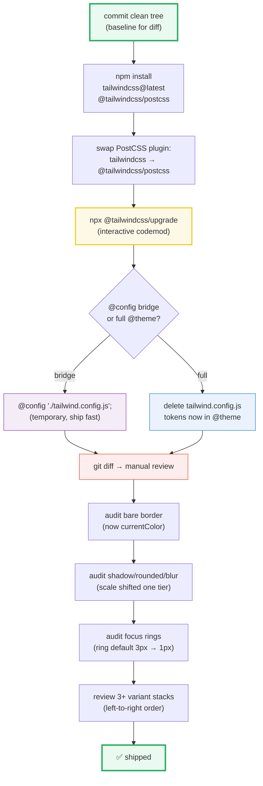

# v3 → v4 Migration

> **Companion demo:** [`v3_migration.html`](./v3_migration.html) — open in a browser.
> **Tailwind version:** v4.x. The HTML page is the rendered ground truth: it
> loads the real v4 Play CDN and proves (via `getComputedStyle()`) that the
> renamed utilities (`bg-linear-to-r`) compile and that the default border color
> is now `currentColor`.
> **The codemod:** `npx @tailwindcss/upgrade` does ~90% of this for you. The
> other 10% is judgment calls the tool can't make — that's what this guide is for.

---

## 0. TL;DR — the one idea

> **v4 is CSS-first.** `tailwind.config.js` shrinks (or vanishes), theme tokens
> move into `@theme {}` in your CSS, the three `@tailwind base/components/utilities`
> directives collapse to a single `@import "tailwindcss";`, ~14 utilities got
> renamed for consistency, the default border color switched from `gray-200` to
> `currentColor`, dark mode moved from a config flag to a `@custom-variant`, the
> `shadow` / `rounded` / `blur` scales shifted down one tier to make room for
> finer-grained small values, and variant stacking now reads left-to-right. Run
> the codemod, review the diff, fix the handful of judgment-call gotchas.



```
/* v3 ─────────────────────────────────────── */
@tailwind base; @tailwind components; @tailwind utilities;
// tailwind.config.js → { theme: { extend: { colors: { brand: "#06b6d4" } } } }

/* v4 ─────────────────────────────────────── */
@import "tailwindcss";
@theme { --color-brand: #06b6d4; }              /* was theme.extend.colors.brand */
@custom-variant dark (&:where(.dark, .dark *)); /* was darkMode: "class"        */
```

---

## 1. The full breaking-changes table

Every change the upgrade touches. "Codemod?" = does `npx @tailwindcss/upgrade`
rewrite this automatically, or do you need to handle it manually?

| # | Area | v3 | v4 | Codemod? | Notes |
|---|---|---|---|---|---|
| 1 | Entry directive | `@tailwind base; @tailwind components; @tailwind utilities;` | `@import "tailwindcss";` | ✓ automatic | single import pulls Preflight + components + utilities |
| 2 | Config file | `tailwind.config.js` (required) | optional — tokens move into `@theme` | ✓ automatic | keep the file via `@config` bridge if you can't migrate everything at once |
| 3 | Theme tokens | `theme.extend.colors.brand = "#06b6d4"` | `@theme { --color-brand: #06b6d4; }` | ✓ automatic | tokens become real CSS custom properties (cascade, runtime-overridable) |
| 4 | Content / source | `content: ["./src/**/*.{html,tsx}"]` | auto-detect + `@source` directive | ✓ automatic | see [source detection](./source_detection.html) |
| 5 | Dark mode | `darkMode: "class"` | `@custom-variant dark (&:where(.dark, .dark *));` | ✓ automatic | default is now `prefers-color-scheme`; add the variant to keep class-toggle |
| 6 | Default border color | `gray-200` | `currentColor` | ⚠ **manual** | codemod does NOT add colors — see gotcha #1 |
| 7 | Gradient utility | `bg-gradient-to-r` | `bg-linear-to-r` | ✓ automatic | new `bg-linear-*` / `bg-radial-*` / `bg-conic-*` family |
| 8 | Flex grow/shrink | `flex-grow` / `flex-shrink` | `grow` / `shrink` | ✓ automatic | shorter; matches CSS property root |
| 9 | Ellipsis | `overflow-ellipsis` | `text-ellipsis` | ✓ automatic | it's a `text-*` property (`text-overflow`) |
| 10 | Decoration clone/slice | `decoration-clone` / `decoration-slice` | `text-decoration-clone` / `text-decoration-slice` | ✓ automatic | matches the `text-decoration-*` family |
| 11 | Shadow scale | `shadow-sm` / `shadow` | `shadow-xs` / `shadow-sm` | ✓ automatic (but visually changes) | scale shifts down one tier to add a new small end |
| 12 | Rounded scale | `rounded-sm` / `rounded` | `rounded-xs` / `rounded-sm` | ✓ automatic (but visually changes) | same scale-shift logic |
| 13 | Blur scale | `blur-sm` etc. | `blur-xs` etc. | ✓ automatic (but visually changes) | same scale-shift logic |
| 14 | Outline none | `outline-none` (transparent 2px outline) | `outline-hidden` (old behavior) / `outline-none` = `outline-style:none` | ✓ automatic | `outline-none` now means what the CSS property name suggests |
| 15 | Ring default width | `ring` = 3px | `ring` = 1px / `ring-3` for old 3px | ✓ automatic | the bare `ring` default got thinner |
| 16 | Slash opacity | `bg-black/50` only | `bg-*/N`, `text-*/N`, `border-*/N`, `ring-*/N`, … | ✓ automatic where paired | works on every color utility now |
| 17 | Variant stacking | right-to-left (innermost-first) | left-to-right (outermost-first) | ⚠ **manual for 3+** | 1- and 2-variant stacks are unchanged |
| 18 | PostCSS plugin | `tailwindcss` | `@tailwindcss/postcss` | ⚠ **manual** | swap in `postcss.config.js` yourself |
| 19 | Browser RTL flip | `rtl:` / `ltr:` work out of the box | opt-in via `@custom-variant` | ⚠ **manual** | if you used RTL, re-add the variant |
| 20 | Plugin loading | `plugins: [require("@tailwindcss/forms")]` | `@plugin "@tailwindcss/forms";` or `@import` | ✓ automatic | JS plugin API still works through the bridge |

---

## 2. The `@config` bridge — ship fast, migrate later

If a full migration is too big for one PR, v4 ships an escape hatch: the
**`@config` directive**. Point it at your old `tailwind.config.js` and every
JS-defined theme token, plugin, and preset continues to work. You get v4's
engine (faster builds, new utilities, the renamed scales) without rewriting
your config today.

```css
/* app.css — bridge mode */
@import "tailwindcss";
@config "./tailwind.config.js";   /* ← legacy config still drives the theme */
```

**What works through the bridge:**
- `theme.extend.*` tokens (colors, fonts, spacing, breakpoints)
- `plugins: [...]` (the JS plugin API)
- `presets: [...]`
- `darkMode`, `content`, `safelist`

**What does NOT work through the bridge:**
- New v4 features that read CSS directly — `@theme inline`, `@utility` (CSS-first
  custom utilities), `@source`, `@custom-variant` — they coexist with the
  bridged config but don't see its tokens
- Runtime CSS-variable access to JS-defined tokens (they aren't emitted as CSS
  custom properties unless you move them into `@theme`)

**The recommended path:** use the bridge to ship the v4 engine upgrade in one
PR, then move tokens into `@theme` in follow-up PRs. Don't stay on the bridge
forever — it's a migration aid, not a permanent home.

---

## 3. The automated upgrade tool

```bash
# 1. commit a clean tree — the codemod edits files in place
git add -A && git commit -m "chore: snapshot before tailwind v4 upgrade"

# 2. install v4 (the postcss plugin is a separate package now)
npm install tailwindcss@latest @tailwindcss/postcss@latest

# 3. swap the PostCSS plugin yourself (the codemod doesn't touch postcss.config.js)
#    postcss.config.js → plugins: { "@tailwindcss/postcss": {} }

# 4. run the codemod
npx @tailwindcss/upgrade
```

**What it does automatically:**
- Rewrites `@tailwind base/components/utilities` → `@import "tailwindcss"`
- Moves `theme.extend.*` tokens into `@theme {}`
- Migrates `content:[]` → auto-detect (or `@source` where overrides existed)
- Rewrites every utility rename (rows 7–16 in the table above)
- Shifts the `shadow` / `rounded` / `blur` scales (renames each tier down one)
- Converts `darkMode: "class"` → `@custom-variant dark (…)`
- Rewrites `outline-none` → `outline-hidden` where it detects the old usage
- Rewrites `ring` → `ring-3` to preserve the old 3px default

**What it does NOT do (the judgment calls):**
- It will not add a color to a bare `border` (it can't tell if `gray-200` was intentional)
- It will not reorder 3+ variant stacks (the stacking-direction change)
- It will not swap your PostCSS plugin in `postcss.config.js`
- It will not migrate custom PostCSS / Vite / webpack wiring outside Tailwind
- It will not catch semantic differences from the shadow/radius scale shift

**After the codemod:**
```bash
git diff                       # review every change
npm run build                  # verify the build still compiles
# spot-check: hero sections, cards, form focus rings, modal borders
```

---

## 4. Manual migration patterns (the 10% the codemod skips)

### 4.1 Bare border → add a color
```html
<!-- v3 habit (renders gray-200) -->
<div class="border p-4 text-cyan-400">…</div>

<!-- v4 (renders cyan — border inherits text color) -->
<div class="border p-4 text-cyan-400">…</div>

<!-- v4 fix: be explicit when the gray mattered -->
<div class="border border-gray-200 p-4 text-cyan-400">…</div>
```
Grep: `rg '\bborder\b(?!-)' src/` to find every unqualified `border`.

### 4.2 Three-plus variant stacks
```html
<!-- v3 (applied right-to-left: md first, then hover, then focus) -->
<a class="focus:hover:md:underline">

<!-- v4 (applied left-to-right: focus first, then hover, then md) -->
<a class="md:hover:focus:underline">
```
Read the v4 order literally: "within `md`, when `hover`ed, when `focus`ed."
Reorder to match the v3 nesting you intended.

### 4.3 PostCSS plugin swap
```js
// postcss.config.js — v3
module.exports = { plugins: { tailwindcss: {}, autoprefixer: {} } }

// postcss.config.js — v4 (autoprefixer is bundled inside @tailwindcss/postcss)
module.exports = { plugins: { "@tailwindcss/postcss": {} } }
```

### 4.4 Vite / webpack / Lightning CSS users
If you use the Vite plugin, swap `@tailwindcss/vite` in (no PostCSS needed).
For Lightning CSS, v4 ships with first-class support — see
[build tooling](./build_tooling.html).

### 4.5 Reacting to the shadow / rounded / blur scale shift
The codemod renames mechanically (`shadow-sm` → `shadow-xs`, `shadow` →
`shadow-sm`). The values are preserved exactly — but if you later add a *new*
`shadow-sm` thinking it's the old small shadow, you'll get the new (smaller)
value. Spot-check after the upgrade; if a card looks flatter than you remember,
bump it one tier up.

---

## 5. Killer Gotchas

| # | Trap | Symptom | Fix |
|---|---|---|---|
| 1 | **Bare `border` is now `currentColor`** | Borders render in the element's text color instead of gray-200; sections look "loud" or borders disappear on dark backgrounds | Grep for `\bborder\b(?!-)` and add `border-gray-200` (or your design's color) where the gray mattered. The codemod will not add it. |
| 2 | **Shadow / rounded / blur scale shifted down one tier** | Cards, buttons, and modals look subtly flatter / less rounded after upgrade | Bump each shadow/radius one tier up (`shadow-sm` → `shadow-md`) to match the old visual weight, or accept the new (smaller) defaults. |
| 3 | **`ring` default dropped from 3px to 1px** | Focus rings look thinner / harder to see; accessibility regression | The codemod rewrites `ring` → `ring-3` to preserve width. Audit focus styles from UI libraries (they may use the bare default). |
| 4 | **`outline-none` changed meaning** | `outline-none` now sets `outline-style: none` (truly no outline) instead of a transparent 2px forced-colors outline | Codemod rewrites to `outline-hidden`. Verify keyboard focus is still visible — don't reach for `outline-none` to "clean up" focus styles. |
| 5 | **3+ variant stacks apply in a different order** | Rare `focus:hover:md:` selectors behave differently; usually invisible until a specific interaction | Reorder to literal nesting order. 1- and 2-variant stacks are unaffected. |
| 6 | **`darkMode: 'class'` silently became `prefers-color-scheme`** | Dark mode only triggers when the OS is in dark mode, not when `.dark` is toggled | Add `@custom-variant dark (&:where(.dark, .dark *));` to your CSS. The codemod does this automatically — but verify if you skipped it. |
| 7 | **`content:[]` is gone — auto-detect may miss gitignored packages** | Custom UI library in `node_modules` loses its styles after upgrade | Add `@source "../node_modules/@your-lib";`. See [source detection](./source_detection.html). |
| 8 | **PostCSS plugin name changed** | Build fails with "Unknown at rule @tailwind" or "Cannot find module 'tailwindcss'" in postcss pipeline | Swap `tailwindcss` → `@tailwindcss/postcss` in `postcss.config.js`. |
| 9 | **`@config` bridge hides new features** | `@theme inline`, `@utility`, `@custom-variant` don't see JS-defined tokens while bridging | Move tokens into `@theme` to unlock the new APIs. Use the bridge to ship fast, not forever. |
| 10 | **Forced-colors mode + `outline-none`** | In Windows high-contrast mode, focus disappears because the transparent outline is gone | Use `outline-hidden` (preserves the forced-colors outline) instead of `outline-none`. |

---

## 6. Cheat sheet

| Intent | v3 | v4 |
|---|---|---|
| import Tailwind | `@tailwind base; @tailwind components; @tailwind utilities;` | `@import "tailwindcss";` |
| define a brand color | `theme.extend.colors.brand = "#06b6d4"` | `@theme { --color-brand: #06b6d4; }` |
| class-based dark mode | `darkMode: "class"` | `@custom-variant dark (&:where(.dark, .dark *));` |
| scan extra paths | `content: ["./src/**/*"]` | `@source "../src";` (or rely on auto-detect) |
| safelist | `safelist: ["bg-red-500"]` | `@source inline("bg-red-500");` |
| linear gradient | `bg-gradient-to-r from-cyan-400 to-blue-500` | `bg-linear-to-r from-cyan-400 to-blue-500` |
| grow / shrink | `flex-grow` / `flex-shrink` | `grow` / `shrink` |
| 50% opacity | `text-black opacity-50` | `text-black/50` |
| visible 3px focus ring | `ring` | `ring-3` |
| small shadow | `shadow-sm` | `shadow-xs` (or `shadow-sm` for the new small) |
| keep a legacy config | (n/a) | `@config "./tailwind.config.js";` |
| PostCSS plugin | `tailwindcss` | `@tailwindcss/postcss` |
| load a plugin | `plugins: [require("@tailwindcss/forms")]` | `@plugin "@tailwindcss/forms";` |

---

## 7. Minimal worked example — full migration

```css
/* ═════════════════════════════════════════════════════════════════════
   BEFORE — v3 (app.css + tailwind.config.js)
   ═════════════════════════════════════════════════════════════════════ */
@tailwind base;
@tailwind components;
@tailwind utilities;
/* tailwind.config.js:
   module.exports = {
     content: ["./src/**/*.{html,tsx}"],
     darkMode: "class",
     theme: { extend: { colors: { brand: "#06b6d4" },
                        fontFamily: { sans: ["Inter", "sans-serif"] } } },
     plugins: [require("@tailwindcss/forms")]
   };
*/

/* ═════════════════════════════════════════════════════════════════════
   AFTER — v4 (app.css only; delete tailwind.config.js)
   ═════════════════════════════════════════════════════════════════════ */
@import "tailwindcss";
@plugin "@tailwindcss/forms";                          /* was plugins:[]   */

@theme {
  --color-brand: #06b6d4;                              /* was colors.brand */
  --font-sans: "Inter", sans-serif;                    /* was fontFamily   */
}

@custom-variant dark (&:where(.dark, .dark *));        /* was darkMode     */
/* content:[] is GONE — auto-detect handles ./src/**/*.{html,tsx} for you */
```

```html
<!-- markup changes (codemod handles these automatically) -->
<!-- v3 -->  <div class="bg-gradient-to-r from-cyan-400 to-blue-500 flex-grow ring">
<!-- v4 -->  <div class="bg-linear-to-r   from-cyan-400 to-blue-500 grow      ring-3">

<!-- markup that needs MANUAL review -->
<!-- v3 -->  <div class="border p-4 text-cyan-400">
<!-- v4 -->  <div class="border border-gray-200 p-4 text-cyan-400">  <!-- explicit color -->
```

---

## 🔗 Cross-references

- [**source detection**](./SOURCE_DETECTION.md) — the v3 `content:[]` → v4
  `@source` + auto-detect migration in depth.
- [**build tooling**](./build_tooling.html) — PostCSS plugin swap, the Vite
  plugin, and Lightning CSS first-class support in v4.
- [**preflight & reset**](./preflight_reset.html) — Preflight v4 ships with
  this migration; default styles changed (notably the border default).
- [**production optimization**](./production_optimization.html) — v4's smaller
  default CSS footprint; tree-shaking the unused utilities.
- [**multi-theme**](./MULTI_THEME.md) — multi-color-scheme setups using the
  new `@custom-variant` directive that replaced `darkMode`.
- [**gradients v4**](./GRADIENTS_V4.md) — the renamed `bg-linear-*` /
  `bg-radial-*` / `bg-conic-*` family in depth.
- Companion in the frontend onboarding section:
  [frontend/tailwind: customization](/frontend/tailwind/tailwind_customization.html) —
  the v4 onboarding view of `@theme`.

---

## Sources

- [Tailwind CSS — Upgrade Guide](https://tailwindcss.com/docs/upgrade-guide) —
  official v3 → v4 migration guide (breaking changes, renamed utilities, the
  `@config` bridge). Tailwind team. Verified 2026-06.
- [Tailwind CSS — Installation](https://tailwindcss.com/docs/installation) —
  the PostCSS / Vite / CLI / Play CDN setup that replaces the v3 entry
  directives. Verified 2026-06.
- [Tailwind Labs blog — Tailwind CSS v4.0](https://tailwindcss.com/blog/tailwindcss-v4) —
  the release post explaining the CSS-first architecture, the renamed utility
  rationale, and the scale-shift decision. Verified 2026-06.
- [GitHub — tailwindlabs/tailwindcss](https://github.com/tailwindlabs/tailwindcss) —
  the `@tailwindcss/upgrade` codemod source and changelog. Verified 2026-06.
