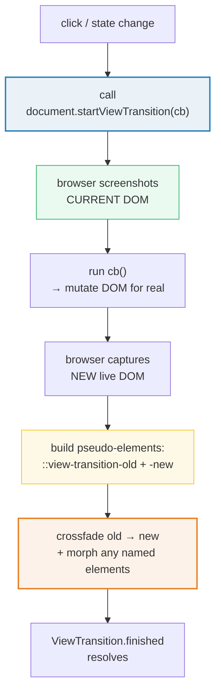
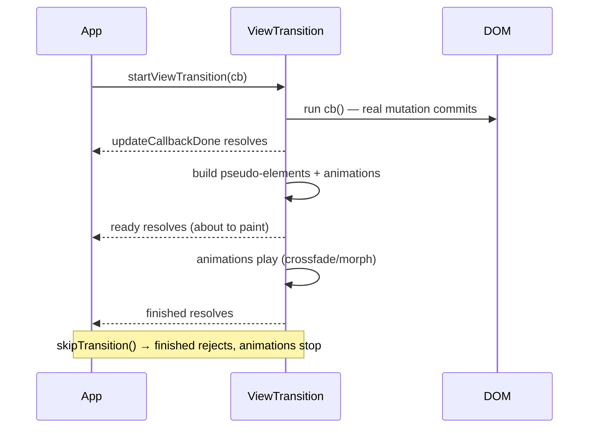

# View Transitions API with Tailwind

> **Companion demo:** [`view_transitions_tw.html`](./view_transitions_tw.html) — open in a browser.
> Renders a list↔detail crossfade + a named hero morph live via the Play CDN,
> with a `document.styleSheets` gold-check that scans for `view-transition` CSS.

---

## 0. TL;DR — the one idea

`document.startViewTransition(callback)` is a **browser primitive** that
screenshots the current DOM, runs your callback (where you mutate the DOM),
then crossfades the screenshot into the new live DOM. You get a smooth visual
transition for free — no JS animation library, no manual FLIP math. The default
is a whole-page crossfade; tag an element with `view-transition-name` and the
browser **morphs** it between its old and new box (a hero animation). Tailwind
styles the surrounding UI; the transition itself is a handful of CSS
pseudo-elements.



---

## 1. How it works — the lifecycle

Three phases happen every time you call `startViewTransition`:

1. **Snapshot.** The browser takes a pixel capture of the current page (the
   "old" state) and hides the live tree behind a root overlay.
2. **Mutate.** Your callback runs and commits the real DOM change (toggle a
   class, swap `hidden`, replace `innerHTML`). The DOM, layout, and
   accessibility tree update for real — the screenshot is purely visual.
3. **Crossfade / morph.** The browser builds `::view-transition-old(root)`
   (the snapshot) and `::view-transition-new(root)` (the new live tree) and
   animates between them. Any element carrying a `view-transition-name` gets
   its own `::view-transition-group(name)` wrapper that morphs position + size.

```js
// Wrap ANY DOM mutation. Default = whole-page crossfade.
function swap(fn) {
  if (document.startViewTransition) {       // feature-detect (Firefox = flag)
    return document.startViewTransition(fn); // returns a ViewTransition object
  }
  fn();                                      // fallback: instant, no animation
}

swap(() => {
  list.hidden = true;
  detail.hidden = false;   // the real DOM update
});
```

The returned `ViewTransition` object exposes three promises:



| promise | resolves when | use it for |
|---|---|---|
| `updateCallbackDone` | your callback's DOM mutation commits | reacting to the *real* state change (not the visual) |
| `ready` | pseudo-elements built, animations about to start | chaining JS onto the visual start |
| `finished` | the animations complete | cleanup, re-enabling interaction |

Call `transition.skipTransition()` to bail out — `finished` then **rejects**
(so always `.catch()` it).

---

## 2. The `startViewTransition` mechanism — what Tailwind does and doesn't do

Tailwind v4 is irrelevant to the *core* API: `startViewTransition` is pure
browser + JS, and the pseudo-elements are plain CSS that lives in any
stylesheet. Where Tailwind fits in:

- **Styling the chrome** (cards, panels, buttons) — that's just normal utilities.
- **Opting elements into named transitions** via an **arbitrary property**:
  `[view-transition-name:hero]` compiles to `view-transition-name: hero;`.
- **Reduced-motion guards** via the `motion-safe:` / `motion-reduce:`
  variants so you don't animate against a user's OS preference.

```html
<!-- Arbitrary property: the Tailwind-native way to name an element -->
<div class="[view-transition-name:hero] bg-cyan-500 rounded-lg">
  I morph between layouts
</div>
```

```css
/* The pseudo-element rules are plain CSS (Tailwind can't generate :: pseudo-els
   from a utility, so put them in your stylesheet / @layer): */
::view-transition-old(root) { animation: vt-fade-out .25s ease forwards; }
::view-transition-new(root) { animation: vt-fade-in  .25s ease forwards; }
::view-transition-group(hero) { animation-duration: .5s; }
```

> The demo's `<style>` block defines these rules directly (the cleanest place
> for `::view-transition-*` selectors). The gold-check scans
> `document.styleSheets` to prove they landed.

### Named elements — the hero morph

The magic of `view-transition-name` is that the browser matches the element
across the old/new boundary. The element must:

- exist in **both** states with the **same** name, and
- be **unique** per document at transition time (two elements sharing a name
  skip the morph and fall back to the root crossfade for that name).

When those hold, you write **zero transform math** — the browser interpolates
`top/left/width/height` on `::view-transition-group(name)` automatically.

---

## 3. Killer Gotchas

| trap | symptom | fix |
|---|---|---|
| **No feature-detect** | Firefox users get a `TypeError` — `startViewTransition` is `undefined` | `if (document.startViewTransition) … else fn()` |
| **Duplicate `view-transition-name`** | the named morph silently disappears; you get a root crossfade instead | ensure the name is unique per document at the moment the transition runs |
| **Name present in only one state** | no morph — element just appears with the root crossfade | the element (or a logical twin) must carry the name in both old and new DOM |
| **Mutating outside the callback** | change happens but isn't part of the snapshot — flicker / no anim | put the DOM mutation **inside** the `startViewTransition(cb)` callback |
| **Async callback** | transition starts before your `await` resolves; snapshot is stale | return a Promise from `cb` — `startViewTransition` awaits it before snapshotting the new state |
| **`finished` rejecting** | unhandled promise rejection if `skipTransition()` fires | always `.catch()` `transition.finished` |
| **Reduced motion ignored** | motion-sensitive users get full animation | gate with `@media (prefers-reduced-motion: reduce) { ::view-transition-* { animation: none } }` (or `motion-reduce:` in Tailwind-land) |
| **Hidden elements with a name** | `display:none` element with a name never participates — no old box to morph from | only name elements that are visible in the state being snapshotted |
| **Same-document vs cross-document** | `startViewTransition` is same-document only; MPA transitions need the `@view-transition` CSS rule + different browsers | use the JS API for SPA/React; use `@view-transition { navigation: auto }` for full page-to-page (Chrome only) |

---

## Cheat sheet

```css
/* 1 · default whole-page crossfade (override the built-in one) */
::view-transition-old(root) { animation: fade-out .25s ease forwards; }
::view-transition-new(root) { animation: fade-in  .25s ease forwards; }

/* 2 · name an element so it morphs instead of crossfading */
.hero { view-transition-name: hero; }        /* or Tailwind: [view-transition-name:hero] */
::view-transition-group(hero) { animation-duration: .5s; }
::view-transition-old(hero)  { animation: slide-out-left  .3s ease forwards; }
::view-transition-new(hero)  { animation: slide-in-right  .3s ease forwards; }

/* 3 · respect reduced motion */
@media (prefers-reduced-motion: reduce) {
  ::view-transition-old(*), ::view-transition-new(*) { animation: none !important; }
}
```

```js
// 4 · the trigger (always feature-detect)
function swap(fn) {
  if (!document.startViewTransition) return fn();        // Firefox fallback
  const t = document.startViewTransition(fn);            // fn mutates the DOM
  t.finished.catch(() => {});                            // skipTransition-safe
  return t;
}

// 5 · async mutation — return a promise from the callback
swap(() => fetch(url).then(r => r.json()).then(data => {
  el.textContent = data.value;                           // awaited before snapshot
});

// 6 · bail out early
const t = document.startViewTransition(() => toggle());
if (shouldCancel) t.skipTransition();                    // finished rejects
```

| intent | pattern |
|---|---|
| crossfade two views | wrap `hidden` toggle in `startViewTransition` |
| morph an element between layouts | `view-transition-name` on a persistent element + toggle its box |
| custom direction (slide not fade) | replace the `::view-transition-old/new` keyframes |
| stagger multiple named elements | give each a distinct `view-transition-name` + per-name duration |
| SPA page transitions | wrap the router's render fn |
| MPA (full reload) transitions | `@view-transition { navigation: auto }` (Chrome 126+) |

---

## 🔗 Cross-references

- **[`/react/view_transitions.html`](../react/view_transitions.html)** — the same
  API in a React context: wrap `setState` in `startViewTransition` and the React
  commit becomes the transitioned state. This page is the raw-browser-API twin.
- **[`scroll_driven.html`](./scroll_driven.html)** — scroll-driven animations
  (`animation-timeline: scroll()`). Pair with view transitions for
  scroll-triggered page morphs.
- **[`transitions_timing.html`](./transitions_timing.html)** — the `transition-*`
  + `ease-*` / `duration-*` utilities that style the *easing* you'll want inside
  `::view-transition-group` timing functions.
- **[`starting_style.html`](./starting_style.html)** — `@starting-style` for
  animating an element's *first* appearance; complementary to view transitions
  (which animate *between* states).
- **[`keyframes_animate.html`](./keyframes_animate.html)** — the `--animate-*`
  namespace; the `@keyframes` you reference from `::view-transition-old/new` are
  defined the same way.

---

## Sources

- **MDN — View Transition API:** <https://developer.mozilla.org/en-US/docs/Web/API/View_Transition_API>
  (API surface, pseudo-elements, `ViewTransition` promise lifecycle, same-document
  vs cross-document).
- **Chrome Developers — Smooth transitions with the View Transition API:**
  <https://developer.chrome.com/docs/web-platform/view-transitions> (the reference
  explainer; same-document + MPA navigation transitions).
- **Can I use — View Transitions API:** <https://caniuse.com/?search=view%20transition%20api>
  (support matrix: Chrome/Edge 111+, Safari 18+, Firefox flag-only → Baseline
  Newly Available 2024).
