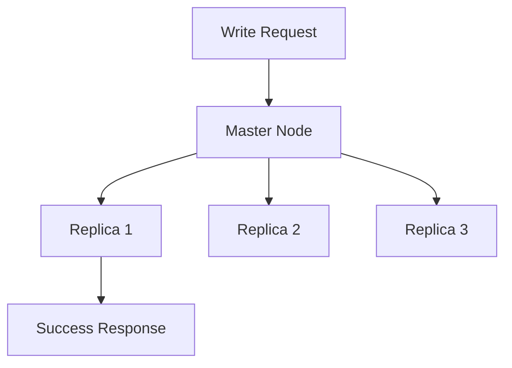

# Key Abstractions: The Building Blocks of Memory Speed

## The Desk vs. Filing Cabinet Mental Model

Before diving into technical abstractions, let's establish a powerful mental model that explains why in-memory storage is fundamentally different.

**Traditional Storage = Filing Cabinet**
- Vast capacity, organized filing system
- Finding a specific document requires walking to the cabinet, opening the right drawer, searching through folders
- Sequential access: you can only look at one file at a time
- Shared resource: only one person can access it efficiently at once

**In-Memory Storage = Working Desk**
- Limited space, but everything is immediately accessible
- Any document can be grabbed instantly without walking anywhere
- Parallel access: multiple people can grab different documents simultaneously
- Everything important is spread out and ready to use

This analogy helps explain why in-memory systems are faster but have capacity limits, and why the data structures we choose matter so much.

## Core Abstraction 1: The Key-Value Store

The fundamental building block of in-memory storage is the key-value store—a simple but powerful abstraction.

### What It Is
```
Key (String) → Value (Any Data Type)
"user:12345" → { name: "Alice", email: "alice@example.com" }
"cache:latest_posts" → ["post1", "post2", "post3"]
"counter:page_views" → 42
```

### Why It Works in Memory
- **O(1) access time** through hash tables
- **No schema overhead**—store any type of value
- **Atomic operations**—increment, set, delete happen instantly
- **Memory-efficient** when you control key naming

### The Power of Simplicity
This abstraction is deceptively simple but incredibly powerful. Complex data models can be built on top of key-value pairs, but the underlying access pattern remains constant: give me a key, get back a value, instantly.

## Core Abstraction 2: Data Structure Specialization

In-memory systems excel because they can use specialized data structures optimized for memory access patterns.

### Hash Tables: The Speed Demon
```mermaid
graph LR
    A[Key: "user:123"] --> B[Hash Function]
    B --> C[Memory Address]
    C --> D[Value: User Data]
```

- **Constant time access** O(1) for get/set operations
- **Memory-friendly** when load factor is controlled
- **Cache-efficient** with good hash distribution

### Arrays: The Sequential Speedster
When data has natural ordering (time series, rankings, lists), arrays provide unbeatable performance:
- **CPU cache-friendly** sequential access
- **Predictable memory layout** enables optimization
- **Bulk operations** can be vectorized

### Skip Lists: The Concurrent Compromise
For ordered data with concurrent access:
- **Logarithmic time** O(log n) but still fast in practice
- **Lock-free implementations** possible
- **Range queries** supported efficiently

## Core Abstraction 3: The Working Set Principle

Not all data is created equal. In-memory systems are built around the concept of the **working set**—the subset of data that's actively being used.

### The 80/20 Rule in Practice
- 80% of queries touch 20% of the data
- Keep that 20% in memory, let the rest live on disk
- Use intelligent caching to identify the working set

### Working Set Patterns
```
Hot Data (Memory):     Warm Data (SSD):      Cold Data (Archive):
- Active user sessions - Recent transactions  - Historical logs
- Current metrics      - Yesterday's data     - Old backups  
- Live configurations  - Last week's reports  - Audit trails
```

## Core Abstraction 4: The Expiration Model

Memory is finite, so in-memory systems embrace data that expires naturally.

### Time-Based Expiration (TTL)
```
SET cache:expensive_computation "result" EX 3600  # Expires in 1 hour
SET session:user123 "session_data" EX 1800        # Expires in 30 minutes
```

### Usage-Based Expiration (LRU)
When memory fills up, evict the **Least Recently Used** data first.
- Maintains a working set automatically
- Adapts to changing access patterns
- Balances memory usage with performance

### The Beautiful Side Effect
Data that expires naturally aligns perfectly with many real-world use cases:
- Session data becomes stale
- Cache entries lose relevance
- Temporary computations are short-lived

## Core Abstraction 5: The Atomic Operation

In-memory systems can offer atomic operations that would be expensive on disk.

### Compare-and-Swap
```
INCR page_views        # Atomically increment counter
LPUSH recent_orders    # Atomically add to list head
SADD unique_visitors   # Atomically add to set
```

### Why This Matters
- **No locks needed** for simple operations
- **Consistent state** even under high concurrency
- **Building block** for complex distributed algorithms

## Core Abstraction 6: The Replication Strategy

Since memory is volatile, in-memory systems often use replication rather than traditional persistence.

### Master-Replica Pattern


### Why This Works
- **Faster than disk writes** because it's all memory-to-memory
- **Higher availability** than single-node disk systems
- **Eventual consistency** is often acceptable for speed gains

## Putting It All Together

These abstractions work together to create systems that are:

1. **Fast** because everything is in memory
2. **Simple** because the key-value model is universal
3. **Reliable** through replication instead of disk persistence
4. **Efficient** by focusing on working sets and natural expiration

Understanding these abstractions helps explain why Redis can handle 100,000+ operations per second, why Memcached is so effective for web application caching, and why in-memory analytics can process queries in milliseconds rather than minutes.

The beauty is in the coherence: each abstraction reinforces the others to create a system optimized for one thing—speed.