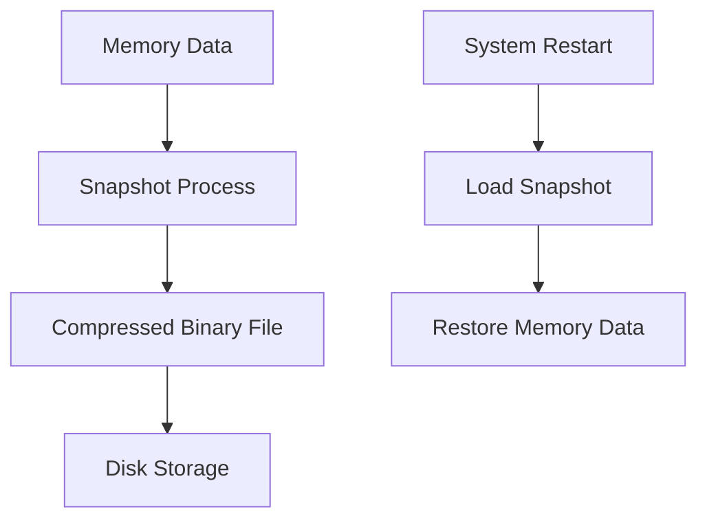
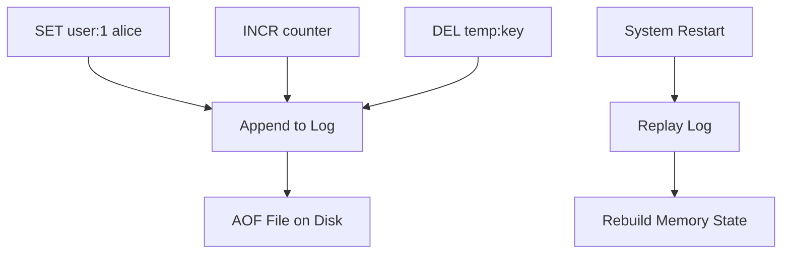
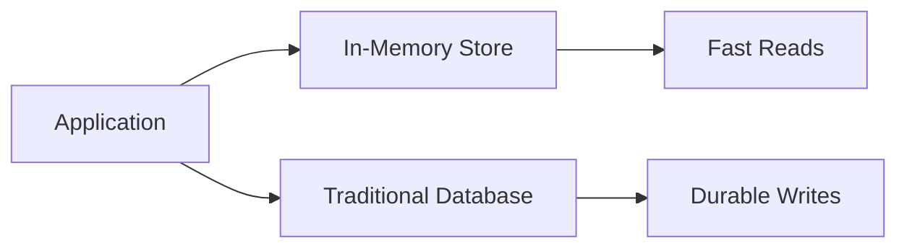
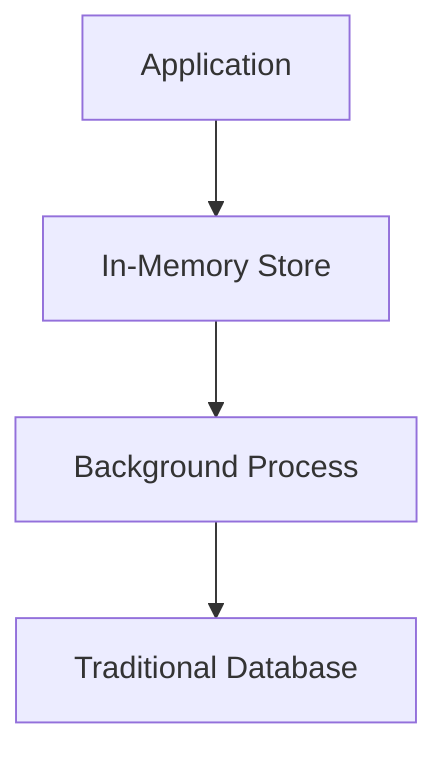
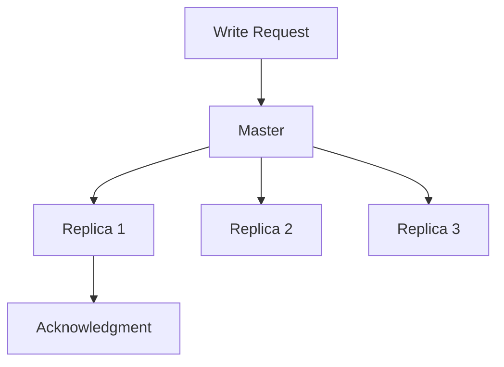

# The Persistence Problem: When the Power Goes Out

## The Fundamental Tension

In-memory storage gives us incredible speed, but it introduces a sobering reality: **when the power goes out, your data vanishes**. This isn't a bug—it's the fundamental trade-off. Memory is volatile by design.

But here's the thing: many applications can tolerate some data loss in exchange for massive performance gains. The key is understanding when and how to add persistence back into the equation.

## The Spectrum of Data Durability Needs

Not all data is created equal when it comes to durability requirements:

### Data You Can Afford to Lose
- **Cache entries**: Can be regenerated from source data
- **Session data**: Users can log in again
- **Temporary computations**: Can be recalculated
- **Real-time metrics**: Losing a few data points won't break analytics

### Data You Cannot Afford to Lose
- **Financial transactions**: Money must never disappear
- **User accounts**: Registration data is irreplaceable
- **Critical business events**: Order confirmations, payments
- **Legal audit trails**: Compliance requires permanence

## Strategy 1: Snapshots (RDB)

Think of snapshots like taking a photograph of your entire dataset at regular intervals.

### How It Works


### The Process
1. **Fork the process**: Create a copy-on-write snapshot
2. **Serialize data**: Convert memory structures to disk format
3. **Compress and write**: Save to disk efficiently
4. **Continue operations**: Original process keeps serving requests

### Redis Example
```bash
# Configure snapshots in redis.conf
save 900 1      # Save if at least 1 key changes in 900 seconds
save 300 10     # Save if at least 10 keys change in 300 seconds  
save 60 10000   # Save if at least 10000 keys change in 60 seconds

# Manual snapshot
127.0.0.1:6379> BGSAVE
Background saving started
```

### Trade-offs
**Pros:**
- Compact storage format
- Fast startup (single file to load)
- Low runtime overhead

**Cons:**
- Can lose data between snapshots
- Memory usage spikes during snapshot creation
- Recovery time depends on dataset size

## Strategy 2: Append-Only File (AOF)

Think of AOF like keeping a detailed journal of every operation performed.

### How It Works


### The Process
1. **Log every write**: Record each operation as it happens
2. **Append to file**: Add to the end of the log file
3. **Sync to disk**: Force write to ensure durability
4. **Replay on restart**: Execute all logged operations to rebuild state

### Redis Example
```bash
# Enable AOF in redis.conf
appendonly yes
appendfilename "appendonly.aof"

# Sync policies
appendfsync always    # Sync after every command (safest, slowest)
appendfsync everysec  # Sync every second (good compromise)
appendfsync no        # Let OS decide when to sync (fastest, riskiest)
```

### AOF Rewrite
Over time, the AOF file grows large because it logs every operation. Redis can compact it:

```bash
127.0.0.1:6379> BGREWRITEAOF
Background append only file rewriting started
```

This rewrites the AOF file to contain only the minimal set of operations needed to reconstruct the current state.

### Trade-offs
**Pros:**
- Maximum durability (can lose at most 1 second of data)
- Human-readable log format
- Can replay partial failures

**Cons:**
- Larger file sizes than snapshots
- Slower restart times (must replay entire log)
- Write performance impact

## Strategy 3: Hybrid Approaches

Modern systems often combine both strategies to get the best of both worlds.

### Redis Hybrid Persistence
```bash
# Use both RDB and AOF
save 900 1
appendonly yes
appendfsync everysec
```

**Recovery process:**
1. If AOF exists, use it (more complete data)
2. If only RDB exists, use that
3. If both exist, AOF takes precedence

### The Sweet Spot
- **RDB for fast restarts**: Quick bulk recovery
- **AOF for durability**: Minimize data loss
- **AOF rewrite for efficiency**: Keep log files manageable

## Strategy 4: External Persistence

Sometimes the best approach is to handle persistence outside the in-memory store.

### Write-Through Pattern


**Implementation:**
```python
def save_user(user_id, data):
    # Write to both systems
    redis.set(f"user:{user_id}", json.dumps(data))
    database.save_user(user_id, data)

def get_user(user_id):
    # Try cache first
    cached = redis.get(f"user:{user_id}")
    if cached:
        return json.loads(cached)
    
    # Fall back to database
    user_data = database.get_user(user_id)
    redis.set(f"user:{user_id}", json.dumps(user_data), ex=3600)
    return user_data
```

### Write-Behind Pattern


**Benefits:**
- Fast writes (no disk I/O in critical path)
- Bulk operations to database
- Can batch and optimize writes

**Risks:**
- Potential data loss if cache fails before background sync
- Complex consistency guarantees

## Strategy 5: Replication as Persistence

Instead of writing to disk, write to other memory stores.

### Master-Replica Setup


**Why This Works:**
- Multiple independent failure points
- Faster than disk writes (memory-to-memory over network)
- Can tolerate individual node failures
- Geographic distribution possible

### Redis Replication
```bash
# On master (redis.conf)
bind 0.0.0.0
port 6379

# On replica (redis.conf)  
replicaof 192.168.1.100 6379
replica-read-only yes
```

## Choosing the Right Strategy

### High-Performance Caching
- **Use**: No persistence or periodic snapshots
- **Rationale**: Data can be regenerated, speed is everything

### Session Storage
- **Use**: AOF with `appendfsync everysec`
- **Rationale**: User experience matters, losing sessions is annoying

### Financial Systems
- **Use**: AOF with `appendfsync always` + replication
- **Rationale**: Cannot afford any data loss

### Analytics/Metrics
- **Use**: Periodic snapshots + write-behind to data warehouse
- **Rationale**: Some data loss acceptable, bulk operations efficient

## The Modern Reality

Today's persistence strategies acknowledge that different data has different durability requirements:

1. **Hot data** stays in memory for speed
2. **Warm data** gets persisted with balanced trade-offs
3. **Cold data** lives in traditional storage

The key insight is that persistence doesn't have to be all-or-nothing. You can add exactly as much durability as your use case requires, paying only the performance cost that's justified by your business needs.

Understanding these persistence strategies helps you design systems that are both blazingly fast and appropriately durable. The goal isn't perfect persistence—it's optimal persistence for your specific requirements.