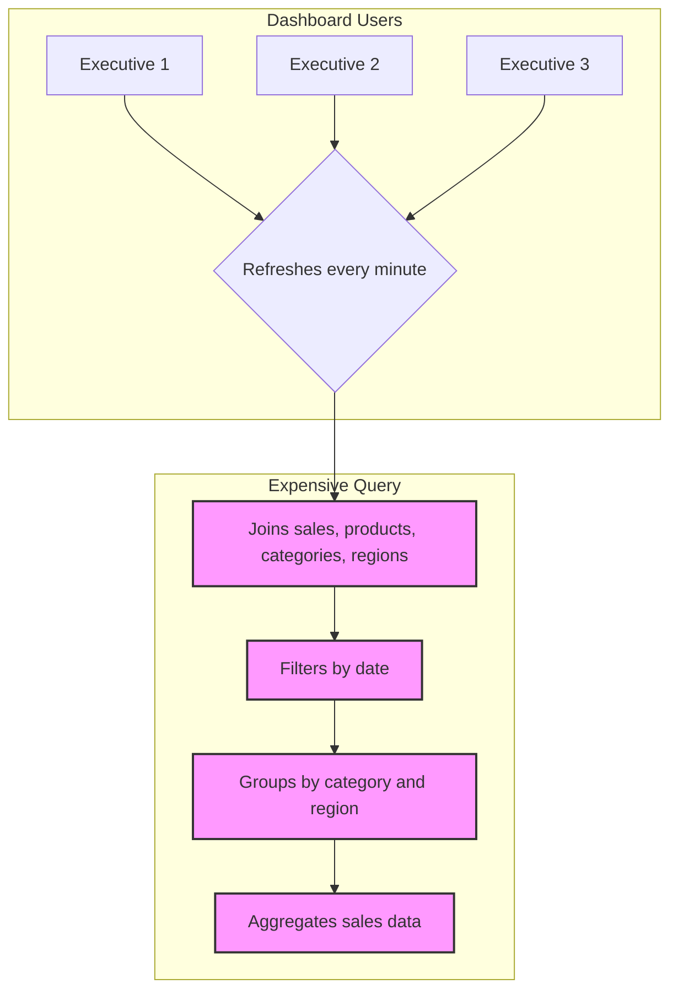

# The Core Problem: The High Cost of Repetitive, Complex Queries

Imagine you're running a large e-commerce platform. Your CEO wants a real-time dashboard that shows the total sales revenue, broken down by product category and region, for the last 30 days.

To get this data, you'd need to write a complex SQL query that performs several intensive operations.

This query is computationally expensive. It might take several seconds, or even minutes, to run on a large dataset.

Now, imagine that this dashboard is being viewed by dozens of executives, and it refreshes every minute. Each refresh triggers the same expensive query. This leads to several significant problems:

*   **High Database Load:** The database is constantly strained, which can slow down other critical operations, like processing customer orders.
*   **Slow User Experience:** The dashboard users have to wait for the query to finish, making the application feel sluggish.
*   **Wasted Resources:** You're repeatedly performing the exact same computation, which is incredibly inefficient.

This is the core problem that materialized views are designed to solve. **How can we provide fast access to the results of complex, expensive queries without running them over and over again?**
