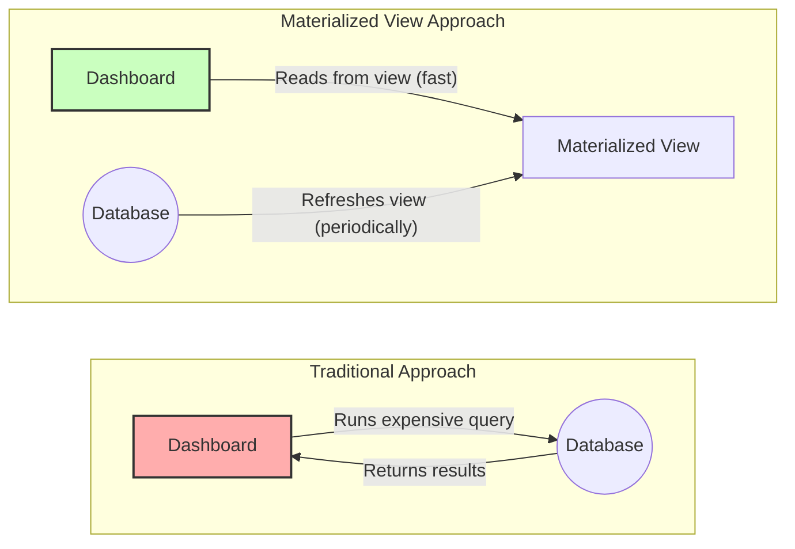

# The Guiding Philosophy: Compute Once, Read Many Times

The philosophy behind materialized views is simple yet powerful: **"Compute once, read many times."**

Instead of re-running a complex query every time the data is needed, a materialized view pre-calculates the results and stores them as a physical table in the database. This "materialized" table holds the exact data that the query would otherwise generate.

When an application needs the data, it doesn't run the original, expensive query. Instead, it simply queries the materialized view, which is as fast and efficient as querying any other simple table.

## The Box Score Analogy

Think of a baseball game. The game itself is a long, complex event with hundreds of individual plays (the raw data).

*   **The Complex Query:** Watching the entire 3-hour game from start to finish to determine the final score and key statistics.
*   **The Materialized View:** Looking at the final **box score**.

The box score is a pre-calculated summary of the game. It gives you all the important results—runs, hits, errors—without you having to re-watch every play. It's computed once at the end of the game and then can be read by thousands of fans instantly.

A materialized view works the same way. It's a pre-computed snapshot of your data, optimized for fast read access. The trade-off, of course, is that the data might not be perfectly up-to-the-minute, just as the box score isn't updated in real-time during the game. This leads to the central trade-off of materialized views: **freshness vs. performance**.
