# Key Abstractions

A Merkle tree has three fundamental components that work together to create an efficient verification system. Understanding these abstractions is crucial to grasping how the entire structure operates.

## 1. Leaves: The Data Blocks

**Leaves** are the bottom-most nodes of the tree, each containing the hash of an actual data block.

```
Data Block A → Hash(A) = 0x7a3f... [Leaf]
Data Block B → Hash(B) = 0x9c2e... [Leaf]  
Data Block C → Hash(C) = 0x1b8d... [Leaf]
Data Block D → Hash(D) = 0x4f91... [Leaf]
```

Key characteristics:
- Each leaf represents exactly one data block
- The leaf stores the hash, not the original data
- The hash function is typically cryptographic (SHA-256, SHA-3, etc.)
- All leaves are at the same level (complete tree structure)

## 2. Internal Nodes: The Hash Combinators

**Internal nodes** contain hashes of their children's hashes. Each internal node combines exactly two child hashes into one parent hash.

```
                Root
               /    \
         Node AB    Node CD
         /    \      /    \
    Leaf A  Leaf B Leaf C Leaf D
```

Where:
- `Node AB = Hash(Leaf A + Leaf B)`
- `Node CD = Hash(Leaf C + Leaf D)`  
- `Root = Hash(Node AB + Node CD)`

The combining operation is typically concatenation followed by hashing:
```
Hash(left_child || right_child)
```

## 3. Merkle Root: The Universal Fingerprint

The **Merkle Root** is the single hash at the top of the tree that represents the entire dataset. This is the "fingerprint" that can be quickly compared between systems.

Properties of the Merkle Root:
- **Deterministic**: Same data always produces the same root
- **Avalanche effect**: Any change in data dramatically changes the root
- **Compact**: Fixed size regardless of dataset size (e.g., 32 bytes for SHA-256)
- **Verifiable**: Can prove any data block belongs to this root

## The Payroll Analogy

Think of a company's organizational structure for verifying payroll:

```
                CEO (Total: $1.2M)
               /              \
        VP Engineering      VP Sales  
        (Total: $800K)      (Total: $400K)
         /        \           /        \
    Team Lead A  Team Lead B Team Lead C Team Lead D
    ($200K)      ($600K)     ($150K)    ($250K)
     /   \        /   \       /   \      /   \
   Emp1 Emp2   Emp3 Emp4   Emp5 Emp6  Emp7 Emp8
```

- **Employees (Leaves)**: Individual salary amounts
- **Team Leads/VPs (Internal Nodes)**: Sum of their reports' salaries  
- **CEO (Root)**: Total company payroll

### Verification Process

When the CEO wants to verify the total payroll:

1. **Quick Check**: Compare the total with expected amount
2. **Drill Down**: If totals don't match, ask VPs for their subtotals
3. **Narrow Search**: Find which VP's numbers are wrong
4. **Pinpoint Issue**: Continue down until you find the incorrect salary

This mirrors how Merkle trees work:
1. **Root Comparison**: Compare Merkle roots between systems
2. **Subtree Exploration**: If roots differ, compare intermediate nodes
3. **Binary Search**: Navigate to the differing subtrees
4. **Leaf Identification**: Find the exact data blocks that differ

## Authentication Path: The Proof Chain

An **authentication path** is the sequence of hashes needed to verify that a specific data block belongs to a given Merkle root.

For data block A in our 4-block tree:
```
Authentication Path = [Hash(B), Hash(CD)]
```

To verify block A:
1. Compute `Hash(A)`
2. Combine with `Hash(B)` to get `Hash(AB)`
3. Combine `Hash(AB)` with `Hash(CD)` to get root
4. Compare computed root with known root

This path has length O(log n), making verification extremely efficient even for massive datasets.

## Visual Summary

```mermaid
graph TD
    Root["🏆 Merkle Root<br/>Universal Fingerprint"]
    AB["🔗 Hash(A+B)<br/>Internal Node"]
    CD["🔗 Hash(C+D)<br/>Internal Node"]
    A["📄 Hash(Data A)<br/>Leaf"]
    B["📄 Hash(Data B)<br/>Leaf"]
    C["📄 Hash(Data C)<br/>Leaf"]
    D["📄 Hash(Data D)<br/>Leaf"]
    
    Root --> AB
    Root --> CD
    AB --> A
    AB --> B
    CD --> C
    CD --> D
```



These three abstractions—leaves, internal nodes, and the Merkle root—work together to transform the complex problem of large-scale data verification into a simple, efficient tree traversal operation.