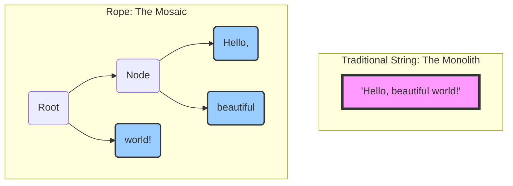

# The Guiding Philosophy: Divide and Conquer

The slowness of large string manipulation comes from treating the string as a single, monolithic entity. The guiding philosophy of the **Rope** data structure is to abandon this idea and embrace a "divide and conquer" strategy. Instead of one long string, we break it into many smaller, manageable pieces.

A Rope is a **binary tree** where each leaf node holds a small, immutable snippet of the text. The internal nodes of the tree don't store text themselves; they simply describe how the pieces are concatenated together.

### From Monolith to Mosaic

Let's visualize the difference in approach.

Here’s the core idea:

1.  **Break It Down:** A long string is split into smaller, fixed-size substrings. These become the leaves of our tree. For example, the string "Hello, beautiful world!" might be broken into "Hello, ", "beautiful ", and "world!".

2.  **Structure, Don't Copy:** When we want to combine or modify the text, we don't move the text itself. Instead, we build a new tree structure *around* the existing leaf nodes.
    *   **Concatenation:** To concatenate two strings, we simply create a new root node whose left child points to the root of the first string's rope and whose right child points to the root of the second's. No copying of the actual text is needed.
    *   **Insertion:** To insert text, we split the rope at the insertion point and create new internal nodes that link the original pieces with the new text. Again, the original leaves remain untouched.

3.  **Immutability is Key:** The leaf nodes containing the actual string data are immutable. This is crucial for efficiency and concurrency. When we "modify" the text, we are actually creating new nodes and reusing the existing, unchanged leaves. This is a form of "copy-on-write" at the structural level. It means that different versions of the text (e.g., before and after an edit) can share the majority of their data, saving a tremendous amount of memory.

By focusing on manipulating the tree structure rather than the raw text data, Ropes transform expensive copy operations into cheap pointer manipulations. This makes insertions, deletions, and concatenations incredibly fast, especially for large texts, fulfilling the need for a high-performance text-splicing data structure.