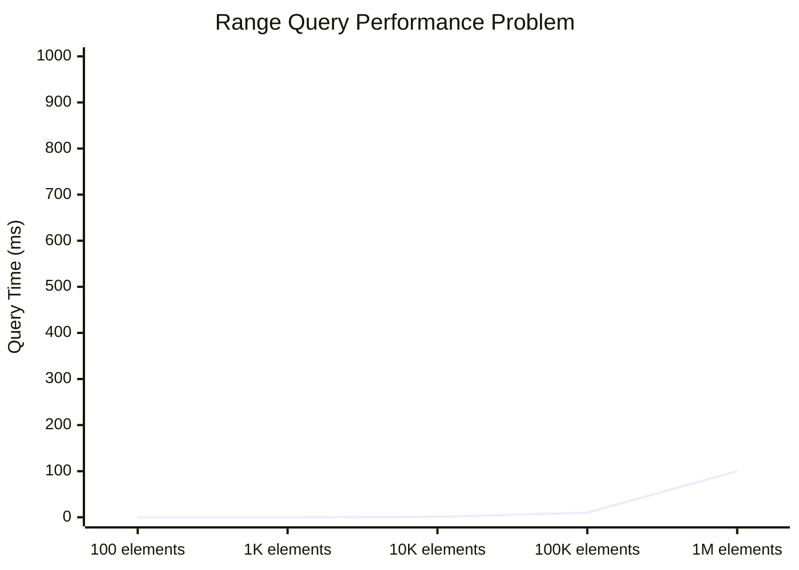
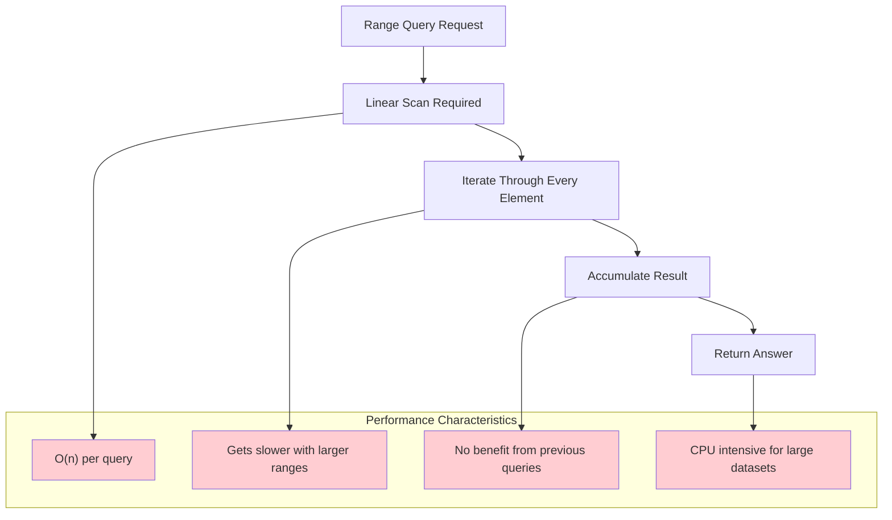
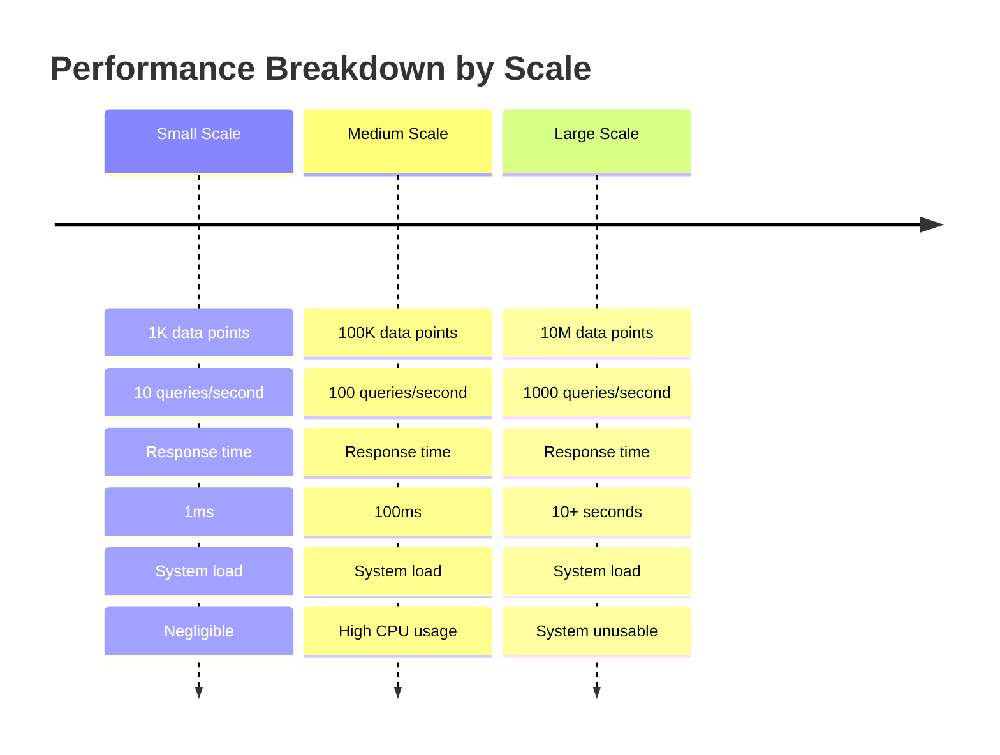
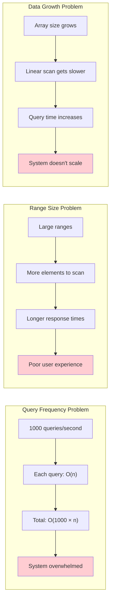
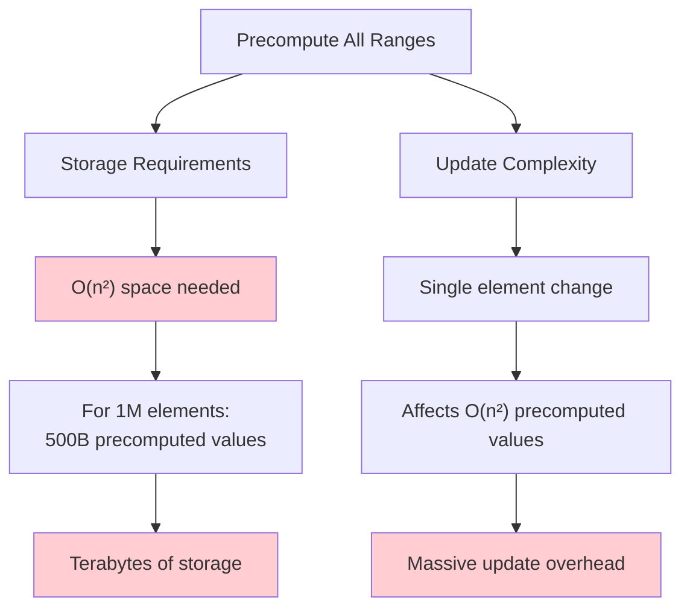
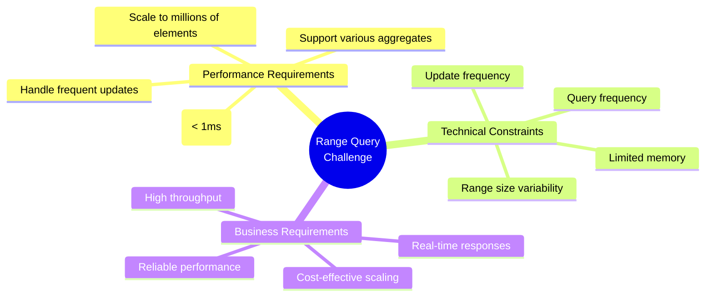
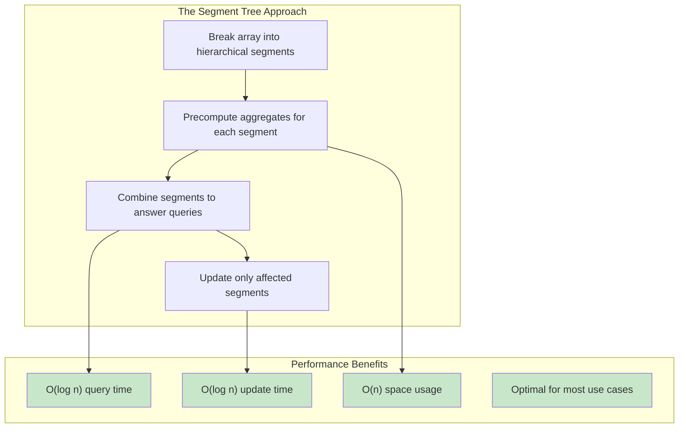

# The Core Problem: When Range Queries Become a Performance Nightmare

Imagine you're building a real-time analytics dashboard for a trading platform. You have an array of stock prices that updates thousands of times per second, and you need to answer queries like:

- "What's the sum of prices from minute 15 to minute 47?"
- "What's the maximum price in the last 30 minutes?"
- "What's the minimum price between 2:15 PM and 3:45 PM?"

Your array contains millions of data points, and you're receiving hundreds of these range queries per second. How do you handle this efficiently?



## The Naive Approach: Linear Scanning

The straightforward solution is to iterate through the array for each query:

```rust
fn range_sum(array: &[i32], start: usize, end: usize) -> i32 {
    let mut sum = 0;
    for i in start..=end {
        sum += array[i];
    }
    sum
}

// Query: sum from index 1000 to 5000
let result = range_sum(&prices, 1000, 5000); // O(n) where n = 4000
```

### Why This Fails at Scale



**The Problems**:
- **Linear complexity**: Each query takes O(k) time where k is the range size
- **No reuse**: Previous computations don't help with new queries
- **Scale poorly**: Performance degrades as arrays and query ranges grow
- **Resource intensive**: High CPU usage for frequent queries

## Real-World Impact

Consider a financial analytics system processing market data:



### When Linear Scanning Breaks Down



**Real-world scenarios where this becomes critical**:
- **Financial systems**: Real-time portfolio analysis over thousands of assets
- **Gaming**: Line-of-sight calculations in 3D environments
- **Analytics**: Time-series aggregations over millions of data points
- **Image processing**: Rectangle-based queries on large images
- **Database engines**: Range queries over large indexed datasets

## The Preprocessing Dilemma

You might think: "Let's precompute all possible range queries!" But this creates even bigger problems:



### Storage Explosion

For an array of size n, there are n×(n+1)/2 possible ranges:
- **1,000 elements**: ~500,000 precomputed values
- **10,000 elements**: ~50,000,000 precomputed values  
- **100,000 elements**: ~5,000,000,000 precomputed values

This quickly becomes impractical for both storage and update costs.

## The Core Challenge



We need a solution that:

1. **Answers range queries efficiently** (better than O(n))
2. **Supports fast updates** (better than O(n²) preprocessing)
3. **Uses reasonable memory** (better than O(n²) storage)
4. **Scales gracefully** with both data size and query frequency

## The Insight: Hierarchical Aggregation

The breakthrough insight is to use **hierarchical pre-computation**: instead of computing every possible range, we compute aggregates for strategically chosen segments that can be combined to answer any range query.



This is exactly what **segment trees** provide: a perfect balance between query speed, update efficiency, and memory usage.

## The Promise of Segment Trees

Instead of the linear scanning nightmare, segment trees offer:

```mermaid
xychart-beta
    title "Performance Comparison: Linear vs Segment Tree"
    x-axis ["100 elements", "1K elements", "10K elements", "100K elements", "1M elements"]
    y-axis "Operations per second" 0 --> 1000000
    bar [100, 100, 100, 100, 100]
    bar [100000, 100000, 83333, 71429, 62500]
```



**The transformation**:
- **Query time**: O(n) → O(log n)
- **Update time**: O(1) → O(log n) 
- **Space usage**: O(1) → O(n)
- **Scalability**: Poor → Excellent

This dramatic improvement makes real-time range queries practical for large-scale applications, turning what was once a performance bottleneck into a solved problem.

The next section explores the hierarchical philosophy that makes this possible.