# Logarithmic Power: The Mathematics Behind Segment Tree Efficiency

Why do segment trees achieve O(log n) complexity for both queries and updates? The answer lies in elegant mathematical properties that transform what seems like a complex problem into a simple tree traversal. Let's explore the mathematical foundations that make segment trees so powerful.

```mermaid
flowchart TD
    subgraph "Mathematical Foundations"
        A["🌳 Complete Binary Tree Properties"]
        B["📐 Range Decomposition Theory"]
        C["🔢 Logarithmic Height Bounds"]
        D["⚡ Path-Based Updates"]
    end
    
    A --> B
    B --> C
    C --> D
    
    style A fill:#e3f2fd
    style B fill:#e8f5e9
    style C fill:#fff3e0
    style D fill:#f3e5f5
```



## The Height-Complexity Connection

### Binary Tree Height Analysis

For an array of size `n`, the segment tree is a complete binary tree with specific height properties:

```mermaid
flowchart TD
    subgraph "Height Calculation"
        A["Array size: n"]
        B["Tree height: h = ⌈log₂(n)⌉"]
        C["Maximum path length: h + 1"]
        D["Operations complexity: O(h) = O(log n)"]
    end
    
    A --> B
    B --> C
    C --> D
    
    style D fill:#c8e6c9
```



### Height Examples by Array Size


**Key insight**: Even for massive arrays, the tree height grows very slowly:
- 1,024 elements → height 10
- 1,048,576 elements → height 20
- 1 billion elements → height 30

## Query Complexity: The Decomposition Principle

### Why Queries Are O(log n)

The fundamental theorem: **Any range [i, j] can be represented by at most 2×log₂(n) segments in the tree.**

```mermaid
flowchart LR
    subgraph "Range Decomposition Proof Sketch"
        A["Start with range [i, j]"]
        B["At each tree level, range spans ≤ 2 nodes"]
        C["Tree has ≤ log₂(n) levels"]
        D["Total segments ≤ 2 × log₂(n)"]
    end
    
    A --> B
    B --> C
    C --> D
    
    style D fill:#c8e6c9
```



### Decomposition Visualization

Consider querying range [2, 6] in an 8-element array:


**Result**: Range [2,6] covered by exactly 3 segments, much fewer than the 5 individual elements.

### The Optimal Decomposition Algorithm

```mermaid
sequenceDiagram
    participant Q as Query [i,j]
    participant A as Algorithm
    participant T as Tree Traversal
    
    Q->>A: Request range [i,j]
    A->>A: Start at root [0,n-1]
    
    loop For each tree level
        A->>T: Check node range vs query range
        alt Complete Coverage
            T-->>A: Use this segment, stop recursion
        else No Overlap
            T-->>A: Skip this segment
        else Partial Overlap
            T->>T: Recurse to children
        end
    end
    
    A-->>Q: Return combined result from ≤ 2×log(n) segments
```



### Mathematical Proof of Query Complexity

**Theorem**: Any range query on a segment tree accesses at most 2×⌈log₂(n)⌉ nodes.

**Proof sketch**:
1. At each level of the tree, the query range can intersect at most 2 nodes
2. This is because internal nodes partition their range exactly in half
3. The tree has height ⌈log₂(n)⌉
4. Therefore, total nodes accessed ≤ 2 × ⌈log₂(n)⌉ = O(log n)

```mermaid
flowchart TD
    subgraph "Proof Visualization"
        A["Level 0: Query intersects ≤ 1 node (root)"]
        B["Level 1: Query intersects ≤ 2 nodes"]
        C["Level 2: Query intersects ≤ 2 nodes"]
        D["Level k: Query intersects ≤ 2 nodes"]
        E["Total: ≤ 2×height = O(log n)"]
    end
    
    A --> B
    B --> C
    C --> D
    D --> E
    
    style E fill:#c8e6c9
```



## Update Complexity: The Path Property

### Why Updates Are O(log n)

Updates follow a single path from root to leaf, affecting exactly one node per level:

```mermaid
flowchart TD
    subgraph "Update Path for Index 5 (n=8)"
        R["Root [0,7]<br/>❌ Recompute"]
        L["[4,7]<br/>❌ Recompute"]
        LL["[4,5]<br/>❌ Recompute"]
        LLL["[5,5]<br/>✏️ Direct Update"]
        
        R --> L
        L --> LL
        LL --> LLL
        
        R2["[0,3]<br/>✅ Unchanged"]
        L2["[6,7]<br/>✅ Unchanged"]
        L3["[4,4]<br/>✅ Unchanged"]
        
        R --> R2
        L --> L2
        LL --> L3
    end
    
    style R fill:#ffcdd2
    style L fill:#ffcdd2
    style LL fill:#ffcdd2
    style LLL fill:#fff3e0
    style R2 fill:#c8e6c9
    style L2 fill:#c8e6c9
    style L3 fill:#c8e6c9
```



### Update Algorithm Analysis

```rust
// Pseudocode showing the single path property
fn update(node, start, end, index, value) {
    if start == end {
        tree[node] = value;  // O(1) - base case
    } else {
        mid = (start + end) / 2;
        if index <= mid {
            update(left_child, start, mid, index, value);  // Only one recursive call
        } else {
            update(right_child, mid+1, end, index, value); // Only one recursive call
        }
        tree[node] = tree[left_child] + tree[right_child]; // O(1) - combine
    }
}
```

**Key properties**:
- Exactly one recursive call per level
- O(1) work per level (assignment or combination)
- Total levels = tree height = O(log n)
- **Total complexity = O(log n)**

### Path Length Analysis


**Observation**: The number of nodes modified grows logarithmically, not linearly.

## Space Complexity: The 4n Bound

### Why Segment Trees Use O(n) Space

```mermaid
flowchart TD
    subgraph "Space Analysis"
        A["Original array: n elements"]
        B["Tree height: h = ⌈log₂(n)⌉"]
        C["Nodes per level: ≤ 2^i at level i"]
        D["Total nodes: ≤ 2^(h+1) - 1"]
        E["Conservative bound: 4n"]
        F["Actual usage: ~2n for powers of 2"]
    end
    
    A --> B
    B --> C
    C --> D
    D --> E
    A --> F
    
    style E fill:#fff3e0
    style F fill:#c8e6c9
```



### Detailed Space Calculation

For an array of size n:

```mermaid
flowchart LR
    subgraph "Level-by-Level Analysis"
        L0["Level 0: 1 node (root)"]
        L1["Level 1: ≤ 2 nodes"]
        L2["Level 2: ≤ 4 nodes"]
        L3["Level 3: ≤ 8 nodes"]
        Lh["Level h: ≤ n nodes (leaves)"]
    end
    
    subgraph "Total Calculation"
        SUM["Sum: 1 + 2 + 4 + ... + n"]
        GEO["Geometric series: 2^(h+1) - 1"]
        BOUND["≤ 2n - 1 for exact powers of 2"]
        SAFE["≤ 4n for any n (safe bound)"]
    end
    
    L0 --> SUM
    L1 --> SUM
    L2 --> SUM
    L3 --> SUM
    Lh --> SUM
    SUM --> GEO
    GEO --> BOUND
    BOUND --> SAFE
    
    style SAFE fill:#c8e6c9
```



## The Range Intersection Mathematics

### Types of Range Relationships

Understanding how query ranges relate to tree node ranges is crucial for complexity analysis:

```mermaid
flowchart TD
    subgraph "Range Relationship Types"
        A["1. Complete Coverage<br/>Node ⊆ Query<br/>Return immediately: O(1)"]
        B["2. No Overlap<br/>Disjoint ranges<br/>Return neutral: O(1)"]
        C["3. Partial Overlap<br/>Split required<br/>Recurse: O(log n)"]
    end
    
    subgraph "Mathematical Conditions"
        D["Coverage: query_start ≤ node_start ∧ node_end ≤ query_end"]
        E["No overlap: node_end < query_start ∨ node_start > query_end"]
        F["Partial: neither complete coverage nor no overlap"]
    end
    
    A --> D
    B --> E
    C --> F
    
    style A fill:#c8e6c9
    style B fill:#ffcdd2
    style C fill:#fff3e0
```



### The Crucial Insight: Binary Partition Property

At each level, a query range can intersect **at most 2 nodes**:


**Proof**: If a query range [i, j] intersects 3 or more nodes at the same level, those nodes must have a common parent that completely contains [i, j], contradicting the definition of "intersecting at the same level."

## Performance Comparison: Theory vs Practice

### Asymptotic vs Constant Factors


**Red bars**: Time complexity (microseconds)  
**Blue bars**: Space complexity (MB)

### Cache Performance Analysis

Segment trees exhibit excellent cache locality due to array-based storage:


## Mathematical Extensions

### Lazy Propagation Complexity

For range updates, lazy propagation maintains the same complexity bounds:


### Generalization to Other Operations

The logarithmic complexity extends to any associative operation:

```mermaid
mindmap
  root((Associative
    Operations))
    Arithmetic
      Sum (a + b)
      Product (a × b)
      
    Logical
      AND (a ∧ b)
      OR (a ∨ b)
      XOR (a ⊕ b)
      
    Extremal
      Min (min(a,b))
      Max (max(a,b))
      
    Number Theory
      GCD (gcd(a,b))
      LCM (lcm(a,b))
```

**Key requirement**: The operation must be associative: (a ⊗ b) ⊗ c = a ⊗ (b ⊗ c)

## The Information-Theoretic Perspective

### Lower Bounds for Range Queries

```mermaid
flowchart TD
    subgraph "Information Theory Analysis"
        A["Any data structure supporting range queries"]
        B["Must store Ω(n) information"]
        C["Updates must affect Ω(log n) precomputed values"]
        D["Segment trees are optimal"]
    end
    
    A --> B
    A --> C
    B --> D
    C --> D
    
    style D fill:#c8e6c9
```



**Intuition**: You can't answer arbitrary range queries without examining a logarithmic amount of precomputed information, and you can't update without modifying a logarithmic number of dependent values.

## Real-World Complexity Implications

### Scalability Analysis


**Key insight**: Performance degrades gracefully as data size increases, unlike linear algorithms that become unusable.

### Memory Hierarchy Effects

Modern CPUs have multiple cache levels that affect practical performance:


## The Mathematical Beauty

The logarithmic complexity of segment trees emerges from the elegant interaction of three mathematical principles:

1. **Binary decomposition**: Any range can be expressed as a union of O(log n) power-of-2 segments
2. **Tree height bounds**: Complete binary trees have logarithmic height
3. **Path uniqueness**: Updates follow a single root-to-leaf path

```mermaid
flowchart TD
    subgraph "Mathematical Harmony"
        A["🌳 Tree Structure"]
        B["📐 Range Decomposition"]
        C["🔢 Logarithmic Bounds"]
        
        A -.-> B
        B -.-> C
        C -.-> A
    end
    
    D["⚡ O(log n) Operations"]
    
    A --> D
    B --> D
    C --> D
    
    style D fill:#c8e6c9
```

This mathematical foundation makes segment trees not just efficient, but **provably optimal** for the range query problem - a rare achievement in algorithm design.

The next section provides a complete, production-ready implementation that brings these mathematical principles to life in Rust code.