# The Core Problem: When One Size Doesn't Fit All

## The Universal Performance Dilemma

Imagine you're designing a library's filing system. Should you organize books alphabetically by title? By author? By genre? By publication date? Each organization method excels at certain types of searches but fails at others.

This is the fundamental challenge that adaptive data structures address: **the optimal organization of data depends entirely on how that data will be accessed**.

### Visualizing the Organization Problem

```mermaid
graph TD
    subgraph "Different Organization Strategies"
        A[Same 1000 Books] --> B[By Title]
        A --> C[By Author]
        A --> D[By Genre]
        A --> E[By Date]
        
        B --> F[Fast: "Find Harry Potter"]
        B --> G[Slow: "Find all Stephen King books"]
        
        C --> H[Fast: "Find all Stephen King books"]
        C --> I[Slow: "Find Harry Potter"]
        
        D --> J[Fast: "Find all Horror books"]
        D --> K[Slow: "Find book published in 2023"]
        
        E --> L[Fast: "Find newest books"]
        E --> M[Slow: "Find all Horror books"]
    end
    
    style F fill:#e8f5e8
    style G fill:#ffebee
    style H fill:#e8f5e8
    style I fill:#ffebee
    style J fill:#e8f5e8
    style K fill:#ffebee
    style L fill:#e8f5e8
    style M fill:#ffebee
```

**The Insight**: No single organization strategy is optimal for all access patterns. The best choice depends on how users actually search for books.

## The Static Data Structure Trap

Traditional data structures are like rigid filing systems. An array provides O(1) access by index but O(n) search by value. A hash table offers O(1) average-case lookup but poor cache locality for sequential access. A binary search tree balances search and insertion but may degrade to O(n) with skewed access patterns.

### The Performance Assumption Matrix

```mermaid
graph TD
    subgraph "Data Structure Assumptions vs Reality"
        A[Array] --> B[Assumption: Know exact indices]
        A --> C[Reality: Often search by value]
        A --> D[Result: O(n) linear scans]
        
        E[Hash Table] --> F[Assumption: Random uniform access]
        E --> G[Reality: Temporal locality patterns]
        E --> H[Result: Poor cache performance]
        
        I[Binary Tree] --> J[Assumption: Balanced access]
        I --> K[Reality: Skewed access patterns]
        I --> L[Result: O(n) worst-case chains]
        
        M[Linked List] --> N[Assumption: Sequential access]
        M --> O[Reality: Random lookups needed]
        M --> P[Result: O(n) search overhead]
    end
    
    style D fill:#ffebee
    style H fill:#fce4ec
    style L fill:#ffebee
    style P fill:#fce4ec
```

Each structure makes assumptions about usage patterns:
- **Arrays** assume you know exactly where your data lives
- **Hash tables** assume lookups are random and uniformly distributed
- **Binary trees** assume balanced access across the entire dataset
- **Linked lists** assume predominantly sequential access

But real-world applications rarely follow these assumptions.

### The Rigidity Problem Illustrated


## The Access Pattern Problem

Consider a web server's cache. Early in the day, users might access recent news articles. During lunch, they browse entertainment content. In the evening, they check social media feeds. The "hot" data constantly shifts, but traditional data structures can't adapt.

### Temporal Access Pattern Evolution

```mermaid
gantt
    title Daily Access Pattern Changes
    dateFormat  HH:mm
    axisFormat %H:%M
    
    section Morning
    News Articles     :active, news, 06:00, 10:00
    Weather Updates   :weather, 07:00, 09:00
    
    section Lunch
    Entertainment     :entertain, 11:00, 14:00
    Social Media      :social1, 12:00, 13:00
    
    section Afternoon
    Work Documents    :work, 13:00, 17:00
    Productivity Apps :apps, 14:00, 18:00
    
    section Evening
    Social Media      :social2, 18:00, 23:00
    Streaming Content :stream, 19:00, 24:00
```



### The Three Fundamental Problems


#### 1. **The Cold Start Problem**
New data starts in the same position as old data, even though it might be accessed frequently.

**Example**: A viral news article gets published but starts at the end of the cache structure, requiring multiple hops to access despite being the most popular content.

#### 2. **The Obsolescence Problem**
Once-popular data that's no longer accessed still occupies prime real estate in the structure.

**Example**: Yesterday's trending topic still sits at the front of the cache, forcing today's popular content to be accessed through slower paths.

#### 3. **The Rigidity Problem**
The structure can't reorganize itself when usage patterns change.

**Example**: A data structure optimized for morning news reading patterns performs poorly when users switch to entertainment browsing at lunch.

## The Adaptive Solution

Adaptive data structures solve this by implementing a simple but powerful principle: **structures that change based on how they're used**.

Instead of maintaining a fixed organization, they continuously reorganize themselves to optimize for the actual access patterns they observe. Like a well-trained assistant who learns your preferences and adjusts accordingly.

### The Adaptive Paradigm Shift


### Core Adaptive Principles


### The Learning Process

Adaptive data structures follow a continuous learning cycle:


## Real-World Examples

### Operating System Page Tables
Modern operating systems don't just store page mappings—they track which pages are accessed most frequently and keep them in faster memory levels.


**Example**: Linux's LRU (Least Recently Used) page replacement algorithm continuously adapts which pages stay in RAM vs. swap to disk based on actual usage patterns.

### Database Index Structures
Advanced databases adjust their internal index structures based on query patterns, promoting frequently-accessed data to higher levels in the index hierarchy.


**Example**: PostgreSQL's buffer cache automatically keeps frequently-accessed pages in memory, and its query planner adapts execution plans based on statistical data about column distributions and access patterns.

### CPU Cache Lines
Even hardware adapts: CPU caches automatically promote frequently-accessed memory to faster cache levels.


**Example**: Modern CPUs use sophisticated replacement policies like pseudo-LRU to decide which cache lines to evict, constantly adapting to the program's memory access patterns.

### Web Browser Caches
Browsers adaptively manage cache storage based on user browsing patterns.


**Example**: Chrome's cache replacement algorithm considers factors like access frequency, recency, resource size, and even the time of day to make intelligent caching decisions.

### Content Delivery Networks (CDNs)
CDNs adaptively place content at edge servers based on geographic access patterns.


**Example**: Cloudflare's edge network automatically caches content at the edge servers where it's most frequently requested, and their Argo smart routing adapts to real-time network conditions.

## The Core Insight

The breakthrough realization is that **the cost of reorganization can be amortized across multiple operations**. While a single adaptive operation might be expensive, the improved performance on subsequent operations more than compensates for the reorganization cost.

This is the essence of adaptive data structures: they trade occasional reorganization overhead for consistently better performance on the workloads they actually encounter.

## What Makes Adaptation Work

Three key principles enable successful adaptation:

1. **Locality of Reference**: If data is accessed once, it's likely to be accessed again soon
2. **Temporal Locality**: Recent access patterns are good predictors of future patterns  
3. **Amortized Cost**: The cost of adaptation is spread across many operations

Understanding these principles is crucial because they determine when and how a data structure should adapt to changing access patterns.