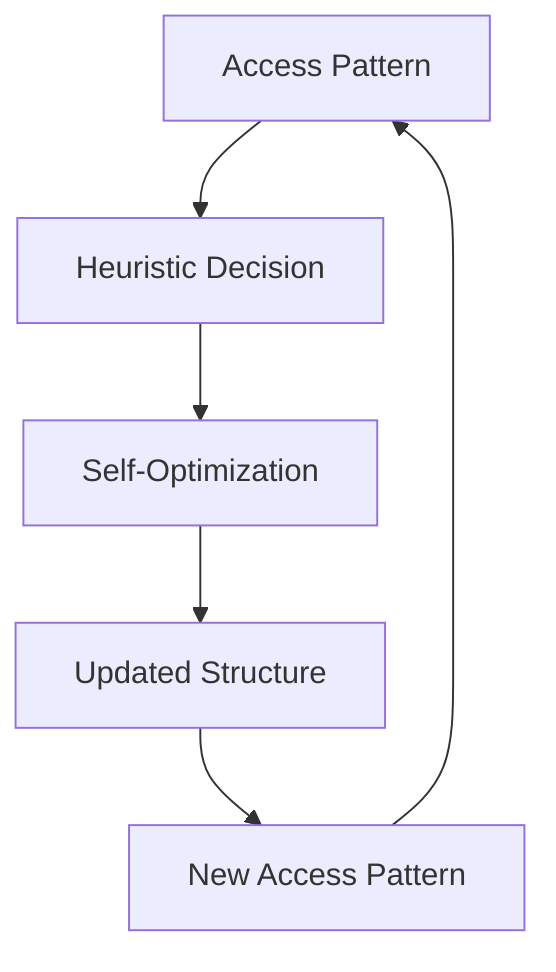

# Key Abstractions: The Building Blocks of Adaptation

## The Three Pillars of Adaptive Data Structures

Understanding adaptive data structures requires mastering three fundamental abstractions: **Self-Optimization**, **Access Patterns**, and **Heuristics**. These concepts work together to create structures that improve their performance over time.

## 1. Self-Optimization: The Autonomous Improvement Engine

### What It Is
Self-optimization is the capability of a data structure to automatically improve its organization based on observed usage, without external intervention.

### The Toolbox Analogy
Imagine a carpenter's toolbox that learns from usage:
- After a week of plumbing work, the pipe wrenches and cutters naturally migrate from the bottom drawer to the top tray
- Frequently-used screwdrivers move to the most accessible slots
- Rarely-used specialty tools gradually settle to the back
- The toolbox organizes itself for the work actually being done

This is exactly how adaptive data structures work—they reorganize themselves based on actual usage patterns.

### Core Characteristics
- **Automatic**: No manual intervention required
- **Continuous**: Ongoing process, not a one-time event
- **Usage-driven**: Based on actual access patterns, not predictions
- **Cost-aware**: Balances reorganization cost against performance benefit

### Implementation Patterns
```
// Pseudo-code for self-optimization
function access(element) {
    result = find_element(element)
    
    // The self-optimization step
    if (should_reorganize(element, current_pattern)) {
        reorganize_for_efficiency(element)
    }
    
    return result
}
```

## 2. Access Patterns: The Language of Usage

### What It Is
An access pattern is the sequence and frequency of operations performed on a data structure over time. It's the "signature" of how the structure is actually being used.

### Types of Access Patterns

#### Temporal Locality
Recently accessed elements are likely to be accessed again soon.

**Example**: A web cache where users repeatedly access the same news article within a short time window.

#### Spatial Locality
Elements close to recently accessed elements are likely to be accessed soon.

**Example**: Reading consecutive pages in a book, or accessing adjacent memory locations in an array.

#### Frequency-Based Patterns
Some elements are accessed much more frequently than others.

**Example**: The 80/20 rule—80% of accesses target 20% of the data.

#### Sequential Patterns
Elements are accessed in a predictable order.

**Example**: Streaming through a dataset from beginning to end.

#### Cyclical Patterns
Access patterns repeat over time.

**Example**: Daily website traffic patterns that repeat every 24 hours.

### Pattern Recognition
Adaptive structures don't need to explicitly recognize complex patterns. They typically respond to simple signals:

```
// Simple pattern indicators
recent_access_count[element]++
time_since_last_access[element] = current_time
access_frequency[element] = calculate_frequency(element)
```

## 3. Heuristics: The Decision-Making Rules

### What It Is
Heuristics are simple rules that guide how a data structure should adapt to observed access patterns. They're the "policies" that determine when and how to reorganize.

### The Move-to-Front Heuristic
**Rule**: Whenever an element is accessed, move it to the front of the structure.

**Rationale**: If something was accessed recently, it's likely to be accessed again soon (temporal locality).

**Example in Linked Lists**:
```
// Move-to-front in action
Original list: [A] -> [B] -> [C] -> [D] -> [E]
Access C: Move C to front
Result: [C] -> [A] -> [B] -> [D] -> [E]
```

### The Frequency-Based Heuristic
**Rule**: Promote elements based on their access frequency.

**Rationale**: Frequently accessed elements should be in positions that make them faster to access.

### The Aging Heuristic
**Rule**: Gradually demote elements that haven't been accessed recently.

**Rationale**: Prevents the structure from being dominated by historical patterns that may no longer be relevant.

### The Threshold Heuristic
**Rule**: Only reorganize when the expected benefit exceeds a threshold.

**Rationale**: Avoid constant micro-optimizations that provide little benefit.

## The Interaction Between Abstractions

### The Feedback Loop


### Example: Splay Tree in Action
1. **Access Pattern**: Frequent access to node X
2. **Heuristic**: "Move frequently accessed nodes toward the root"
3. **Self-Optimization**: Perform rotations to move X toward the root
4. **Result**: Future accesses to X are faster

## Advanced Abstractions

### Adaptive Thresholds
Instead of fixed thresholds, some structures adjust their adaptation sensitivity based on observed patterns.

### Multi-Level Adaptation
Structures can adapt at multiple levels simultaneously:
- **Local**: Adjust individual element positions
- **Global**: Modify overall structure organization
- **Meta**: Change adaptation strategies themselves

### Predictive Adaptation
Advanced structures might attempt to predict future access patterns and adapt proactively.

## The Self-Organizing Principle

The most powerful abstraction in adaptive data structures is the **self-organizing principle**: the idea that optimal organization emerges from local adaptation rules rather than global planning.

### Emergent Properties
- **Global efficiency** emerges from local optimization decisions
- **Robustness** emerges from continuous adaptation
- **Scalability** emerges from distributed decision-making

### The Ant Colony Analogy
Like ant colonies that find optimal paths through simple pheromone-following rules, adaptive data structures find optimal organizations through simple adaptation heuristics.

## Common Pitfalls in Understanding

### Misconception 1: "Adaptive = Always Better"
**Reality**: Adaptation has costs. For some patterns, static structures are more efficient.

### Misconception 2: "More Complex Heuristics = Better Performance"
**Reality**: Simple heuristics often outperform complex ones because they have lower overhead.

### Misconception 3: "Adaptation Requires Perfect Pattern Recognition"
**Reality**: Effective adaptation can work with simple, imperfect heuristics.

## Practical Implications

### When to Use These Abstractions
- **Unknown access patterns**: When you can't predict how the structure will be used
- **Changing patterns**: When usage patterns evolve over time
- **Mixed workloads**: When the structure needs to handle diverse access patterns

### Design Decisions
- Choose heuristics that match your expected access patterns
- Balance adaptation cost against performance benefit
- Consider the time scale of pattern changes

Understanding these key abstractions—self-optimization, access patterns, and heuristics—provides the foundation for both using existing adaptive data structures effectively and designing new ones for specific applications.