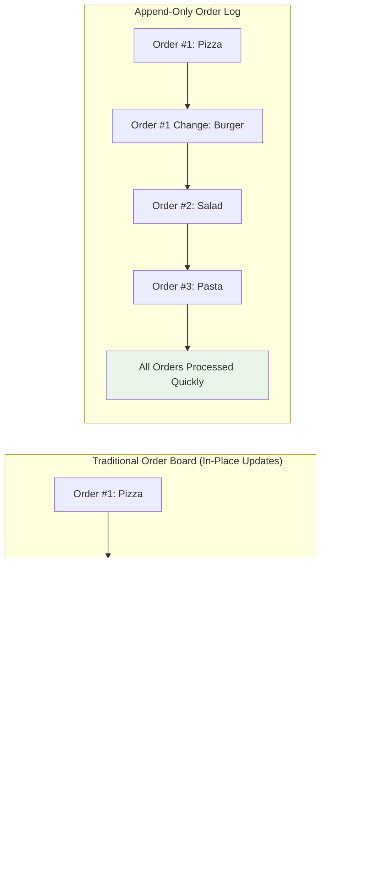

# The Core Problem: The Performance Penalty of Modification

## The Write Performance Dilemma

Imagine you're managing a busy restaurant's order system. Traditional database approaches would be like constantly erasing and rewriting the same order board—every time a customer changes their order, you erase the old entry and write the new one. This approach creates a bottleneck that gets worse as your restaurant gets busier.

This is the fundamental challenge that append-only logs address: **writing to storage is fast, but modifying existing data is slow and complex**.

### The Restaurant Analogy Visualized



**The Key Insight**: Instead of erasing and rewriting, append-only systems simply add new entries to the end of a log, like writing in a journal that never gets erased.

## The Hidden Costs of In-Place Updates

### Physical Storage Realities
When you modify data in place, several expensive operations happen under the hood:


1. **Read-Modify-Write Cycle**: The system must read the existing data, modify it in memory, then write it back
2. **Synchronization Overhead**: Multiple processes trying to modify the same data require complex locking mechanisms
3. **Fragmentation**: Changing data sizes can create gaps in storage, leading to fragmentation
4. **Transaction Complexity**: Ensuring data integrity during modifications requires sophisticated transaction management

### The Performance Cliff Visualized

Consider a simple example: updating a user's profile in a traditional database.


**The Problem**: Each step adds latency, and the locks prevent other operations from proceeding concurrently.

### Performance Impact Analysis


## The Concurrency Nightmare

### Lock Contention Visualization

In high-traffic systems, multiple processes competing for the same data create lock contention:


**Example Scenario**:
```
Process A: Wants to update user 123's email
Process B: Wants to update user 123's password  
Process C: Wants to read user 123's profile
Process D: Wants to update user 123's address

Result: All processes serialize, waiting for each other
```

### The Deadlock Problem

As systems grow complex, circular dependencies between locks can cause deadlocks:


**Classic Example**:
```
Transaction 1: Locks User A, wants User B
Transaction 2: Locks User B, wants User A
Result: Circular dependency → Deadlock
```
Transaction 2: Locks B, wants A
Result: Both transactions wait forever
```

### Complex Coordination
Ensuring data consistency across multiple modifications requires sophisticated coordination mechanisms like two-phase commit, which adds significant overhead.

## The Sequential vs. Random Write Performance Gap

### Why Sequential Writes Are Fast

Storage devices, whether HDDs or SSDs, are optimized for sequential access:


### The Mechanical Reality Visualized


HDDs have physical seek times—the disk head must physically move to the right location. Sequential writes eliminate this movement, while random writes maximize it.

Even SSDs, with no moving parts, show significant performance differences due to:
- **Write amplification**: Small writes trigger large block erases
- **Garbage collection overhead**: Cleaning up fragmented blocks
- **Block erase cycles**: Limited write/erase cycles per block

## Real-World Performance Examples

### Database Transaction Logs
Every major database system uses append-only transaction logs for a reason:

```
Traditional approach:
UPDATE users SET email = 'new@email.com' WHERE id = 123;
Operations: Lock → Read → Modify → Write → Unlock
Time: 5-50ms per operation

Append-only approach:
APPEND: "user:123:email:new@email.com:timestamp"
Operations: Single sequential write
Time: 0.1-1ms per operation
```

### Web Server Logs
Web servers never modify existing log entries—they only append new ones:

```
# This is fast (append-only)
echo "2024-01-15 10:30:45 GET /api/users" >> access.log

# This would be slow (modification)
sed -i 's/old-pattern/new-pattern/' access.log
```

## The Consistency Challenge

### The CAP Theorem Reality
Traditional databases try to maintain strong consistency, availability, and partition tolerance simultaneously. This creates complex trade-offs:

- **Strong consistency** requires coordination between nodes
- **Coordination** requires locks and synchronization
- **Locks** reduce availability and performance

### The ACID Overhead
ACID properties (Atomicity, Consistency, Isolation, Durability) require significant overhead:

- **Atomicity**: All-or-nothing transactions require rollback capabilities
- **Consistency**: Maintaining invariants requires validation on every change
- **Isolation**: Preventing concurrent access conflicts requires locking
- **Durability**: Ensuring data survives crashes requires fsync operations

## The Scaling Wall

### Write Amplification
Traditional databases suffer from write amplification—a single logical write triggers multiple physical writes:

```
User writes: 1 record
Database performs:
1. Write to data file
2. Write to index file  
3. Write to transaction log
4. Write to backup/replica
Result: 4x write amplification
```

### Index Maintenance Overhead
Every modification requires updating multiple indexes:

```
UPDATE users SET email = 'new@email.com' WHERE id = 123;

Updates required:
1. Primary key index
2. Email index
3. Any composite indexes containing email
4. Full-text search indexes
```

## The Distributed Systems Problem

### Network Coordination
In distributed systems, coordinating modifications across multiple nodes is exponentially complex:

```
Distributed transaction across 3 nodes:
1. Prepare phase: All nodes must agree
2. Commit phase: All nodes must execute
3. Failure recovery: Complex rollback procedures

Single point of failure at each step
```

### Consensus Overhead
Algorithms like Raft or Paxos require multiple round trips to achieve consensus on modifications, adding significant latency.

## The Backup and Recovery Complexity

### Point-in-Time Recovery
Traditional systems require complex backup strategies:

```
Full backup: Complete database snapshot (slow, large)
Incremental backup: Only changed data (complex to manage)
Point-in-time recovery: Replay transaction logs (slow)
```

### Corruption Risks
In-place modifications increase the risk of data corruption:
- Power failures during writes
- Disk errors affecting existing data
- Software bugs overwriting good data

## The Maintenance Overhead

### Fragmentation
Constant modifications lead to fragmentation:

```
Original data: [A][B][C][D]
After updates: [A'][ gap ][C'][D]
Result: Wasted space, slower reads
```

### Compaction Costs
Periodic compaction to reclaim space:
- Requires taking the system offline
- Intensive I/O operations
- Risk of data loss during compaction

## The Development Complexity

### Race Conditions
Concurrent modifications create race conditions:

```rust
// Thread 1
balance = get_balance(account);
new_balance = balance + 100;
set_balance(account, new_balance);

// Thread 2 (concurrent)
balance = get_balance(account);
new_balance = balance - 50;
set_balance(account, new_balance);

// Result: Lost update!
```

### Error Handling
Partial failures in modification operations require complex error handling:

```
try {
    update_user_profile(user_id, new_data);
    update_user_indexes(user_id, new_data);
    notify_subscribers(user_id, new_data);
} catch (error) {
    // Complex rollback logic required
    rollback_user_profile(user_id);
    rollback_user_indexes(user_id);
    // What if rollback fails?
}
```

## The Core Insight

The fundamental problem is that **modification is inherently more complex than creation**. 

### Complexity Comparison


**Modification Requirements**:
1. Coordinate with other processes
2. Maintain consistency invariants  
3. Handle partial failures
4. Manage concurrent access
5. Ensure durability guarantees

**Append-Only Requirements**:
1. Find the end of the log
2. Write the new entry
3. Update the end pointer

### The Paradigm Shift


This insight leads to a profound realization: **what if we never modify data at all?** What if we only ever add new information, treating the past as immutable?

### The Power of Immutability


This is the core insight that makes append-only logs so powerful—they eliminate the complexity of modification by embracing immutability. Instead of changing the past, we simply record new events as they happen, creating a permanent, ordered history of all changes.

### Real-World Impact


Understanding this fundamental performance and complexity problem is crucial because it explains why append-only logs have become the foundation of modern distributed systems, from Apache Kafka to Git, from database transaction logs to blockchain technologies.

**The Next Step**: Understanding how the guiding philosophy of immutability transforms system design and enables these powerful capabilities.