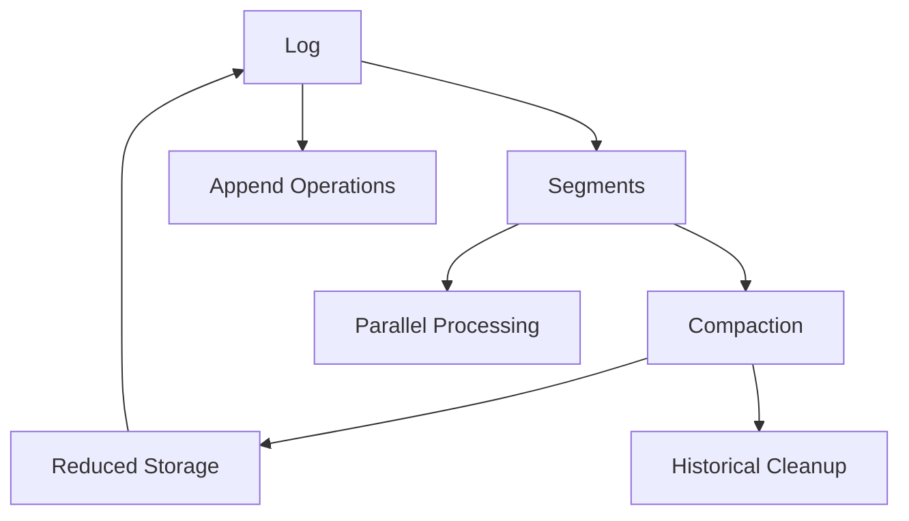

# Key Abstractions: The Building Blocks of Append-Only Systems

## The Three Pillars of Append-Only Logs

Understanding append-only logs requires mastering three fundamental abstractions: **The Log**, **Segments**, and **Compaction**. These concepts work together to create systems that are both simple and powerful.

## 1. The Log: The Infinite Diary

### What It Is
The log is the central abstraction—an ordered, immutable sequence of records that grows indefinitely. Think of it as a diary where you only write on new pages and never erase what you've written.

### The Diary Analogy
```
January 1: "Started new year resolution to exercise"
January 2: "Went for a run, felt great"
January 3: "Too tired to exercise today"
January 4: "Back to running, establishing routine"
...
```

Just like a diary, the log preserves the complete history of events in the order they occurred.

### Core Properties

#### Ordering
Every entry in the log has a position (offset) that determines its place in the sequence:

```
Log structure:
[Entry 0][Entry 1][Entry 2][Entry 3][Entry 4]...
    ↓        ↓        ↓        ↓        ↓
 First    Second   Third   Fourth   Fifth
```

#### Immutability
Once written, entries never change:

```
Write: log.append("user:123:created")
       log.append("user:123:email:old@email.com")
       log.append("user:123:email:new@email.com")

Read: Always returns the same sequence
```

#### Infinite Growth
The log can grow indefinitely, limited only by available storage:

```
Day 1: [A][B][C]
Day 2: [A][B][C][D][E][F]
Day 3: [A][B][C][D][E][F][G][H][I]
...
```

### Implementation Concepts

#### Log Entries
Each entry contains:
- **Timestamp**: When the event occurred
- **Event type**: What kind of event this represents
- **Data**: The actual event payload
- **Metadata**: Additional context like user ID, transaction ID

```rust
struct LogEntry {
    timestamp: u64,
    event_type: String,
    data: Vec<u8>,
    metadata: HashMap<String, String>,
}
```

#### Offsets
The log maintains a continuous sequence of offsets:

```
Offset 0: "user:123:created"
Offset 1: "user:123:email:old@email.com"
Offset 2: "user:456:created"
Offset 3: "user:123:email:new@email.com"
Offset 4: "user:456:deleted"
```

#### Append Operations
New entries are always added to the end:

```rust
fn append(&mut self, entry: LogEntry) -> u64 {
    let offset = self.next_offset;
    self.entries.push(entry);
    self.next_offset += 1;
    offset
}
```

## 2. Segments: The Chapter Organization

### What It Is
As logs grow large, they're divided into segments—individual files that contain portions of the log. Think of segments as chapters in a book, where each chapter is a separate file but the overall story flows continuously.

### The Book Chapter Analogy
```
Book: "The Complete User Activity Log"
Chapter 1 (segment-000): Entries 0-999
Chapter 2 (segment-001): Entries 1000-1999
Chapter 3 (segment-002): Entries 2000-2999
...
```

Each chapter is a separate file, but they form a cohesive narrative when read in sequence.

### Why Segments Matter

#### File System Limitations
Operating systems have practical limits on file sizes:

```
Without segments: One 100GB log file
- Slow to open
- Difficult to back up
- Risky to modify
- Poor for concurrent access

With segments: 100 files of 1GB each
- Fast to open individual segments
- Easy to back up incrementally
- Safe to delete old segments
- Good for parallel processing
```

#### Parallel Processing
Segments enable concurrent operations:

```
Reader 1: Processing segment-000
Reader 2: Processing segment-001
Reader 3: Processing segment-002
Writer: Appending to segment-003
```

#### Retention Policies
Segments make it easy to implement retention policies:

```rust
// Delete segments older than 30 days
fn cleanup_old_segments(&mut self) {
    let cutoff = current_time() - Duration::days(30);
    self.segments.retain(|segment| segment.created_at > cutoff);
}
```

### Segment Management

#### Segment Structure
```
segment-000000000000000000.log: Entries 0-999
segment-000000000000001000.log: Entries 1000-1999
segment-000000000000002000.log: Entries 2000-2999
```

The filename indicates the starting offset of the segment.

#### Rolling Segments
New segments are created based on:
- **Size**: When current segment reaches size limit
- **Time**: After a certain time period
- **Count**: After a certain number of entries

```rust
fn should_roll_segment(&self) -> bool {
    let current_segment = self.current_segment();
    current_segment.size() > MAX_SEGMENT_SIZE ||
    current_segment.age() > MAX_SEGMENT_AGE ||
    current_segment.count() > MAX_SEGMENT_ENTRIES
}
```

#### Segment Index
Each segment maintains an index for fast access:

```
segment-000000000000001000.log: The actual log entries
segment-000000000000001000.idx: Index for fast offset lookup
```

## 3. Compaction: The History Summarization

### What It Is
Compaction is the process of removing redundant or obsolete information from the log while preserving the essential history. Like summarizing old diary entries into a condensed version that captures the key points.

### The Diary Summarization Analogy
```
Original diary entries:
Jan 1: "Started diet"
Jan 2: "Ate salad for lunch"
Jan 3: "Cheated with pizza"
Jan 4: "Back on diet"
Jan 5: "Lost 2 pounds"
...
Jan 31: "Lost 10 pounds total"

Summarized version:
Jan 1: "Started diet"
Jan 31: "Lost 10 pounds total"
```

The summary preserves the important outcomes while removing the daily fluctuations.

### Types of Compaction

#### Log Compaction
Removes duplicate keys, keeping only the latest value:

```
Original log:
user:123:name:Alice
user:123:email:alice@old.com
user:123:email:alice@new.com
user:123:name:Alice Smith

After compaction:
user:123:name:Alice Smith
user:123:email:alice@new.com
```

#### Temporal Compaction
Summarizes events over time periods:

```
Original log (hourly):
09:00 CPU:50% Memory:60%
10:00 CPU:55% Memory:58%
11:00 CPU:52% Memory:62%
12:00 CPU:48% Memory:59%

After compaction (daily):
Date: 2024-01-15 Avg_CPU:51% Avg_Memory:60%
```

#### Semantic Compaction
Combines related events into higher-level events:

```
Original log:
user:123:login_attempt
user:123:password_verified
user:123:session_created

After compaction:
user:123:login_successful
```

### Compaction Strategies

#### Background Compaction
Compaction runs as a background process:

```rust
async fn background_compaction(&mut self) {
    loop {
        if self.should_compact() {
            let compacted_segment = self.compact_oldest_segments();
            self.replace_segments(compacted_segment);
        }
        sleep(COMPACTION_INTERVAL).await;
    }
}
```

#### Triggered Compaction
Compaction triggered by specific conditions:

```rust
fn maybe_compact(&mut self) {
    if self.total_size() > MAX_LOG_SIZE {
        self.compact_by_size();
    }
    if self.oldest_segment_age() > MAX_AGE {
        self.compact_by_age();
    }
}
```

#### Snapshot Compaction
Create point-in-time snapshots:

```rust
fn create_snapshot(&self, timestamp: u64) -> Snapshot {
    let mut state = ApplicationState::new();
    for entry in self.entries_before(timestamp) {
        state.apply(entry);
    }
    Snapshot::new(state, timestamp)
}
```

## The Interaction Between Abstractions

### The Complete System


### Example: User Profile Updates

#### Initial State
```
Log: [user:123:created:name:Alice]
Segments: [segment-000: entry-0]
```

#### After Multiple Updates
```
Log: [
  user:123:created:name:Alice,
  user:123:email:alice@old.com,
  user:123:email:alice@new.com,
  user:123:name:Alice Smith,
  user:123:phone:555-0123
]
Segments: [segment-000: entries 0-4]
```

#### After Compaction
```
Log: [
  user:123:name:Alice Smith,
  user:123:email:alice@new.com,
  user:123:phone:555-0123
]
Segments: [segment-001: entries 0-2]
```

## Advanced Abstractions

### Log Partitioning
Divide logs by key or topic:

```
user-events.log: User-related events
order-events.log: Order-related events
payment-events.log: Payment-related events
```

### Log Replication
Replicate logs across multiple machines:

```
Primary: [A][B][C][D]
Replica 1: [A][B][C]    (catching up)
Replica 2: [A][B][C][D] (in sync)
```

### Log Indexing
Create indexes for fast queries:

```
Primary log: [event1][event2][event3]
User index: user:123 → [event1, event3]
Time index: 2024-01-15 → [event2]
```

## Implementation Patterns

### The Log Interface
```rust
trait Log {
    fn append(&mut self, entry: LogEntry) -> u64;
    fn read(&self, offset: u64) -> Option<LogEntry>;
    fn read_range(&self, start: u64, end: u64) -> Vec<LogEntry>;
    fn len(&self) -> u64;
}
```

### The Segment Interface
```rust
trait Segment {
    fn append(&mut self, entry: LogEntry) -> bool;
    fn read(&self, offset: u64) -> Option<LogEntry>;
    fn should_roll(&self) -> bool;
    fn size(&self) -> u64;
}
```

### The Compaction Interface
```rust
trait Compactor {
    fn compact(&self, segments: Vec<Segment>) -> Segment;
    fn should_compact(&self, log: &Log) -> bool;
    fn retention_policy(&self) -> RetentionPolicy;
}
```

## Real-World Applications

### Apache Kafka
- **Log**: Topic partitions
- **Segments**: Log segment files
- **Compaction**: Log compaction by key

### Git Version Control
- **Log**: Commit history
- **Segments**: Packfiles
- **Compaction**: Git garbage collection

### Database Write-Ahead Logs
- **Log**: Transaction log
- **Segments**: Log files
- **Compaction**: Checkpoint operations

## Performance Characteristics

### Log Operations
- **Append**: O(1) - constant time
- **Read by offset**: O(1) - direct access
- **Range read**: O(n) - linear in range size

### Segment Operations
- **Segment lookup**: O(log n) - binary search
- **Parallel processing**: O(n/p) - where p is number of processors

### Compaction Operations
- **Space reclamation**: Reduces storage by 50-90%
- **Query performance**: Improves by reducing data volume
- **Time complexity**: O(n) - linear in data size

## Design Trade-offs

### Space vs. Time
- **More segments**: Better parallelism, more file handles
- **Fewer segments**: Lower overhead, simpler management

### Retention vs. Performance
- **Longer retention**: Better debugging, more storage
- **Shorter retention**: Better performance, less storage

### Compaction vs. Freshness
- **Frequent compaction**: Lower storage, higher CPU usage
- **Infrequent compaction**: Higher storage, lower CPU usage

## Common Pitfalls

### Over-Segmentation
Creating too many small segments:
```
Bad: 1000 segments of 1MB each
Good: 100 segments of 10MB each
```

### Under-Compaction
Letting logs grow without bounds:
```
Bad: Never compact, storage grows indefinitely
Good: Regular compaction based on policy
```

### Incorrect Ordering
Not preserving event order during compaction:
```
Bad: Reorder events during compaction
Good: Preserve temporal ordering
```

## The Big Picture

These three abstractions work together to create a system that is:

1. **Simple**: Append-only operations are straightforward
2. **Scalable**: Segments enable parallel processing
3. **Efficient**: Compaction manages storage growth
4. **Reliable**: Immutability eliminates many failure modes
5. **Debuggable**: Complete history is preserved

Understanding these abstractions is crucial because they form the foundation of modern distributed systems. Whether you're working with Apache Kafka, implementing event sourcing, or designing a new logging system, these concepts provide the building blocks for robust, scalable solutions.

The next step is putting these concepts into practice by building a simple append-only log system.