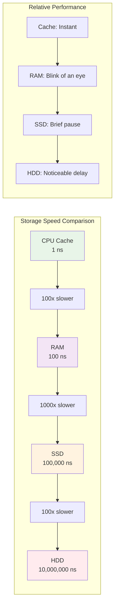
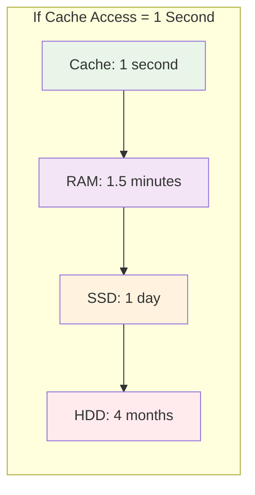
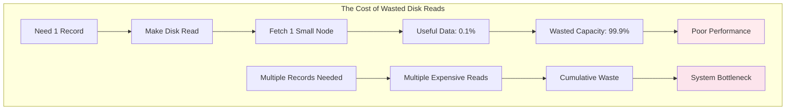
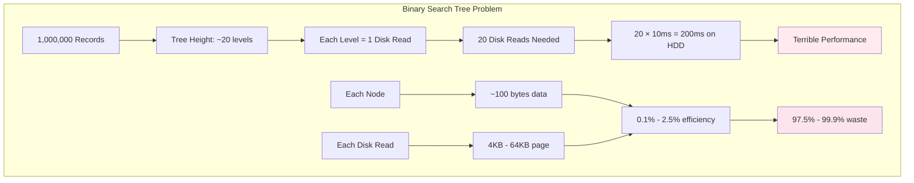
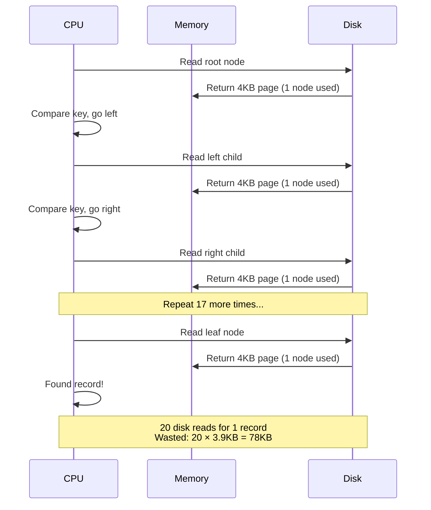
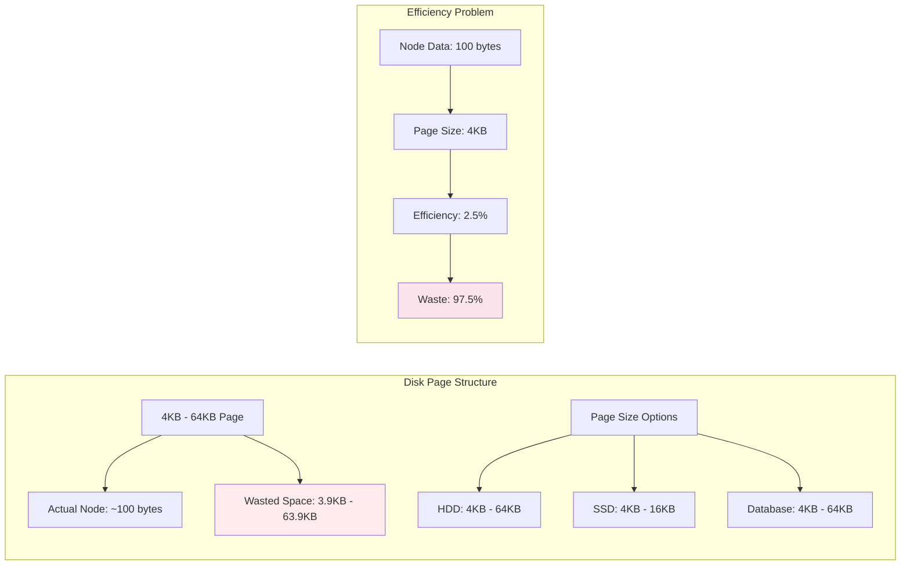
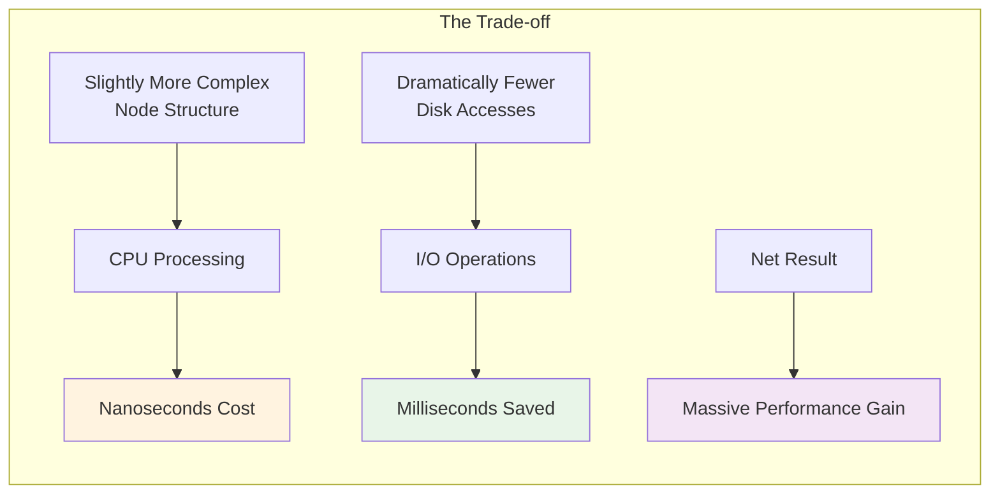
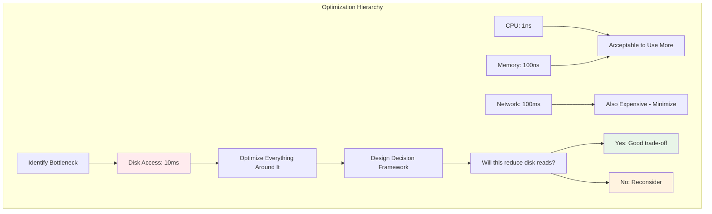

# The Core Problem: The Disk Access Performance Cliff

## The Hidden Cost of Storage

Imagine you're a librarian managing a massive library with millions of books. If you had to walk to a different building every time you needed to find a single book, you'd spend most of your time walking rather than helping patrons. This is exactly the challenge that databases face when working with disk storage.

This is the fundamental problem that B-Trees solve: **disk access is thousands of times slower than memory access, so every disk read must be maximized**.

### The Librarian Analogy Visualized


**The Key Insight**: Instead of making many trips for individual items, make fewer trips and bring back more useful data each time.

## The Storage Hierarchy Reality

### The Speed Chasm

Modern computer systems have a dramatic performance hierarchy:



**Performance Numbers**:
- **CPU Cache**: 1 nanosecond (baseline)
- **RAM**: 100 nanoseconds (100x slower)
- **SSD**: 100,000 nanoseconds = 0.1ms (100,000x slower)
- **HDD**: 10,000,000 nanoseconds = 10ms (10,000,000x slower)

### The Time Scale Visualization

If CPU cache access was 1 second, the relative times would be:



**The Key Insight**: Disk access is 100,000 to 10,000,000 times slower than memory access.

### The Performance Implication

When your database needs to find a record, every disk read is precious. If you waste a disk read by fetching only a tiny amount of useful data, you're throwing away performance.



## The Binary Search Tree Trap

### Why BSTs Fail on Disk

Consider a traditional binary search tree storing 1 million records:



**The Problem**: Each disk read fetches exactly one node—a tiny amount of data. We're making 20 expensive disk operations to find one record.

### BST Disk Access Pattern



### The Page Reality Visualized

Disks don't read single bytes—they read in chunks called "pages" or "blocks":



**Key Insight**: If your tree node is 100 bytes but the disk reads 4KB, you're wasting 97.5% of every disk read.

### The Cumulative Waste

```mermaid
graph TD
    subgraph "Search Operation Waste"
        A[Find 1 Record] --> B[20 Disk Reads]
        B --> C[20 × 4KB = 80KB transferred]
        C --> D[20 × 100 bytes = 2KB useful]
        D --> E[78KB wasted (97.5%)]
        
        F[Find 100 Records] --> G[2000 Disk Reads]
        G --> H[8MB transferred]
        H --> I[200KB useful]
        I --> J[7.8MB wasted]
    end
    
    style E fill:#ffebee
    style J fill:#fce4ec
```

## The Database Indexing Challenge

### The Scale Problem

Modern databases handle massive datasets:

- **Small database**: 100 million records
- **Medium database**: 10 billion records  
- **Large database**: 1 trillion records

With a binary search tree:
- **100M records**: 27 disk reads per lookup
- **10B records**: 33 disk reads per lookup
- **1T records**: 40 disk reads per lookup

At 10ms per disk read, finding one record takes 270-400ms. This is unacceptable for interactive applications.

### The Concurrent Access Problem

Databases serve many users simultaneously:

```
1,000 concurrent users × 400ms per query = 400 seconds of total disk time
With one disk, only 2.5 queries per second maximum throughput
```

The system becomes completely unusable under load.

## Real-World Performance Examples

### Traditional File Systems

Without proper indexing, finding a file by name requires:

```
Linear search through directory:
- 1,000 files: 500 disk reads on average
- 10,000 files: 5,000 disk reads on average
- 100,000 files: 50,000 disk reads on average

At 10ms per read:
- 1,000 files: 5 seconds
- 10,000 files: 50 seconds
- 100,000 files: 500 seconds (8+ minutes)
```

### Database Table Scans

Finding a record in an unindexed table:

```sql
SELECT * FROM users WHERE email = 'user@example.com';
```

Without an index:
- **10,000 users**: 5 seconds average
- **100,000 users**: 50 seconds average
- **1,000,000 users**: 500 seconds average

This is why databases create indexes—and why those indexes must be disk-efficient.

## The Fundamental Insight

### The Chunky vs. Pointy Problem

**Pointy data structures** (like BSTs) read tiny amounts of data per disk access:
- Small nodes
- One key per node
- Deep trees
- Many disk reads

**Chunky data structures** (like B-Trees) read large amounts of useful data per disk access:
- Large nodes  
- Many keys per node
- Shallow trees
- Few disk reads

### The Utilization Principle

The key insight is **utilization**: how much of each disk read is useful?

```
Binary Search Tree:
- Node size: 100 bytes
- Disk page size: 4KB
- Utilization: 100/4096 = 2.4%

B-Tree:
- Node size: 4KB (matches disk page)
- Disk page size: 4KB
- Utilization: 4096/4096 = 100%
```

B-Trees achieve 40x better utilization of each disk read.

## The Seek Time Reality

### Mechanical Constraints

Traditional hard drives have mechanical limitations:

```
Seek time: 5-10ms (moving the read head)
Rotational delay: 2-5ms (waiting for data to rotate under head)
Transfer time: 0.1ms (actually reading the data)

Total: 7-15ms per random read
```

The mechanical overhead (seek + rotation) dominates. This makes random reads extremely expensive.

### The Sequential Advantage

Reading data sequentially is much faster:

```
First read: 7-15ms (seek + rotation + transfer)
Subsequent reads: 0.1ms each (just transfer)

Reading 40 sequential sectors: 15ms + 40×0.1ms = 19ms
Reading 40 random sectors: 40×15ms = 600ms

Sequential is 30x faster than random
```

B-Trees are designed to take advantage of this by reading large chunks sequentially.

## The Memory Hierarchy Mismatch

### CPU Cache Behavior

Modern CPUs have cache hierarchies:

```
L1 Cache: 32KB, 1ns access
L2 Cache: 256KB, 3ns access  
L3 Cache: 8MB, 12ns access
RAM: GBs, 100ns access
```

Binary search trees have poor cache behavior:
- Random access patterns
- Small nodes don't fill cache lines
- Frequent cache misses

B-Trees have better cache behavior:
- Large nodes fill cache lines efficiently
- More data per cache miss
- Better spatial locality

## The Concurrency Challenge

### Lock Contention

In multi-user systems, tree modifications require locking:

```
Binary Search Tree:
- Deep tree requires locking many levels
- Long lock hold times
- High contention

B-Tree:
- Shallow tree requires locking fewer levels
- Shorter lock hold times
- Lower contention
```

### Update Overhead

Modifying tree structure is expensive:

```
Binary Search Tree insertion:
- May require rebalancing entire tree
- Many nodes affected
- Many disk writes

B-Tree insertion:
- Usually only affects 1-2 nodes
- Minimal disk writes
- Better performance
```

## The Scaling Wall

### The Exponential Problem

As data grows, the problem gets exponentially worse:

```
Data size: 1K records → 1M records → 1B records
BST height: 10 levels → 20 levels → 30 levels
Disk reads: 10 → 20 → 30
Query time: 100ms → 200ms → 300ms
```

The linear increase in height means linear increase in query time.

### The Capacity Cliff

There's a point where the index becomes too large to be effective:

```
Index size > Available RAM = Performance cliff
```

When indexes don't fit in memory, performance degrades dramatically because even traversing the index requires disk reads.

## The Distributed Systems Problem

### Network Latency

In distributed databases, the problem is even worse:

```
Local disk: 10ms
Network + remote disk: 100ms
```

Every additional level in the tree adds 100ms of latency in distributed systems.

### Replication Overhead

Updating distributed indexes is expensive:

```
Deep tree modification:
- More nodes to replicate
- More network traffic
- Higher chance of conflicts
```

## The SSD Improvement

### Solid State Drives

SSDs improve the situation but don't eliminate the problem:

```
SSD read latency: 0.1ms (100x better than HDD)
SSD throughput: 500MB/s (10x better than HDD)
```

Even with SSDs:
- Random reads are still 1,000x slower than memory
- Page-based reading is still important
- Utilization still matters

### The Bandwidth Constraint

Even fast SSDs have limited bandwidth:

```
SSD bandwidth: 500 MB/s
Small random reads: 100 bytes each
Maximum IOPS: 5,000,000 ops/s

With 4KB reads: 125,000 ops/s
With 64KB reads: 8,000 ops/s
```

Larger reads reduce maximum operations per second, but each operation accomplishes more work.

## The Core Insight

### The Fundamental Trade-off

The B-Tree design embodies a fundamental trade-off:



**Trade**: Slightly more complex node structure
**For**: Dramatically fewer disk accesses

This trade-off makes sense because:
- **CPU time is cheap**: nanoseconds
- **Memory is reasonably cheap**: 100 nanoseconds  
- **Disk time is expensive**: 100,000+ nanoseconds

### The Design Principle Visualization



B-Trees are designed around the principle: **optimize for the slowest operation**.

In database systems, the slowest operation is disk access, so everything else is optimized to minimize disk reads.

## The Practical Impact

### Database Performance

Well-designed B-Tree indexes can provide:

```
Query performance:
- 1M records: 3-4 disk reads (30-40ms)
- 1B records: 4-5 disk reads (40-50ms)
- 1T records: 5-6 disk reads (50-60ms)

Compared to BST:
- 1M records: 20 disk reads (200ms)
- 1B records: 30 disk reads (300ms)
- 1T records: 40 disk reads (400ms)

Improvement: 5-8x better performance
```

### System Scalability

B-Trees enable database systems to:
- Handle millions of concurrent users
- Scale to petabytes of data
- Maintain sub-second response times
- Support real-time applications

## The Broader Lesson

### Universal Principle

The B-Tree insight applies beyond databases:

1. **Identify the bottleneck**: What's the slowest operation?
2. **Optimize for the bottleneck**: Design everything around minimizing it
3. **Accept complexity elsewhere**: Trade complexity in fast operations for simplicity in slow ones

### Examples in Other Systems

- **Web caching**: Optimize for network latency
- **Distributed systems**: Optimize for network round-trips
- **Mobile apps**: Optimize for battery life
- **Memory systems**: Optimize for cache misses

Understanding the B-Tree problem teaches us to always identify and optimize for the true bottleneck in any system.

## The Path Forward

The disk access problem is fundamental to understanding why B-Trees are designed the way they are. Every aspect of B-Tree design—from node size to splitting algorithms to balancing strategies—stems from this single insight: **disk access is the bottleneck, so minimize disk reads**.

In the next section, we'll explore how B-Trees solve this problem through their guiding philosophy: keeping related data close together and maximizing the utility of every disk read.