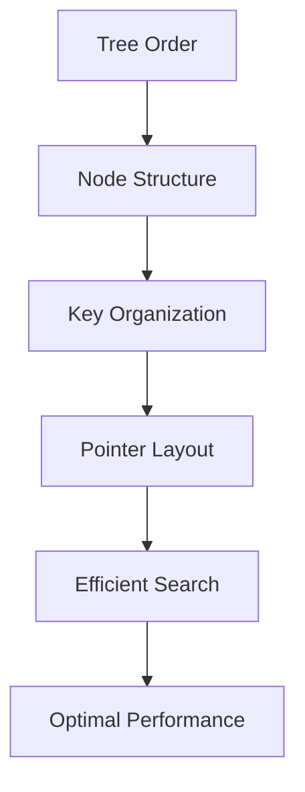

# Key Abstractions: The Building Blocks of B-Trees

## The Four Fundamental Abstractions

Understanding B-Trees requires mastering four core abstractions: **Nodes**, **Keys**, **Pointers**, and **Tree Order**. These abstractions work together to create a data structure that efficiently bridges the gap between logical organization and physical storage.

## The Filing System Analogy

Before diving into technical details, imagine a multi-level filing system in a large office building:

- **The building** represents the entire B-Tree
- **Each floor** represents a level of the tree
- **Each filing cabinet** represents a node
- **Each drawer** represents a key-value pair
- **Directory signs** represent pointers to other floors/cabinets
- **The building's design rules** represent the tree order

This analogy helps us understand how B-Trees organize information hierarchically while keeping related data physically close.

## 1. Nodes: The Storage Containers

### What Is a Node?

A node is the fundamental storage unit in a B-Tree—a container that holds multiple keys and their associated data or pointers. Think of it as a filing cabinet that can hold many folders.

### Node Structure

```
B-Tree Node Layout:
┌─────────────────────────────────────────────────────────────┐
│ Header │ Key₁ │ Ptr₁ │ Key₂ │ Ptr₂ │ ... │ Keyₙ │ Ptrₙ₊₁ │
└─────────────────────────────────────────────────────────────┘
```

#### Node Header
Contains metadata about the node:
- **Node type**: Internal or leaf
- **Key count**: Number of keys currently stored
- **Parent pointer**: Reference to parent node (optional)
- **Free space**: Amount of unused space in node
- **Checksum**: For detecting corruption

#### Node Types

**Internal Nodes** (non-leaf):
- Contain keys and pointers to child nodes
- Act as an index or directory
- Don't store actual data (usually)
- Guide searches to the correct subtree

**Leaf Nodes**:
- Contain keys and actual data values
- Have no child pointers
- Often linked together for efficient range scans
- Where the real data lives

### Node Size Considerations

The node size is crucial for performance:

```
Too small (< 1KB):
- Wasted disk bandwidth
- Deep tree structure
- More disk reads needed

Too large (> 64KB):
- Poor cache utilization
- Wasted memory
- Difficult to manage

Optimal size (4KB-16KB):
- Matches disk page size
- Good cache utilization
- Reasonable memory usage
```

### Node Capacity

The number of keys a node can hold depends on:

```
Node capacity = (Node size - Header size) / (Key size + Pointer size)

Example:
- Node size: 4KB = 4096 bytes
- Header size: 64 bytes
- Key size: 8 bytes (64-bit integer)
- Pointer size: 8 bytes (64-bit address)
- Available space: 4096 - 64 = 4032 bytes
- Capacity: 4032 / (8 + 8) = 252 keys per node
```

## 2. Keys: The Navigation System

### What Are Keys?

Keys are the values used to order and locate data in the B-Tree. They serve as both the search criteria and the organizational principle. In our filing system analogy, keys are like the labels on drawers.

### Key Properties

#### Ordering
Keys must be totally ordered (comparable):
```
For any two keys a and b:
- a < b, or
- a = b, or  
- a > b
```

#### Uniqueness
Keys are typically unique within the tree:
- No two keys can be exactly equal
- Enables unambiguous lookups
- Simplifies insertion/deletion algorithms

#### Immutability
Keys generally don't change once inserted:
- Changing a key would require reorganizing the tree
- Updates typically delete old key and insert new one
- Maintains tree invariants

### Key Types

**Simple Keys**:
```
Integer keys: 1, 2, 3, 4, 5, ...
String keys: "apple", "banana", "cherry", ...
Timestamp keys: 2024-01-15 10:30:00, ...
```

**Composite Keys**:
```
Multi-column keys: (department, employee_id)
Hierarchical keys: (year, month, day, hour)
Compound keys: (last_name, first_name, birth_date)
```

**Derived Keys**:
```
Hash keys: hash(original_value)
Transformed keys: uppercase(string)
Computed keys: (x² + y²) for spatial data
```

### Key Distribution

The distribution of keys affects B-Tree performance:

```
Uniform distribution:
- Even node utilization
- Predictable performance
- Balanced tree growth

Skewed distribution:
- Uneven node utilization
- Hotspots in tree
- Potential performance issues

Sequential insertion:
- Efficient for bulk loading
- Can cause rightmost node hotspots
- May require special handling
```

## 3. Pointers: The Connection Network

### What Are Pointers?

Pointers are references that connect nodes to their children, creating the tree structure. In our filing system analogy, pointers are like directory signs that tell you which floor to go to for specific ranges of information.

### Pointer Types

#### Child Pointers
Internal nodes contain pointers to child nodes:
```
Internal node with keys [10, 20, 30]:
- Pointer 1: Points to child with keys < 10
- Pointer 2: Points to child with keys 10-19
- Pointer 3: Points to child with keys 20-29
- Pointer 4: Points to child with keys ≥ 30
```

#### Data Pointers
Leaf nodes may contain pointers to actual data:
```
Leaf node:
- Key: 12345
- Data pointer: Points to full record on disk
- Or: Key and data stored together in node
```

#### Sibling Pointers
Leaf nodes often link to adjacent nodes:
```
Leaf node connections:
[Node A] ←→ [Node B] ←→ [Node C]
Enables efficient range scans
```

### Pointer Implementation

**Physical Pointers**:
```
Disk addresses: Block number + offset
Memory addresses: Virtual memory pointers
File positions: Byte offset in file
```

**Logical Pointers**:
```
Node IDs: Unique identifier for each node
Page numbers: Logical page in storage system
Object references: High-level language references
```

### Pointer Arithmetic

B-Trees use pointer arithmetic for navigation:

```
Finding child for key K in internal node:
1. Find largest key ≤ K
2. Use corresponding pointer
3. Navigate to child node

Example:
Node keys: [10, 20, 30]
Search key: 25
Result: Use pointer after key 20
```

## 4. Tree Order: The Organizational Rules

### What Is Tree Order?

Tree order (also called degree) defines the structural rules that govern how nodes are organized. It's like the building codes that determine how many drawers each filing cabinet must have.

### Order Definition

For a B-Tree of order `m`:
- Each internal node has at most `m` children
- Each internal node has at least `⌈m/2⌉` children (except root)
- Each node has at most `m-1` keys
- Each node has at least `⌈m/2⌉ - 1` keys (except root)
- The root has at least 1 key (unless tree is empty)

### Order Examples

**Order 3 (2-3 Tree)**:
```
- Max keys per node: 2
- Min keys per node: 1 (except root)
- Max children per node: 3
- Min children per node: 2 (except root)
```

**Order 101**:
```
- Max keys per node: 100
- Min keys per node: 50 (except root)
- Max children per node: 101
- Min children per node: 51 (except root)
```

### Order Selection

Choosing the right order depends on several factors:

```
Factors to consider:
- Node size constraints
- Key and pointer sizes
- Expected data distribution
- Query patterns
- Hardware characteristics

Common orders:
- Small systems: 3-10
- Database systems: 50-200
- File systems: 100-500
```

### Order Impact on Performance

```
Higher order:
✓ Shorter tree height
✓ Fewer disk reads
✓ Better cache utilization
✗ More complex node operations
✗ Higher memory usage per node

Lower order:
✓ Simpler node operations
✓ Lower memory usage per node
✓ Faster individual operations
✗ Taller tree structure
✗ More disk reads needed
```

## The Interaction Between Abstractions

### How They Work Together



### Example: Search Operation

```
Search for key 25 in B-Tree of order 5:

1. Start at root node
   Keys: [10, 20, 30, 40]
   Pointers: [P1, P2, P3, P4, P5]

2. Compare 25 with keys:
   25 > 20 and 25 < 30
   Follow pointer P3

3. Arrive at internal node:
   Keys: [22, 24, 26, 28]
   Pointers: [P1, P2, P3, P4, P5]

4. Compare 25 with keys:
   25 > 24 and 25 < 26
   Follow pointer P3

5. Arrive at leaf node:
   Keys: [25]
   Data: [Record for key 25]

6. Found!
```

### Example: Node Split

```
Insert key 15 into full node [10, 12, 14, 16]:

1. Node is full (4 keys, order 5)
2. Split required
3. Choose middle key: 14
4. Create two nodes:
   - Left: [10, 12]
   - Right: [15, 16]
5. Promote middle key to parent:
   - Parent gets key 14
   - Parent gets pointers to left and right nodes
```

## Advanced Abstractions

### Variable-Length Keys

Some B-Trees support variable-length keys:

```
Fixed-length keys:
- Predictable space usage
- Simple calculations
- Efficient comparisons

Variable-length keys:
- Complex space management
- Indirection often needed
- More flexible data types
```

### Compressed Keys

B-Trees can compress keys to save space:

```
Prefix compression:
Keys: ["apple", "application", "apply"]
Compressed: ["app", "le", "lication", "ly"]

Suffix compression:
Keys: ["running", "walking", "jumping"]
Compressed: ["runn", "walk", "jump", "ing"]
```

### Multi-Version Nodes

Some B-Trees support versioning:

```
MVCC (Multi-Version Concurrency Control):
- Multiple versions of same node
- Readers see consistent snapshot
- Writers create new versions
- Garbage collection removes old versions
```

## Implementation Considerations

### Memory Layout

Efficient memory layout is crucial:

```
Array-based layout:
┌─────────────────────────────────────────┐
│ Header │ Key₁ │ Key₂ │ ... │ Ptr₁ │ Ptr₂ │
└─────────────────────────────────────────┘
Pros: Cache-friendly, simple indexing
Cons: Fixed size, complex insertions

Linked layout:
┌─────────┐    ┌─────────┐    ┌─────────┐
│ Header  │ → │ Key₁    │ → │ Key₂    │
└─────────┘    └─────────┘    └─────────┘
Pros: Dynamic size, easy insertion
Cons: Poor cache locality, complex
```

### Persistence

B-Trees must handle persistent storage:

```
Serialization:
- Convert in-memory structure to disk format
- Handle endianness and alignment
- Manage variable-length data

Deserialization:
- Reconstruct in-memory structure
- Validate data integrity
- Handle version differences
```

### Error Handling

Robust error handling is essential:

```
Corruption detection:
- Checksums on nodes
- Structural invariant checking
- Cross-reference validation

Recovery strategies:
- Backup and restore
- Partial reconstruction
- Graceful degradation
```

## Performance Characteristics

### Time Complexity

```
Search: O(log_m n)
Insert: O(log_m n)
Delete: O(log_m n)
Range scan: O(log_m n + k) where k is result size
```

### Space Complexity

```
Space: O(n)
Node utilization: 50-100% (guaranteed minimum 50%)
Overhead: Pointers and metadata
```

### Cache Behavior

```
Cache hits:
- Large nodes improve cache utilization
- Sequential access patterns help
- Prefetching can be effective

Cache misses:
- Random access patterns hurt
- Node size affects miss penalty
- Memory hierarchy matters
```

## Design Patterns

### Common Patterns

**Bulk Loading**:
```
- Sort data first
- Build tree bottom-up
- Optimize for sequential access
- Minimize node splits
```

**Lazy Deletion**:
```
- Mark nodes as deleted
- Defer actual removal
- Batch cleanup operations
- Maintain performance
```

**Copy-on-Write**:
```
- Share nodes between versions
- Copy only when modified
- Support concurrent access
- Enable versioning
```

## The Big Picture

These four abstractions—nodes, keys, pointers, and tree order—work together to create a data structure that:

1. **Minimizes disk I/O**: Large nodes with many keys
2. **Maintains balance**: Order constraints ensure even distribution
3. **Enables efficient search**: Pointers guide navigation
4. **Supports concurrent access**: Node-level locking possible
5. **Adapts to workloads**: Tunable parameters for different use cases

Understanding these abstractions is crucial because they appear in every B-Tree implementation, from simple in-memory structures to complex distributed database systems. They provide the vocabulary and conceptual framework for reasoning about B-Tree behavior and performance.

The next step is seeing these abstractions in action through visualization and practical examples, which will solidify your understanding of how B-Trees work in practice.