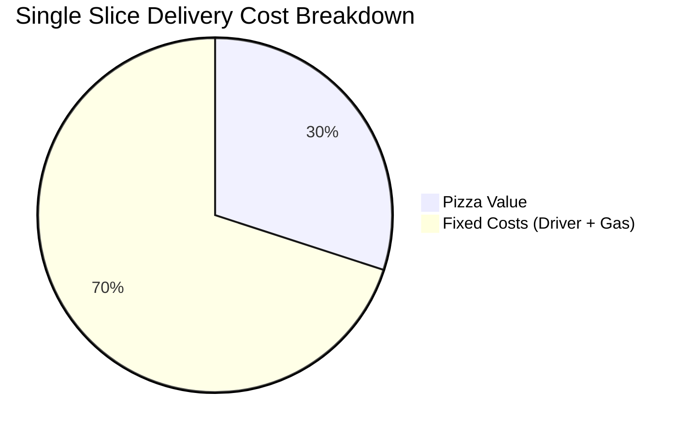
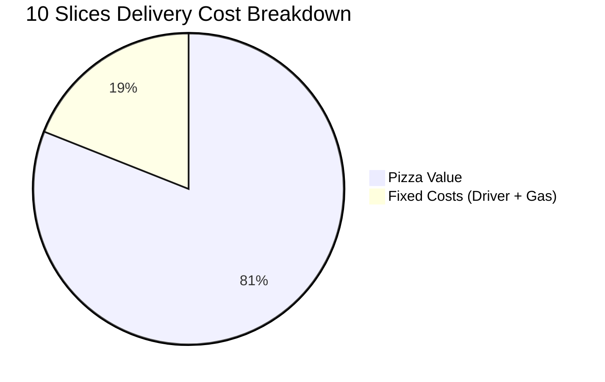
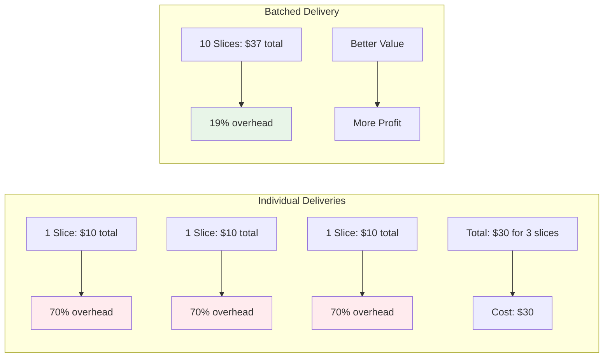
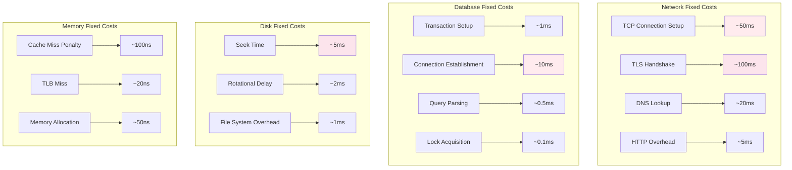
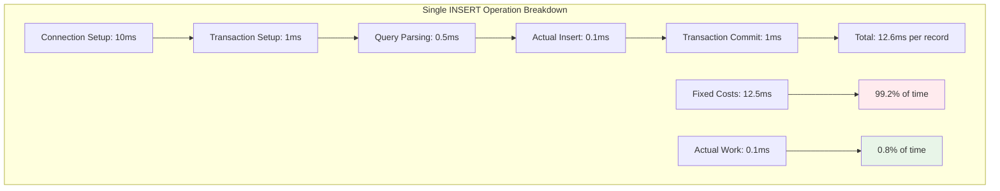
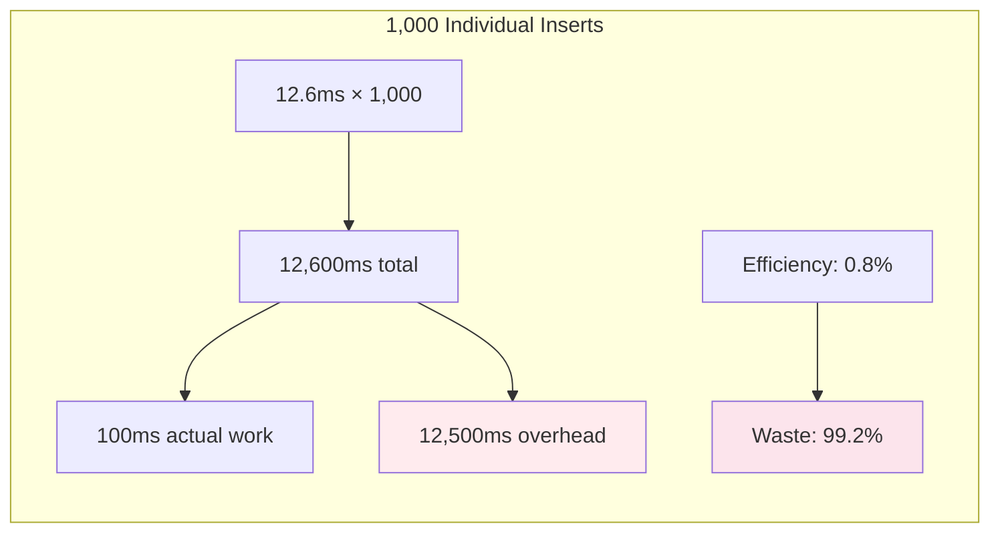
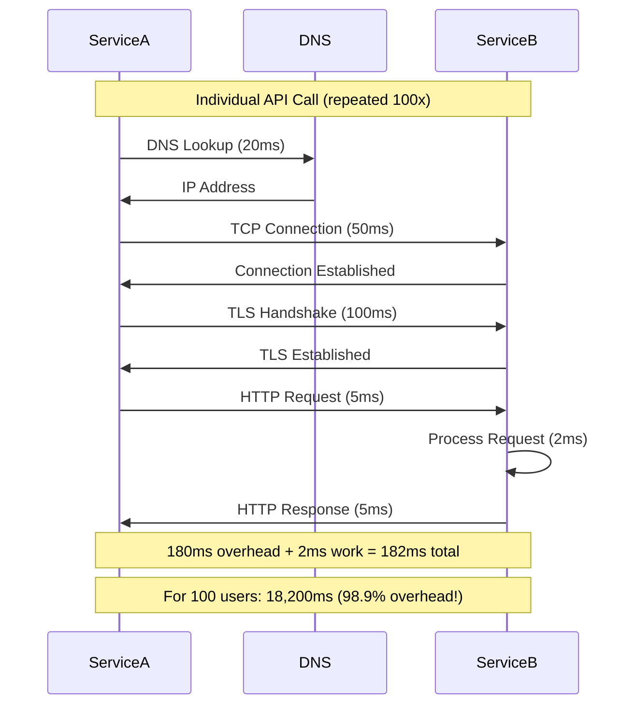
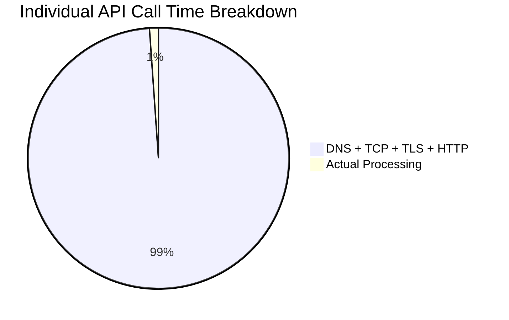
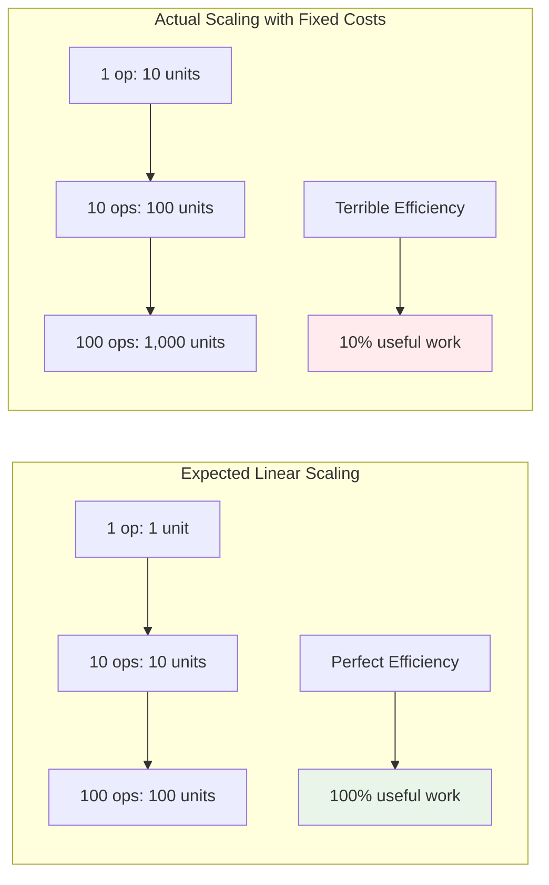
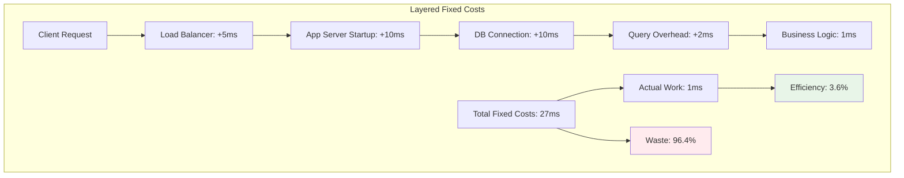

# The Core Problem: The Tyranny of Fixed Costs

## The Universal Overhead Problem

Imagine you're running a pizza delivery service. You have a customer who orders a single slice of pizza. The cost breakdown looks like this:

- **Pizza slice**: $3
- **Driver's time**: $5
- **Gas and vehicle wear**: $2
- **Total cost**: $10 to deliver a $3 item

Now imagine another customer orders 10 slices for a party. The cost breakdown:

- **Pizza slices**: $30
- **Driver's time**: $5 (same trip)
- **Gas and vehicle wear**: $2 (same trip)
- **Total cost**: $37 to deliver $30 worth of items

### Cost Efficiency Visualization





### The Efficiency Transformation



In the first case, fixed costs (driver + gas) represent 70% of the total cost. In the second case, they're only 19%. This is the fundamental problem that batching solves: **fixed costs dominate when operations are performed individually**.

## The Anatomy of Fixed Costs

### What Are Fixed Costs?

Fixed costs are expenses that remain constant regardless of how much work you do in a single operation. In computing systems, these appear everywhere:



**Network Operations:**
- **TCP connection setup**: 3-way handshake (~50ms)
- **TLS handshake**: Certificate exchange (~100ms)
- **DNS lookup**: Domain resolution (~20ms)
- **HTTP overhead**: Headers and protocol parsing (~5ms)

**Database Operations:**
- **Transaction setup**: BEGIN/COMMIT overhead (~1ms)
- **Connection establishment**: Authentication and setup (~10ms)
- **Query parsing**: SQL compilation (~0.5ms)
- **Lock acquisition**: Concurrency control (~0.1ms)

**Disk Operations:**
- **Seek time**: Physical head movement (~5ms)
- **Rotational delay**: Waiting for data to rotate (~2ms)
- **File system overhead**: Metadata updates (~1ms)

**Memory Operations:**
- **Cache miss penalty**: Loading cache line (~100ns)
- **TLB miss**: Page table lookup (~20ns)
- **Memory allocation**: Heap management (~50ns)

### The Mathematics of Waste

Let's examine a concrete example with database inserts:



**Single INSERT operation breakdown**:
- Connection setup: 10ms
- Transaction setup: 1ms  
- Query parsing: 0.5ms
- **Actual insert: 0.1ms**
- Transaction commit: 1ms
- **Total: 12.6ms per record**

Fixed costs: 12.5ms (99.2% of total time)
Actual work: 0.1ms (0.8% of total time)

### The Scaling Disaster



For 1,000 individual inserts:
- **Total time**: 1,000 × 12.6ms = 12,600ms (12.6 seconds)
- **Actual work**: 1,000 × 0.1ms = 100ms  
- **Waste**: 12,500ms (99.2% wasted on overhead)

## Real-World Examples of Fixed Cost Domination

### Web API Calls

Consider a microservices architecture where Service A needs to fetch user data for 100 users from Service B:



### The API Call Waste Analysis



**Individual API Calls breakdown:**
- DNS lookup: 20ms
- TCP connection: 50ms
- TLS handshake: 100ms  
- HTTP request: 5ms
- **Actual processing: 2ms**
- HTTP response: 5ms
- **Total: 182ms per user**

For 100 users:
- **Total time**: 100 × 182ms = 18,200ms (18.2 seconds)
- **Actual work**: 100 × 2ms = 200ms (1.1% of total time)
- **Overhead**: 18,000ms (98.9% wasted on protocol overhead)

### File System Operations

Reading configuration from 50 small files:

**Individual File Reads:**
```
For each file:
- File system lookup: 1ms
- Disk seek: 5ms
- File open: 0.5ms
- Read data: 0.1ms
- File close: 0.5ms
- Total: 7.1ms per file

For 50 files:
- Total time: 50 × 7.1ms = 355ms
- Actual work: 50 × 0.1ms = 5ms (1.4% of total time)
- Overhead: 350ms (98.6% wasted on file system overhead)
```

### Message Queue Processing

Processing messages from a queue one at a time:

**Individual Message Processing:**
```
For each message:
- Queue connection: 2ms
- Message dequeue: 1ms
- Deserialization: 0.5ms
- Business logic: 5ms
- Response serialization: 0.5ms
- Acknowledgment: 1ms
- Total: 10ms per message

For 100 messages:
- Total time: 100 × 10ms = 1,000ms
- Actual work: 100 × 5ms = 500ms (50% of total time)
- Overhead: 500ms (50% wasted on queue management)
```

## The Scalability Cliff

### Linear Scaling Myth

Many developers assume that performance scales linearly with the number of operations. This is rarely true when fixed costs dominate:



**Expected scaling (linear)**:
- 1 operation: 1 unit of time
- 10 operations: 10 units of time  
- 100 operations: 100 units of time

**Actual scaling (with fixed costs)**:
- 1 operation: 10 units of time (9 fixed + 1 work)
- 10 operations: 100 units of time (90 fixed + 10 work)
- 100 operations: 1,000 units of time (900 fixed + 100 work)

The system becomes 90% inefficient at scale, with most resources consumed by overhead rather than useful work.

### The Compound Effect Visualization

Fixed costs compound when systems are layered:



**Web Application Stack breakdown**:
- Load balancer overhead: 5ms
- Application server startup: 10ms
- Database connection: 10ms
- Query overhead: 2ms
- **Actual business logic: 1ms**
- **Total fixed costs: 27ms**
- **Actual work: 1ms (3.6% efficiency)**

Each layer adds its own fixed costs, creating a multiplication effect that devastates performance.

## The Concurrency Trap

### Thread-Per-Request Model

Consider a web server using thread-per-request:

```
Per request overhead:
- Thread creation: 1ms
- Stack allocation: 8KB memory
- Context switching: 0.1ms
- Thread destruction: 0.5ms
- Total: 1.6ms + 8KB per request

For 1,000 concurrent requests:
- Time overhead: 1,600ms of CPU time
- Memory overhead: 8MB of stack space
- Context switching: 100ms of CPU time
- Total: 1,700ms + 8MB for threading overhead
```

### Resource Contention

Fixed costs create resource contention:

```
Database Connection Pool (10 connections):
- Request 1-10: Get connection immediately
- Request 11-20: Wait for connection (average 50ms)
- Request 21-30: Wait for connection (average 100ms)
- Request 31+: Wait for connection (average 200ms)

Fixed waiting time increases with load, creating a performance cliff.
```

## The Distributed Systems Nightmare

### Network Latency Amplification

In distributed systems, fixed costs are amplified by network latency:

```
Microservices Query (needs data from 5 services):
- Network round-trip: 50ms per service
- Service processing: 10ms per service
- Total per service: 60ms

Sequential execution:
- Total time: 5 × 60ms = 300ms
- Actual work: 5 × 10ms = 50ms (16.7% efficiency)
- Network overhead: 250ms (83.3% wasted on network)
```

### The Chatty Interface Problem

APIs that require multiple calls to accomplish a single task:

```
E-commerce Checkout Process:
1. Validate user: 150ms (100ms network + 50ms processing)
2. Check inventory: 150ms (100ms network + 50ms processing)
3. Calculate tax: 150ms (100ms network + 50ms processing)
4. Process payment: 150ms (100ms network + 50ms processing)
5. Update inventory: 150ms (100ms network + 50ms processing)
6. Send confirmation: 150ms (100ms network + 50ms processing)

Total: 900ms (600ms network + 300ms processing)
Network overhead: 66.7% of total time
```

## The Memory Hierarchy Problem

### CPU Cache Misses

Fixed costs exist at every level of the memory hierarchy:

```
Memory Access Costs:
- L1 cache hit: 1 cycle
- L2 cache hit: 3 cycles
- L3 cache hit: 12 cycles
- RAM access: 100 cycles
- Disk access: 100,000 cycles

Processing one item at a time:
- Each item: potential cache miss (100 cycles)
- 1,000 items: 1,000 potential cache misses
- Total: 100,000 cycles of cache miss overhead
```

### Memory Allocation Overhead

Small, frequent allocations create overhead:

```
Individual Allocations:
- Heap metadata: 16 bytes per allocation
- Fragmentation: ~25% memory waste
- Allocation/deallocation: 50 cycles per operation

For 1,000 small objects (64 bytes each):
- Useful data: 64KB
- Metadata overhead: 16KB (25% waste)
- CPU overhead: 50,000 cycles
- Fragmentation: 16KB additional waste
```

## The Psychological Cost

### Context Switching Overhead

Fixed costs aren't just computational—they're cognitive:

```
Developer Context Switching:
- Understand problem: 5 minutes
- Set up development environment: 10 minutes
- Write code: 15 minutes
- Test and debug: 20 minutes
- Deploy: 5 minutes
- Total: 55 minutes

Actual coding: 15 minutes (27% of total time)
Overhead: 40 minutes (73% wasted on context switching)
```

### Error Handling Complexity

Each individual operation requires error handling:

```
1,000 Individual Operations:
- 1,000 potential failure points
- 1,000 error handling paths
- 1,000 retry mechanisms
- 1,000 logging statements
- 1,000 monitoring points

Complexity grows linearly with operation count.
```

## The Root Cause Analysis

### Why Fixed Costs Exist

Fixed costs exist because of fundamental constraints:

1. **Physical Laws**: Network packets can't travel faster than light
2. **Protocol Design**: TCP requires handshakes for reliability
3. **System Architecture**: Databases need transactions for consistency
4. **Resource Management**: Operating systems need scheduling overhead
5. **Security Requirements**: Authentication and encryption add overhead

### The Efficiency Paradox

The paradox of fixed costs:

```
High-performance systems have high fixed costs:
- Databases: Complex for ACID guarantees
- Networks: Reliable protocols add overhead
- Security: Encryption and authentication
- Concurrency: Locks and synchronization

Simple systems have low fixed costs:
- In-memory operations: Direct memory access
- Single-threaded code: No synchronization
- Trusted environments: No security overhead
```

## The Business Impact

### Performance Degradation

Fixed costs directly impact user experience:

```
Web Page Load Time:
- Acceptable: < 100ms
- Noticeable: 100-300ms
- Problematic: 300-1000ms
- Unacceptable: > 1000ms

With fixed costs of 200ms per API call:
- 1 API call: 200ms (acceptable)
- 2 API calls: 400ms (problematic)
- 5 API calls: 1000ms (unacceptable)
```

### Resource Waste

Fixed costs translate to real costs:

```
Cloud Computing Example:
- Virtual machine: $0.10/hour
- Database connection: $0.01/hour
- Network transfer: $0.05/GB

For 1,000 individual operations:
- VM time: 1,000 × $0.10 = $100
- DB connections: 1,000 × $0.01 = $10
- Network: 1,000 × $0.05 = $50
- Total: $160 for work that could cost $16 if batched
```

## The Fundamental Insight

### The Amortization Principle

The core insight is **amortization**: spread fixed costs across multiple operations.

```
Fixed Cost Amortization:
- Fixed cost: F
- Variable cost per item: V
- Batch size: N

Individual operations:
- Cost per item: F + V
- Total cost for N items: N × (F + V)

Batched operations:
- Cost per batch: F + (N × V)
- Cost per item: (F + N × V) / N = F/N + V
- Total cost for N items: F + (N × V)

Savings: N × F - F = F × (N - 1)
```

### The Efficiency Equation

The efficiency of batching depends on the ratio of fixed to variable costs:

```
Efficiency = Variable Work / Total Work
         = (N × V) / (F + N × V)
         = N × V / (F + N × V)

As N increases, efficiency approaches 100%.
As F increases relative to V, batching becomes more critical.
```

## The Path Forward

Understanding the fixed cost problem is the first step toward solving it. The solution lies in recognizing that:

1. **Fixed costs are inevitable** in complex systems
2. **Individual operations are inherently inefficient** when fixed costs dominate
3. **Batching is the universal solution** to amortize fixed costs
4. **The optimal batch size** depends on the specific fixed-to-variable cost ratio

The next step is understanding how batching works as a philosophy and technique to transform inefficient individual operations into efficient bulk operations.

This problem is fundamental to computer science and appears at every level of system design, from CPU instruction batching to distributed system message aggregation. Recognizing and solving it is crucial for building performant, scalable systems.