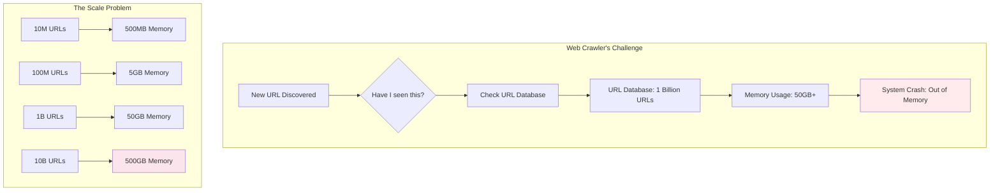
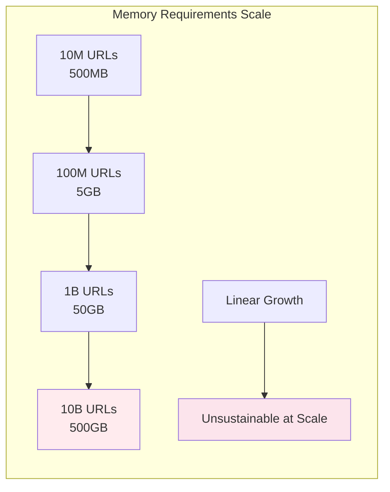
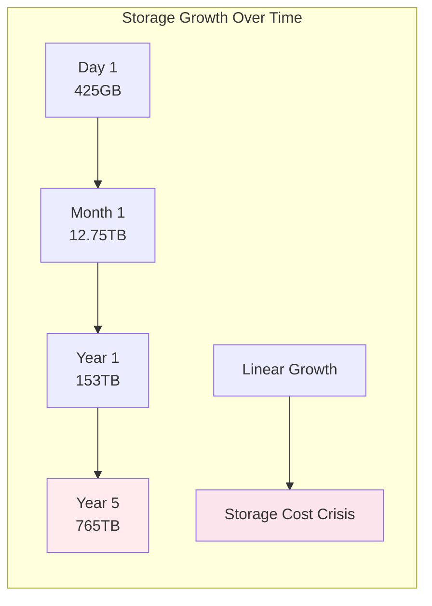

# The Core Problem: Membership Testing at Scale

## The Universal "Have I Seen This Before?" Question

Imagine you're running a web crawler that processes millions of URLs every day. Before crawling a new URL, you need to check: "Have I seen this URL before?" This seems like a simple question, but at scale, it becomes a nightmare.

### The Crawler's Dilemma Visualized



**The naive approach:**
```python
seen_urls = set()

def should_crawl(url):
    if url in seen_urls:
        return False  # Already seen
    seen_urls.add(url)
    return True  # New URL, crawl it
```

### Memory Explosion Visualization



**The reality check:**
- **10 million URLs**: ~500MB of memory (50 bytes per URL)
- **100 million URLs**: ~5GB of memory  
- **1 billion URLs**: ~50GB of memory
- **10 billion URLs**: ~500GB of memory

This is the fundamental problem: **exact membership testing requires storing every element**, which becomes prohibitively expensive as the set grows.

## The Memory Wall

### Scale-Driven Memory Explosion

Let's examine real-world scenarios where membership testing hits the memory wall:


### Real-World Storage Requirements



**Web Search Engine:**
- Google processes ~8.5 billion searches per day
- Need to check if a query has been seen before
- Storage per query: ~50 bytes
- Daily storage: 8.5B × 50 = 425GB
- Monthly storage: 425GB × 30 = 12.75TB
- Yearly storage: 12.75TB × 12 = 153TB

**Social Media Platform:**
- Facebook processes ~4 billion posts per day
- Need to detect duplicate content
- Storage per post hash: ~32 bytes
- Daily storage: 4B × 32 = 128GB
- Monthly storage: 128GB × 30 = 3.84TB
- Yearly storage: 3.84TB × 12 = 46TB

**Email Spam Detection:**
```
Global email volume: ~300 billion emails per day
Need to check if email fingerprint was seen before
- Storage per email fingerprint: ~64 bytes
- Daily storage: 300B × 64 = 19.2TB
- Monthly storage: 19.2TB × 30 = 576TB
- Yearly storage: 576TB × 12 = 6.9PB
```

### The Cost of Exactness

The fundamental issue is that **exact membership testing** requires **exact storage**:

```
Exact Set Operations:
- Insert(item): Store the complete item
- Contains(item): Compare against every stored item
- Space complexity: O(n × item_size)
- Time complexity: O(1) with hash tables, O(log n) with trees

Memory Requirements:
- Each item must be stored completely
- Hash tables need load factor overhead (~2x)
- No compression possible (need exact matches)
- Memory grows linearly with set size
```

## Real-World Manifestations

### Database Query Optimization

Consider a database query optimizer that needs to avoid recomputing expensive query plans:

```sql
-- Expensive query that takes 5 seconds to plan
SELECT o.customer_id, SUM(oi.quantity * p.price) as total
FROM orders o
JOIN order_items oi ON o.order_id = oi.order_id
JOIN products p ON oi.product_id = p.product_id
WHERE o.order_date >= '2023-01-01'
GROUP BY o.customer_id
HAVING total > 10000
ORDER BY total DESC;
```

**The caching challenge:**
- **Query text**: 500 bytes
- **Execution plan**: 50KB
- **Total per query**: 50.5KB
- **Million unique queries**: 50.5GB
- **Billion unique queries**: 50.5TB

### CDN Cache Management

A Content Delivery Network (CDN) needs to decide whether to cache new content:

```
CDN Cache Decision Process:
1. Request comes in for /images/cat-video-thumbnail.jpg
2. Check: "Have we cached this before?"
3. If yes: Serve from cache
4. If no: Fetch from origin, cache it

Memory Requirements:
- URLs average 100 bytes
- 1 billion cached objects = 100GB just for URLs
- Plus cache metadata, headers, etc.
- Total: 200-300GB just to track what's cached
```

### Distributed System Deduplication

In a distributed logging system, you need to avoid storing duplicate log entries:

```
Log Entry Example:
{
  "timestamp": "2023-12-01T10:30:00Z",
  "level": "ERROR",
  "service": "user-service",
  "message": "Database connection failed",
  "trace_id": "abc123...",
  "user_id": "user_456"
}

Deduplication Challenge:
- Average log entry: 200 bytes
- 1 trillion log entries per day: 200TB
- Need to check duplicates across all entries
- Exact storage requirement: 200TB just for deduplication
```

## The Performance Cliff

### Linear Degradation

As the set size grows, performance degrades in multiple ways:

**Memory Access Patterns:**
```
Small sets (< 1MB):
- All data fits in CPU cache
- Lookup time: ~1 nanosecond
- Memory bandwidth: Not a bottleneck

Medium sets (1MB - 1GB):
- Data fits in RAM
- Lookup time: ~100 nanoseconds
- Memory bandwidth: Starting to matter

Large sets (> 1GB):
- Data doesn't fit in RAM
- Lookup time: ~10 milliseconds (disk access)
- Memory bandwidth: Major bottleneck
```

**Cache Hierarchy Impact:**
```
L1 Cache (32KB): 1 cycle access
L2 Cache (256KB): 3 cycle access
L3 Cache (8MB): 12 cycle access
RAM (16GB): 100 cycle access
SSD (1TB): 100,000 cycle access
HDD (4TB): 10,000,000 cycle access
```

### The Thrashing Problem

When the set is too large for available memory, the system starts thrashing:

```
Thrashing Symptoms:
- Constant disk I/O for lookups
- Page faults on every access
- System becomes I/O bound
- Response time degrades from microseconds to seconds
- CPU utilization drops (waiting for I/O)
```

## The Distributed Challenge

### Sharding Complexity

When a single machine can't hold the entire set, you need to distribute:

```
Sharding Approach:
1. Hash the item to determine which shard to check
2. Send network request to appropriate shard
3. Wait for response
4. Handle network failures and retries

Added Complexity:
- Network latency: 1-100ms per lookup
- Network failures: Need retry logic
- Consistency: What if shard is updating?
- Load balancing: Some shards may be overloaded
```

### Consistency Nightmares

In distributed systems, maintaining consistency becomes complex:

```
Consistency Challenges:
- Split-brain scenarios
- Network partitions
- Race conditions between updates
- Eventual consistency vs. strong consistency
- Conflict resolution strategies
```

## The Cost-Benefit Analysis

### Memory Costs

Let's calculate the actual cost of exact membership testing:

```
AWS Memory Pricing (2023):
- r5.large: $0.126/hour, 16GB RAM
- Cost per GB per hour: $0.126/16 = $0.0079
- Cost per GB per year: $0.0079 × 24 × 365 = $69

Storage Costs:
- 1TB membership data: $69,000/year in memory
- 10TB membership data: $690,000/year in memory
- 100TB membership data: $6,900,000/year in memory
```

### Performance Costs

The performance impact compounds over time:

```
Performance Degradation:
- 1% slower responses: 1% less revenue
- 10% slower responses: 10% less revenue
- 100% slower responses: Users leave

User Experience Impact:
- 100ms delay: 1% drop in sales
- 1 second delay: 11% drop in page views
- 10 seconds delay: Complete user abandonment
```

## The Approximation Insight

### The Key Realization

The breakthrough insight is that **many use cases don't actually need exact membership testing**. They can work with:

1. **No false negatives**: If something is in the set, always say "yes"
2. **Acceptable false positives**: If something isn't in the set, occasionally say "yes"

### Use Cases That Can Tolerate False Positives

**Web Crawling:**
```
Question: "Have I crawled this URL before?"
False positive impact: Skip a URL that hasn't been crawled
- Cost: Miss one web page
- Benefit: Save entire crawl cost
- Trade-off: Excellent (occasional misses vs. guaranteed savings)
```

**Spam Detection:**
```
Question: "Is this email spam?"
False positive impact: Mark legitimate email as spam
- Cost: One email goes to spam folder
- Benefit: Block all actual spam
- Trade-off: Good (rare false positives vs. spam-free inbox)
```

**Cache Management:**
```
Question: "Is this content cached?"
False positive impact: Think content is cached when it isn't
- Cost: One cache miss (fetch from origin)
- Benefit: Fast decisions for all actual cache hits
- Trade-off: Excellent (occasional fetch vs. instant responses)
```

### The Probabilistic Advantage

Probabilistic data structures offer a different trade-off:

```
Exact Membership Testing:
- Space: O(n × item_size)
- Time: O(1) or O(log n)
- Accuracy: 100%
- Scalability: Poor

Probabilistic Membership Testing:
- Space: O(1) or O(log n) - independent of item size!
- Time: O(1)
- Accuracy: 99.9%+ (configurable)
- Scalability: Excellent
```

## The Pattern Recognition

### Common Membership Testing Patterns

**Pattern 1: The Negative Filter**
```
Use case: "Skip expensive operations for items I've already processed"
Examples:
- Skip expensive database queries
- Skip redundant network requests
- Skip duplicate computations
- Skip already-processed files

Bloom filter benefit: Eliminate most expensive operations
```

**Pattern 2: The Duplicate Detector**
```
Use case: "Identify duplicate items in a stream"
Examples:
- Duplicate email detection
- Duplicate log entry filtering
- Duplicate transaction prevention
- Duplicate content identification

Bloom filter benefit: Reduce storage for duplicate tracking
```

**Pattern 3: The Prefilter**
```
Use case: "Quick check before expensive exact lookup"
Examples:
- Check bloom filter before database query
- Check bloom filter before disk access
- Check bloom filter before network request
- Check bloom filter before computation

Bloom filter benefit: Avoid expensive operations for non-existent items
```

### The Two-Tier Architecture

A common pattern emerges:

```
Two-Tier Membership Testing:
1. Fast probabilistic filter (Bloom filter)
   - Handles 99%+ of negative cases instantly
   - Uses minimal memory
   - No false negatives

2. Expensive exact lookup (Database/Disk/Network)
   - Handles remaining cases
   - Uses traditional storage
   - Perfect accuracy

Combined Benefits:
- Fast response for common cases
- Perfect accuracy when needed
- Minimal memory usage
- Excellent scalability
```

## The Mathematical Foundation

### The Space-Time Trade-off

The fundamental equation for membership testing:

```
Exact Approach:
Space = n × item_size
Time = O(1) per lookup
False Positive Rate = 0%

Probabilistic Approach:
Space = -n × ln(p) / (ln(2))²
Time = O(1) per lookup
False Positive Rate = p (configurable)

Where:
- n = number of items
- p = desired false positive rate
- item_size = bytes per item
```

### The Efficiency Breakthrough

For typical scenarios, the space savings are dramatic:

```
Example: 1 billion URLs, 1% false positive rate
Exact storage: 1B × 50 bytes = 50GB
Bloom filter: 1B × 9.6 bits = 1.2GB
Space savings: 42x reduction!

Example: 1 billion email hashes, 0.1% false positive rate
Exact storage: 1B × 32 bytes = 32GB
Bloom filter: 1B × 14.4 bits = 1.8GB
Space savings: 18x reduction!
```

## The Practical Implications

### When Bloom Filters Shine

**Excellent use cases:**
1. **High-volume, low-cost false positives**: Web crawling, caching decisions
2. **Expensive exact lookups**: Database queries, disk access, network requests
3. **Memory-constrained environments**: Mobile apps, embedded systems
4. **Distributed systems**: Reduce network calls, improve latency

**Poor use cases:**
1. **Critical exact matching**: Financial transactions, user authentication
2. **High false positive costs**: Medical decisions, safety systems
3. **Small datasets**: Overhead not worth it
4. **Frequently changing data**: Bloom filters are append-only

### The Design Decision Framework

When evaluating Bloom filters, ask:

1. **Can I tolerate false positives?** What's the cost?
2. **Are exact lookups expensive?** How much time/money do they cost?
3. **Is memory limited?** What's the cost of exact storage?
4. **Is the dataset growing?** Will it outgrow memory?
5. **Are false positives recoverable?** Can I fall back to exact lookup?

## The Path Forward

Understanding this core problem is crucial because it appears everywhere in computer science:

- **Databases**: Query optimization, join algorithms
- **Distributed Systems**: Membership protocols, gossip algorithms
- **Networking**: Route filtering, packet classification
- **Security**: Malware detection, intrusion prevention
- **Machine Learning**: Feature selection, dimensionality reduction

The solution lies in embracing **probabilistic data structures** that trade perfect accuracy for practical efficiency. Bloom filters are the most fundamental and widely-used example of this paradigm.

The next step is understanding how Bloom filters solve this problem through their ingenious probabilistic approach, transforming the membership testing problem from "store everything exactly" to "remember just enough to be useful."