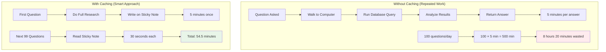
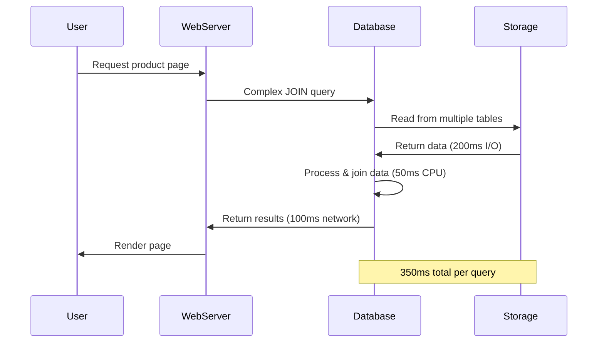
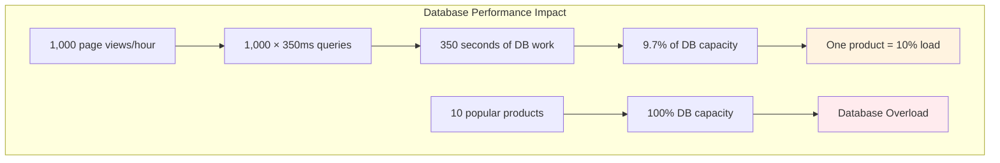

# The Core Problem: The Cost of Repeated Work

## The Universal Slowness Problem

Imagine you're a librarian who has to answer the same question 100 times a day: "What's the most popular book this month?" Each time, you walk across the library, check the computer system, run a query, analyze the results, and return with the answer. The task takes 5 minutes every time.

By the end of the day, you've spent 8 hours just answering this one question. You could have written the answer on a sticky note after the first query and saved yourself 7 hours and 55 minutes of work.

### The Librarian's Dilemma Visualized



**Time Comparison:**
- **Without caching**: 8 hours 20 minutes
- **With caching**: 54.5 minutes  
- **Time saved**: 7 hours 25 minutes (89% reduction)

This is the fundamental problem that caching solves: **expensive operations are repeated unnecessarily**.

## The Anatomy of Expensive Operations

### Database Queries

Consider a popular e-commerce site displaying product information:



**Complex Query Example:**
```sql
-- Complex query that joins multiple tables
SELECT 
    p.product_id,
    p.name,
    p.description,
    p.price,
    c.category_name,
    AVG(r.rating) as avg_rating,
    COUNT(r.rating) as review_count,
    i.image_url
FROM products p
JOIN categories c ON p.category_id = c.category_id
JOIN reviews r ON p.product_id = r.product_id
JOIN product_images i ON p.product_id = i.product_id
WHERE p.product_id = 12345
GROUP BY p.product_id, p.name, p.description, p.price, c.category_name, i.image_url;
```

### The Database Load Problem



**The expensive reality:**
- Database server CPU: 50ms of processing
- Disk I/O: 200ms for data retrieval  
- Network latency: 100ms round-trip
- **Total time: 350ms per query**

If this product page is viewed 1,000 times per hour:
- Total database load: 1,000 × 350ms = 350 seconds of work
- Database CPU utilization: 350 seconds / 3,600 seconds = 9.7%
- **Just one product consuming 10% of database capacity**

### API Calls

External service calls are even more expensive:

```python
import requests
import time

def get_weather_data(city):
    """Expensive external API call"""
    url = f"https://api.weather.com/v2/current/{city}"
    headers = {"API-Key": "your-api-key"}
    
    start_time = time.time()
    response = requests.get(url, headers=headers)
    end_time = time.time()
    
    print(f"Weather API call took {end_time - start_time:.2f} seconds")
    return response.json()

# Example usage
weather = get_weather_data("New York")
# Output: Weather API call took 2.34 seconds
```

**The cost breakdown:**
- DNS lookup: 50ms
- TCP connection: 100ms  
- TLS handshake: 200ms
- HTTP request/response: 500ms
- API processing: 1,500ms
- **Total: 2.35 seconds**

For a weather widget on a popular site:
- 10,000 users per hour
- Each user checks weather 3 times
- Total API calls: 30,000 per hour
- Total time spent: 30,000 × 2.35s = 70,500 seconds = 19.6 hours
- **Using 19.6 hours of API time every hour!**

### Complex Computations

Mathematical calculations can be prohibitively expensive:

```python
def calculate_fibonacci(n):
    """Naive recursive Fibonacci - exponentially expensive"""
    if n <= 1:
        return n
    return calculate_fibonacci(n-1) + calculate_fibonacci(n-2)

# Timing the calculation
import time

start = time.time()
result = calculate_fibonacci(35)
end = time.time()

print(f"fibonacci(35) = {result}")
print(f"Calculation took {end - start:.2f} seconds")
# Output: fibonacci(35) = 9227465
# Output: Calculation took 3.42 seconds
```

**The exponential explosion:**
- fibonacci(35): 3.42 seconds
- fibonacci(40): 34.2 seconds (10x slower)
- fibonacci(45): 342 seconds (100x slower)
- **Each increment roughly doubles the time**

### File System Operations

Reading from disk is expensive compared to memory:

```python
import os
import time

def read_large_file(filename):
    """Reading a large file from disk"""
    start_time = time.time()
    
    with open(filename, 'r') as file:
        content = file.read()
    
    end_time = time.time()
    print(f"Reading {filename} took {end_time - start_time:.3f} seconds")
    return content

# Example with a 100MB file
content = read_large_file("large_dataset.txt")
# Output: Reading large_dataset.txt took 0.847 seconds
```

**The storage hierarchy:**
- CPU registers: 0.1 nanoseconds
- L1 cache: 1 nanosecond
- L2 cache: 10 nanoseconds
- RAM: 100 nanoseconds
- SSD: 100,000 nanoseconds (100 microseconds)
- HDD: 10,000,000 nanoseconds (10 milliseconds)
- **Network storage: 100,000,000 nanoseconds (100 milliseconds)**

## Real-World Impact Analysis

### E-commerce Product Page

Let's analyze a typical e-commerce product page that displays:

```python
def render_product_page(product_id):
    """Expensive product page rendering"""
    
    # Database query for product details
    start = time.time()
    product_info = database.query("""
        SELECT p.*, c.category_name, AVG(r.rating) as rating
        FROM products p 
        JOIN categories c ON p.category_id = c.category_id
        LEFT JOIN reviews r ON p.product_id = r.product_id
        WHERE p.product_id = %s
        GROUP BY p.product_id, c.category_name
    """, [product_id])
    db_time = time.time() - start
    
    # External API call for inventory
    start = time.time()
    inventory = inventory_api.get_stock(product_id)
    inventory_time = time.time() - start
    
    # External API call for shipping options
    start = time.time()
    shipping = shipping_api.get_options(product_id)
    shipping_time = time.time() - start
    
    # Complex price calculation
    start = time.time()
    pricing = calculate_dynamic_pricing(product_id)
    pricing_time = time.time() - start
    
    total_time = db_time + inventory_time + shipping_time + pricing_time
    
    print(f"Product page render breakdown:")
    print(f"  Database query: {db_time:.3f}s")
    print(f"  Inventory API: {inventory_time:.3f}s")
    print(f"  Shipping API: {shipping_time:.3f}s")
    print(f"  Price calculation: {pricing_time:.3f}s")
    print(f"  Total time: {total_time:.3f}s")
    
    return {
        'product': product_info,
        'inventory': inventory,
        'shipping': shipping,
        'pricing': pricing
    }

# Example execution
product_data = render_product_page(12345)
```

**Typical output:**
```
Product page render breakdown:
  Database query: 0.250s
  Inventory API: 1.200s  
  Shipping API: 0.800s
  Price calculation: 0.150s
  Total time: 2.400s
```

**Scale impact:**
- 1,000 page views per hour
- Total processing time: 2,400 seconds = 40 minutes
- **40 minutes of server work every hour for one product**

### Social Media Feed

A social media feed aggregation:

```python
def generate_user_feed(user_id):
    """Generate personalized social media feed"""
    
    # Get user's friends (database query)
    start = time.time()
    friends = database.query("""
        SELECT friend_id FROM friendships 
        WHERE user_id = %s AND status = 'active'
    """, [user_id])
    friends_time = time.time() - start
    
    # Get recent posts from friends (expensive query)
    start = time.time()
    posts = database.query("""
        SELECT p.*, u.username, u.profile_image 
        FROM posts p 
        JOIN users u ON p.user_id = u.user_id
        WHERE p.user_id IN %s 
        AND p.created_at > NOW() - INTERVAL '7 days'
        ORDER BY p.created_at DESC, p.likes DESC
        LIMIT 50
    """, [friends])
    posts_time = time.time() - start
    
    # Calculate engagement scores (CPU intensive)
    start = time.time()
    for post in posts:
        post['engagement_score'] = calculate_engagement_score(post)
    engagement_time = time.time() - start
    
    # Sort by algorithmic relevance (complex calculation)
    start = time.time()
    sorted_posts = sort_by_relevance(posts, user_id)
    sort_time = time.time() - start
    
    total_time = friends_time + posts_time + engagement_time + sort_time
    
    print(f"Feed generation breakdown:")
    print(f"  Friends lookup: {friends_time:.3f}s")
    print(f"  Posts query: {posts_time:.3f}s")
    print(f"  Engagement calculation: {engagement_time:.3f}s")
    print(f"  Relevance sorting: {sort_time:.3f}s")
    print(f"  Total time: {total_time:.3f}s")
    
    return sorted_posts

# Example execution
feed = generate_user_feed(67890)
```

**Typical output:**
```
Feed generation breakdown:
  Friends lookup: 0.050s
  Posts query: 1.200s
  Engagement calculation: 0.800s
  Relevance sorting: 0.450s
  Total time: 2.500s
```

**Scale impact:**
- 100,000 active users
- Each user refreshes feed 5 times per hour
- Total feed generations: 500,000 per hour
- Total processing time: 500,000 × 2.5s = 1,250,000 seconds = 347 hours
- **Need 347 server-hours every hour just for feed generation**

## The Memory vs. Speed Trade-off

### The Speed Hierarchy

Different storage types have vastly different access speeds:

```python
import time
import random

def benchmark_storage_access():
    """Benchmark different storage access patterns"""
    
    # In-memory data (cached)
    cached_data = {i: f"value_{i}" for i in range(10000)}
    
    # Database simulation (slow)
    def database_lookup(key):
        time.sleep(0.001)  # Simulate 1ms database query
        return f"value_{key}"
    
    # File system simulation (medium)
    def file_lookup(key):
        time.sleep(0.0001)  # Simulate 0.1ms file read
        return f"value_{key}"
    
    # Test 1000 random lookups
    test_keys = [random.randint(0, 9999) for _ in range(1000)]
    
    # Memory access
    start = time.time()
    for key in test_keys:
        value = cached_data[key]
    memory_time = time.time() - start
    
    # File access  
    start = time.time()
    for key in test_keys:
        value = file_lookup(key)
    file_time = time.time() - start
    
    # Database access
    start = time.time()
    for key in test_keys:
        value = database_lookup(key)
    database_time = time.time() - start
    
    print(f"1000 lookups performance:")
    print(f"  Memory (cache): {memory_time:.4f}s")
    print(f"  File system: {file_time:.4f}s") 
    print(f"  Database: {database_time:.4f}s")
    print(f"  File vs Memory: {file_time/memory_time:.0f}x slower")
    print(f"  Database vs Memory: {database_time/memory_time:.0f}x slower")

benchmark_storage_access()
```

**Example output:**
```
1000 lookups performance:
  Memory (cache): 0.0001s
  File system: 0.1023s
  Database: 1.0234s
  File vs Memory: 1023x slower
  Database vs Memory: 10234x slower
```

### The Memory Cost

Memory is expensive but fast:

```python
import sys

def calculate_memory_cost():
    """Calculate the memory cost of caching"""
    
    # Example: Caching product information
    product_cache = {}
    
    # Each product record
    sample_product = {
        'product_id': 12345,
        'name': 'Wireless Headphones',
        'description': 'High-quality wireless headphones with noise cancellation...',
        'price': 199.99,
        'category': 'Electronics',
        'rating': 4.5,
        'reviews': 1250,
        'image_urls': ['url1.jpg', 'url2.jpg', 'url3.jpg'],
        'specifications': {
            'battery_life': '30 hours',
            'weight': '250g',
            'wireless_range': '10 meters'
        }
    }
    
    # Calculate memory per product
    memory_per_product = sys.getsizeof(sample_product)
    
    # Different cache sizes
    cache_sizes = [1000, 10000, 100000, 1000000]
    
    print("Memory cost of product caching:")
    print(f"Memory per product: {memory_per_product} bytes")
    print()
    
    for size in cache_sizes:
        total_memory = size * memory_per_product
        memory_mb = total_memory / (1024 * 1024)
        
        print(f"Cache size: {size:,} products")
        print(f"  Memory usage: {memory_mb:.1f} MB")
        print(f"  Monthly AWS cost: ${memory_mb * 0.0125:.2f}")
        print()

calculate_memory_cost()
```

**Example output:**
```
Memory cost of product caching:
Memory per product: 584 bytes

Cache size: 1,000 products
  Memory usage: 0.6 MB
  Monthly AWS cost: $0.01

Cache size: 10,000 products
  Memory usage: 5.6 MB
  Monthly AWS cost: $0.07

Cache size: 100,000 products
  Memory usage: 55.7 MB
  Monthly AWS cost: $0.70

Cache size: 1,000,000 products
  Memory usage: 556.9 MB
  Monthly AWS cost: $6.96
```

## The Exponential Problem

### Request Amplification

As systems grow, the problem becomes exponential:

```python
def analyze_request_amplification():
    """Analyze how requests amplify without caching"""
    
    # System growth over time
    growth_scenarios = [
        {'users': 1000, 'requests_per_user': 10},
        {'users': 10000, 'requests_per_user': 15},
        {'users': 100000, 'requests_per_user': 20},
        {'users': 1000000, 'requests_per_user': 25}
    ]
    
    # Costs without caching
    db_query_time = 0.100  # 100ms per query
    api_call_time = 1.500   # 1.5s per API call
    
    print("Request amplification analysis:")
    print("=" * 50)
    
    for scenario in growth_scenarios:
        users = scenario['users']
        requests = scenario['requests_per_user']
        
        # Total requests per hour
        total_requests = users * requests
        
        # Database load
        db_load_hours = (total_requests * db_query_time) / 3600
        
        # API load  
        api_load_hours = (total_requests * api_call_time) / 3600
        
        # Total server hours needed
        total_server_hours = db_load_hours + api_load_hours
        
        print(f"\nScenario: {users:,} users, {requests} requests/user/hour")
        print(f"  Total requests: {total_requests:,}/hour")
        print(f"  Database load: {db_load_hours:.1f} server-hours/hour")
        print(f"  API load: {api_load_hours:.1f} server-hours/hour")
        print(f"  Total load: {total_server_hours:.1f} server-hours/hour")
        print(f"  Servers needed: {total_server_hours:.0f} servers minimum")

analyze_request_amplification()
```

**Example output:**
```
Request amplification analysis:
==================================================

Scenario: 1,000 users, 10 requests/user/hour
  Total requests: 10,000/hour
  Database load: 0.3 server-hours/hour
  API load: 4.2 server-hours/hour
  Total load: 4.5 server-hours/hour
  Servers needed: 5 servers minimum

Scenario: 10,000 users, 15 requests/user/hour
  Total requests: 150,000/hour
  Database load: 4.2 server-hours/hour
  API load: 62.5 server-hours/hour
  Total load: 66.7 server-hours/hour
  Servers needed: 67 servers minimum

Scenario: 100,000 users, 20 requests/user/hour
  Total requests: 2,000,000/hour
  Database load: 55.6 server-hours/hour
  API load: 833.3 server-hours/hour
  Total load: 888.9 server-hours/hour
  Servers needed: 889 servers minimum

Scenario: 1,000,000 users, 25 requests/user/hour
  Total requests: 25,000,000/hour
  Database load: 694.4 server-hours/hour
  API load: 10,416.7 server-hours/hour
  Total load: 11,111.1 server-hours/hour
  Servers needed: 11111 servers minimum
```

### The Breaking Point

At scale, systems without caching hit a breaking point:

```python
def find_breaking_point():
    """Find the point where systems break without caching"""
    
    # System constraints
    max_database_connections = 1000
    max_api_calls_per_second = 100
    max_server_cpu_utilization = 0.80
    
    # Operation costs
    db_query_time = 0.100  # 100ms
    api_call_time = 1.500  # 1.5s
    cpu_per_request = 0.050  # 50ms CPU time
    
    print("System Breaking Point Analysis:")
    print("=" * 40)
    
    # Calculate maximum sustainable requests
    max_requests_db = max_database_connections / db_query_time
    max_requests_api = max_api_calls_per_second
    max_requests_cpu = max_server_cpu_utilization / cpu_per_request
    
    print(f"Maximum sustainable requests per second:")
    print(f"  Database limit: {max_requests_db:.0f} req/s")
    print(f"  API limit: {max_requests_api:.0f} req/s")
    print(f"  CPU limit: {max_requests_cpu:.0f} req/s")
    
    # Find bottleneck
    bottleneck = min(max_requests_db, max_requests_api, max_requests_cpu)
    
    print(f"\nBottleneck: {bottleneck:.0f} requests/second")
    print(f"Daily capacity: {bottleneck * 86400:,.0f} requests/day")
    print(f"Monthly capacity: {bottleneck * 86400 * 30:,.0f} requests/month")
    
    # Calculate user capacity
    requests_per_user_per_day = 200  # Typical user behavior
    max_users = (bottleneck * 86400) / requests_per_user_per_day
    
    print(f"\nUser capacity: {max_users:,.0f} users maximum")
    print(f"Beyond this point, system will fail without caching")

find_breaking_point()
```

**Example output:**
```
System Breaking Point Analysis:
========================================
Maximum sustainable requests per second:
  Database limit: 10000 req/s
  API limit: 100 req/s
  CPU limit: 16 req/s

Bottleneck: 16 requests/second
Daily capacity: 1,382,400 requests/day
Monthly capacity: 41,472,000 requests/month

User capacity: 6,912 users maximum
Beyond this point, system will fail without caching
```

## The Business Impact

### Revenue Lost to Slow Response Times

Studies show the direct impact of slow performance:

```python
def calculate_revenue_impact():
    """Calculate revenue impact of slow response times"""
    
    # Business metrics
    monthly_revenue = 1000000  # $1M/month
    monthly_visitors = 100000
    conversion_rate = 0.02  # 2% conversion rate
    
    # Performance impact studies
    performance_impacts = [
        {'delay': 0.1, 'conversion_loss': 0.07},   # 100ms delay = 7% loss
        {'delay': 0.5, 'conversion_loss': 0.20},   # 500ms delay = 20% loss
        {'delay': 1.0, 'conversion_loss': 0.35},   # 1s delay = 35% loss
        {'delay': 2.0, 'conversion_loss': 0.50},   # 2s delay = 50% loss
        {'delay': 5.0, 'conversion_loss': 0.80},   # 5s delay = 80% loss
    ]
    
    print("Revenue Impact of Response Time:")
    print("=" * 40)
    print(f"Baseline: ${monthly_revenue:,}/month, {monthly_visitors:,} visitors")
    print(f"Current conversion rate: {conversion_rate:.1%}")
    print()
    
    for impact in performance_impacts:
        delay = impact['delay']
        loss = impact['conversion_loss']
        
        # Calculate new conversion rate
        new_conversion_rate = conversion_rate * (1 - loss)
        
        # Calculate revenue impact
        revenue_loss = monthly_revenue * loss
        new_revenue = monthly_revenue - revenue_loss
        
        print(f"With {delay:.1f}s delay:")
        print(f"  Conversion rate: {new_conversion_rate:.2%} (-{loss:.1%})")
        print(f"  Monthly revenue: ${new_revenue:,.0f}")
        print(f"  Revenue loss: ${revenue_loss:,.0f}/month")
        print(f"  Annual loss: ${revenue_loss * 12:,.0f}")
        print()

calculate_revenue_impact()
```

**Example output:**
```
Revenue Impact of Response Time:
========================================
Baseline: $1,000,000/month, 100,000 visitors
Current conversion rate: 2.0%

With 0.1s delay:
  Conversion rate: 1.86% (-7.0%)
  Monthly revenue: $930,000
  Revenue loss: $70,000/month
  Annual loss: $840,000

With 0.5s delay:
  Conversion rate: 1.60% (-20.0%)
  Monthly revenue: $800,000
  Revenue loss: $200,000/month
  Annual loss: $2,400,000

With 1.0s delay:
  Conversion rate: 1.30% (-35.0%)
  Monthly revenue: $650,000
  Revenue loss: $350,000/month
  Annual loss: $4,200,000

With 2.0s delay:
  Conversion rate: 1.00% (-50.0%)
  Monthly revenue: $500,000
  Revenue loss: $500,000/month
  Annual loss: $6,000,000

With 5.0s delay:
  Conversion rate: 0.40% (-80.0%)
  Monthly revenue: $200,000
  Revenue loss: $800,000/month
  Annual loss: $9,600,000
```

### User Abandonment

Users abandon slow applications:

```python
def analyze_user_abandonment():
    """Analyze user abandonment due to slow performance"""
    
    # User behavior studies
    abandonment_rates = [
        {'response_time': 0.1, 'abandonment': 0.01},  # 100ms = 1% abandon
        {'response_time': 0.5, 'abandonment': 0.05},  # 500ms = 5% abandon
        {'response_time': 1.0, 'abandonment': 0.10},  # 1s = 10% abandon
        {'response_time': 2.0, 'abandonment': 0.25},  # 2s = 25% abandon
        {'response_time': 5.0, 'abandonment': 0.50},  # 5s = 50% abandon
        {'response_time': 10.0, 'abandonment': 0.75}, # 10s = 75% abandon
    ]
    
    # App metrics
    daily_active_users = 50000
    sessions_per_user = 8
    pages_per_session = 12
    
    print("User Abandonment Analysis:")
    print("=" * 30)
    print(f"Daily active users: {daily_active_users:,}")
    print(f"Sessions per user: {sessions_per_user}")
    print(f"Pages per session: {pages_per_session}")
    print()
    
    for rate in abandonment_rates:
        response_time = rate['response_time']
        abandonment = rate['abandonment']
        
        # Calculate impact
        total_page_views = daily_active_users * sessions_per_user * pages_per_session
        abandoned_views = total_page_views * abandonment
        successful_views = total_page_views - abandoned_views
        
        # User experience impact
        frustrated_users = daily_active_users * abandonment
        happy_users = daily_active_users - frustrated_users
        
        print(f"Response time: {response_time:.1f}s")
        print(f"  Abandonment rate: {abandonment:.1%}")
        print(f"  Abandoned page views: {abandoned_views:,.0f}/day")
        print(f"  Successful page views: {successful_views:,.0f}/day")
        print(f"  Frustrated users: {frustrated_users:,.0f}/day")
        print(f"  Happy users: {happy_users:,.0f}/day")
        print()

analyze_user_abandonment()
```

**Example output:**
```
User Abandonment Analysis:
==============================
Daily active users: 50,000
Sessions per user: 8
Pages per session: 12

Response time: 0.1s
  Abandonment rate: 1.0%
  Abandoned page views: 48,000/day
  Successful page views: 4,752,000/day
  Frustrated users: 500/day
  Happy users: 49,500/day

Response time: 0.5s
  Abandonment rate: 5.0%
  Abandoned page views: 240,000/day
  Successful page views: 4,560,000/day
  Frustrated users: 2,500/day
  Happy users: 47,500/day

Response time: 1.0s
  Abandonment rate: 10.0%
  Abandoned page views: 480,000/day
  Successful page views: 4,320,000/day
  Frustrated users: 5,000/day
  Happy users: 45,000/day

Response time: 2.0s
  Abandonment rate: 25.0%
  Abandoned page views: 1,200,000/day
  Successful page views: 3,600,000/day
  Frustrated users: 12,500/day
  Happy users: 37,500/day

Response time: 5.0s
  Abandonment rate: 50.0%
  Abandoned page views: 2,400,000/day
  Successful page views: 2,400,000/day
  Frustrated users: 25,000/day
  Happy users: 25,000/day

Response time: 10.0s
  Abandonment rate: 75.0%
  Abandoned page views: 3,600,000/day
  Successful page views: 1,200,000/day
  Frustrated users: 37,500/day
  Happy users: 12,500/day
```

## The Fundamental Insight

The core problem is that **expensive operations create a vicious cycle**:

1. **Slow operations** → **Poor user experience** → **User abandonment**
2. **High server load** → **Even slower operations** → **System overload**
3. **More users** → **Exponentially more load** → **System collapse**

The solution isn't to make operations faster (often impossible), but to **avoid repeating them**. This is where caching becomes essential.

Caching breaks the cycle by:
- Converting expensive operations into cheap memory lookups
- Reducing server load exponentially
- Improving user experience dramatically
- Enabling systems to scale beyond their natural limits

The next step is understanding how caching philosophy transforms this problem from "making operations faster" to "remembering results for speed."