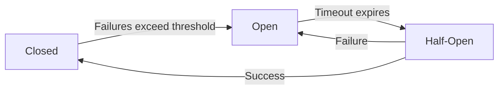

# The Guiding Philosophy: Fail Fast, Recover Gracefully

## The Core Principle: Protective Isolation

The circuit breaker pattern is built on a simple but powerful philosophy: **when something is broken, stop using it until it's fixed**.

This sounds obvious, but traditional software systems often do the opposite - they keep hammering failing services with requests, hoping they'll eventually succeed. It's like repeatedly trying to start a car with a dead battery instead of getting a jump start.

## The Three Pillars of Circuit Breaker Philosophy

### 1. Fail Fast, Don't Fail Slow

**Traditional approach:**
```
Request → Wait 30s → Timeout → Retry → Wait 30s → Timeout → Give up
Total time: 60+ seconds of wasted resources
```

**Circuit breaker approach:**
```
Request → Circuit open → Immediately return error
Total time: <1ms
```

By failing fast, you:
- Free up resources immediately
- Give users quick feedback
- Prevent resource exhaustion
- Allow the system to focus on healthy operations

### 2. Assume Failure is Normal

In distributed systems, failure isn't an exception - it's a regular occurrence. Services fail due to:
- Network issues
- Server overload
- Database connection pool exhaustion
- Memory leaks
- Deployment issues
- Third-party service outages

Circuit breakers normalize this reality by treating failure as a first-class concern, not an edge case.

### 3. Recovery is Automatic

The circuit breaker doesn't just protect against failure - it actively helps recovery by:
- Reducing load on the failing service
- Giving it time to recover
- Gradually re-introducing traffic
- Detecting when the service is healthy again

## The Electrical Circuit Analogy

The pattern gets its name from electrical circuit breakers, and the analogy is perfect:

**Electrical Circuit Breaker:**
- Monitors electrical current
- Trips (opens) when current exceeds safe limits
- Prevents electrical fires and equipment damage
- Can be reset after the problem is fixed

**Software Circuit Breaker:**
- Monitors request success/failure rates
- Opens when error rate exceeds threshold
- Prevents cascading failures and resource exhaustion
- Automatically resets when service recovers

## The State Machine Philosophy

Circuit breakers implement a simple but effective state machine:



**Closed State:** "Everything is working normally"
- Requests pass through
- Monitor success/failure rates
- Like a normal electrical circuit

**Open State:** "Something is wrong, protect the system"
- Reject requests immediately
- Return default responses or cached data
- Like a tripped electrical breaker

**Half-Open State:** "Let's carefully test if it's working again"
- Allow limited requests through
- If they succeed, close the circuit
- If they fail, open it again
- Like testing an electrical circuit before fully resetting

## Design Trade-offs

### Availability vs. Consistency

Circuit breakers prioritize **availability** over **consistency**:
- When a service is down, return cached or default data
- Better to show slightly stale data than no data at all
- Users can still use the application, just with reduced functionality

### False Positives vs. False Negatives

Circuit breakers are tuned to prefer **false positives** (opening when service is actually healthy) over **false negatives** (staying closed when service is failing):
- False positive: Brief service interruption
- False negative: Cascading system failure

The philosophy is: "It's better to be overly cautious than to bring down the entire system."

## The Graceful Degradation Philosophy

Circuit breakers enable **graceful degradation** - the system continues to function even when parts are failing:

**E-commerce Example:**
- Product catalog service fails → Show cached product data
- Recommendation service fails → Show popular products instead
- Payment service fails → Allow "buy now, pay later" options
- Review service fails → Hide review sections

The core business function (buying products) continues even when auxiliary services fail.

## Monitoring and Observability

Circuit breakers provide clear signals about system health:
- **Circuit state** (open/closed/half-open)
- **Error rates** that triggered state changes
- **Recovery attempts** and their outcomes
- **Request volumes** being rejected

This makes it easy to:
- Identify which services are having problems
- Understand the impact of failures
- Plan capacity and redundancy
- Debug issues in production

## The Human Factor

Circuit breakers also protect your team:
- **Reduce on-call fatigue** - Fewer cascading failures mean fewer middle-of-the-night alerts
- **Clearer debugging** - Circuit state provides immediate insight into what's failing
- **Safer deployments** - New services fail gracefully instead of bringing down the system
- **Better user experience** - Users see degraded functionality instead of complete failures

This philosophy transforms how you think about failure - from something to prevent at all costs to something to manage gracefully.