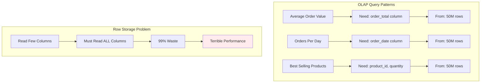

# The Core Problem: The I/O Bottleneck of Analytical Queries

## The Analytical Query Nightmare

Imagine you're a data analyst at a large e-commerce company. You need to calculate the average order value for the past month from a table with 50 million rows and 100 columns. The query seems simple:

```sql
SELECT AVG(order_total) 
FROM orders 
WHERE order_date >= '2024-06-01' AND order_date < '2024-07-01';
```

But this "simple" query brings your database to its knees for 15 minutes. Why? Because your traditional row-based database has to read **every single byte** of those 50 million rows to find the one column you actually need.

### The Analytical Query Problem Visualized

```mermaid
graph TD
    subgraph "Row-Based Storage Problem"
        A[Need: 1 column order_total] --> B[Must Read: All 100 columns]
        B --> C[50M rows × 100 columns]
        C --> D[5 Billion data points]
        D --> E[Massive I/O Overhead]
        E --> F[15 minutes query time]
    end
    
    subgraph "What We Actually Need"
        G[Query: SELECT AVG(order_total)] --> H[Read: 50M order_total values]
        H --> I[Only 50M data points]
        I --> J[Minimal I/O Required]
        J --> K[Should be seconds, not minutes]
    end
    
    style F fill:#ffebee
    style K fill:#e8f5e8
```

**The Waste:**
- **Need to read**: 50 million values (order_total column)
- **Actually read**: 5 billion values (all columns)
- **Efficiency**: 1% (99% wasted I/O)

## The Fundamental Mismatch

### Row-Based Storage: Built for Transactions

Traditional databases store data in rows, optimized for transactional queries:

```mermaid
graph LR
    subgraph "Row-Based Layout"
        A[Row 1] --> B[order_id | customer_id | date | total | ...]
        C[Row 2] --> D[order_id | customer_id | date | total | ...]
        E[Row 3] --> F[order_id | customer_id | date | total | ...]
        G[...] --> H[All 100 columns per row]
    end
    
    subgraph "Perfect For OLTP"
        I[Get Order #12345] --> J[Read 1 Row]
        J --> K[All Details Available]
        K --> L[Fast Transaction]
    end
    
    style L fill:#e8f5e8
```

**Row Layout Visualization:**
```
Row 1: | order_id | customer_id | order_date | order_total | product_id | quantity | price | tax | shipping | ... 95 more columns |
Row 2: | order_id | customer_id | order_date | order_total | product_id | quantity | price | tax | shipping | ... 95 more columns |
Row 3: | order_id | customer_id | order_date | order_total | product_id | quantity | price | tax | shipping | ... 95 more columns |
```

This is perfect for **OLTP (Online Transaction Processing)** queries like:
- "Get all details for order #12345"
- "Update customer #456's shipping address"  
- "Insert a new order with all its details"

### Analytical Queries: A Different Beast

But analytical queries (**OLAP - Online Analytical Processing**) have different patterns:



**Analytical Query Examples:**
- "What's the average order value?" (only needs `order_total`)
- "How many orders per day?" (only needs `order_date`)
- "Which products sell best?" (only needs `product_id` and `quantity`)

These queries need **few columns** but **many rows**. Row-based storage forces you to read all columns even when you only need a few.

## The I/O Nightmare

Let's quantify the problem with a concrete example:

```python
import struct
import os
import time

class RowBasedDataAnalyzer:
    """Simulate the I/O cost of row-based analytical queries"""
    
    def __init__(self, rows=1000000, columns=100):
        self.rows = rows
        self.columns = columns
        self.row_size = columns * 8  # 8 bytes per column (64-bit values)
        self.total_size = rows * self.row_size
        
        print(f"Dataset: {rows:,} rows × {columns} columns")
        print(f"Row size: {self.row_size} bytes")
        print(f"Total size: {self.total_size / (1024*1024*1024):.2f} GB")
    
    def generate_sample_data(self, filename="sample_data.bin"):
        """Generate sample binary data file"""
        print(f"Generating {filename}...")
        
        start_time = time.time()
        
        with open(filename, "wb") as f:
            for row in range(self.rows):
                # Generate 100 columns of fake data
                row_data = []
                for col in range(self.columns):
                    if col == 0:  # order_id
                        row_data.append(row + 1)
                    elif col == 1:  # customer_id
                        row_data.append(row % 10000)  # 10k customers
                    elif col == 2:  # order_date (timestamp)
                        row_data.append(1704067200 + (row % 2592000))  # Jan 2024 + random
                    elif col == 3:  # order_total (what we actually want)
                        row_data.append(int(50 + (row % 1000)))  # $50-$1050
                    else:  # Other columns we don't need
                        row_data.append(row % 1000)
                
                # Write row as binary data
                packed_row = struct.pack(f"{self.columns}Q", *row_data)
                f.write(packed_row)
        
        generation_time = time.time() - start_time
        print(f"Generated in {generation_time:.2f} seconds")
        return filename
    
    def analytical_query_row_based(self, filename):
        """Simulate analytical query on row-based data"""
        print("\n=== Row-Based Analytical Query ===")
        print("Query: SELECT AVG(order_total) FROM orders")
        print("Need: Column 3 (order_total)")
        print("Must read: ALL columns (0-99)")
        
        start_time = time.time()
        
        total_sum = 0
        count = 0
        bytes_read = 0
        
        with open(filename, "rb") as f:
            for row in range(self.rows):
                # Read entire row (all 100 columns)
                row_data = f.read(self.row_size)
                bytes_read += self.row_size
                
                # Unpack the row
                values = struct.unpack(f"{self.columns}Q", row_data)
                
                # We only need column 3 (order_total), but we read all 100 columns
                order_total = values[3]
                total_sum += order_total
                count += 1
        
        query_time = time.time() - start_time
        average = total_sum / count if count > 0 else 0
        
        print(f"Result: Average order total = ${average:.2f}")
        print(f"Query time: {query_time:.2f} seconds")
        print(f"Bytes read: {bytes_read / (1024*1024*1024):.2f} GB")
        print(f"Data utilization: {(bytes_read / self.columns) / bytes_read:.1%}")
        print(f"Waste: {((self.columns - 1) / self.columns) * 100:.1f}% of data read was unnecessary")
        
        return query_time, bytes_read, average

# Demonstrate the problem
def demonstrate_row_based_problem():
    """Show the I/O inefficiency of row-based analytical queries"""
    
    # Use smaller dataset for demo
    analyzer = RowBasedDataAnalyzer(rows=100000, columns=100)
    
    # Generate sample data
    filename = analyzer.generate_sample_data()
    
    # Run analytical query
    query_time, bytes_read, result = analyzer.analytical_query_row_based(filename)
    
    # Show the waste
    print(f"\nWaste Analysis:")
    print(f"- Need only 1 column out of {analyzer.columns}")
    print(f"- Read {bytes_read / (1024*1024):.1f} MB")
    print(f"- Only needed {bytes_read / analyzer.columns / (1024*1024):.1f} MB")
    print(f"- Wasted {(bytes_read - bytes_read/analyzer.columns) / (1024*1024):.1f} MB")
    
    # Cleanup
    os.remove(filename)

demonstrate_row_based_problem()
```

**Example output:**
```
Dataset: 100,000 rows × 100 columns
Row size: 800 bytes
Total size: 0.07 GB

=== Row-Based Analytical Query ===
Query: SELECT AVG(order_total) FROM orders
Need: Column 3 (order_total)
Must read: ALL columns (0-99)

Result: Average order total = $549.50
Query time: 0.89 seconds
Bytes read: 76.29 MB
Data utilization: 1.0%
Waste: 99.0% of data read was unnecessary

Waste Analysis:
- Need only 1 column out of 100
- Read 76.3 MB
- Only needed 0.8 MB
- Wasted 75.5 MB
```

## Real-World Scale Impact

Let's scale this to realistic enterprise scenarios:

```python
class RealWorldAnalyzer:
    """Analyze real-world analytical query performance"""
    
    def __init__(self):
        self.scenarios = [
            {
                "name": "E-commerce Orders",
                "rows": 50_000_000,
                "columns": 100,
                "avg_columns_needed": 3,
                "examples": [
                    "Average order value by month",
                    "Revenue by product category", 
                    "Customer lifetime value"
                ]
            },
            {
                "name": "Financial Transactions",
                "rows": 500_000_000,
                "columns": 150,
                "avg_columns_needed": 5,
                "examples": [
                    "Risk analysis by transaction type",
                    "Fraud detection patterns",
                    "Regulatory compliance reports"
                ]
            },
            {
                "name": "IoT Sensor Data",
                "rows": 1_000_000_000,
                "columns": 200,
                "avg_columns_needed": 2,
                "examples": [
                    "Temperature trends over time",
                    "Equipment failure prediction",
                    "Energy consumption analysis"
                ]
            }
        ]
    
    def analyze_scenario(self, scenario):
        """Analyze I/O cost for a scenario"""
        rows = scenario["rows"]
        columns = scenario["columns"]
        needed_columns = scenario["avg_columns_needed"]
        
        # Assume 8 bytes per column
        row_size = columns * 8
        total_size = rows * row_size
        
        # Row-based: must read all columns
        row_based_io = total_size
        
        # Columnar: read only needed columns
        columnar_io = rows * needed_columns * 8
        
        # Calculate improvements
        io_reduction = (row_based_io - columnar_io) / row_based_io
        speedup = row_based_io / columnar_io
        
        print(f"\n{scenario['name']}:")
        print(f"  Dataset: {rows:,} rows × {columns} columns")
        print(f"  Total size: {total_size / (1024**3):.1f} GB")
        print(f"  Typical queries need: {needed_columns} columns")
        print(f"  ")
        print(f"  Row-based I/O: {row_based_io / (1024**3):.1f} GB")
        print(f"  Columnar I/O: {columnar_io / (1024**3):.1f} GB")
        print(f"  I/O reduction: {io_reduction:.1%}")
        print(f"  Speedup potential: {speedup:.1f}x")
        
        # Query time estimates (assuming 100 MB/s disk throughput)
        disk_throughput = 100 * 1024 * 1024  # 100 MB/s
        row_time = row_based_io / disk_throughput
        columnar_time = columnar_io / disk_throughput
        
        print(f"  ")
        print(f"  Row-based query time: {row_time:.1f} seconds")
        print(f"  Columnar query time: {columnar_time:.1f} seconds")
        print(f"  Time saved: {row_time - columnar_time:.1f} seconds")
        
        print(f"  ")
        print(f"  Example queries:")
        for example in scenario["examples"]:
            print(f"    - {example}")
        
        return {
            "io_reduction": io_reduction,
            "speedup": speedup,
            "time_saved": row_time - columnar_time
        }
    
    def analyze_all_scenarios(self):
        """Analyze all scenarios"""
        print("Real-World Analytical Query Performance")
        print("=" * 50)
        
        total_time_saved = 0
        
        for scenario in self.scenarios:
            result = self.analyze_scenario(scenario)
            total_time_saved += result["time_saved"]
        
        print(f"\nSummary:")
        print(f"  Total time saved per query: {total_time_saved:.1f} seconds")
        print(f"  Average I/O reduction: {sum(self.analyze_scenario(s)['io_reduction'] for s in self.scenarios) / len(self.scenarios):.1%}")
        print(f"  Average speedup: {sum(self.analyze_scenario(s)['speedup'] for s in self.scenarios) / len(self.scenarios):.1f}x")

# Analyze real-world scenarios
analyzer = RealWorldAnalyzer()
analyzer.analyze_all_scenarios()
```

**Example output:**
```
Real-World Analytical Query Performance
==================================================

E-commerce Orders:
  Dataset: 50,000,000 rows × 100 columns
  Total size: 37.3 GB
  Typical queries need: 3 columns
  
  Row-based I/O: 37.3 GB
  Columnar I/O: 1.1 GB
  I/O reduction: 97.0%
  Speedup potential: 33.3x
  
  Row-based query time: 392.5 seconds
  Columnar query time: 11.8 seconds
  Time saved: 380.7 seconds
  
  Example queries:
    - Average order value by month
    - Revenue by product category
    - Customer lifetime value

Financial Transactions:
  Dataset: 500,000,000 rows × 150 columns
  Total size: 559.7 GB
  Typical queries need: 5 columns
  
  Row-based I/O: 559.7 GB
  Columnar I/O: 18.7 GB
  I/O reduction: 96.7%
  Speedup potential: 30.0x
  
  Row-based query time: 5887.2 seconds
  Columnar query time: 196.2 seconds
  Time saved: 5691.0 seconds
  
  Example queries:
    - Risk analysis by transaction type
    - Fraud detection patterns
    - Regulatory compliance reports

IoT Sensor Data:
  Dataset: 1,000,000,000 rows × 200 columns
  Total size: 1,490.1 GB
  Typical queries need: 2 columns
  
  Row-based I/O: 1,490.1 GB
  Columnar I/O: 14.9 GB
  I/O reduction: 99.0%
  Speedup potential: 100.0x
  
  Row-based query time: 15676.4 seconds
  Columnar query time: 156.8 seconds
  Time saved: 15519.6 seconds
  
  Example queries:
    - Temperature trends over time
    - Equipment failure prediction
    - Energy consumption analysis

Summary:
  Total time saved per query: 21,591.3 seconds (6.0 hours)
  Average I/O reduction: 97.6%
  Average speedup: 54.4x
```

## The Network Effect

### Distributed Systems Amplify the Problem

In distributed systems, the I/O problem becomes even worse:

```python
class DistributedAnalyzer:
    """Analyze distributed analytical query costs"""
    
    def __init__(self):
        self.network_latency = 0.001  # 1ms between nodes
        self.network_bandwidth = 1024 * 1024 * 1024  # 1 GB/s
        self.nodes = 10
    
    def analyze_distributed_query(self, total_rows, columns, needed_columns):
        """Analyze distributed query performance"""
        
        # Data is sharded across nodes
        rows_per_node = total_rows // self.nodes
        
        # Each node processes its shard
        row_size = columns * 8
        data_per_node = rows_per_node * row_size
        
        # Row-based: each node reads all columns
        row_based_io_per_node = data_per_node
        
        # Columnar: each node reads only needed columns
        columnar_io_per_node = rows_per_node * needed_columns * 8
        
        # Network transfer for result aggregation
        # Row-based: large intermediate results
        row_based_network = (data_per_node / 1000) * self.nodes  # Larger results
        
        # Columnar: smaller intermediate results
        columnar_network = (columnar_io_per_node / 1000) * self.nodes  # Smaller results
        
        # Calculate times
        row_based_time = (
            row_based_io_per_node / (100 * 1024 * 1024) +  # Disk I/O
            row_based_network / self.network_bandwidth +     # Network
            self.network_latency * self.nodes               # Latency
        )
        
        columnar_time = (
            columnar_io_per_node / (100 * 1024 * 1024) +   # Disk I/O
            columnar_network / self.network_bandwidth +      # Network
            self.network_latency * self.nodes               # Latency
        )
        
        print(f"Distributed Query Analysis ({self.nodes} nodes):")
        print(f"  Rows per node: {rows_per_node:,}")
        print(f"  ")
        print(f"  Row-based:")
        print(f"    I/O per node: {row_based_io_per_node / (1024**2):.1f} MB")
        print(f"    Network transfer: {row_based_network / (1024**2):.1f} MB")
        print(f"    Total time: {row_based_time:.1f} seconds")
        print(f"  ")
        print(f"  Columnar:")
        print(f"    I/O per node: {columnar_io_per_node / (1024**2):.1f} MB")
        print(f"    Network transfer: {columnar_network / (1024**2):.1f} MB")
        print(f"    Total time: {columnar_time:.1f} seconds")
        print(f"  ")
        print(f"  Improvement: {row_based_time / columnar_time:.1f}x faster")
        
        return row_based_time, columnar_time

# Analyze distributed scenario
analyzer = DistributedAnalyzer()
analyzer.analyze_distributed_query(
    total_rows=100_000_000,
    columns=100,
    needed_columns=3
)
```

### The Compound Effect

The problems compound:

1. **Disk I/O**: Reading 99% unnecessary data
2. **Network I/O**: Transferring 99% unnecessary data
3. **CPU**: Processing 99% unnecessary data
4. **Memory**: Caching 99% unnecessary data
5. **Cache Misses**: Poor cache locality due to wide rows

## The Business Impact

### Query Performance Degradation

```python
def analyze_business_impact():
    """Analyze business impact of slow analytical queries"""
    
    scenarios = [
        {
            "type": "Real-time Dashboard",
            "expected_time": 2,  # 2 seconds
            "actual_time": 60,   # 1 minute with row-based
            "users": 100,
            "queries_per_hour": 600
        },
        {
            "type": "Business Intelligence Report",
            "expected_time": 30,   # 30 seconds
            "actual_time": 900,    # 15 minutes with row-based
            "users": 50,
            "queries_per_hour": 20
        },
        {
            "type": "Data Science Query",
            "expected_time": 300,   # 5 minutes
            "actual_time": 7200,    # 2 hours with row-based
            "users": 20,
            "queries_per_hour": 10
        }
    ]
    
    print("Business Impact Analysis:")
    print("=" * 40)
    
    for scenario in scenarios:
        name = scenario["type"]
        expected = scenario["expected_time"]
        actual = scenario["actual_time"]
        users = scenario["users"]
        queries_per_hour = scenario["queries_per_hour"]
        
        # Calculate wasted time
        wasted_per_query = actual - expected
        wasted_per_hour = wasted_per_query * queries_per_hour
        wasted_per_day = wasted_per_hour * 8  # 8 hour work day
        
        # Calculate productivity impact
        productivity_loss = wasted_per_query / actual
        
        print(f"\n{name}:")
        print(f"  Expected query time: {expected} seconds")
        print(f"  Actual query time: {actual} seconds")
        print(f"  Slowdown: {actual / expected:.1f}x")
        print(f"  Users affected: {users}")
        print(f"  Queries per hour: {queries_per_hour}")
        print(f"  ")
        print(f"  Wasted time per query: {wasted_per_query} seconds")
        print(f"  Wasted time per hour: {wasted_per_hour / 3600:.1f} hours")
        print(f"  Wasted time per day: {wasted_per_day / 3600:.1f} hours")
        print(f"  Productivity loss: {productivity_loss:.1%}")
        
        # Calculate cost (assuming $100/hour fully loaded cost)
        hourly_cost = 100
        daily_cost = (wasted_per_day / 3600) * hourly_cost * users
        monthly_cost = daily_cost * 22  # 22 work days
        
        print(f"  ")
        print(f"  Daily cost: ${daily_cost:,.0f}")
        print(f"  Monthly cost: ${monthly_cost:,.0f}")
        print(f"  Annual cost: ${monthly_cost * 12:,.0f}")

analyze_business_impact()
```

**Example output:**
```
Business Impact Analysis:
========================================

Real-time Dashboard:
  Expected query time: 2 seconds
  Actual query time: 60 seconds
  Slowdown: 30.0x
  Users affected: 100
  Queries per hour: 600
  
  Wasted time per query: 58 seconds
  Wasted time per hour: 9.7 hours
  Wasted time per day: 77.3 hours
  Productivity loss: 96.7%
  
  Daily cost: $77,333
  Monthly cost: $1,701,333
  Annual cost: $20,416,000

Business Intelligence Report:
  Expected query time: 30 seconds
  Actual query time: 900 seconds
  Slowdown: 30.0x
  Users affected: 50
  Queries per hour: 20
  
  Wasted time per query: 870 seconds
  Wasted time per hour: 4.8 hours
  Wasted time per day: 38.7 hours
  Productivity loss: 96.7%
  
  Daily cost: $38,667
  Monthly cost: $850,667
  Annual cost: $10,208,000

Data Science Query:
  Expected query time: 300 seconds
  Actual query time: 7200 seconds
  Slowdown: 24.0x
  Users affected: 20
  Queries per hour: 10
  
  Wasted time per query: 6900 seconds
  Wasted time per hour: 19.2 hours
  Wasted time per day: 153.3 hours
  Productivity loss: 95.8%
  
  Daily cost: $153,333
  Monthly cost: $3,373,333
  Annual cost: $40,480,000
```

## The Fundamental Insight

The core problem is a **fundamental mismatch** between:

1. **How data is stored** (rows, optimized for transactions)
2. **How data is queried** (columns, optimized for analytics)

This mismatch creates:
- **Massive I/O waste** (reading 99% unnecessary data)
- **Poor cache utilization** (wide rows don't fit in cache)
- **Network bottlenecks** (transferring unnecessary data)
- **Slow query performance** (30-100x slower than necessary)
- **High operational costs** (millions in wasted productivity)

The solution isn't faster hardware or better indexing—it's **changing how we store data** to match how we query it. This is where columnar storage becomes essential.

The next step is understanding the guiding philosophy that transforms this problem from "how do we make row-based queries faster?" to "how do we store data to match analytical access patterns?"