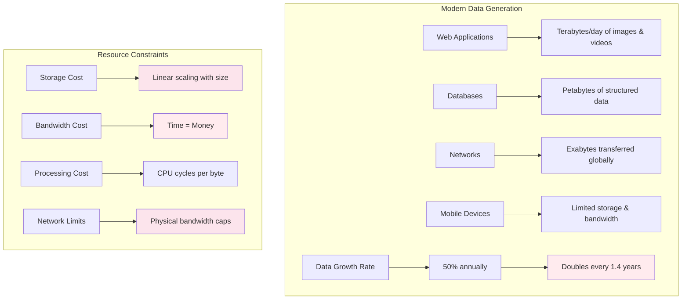
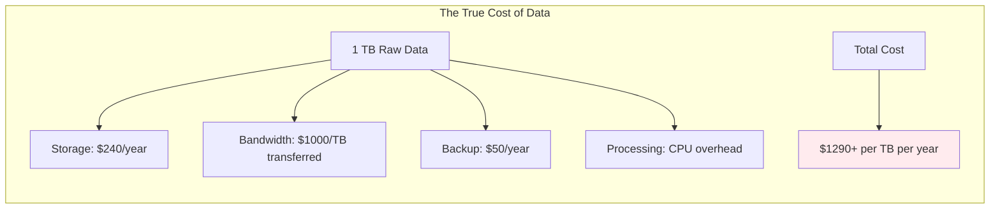

# The Core Problem: Data Consumes Space and Bandwidth

## The Universal Resource Constraint

Data is everywhere, growing exponentially, and it all requires storage and transmission. Every byte of data you store costs money, every byte you transmit takes time, and every byte you process consumes CPU cycles. The fundamental problem is that **data is rarely as compact as it could be**.

### The Data Explosion Visualized

**Modern systems generate and process massive amounts of data:**
- **Web applications**: Terabytes of images and videos daily
- **Databases**: Petabytes of structured information
- **Networks**: Exabytes of data across the globe
- **Mobile devices**: Limited storage and bandwidth

**Without compression, these systems would collapse under their own data weight.**

### The Cost Reality

## The Scale of the Problem

### Storage Costs

Imagine your closet space costs money by the cubic foot. Every shirt, every shoe, every box takes up space that you're paying for monthly. Now imagine you could magically shrink everything to half its size—suddenly your storage costs are cut in half.

This is the reality of digital storage. Whether it's local SSDs, cloud storage, or enterprise data centers, you pay for every byte. The costs add up quickly:

**The Storage Reality:**
- **Small websites**: Hundreds of dollars per year in storage costs
- **Medium applications**: Thousands of dollars per year  
- **Large databases**: Tens of thousands of dollars per year
- **Enterprise data platforms**: Hundreds of thousands per year

**The Compression Opportunity:** If you can compress data by 50%, you immediately cut storage costs in half. If you achieve 80% compression, you reduce costs by 80%. The math is that simple.

### Network Bandwidth Costs

Think of bandwidth like a toll road where you pay by the weight of your cargo. Every megabyte of data costs money to transmit, and the bigger the file, the longer it takes and the more it costs.

**The Transfer Reality:**
Data transfer isn't free—it costs real money and real time. A software update that takes 13 minutes on mobile 4G could take just 3 minutes if compressed by 75%. A database backup that normally costs $8 to transfer could cost just $2 with good compression.

**Time is Money:** 
- **Web pages**: Every extra second of load time costs conversions
- **Software updates**: Users abandon downloads that take too long
- **Video streaming**: Larger files mean more buffering and unhappy users  
- **Data backups**: Transfer windows become critical bottlenecks

**The Compression Impact:** Reduce file size by 50%, and you cut both transfer time and bandwidth costs in half. The benefits compound across millions of transfers.

## The Redundancy Reality

### Data is Rarely Random

Think about a typical English sentence. The letter 'e' appears much more frequently than 'z'. The word "the" appears constantly, while "xylophone" is rare. This isn't randomness—it's pattern, and patterns can be compressed.

**The Redundancy Everywhere:**
Real-world data is full of patterns and repetition:

- **Text documents**: Common words like "the," "and," "a" appear constantly
- **Images**: Large areas of similar colors (like blue sky)
- **Database records**: Repeated field names, similar values
- **Log files**: Timestamp formats, repeated error messages
- **JSON/XML**: Massive structural redundancy in tags and field names

**The Pattern Recognition Opportunity:**
Where humans see meaning, compression algorithms see mathematical patterns. That business report with "revenue," "profit," and "analysis" repeated throughout? A compression algorithm sees opportunities to replace frequent patterns with shorter codes.

### Specific Data Type Redundancy

Different data types have characteristic patterns that compression can exploit:

**JSON/XML Data:**
Think of JSON as a filing system where every folder has a label, but most folders have the same labels. In a typical user database, you see "id," "name," "email," "status" repeated for every record. The field names often make up 30-50% of the file size, yet they carry no unique information—just structure.

**CSV Files:**
CSV data is like a spreadsheet where column headers and delimiters create predictable patterns. Department names like "Engineering" and "Marketing" repeat hundreds of times. Email domains like "@company.com" appear in every row. These repetitive elements are compression gold mines.

**Binary Data:**
Even binary data has patterns. A file might consist mostly of zeros with occasional ones, or have repeating byte sequences. The more predictable the pattern, the better the compression ratio.

**The Insight:** Every data format has its characteristic redundancies. Understanding these patterns is the key to choosing the right compression approach.

## The Performance Impact

### I/O Bottlenecks

Think of your computer's storage like a narrow pipe. When you need to read or write data, you're limited by how fast data can flow through that pipe. Compression changes the game fundamentally: instead of pushing 1000 gallons of water through the pipe, you compress it to 200 gallons, push that through, then expand it back to 1000 gallons on the other side.

**The I/O Reality:**
- **Hard drives**: 100-150 MB/s transfer rates
- **SSDs**: 400-600 MB/s transfer rates  
- **NVMe drives**: 2000+ MB/s transfer rates

**The Compression Advantage:**
When you compress data by 80%, you only need to transfer 20% of the original data. Even with the CPU overhead of compression/decompression, you often see 2-5x performance improvements because I/O is the bottleneck, not CPU processing.

**Real-World Impact:** A database backup that normally takes 2 hours might complete in 30 minutes with compression. A large file copy that takes 10 minutes could finish in 3 minutes.

### Network Transfer Impact

Network transfer is where compression delivers its most dramatic improvements. Picture the internet as a highway system where bandwidth is the number of lanes, and data is the traffic. Compression is like carpooling—you fit more people (data) into fewer cars (packets).

**The Network Reality:**
- **Mobile 4G**: 20 Mbps (2.5 MB/s) on a good day
- **Home cable**: 50-100 Mbps (6-12 MB/s) typical  
- **Enterprise fiber**: 1000+ Mbps (125+ MB/s)

**The User Experience Impact:**
- **Web pages**: A 2MB page compressed to 0.7MB loads 3x faster
- **Software updates**: A 100MB update compressed to 50MB saves minutes on mobile
- **Video streaming**: Better compression means less buffering
- **Database backups**: 5GB backup becomes 1GB transfer, saving hours

**The Mobile Revolution:** Compression is especially critical on mobile networks where bandwidth is expensive and limited. Every byte saved is money saved and time saved for users.

## The Business Impact

### Cost Savings

Compression delivers direct bottom-line impact. Think of it as a universal cost reducer that touches every aspect of your data infrastructure.

**The ROI Reality:**
- **Small business (1TB)**: $5,000-10,000 saved over 5 years
- **Medium enterprise (10TB)**: $50,000-100,000 saved over 5 years  
- **Large corporation (100TB)**: $500,000-1,000,000 saved over 5 years
- **Big data company (1PB)**: $5-10 million saved over 5 years

**Where the Savings Come From:**
1. **Storage costs**: Pay for less cloud storage, fewer physical drives
2. **Bandwidth costs**: Reduce data transfer fees, especially cloud egress charges
3. **Infrastructure costs**: Need fewer servers, less network capacity
4. **Operational costs**: Faster backups, quicker deployments, shorter maintenance windows

**The Multiplier Effect:** Compression doesn't just save money once—it saves money continuously. Every file compressed saves storage costs every month, bandwidth costs every transfer, and time costs every operation.

## Key Insights

### The Fundamental Problem

The core problem of data compression is that **data consumes finite and expensive resources**:

1. **Storage**: Every byte costs money to store
2. **Bandwidth**: Every byte takes time to transmit
3. **Processing**: Every byte requires CPU cycles
4. **Memory**: Every byte competes for cache space

### The Opportunity

Real-world data contains massive redundancy:

- **Text**: 60-90% compression possible
- **JSON/XML**: 70-95% compression possible
- **Images**: 50-95% compression possible
- **Videos**: 90-99% compression possible
- **Databases**: 50-90% compression possible

### The Business Case

Compression delivers:

- **Cost Savings**: 50-90% reduction in storage and bandwidth costs
- **Performance Gains**: 2-10x faster data transfer
- **Scalability**: Handle more data with same infrastructure
- **User Experience**: Faster load times and responsiveness

The fundamental insight is that **compression transforms data from a cost center into a performance multiplier**. Every byte compressed is a byte that doesn't need to be stored, transmitted, or processed.

The next step is understanding the philosophy behind compression: exploiting redundancy to represent data more efficiently.