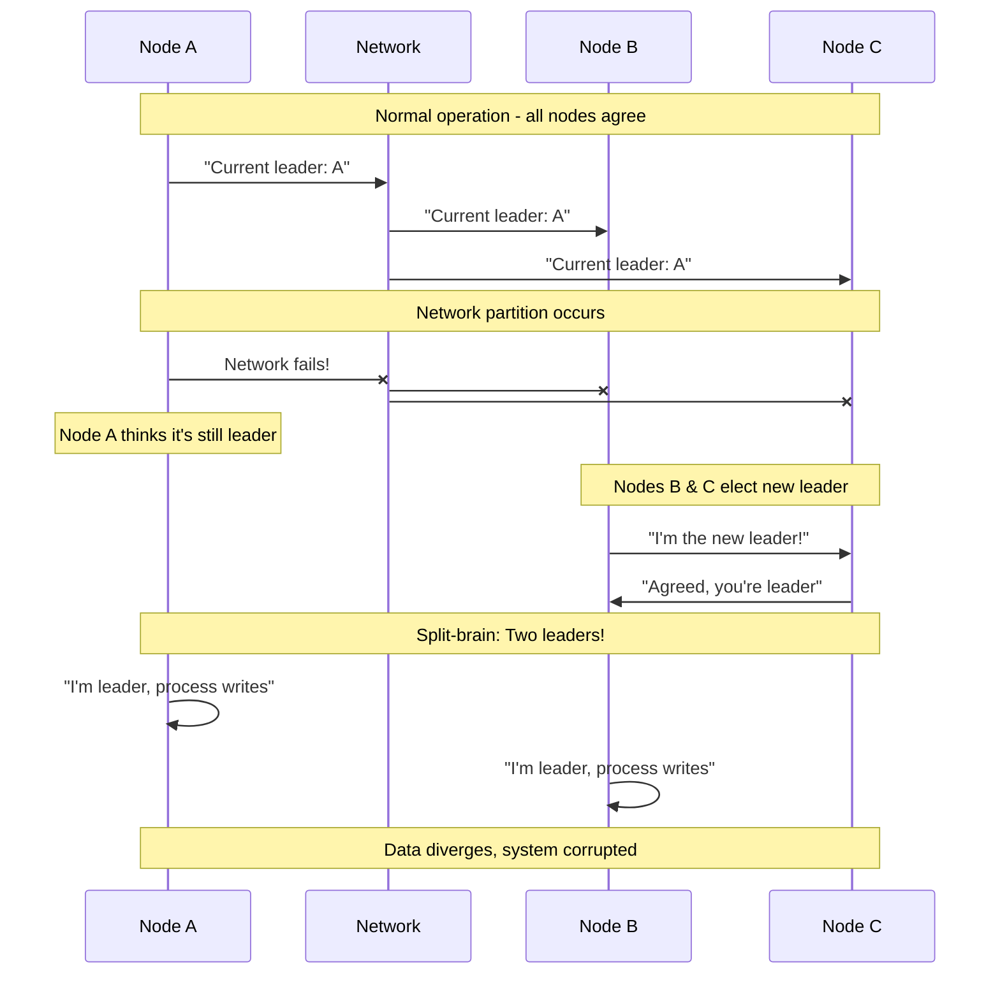
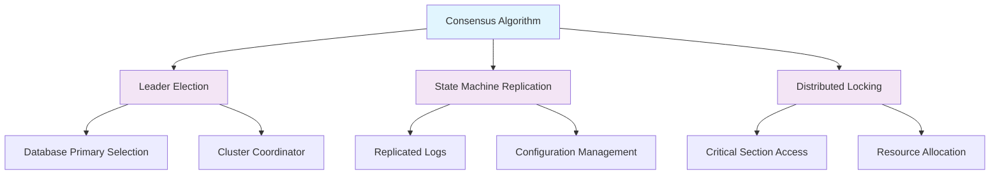
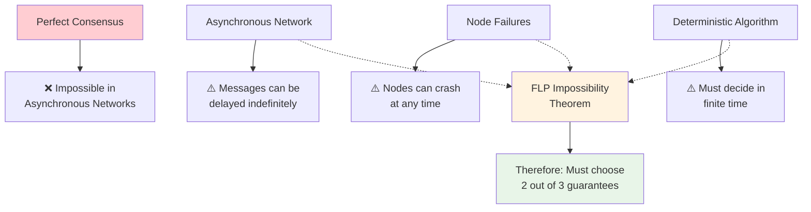

# The Core Problem: Achieving Agreement in Chaos

## The Fundamental Challenge

Imagine you're organizing a group dinner with friends scattered across a busy city. You need everyone to agree on *one* restaurant, but:

- Messages get delayed or lost (dropped texts, network issues)
- Some friends might suddenly become unavailable (phone dies, emergency)
- There's no central coordinator everyone trusts
- You can't wait forever for a decision

This is essentially the **distributed consensus problem**: getting multiple independent parties to agree on a single value when communication is unreliable and participants can fail.

## Why This Problem Is Hard

In a distributed system, consensus becomes exponentially more difficult because:

### 1. **Network Partitions**
The network can split, preventing nodes from communicating. Unlike a single machine where components share memory, distributed nodes must communicate through an unreliable medium.

### 2. **Partial Failures**
A node might crash during the agreement process, leaving others unsure about its state. Was it about to vote "yes" or "no"? Did it receive the latest proposal?

### 3. **No Global Clock**
There's no universal timekeeper. Node A might think it's been 5 seconds since the last message, while Node B thinks it's been 30 seconds. This makes timeouts and ordering extremely challenging.

### 4. **Byzantine Failures**
Some nodes might not just crash—they might actively misbehave, sending conflicting messages to different peers.

## The CAP Theorem Connection

The famous CAP theorem states you can only guarantee two of:
- **Consistency**: All nodes see the same data
- **Availability**: System remains operational
- **Partition tolerance**: System continues despite network failures

Consensus algorithms are essentially sophisticated strategies for navigating these trade-offs.

## Real-World Manifestations

This problem appears everywhere in distributed systems:

- **Database replication**: Which node has the "true" data?
- **Leader election**: Who should coordinate the distributed system?
- **Configuration management**: What's the current system configuration?
- **Distributed locks**: Who has permission to access a critical resource?
- **Blockchain**: What's the next valid block in the chain?

### Visual Example: The Split-Brain Problem

## The Stakes

Getting consensus wrong leads to:
- **Split-brain scenarios**: Multiple nodes thinking they're the leader
- **Data corruption**: Inconsistent states across replicas
- **Service outages**: System unable to make progress
- **Financial losses**: Especially critical in payment systems

The consensus problem is fundamental because it's the foundation upon which all other distributed system guarantees are built. Solve consensus, and you can solve almost any distributed coordination challenge.

## The Consensus Problem Hierarchy

## The Impossibility Triangle

The fundamental challenge can be visualized as an "impossibility triangle":

