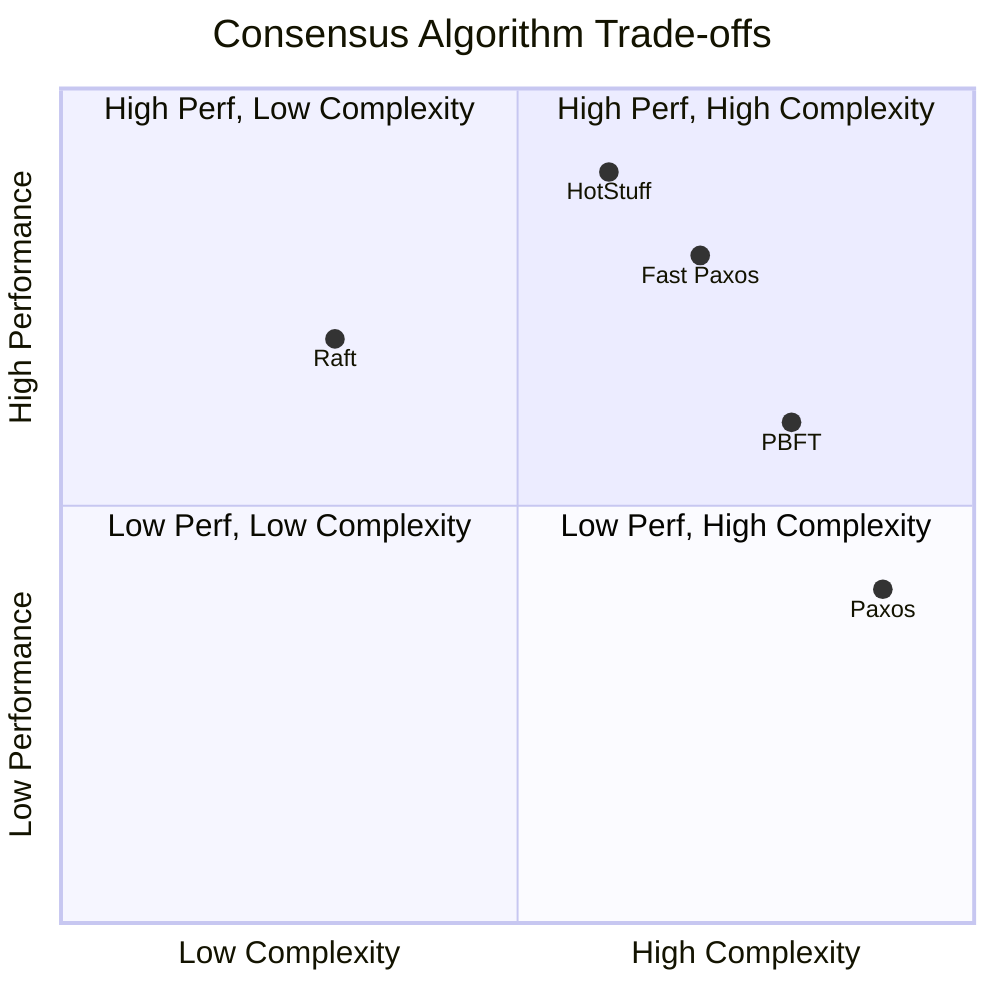
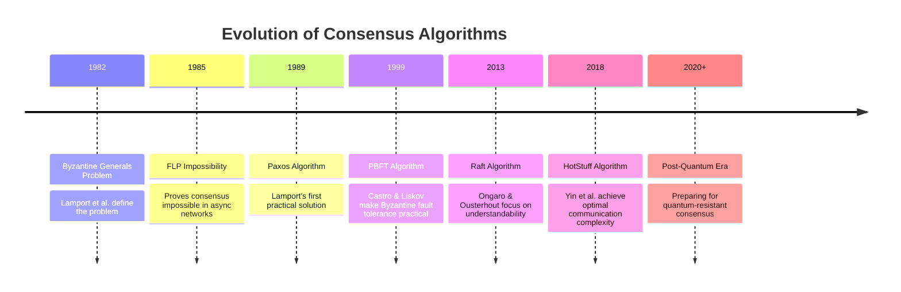
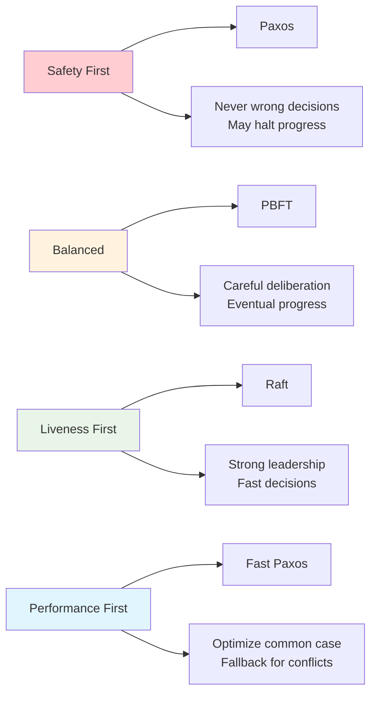

# The Guiding Philosophy: Democracy in Distributed Systems

## Core Principle: Voting with Safeguards

Consensus algorithms are fundamentally **voting systems** with sophisticated safeguards against the chaos of distributed environments. The philosophy is elegantly simple:

> "If the majority agrees, and that majority is stable, then we have consensus."

But the devil is in the details of what "majority" means and how to ensure "stability."

## The Two Fundamental Guarantees

Every consensus algorithm must provide two essential properties:

### 1. **Safety** (Never Wrong)
- **Agreement**: All non-faulty nodes decide on the same value
- **Validity**: The decided value must have been proposed by some node
- **Integrity**: A node decides at most once

*Think of this as: "We'd rather not decide than decide wrong."*

### 2. **Liveness** (Eventually Right)
- **Termination**: All non-faulty nodes eventually decide
- **Progress**: The system doesn't get stuck forever

*Think of this as: "We must eventually make progress."*

## The Impossible Trinity

The **FLP Impossibility Result** (Fischer, Lynch, Paterson) proves that in an asynchronous network, you cannot guarantee all three:
- **Safety**: Never make wrong decisions
- **Liveness**: Always make progress
- **Fault tolerance**: Handle node failures

This forces every consensus algorithm to make a philosophical choice about when to prioritize safety over liveness.

## Design Philosophies by Algorithm

### **Raft**: "Strong Leadership"
- **Philosophy**: Elect a strong leader who makes all decisions
- **Trade-off**: Prioritizes simplicity and understandability
- **Analogy**: A benevolent dictator who everyone trusts until they prove unworthy

### **PBFT**: "Byzantine Paranoia"
- **Philosophy**: Assume some nodes are actively malicious
- **Trade-off**: Requires 2f+1 nodes to tolerate f failures (expensive)
- **Analogy**: A jury trial where you assume some jurors might be compromised

### **Paxos**: "Theoretical Purity"
- **Philosophy**: Minimal assumptions, maximum theoretical guarantees
- **Trade-off**: Complex to implement and understand
- **Analogy**: A perfectly designed constitution that's hard to interpret

### **Fast Paxos**: "Practical Efficiency"
- **Philosophy**: Fast consensus in normal cases, fallback for edge cases
- **Trade-off**: Optimizes for the common case
- **Analogy**: Streamlined voting that only uses complex procedures when disputes arise

## Algorithm Comparison Matrix

## Key Architectural Decisions

### **Synchrony Assumptions**
- **Synchronous**: Messages arrive within known bounds
- **Asynchronous**: No timing guarantees
- **Partially synchronous**: Eventually synchronous (most practical)

### **Failure Models**
- **Crash failures**: Nodes stop working but don't lie
- **Omission failures**: Nodes might not send/receive messages
- **Byzantine failures**: Nodes might behave arbitrarily

### **Communication Patterns**
- **All-to-all**: Every node talks to every other node
- **Leader-based**: One node coordinates, others follow
- **Rotating leadership**: Leadership changes over time

## The Epoch/Term Concept

Most modern consensus algorithms use **epochs** (or terms):
- Time is divided into numbered periods
- Each epoch has at most one leader
- Nodes reject messages from older epochs
- This prevents old, delayed messages from causing confusion

*Think of it as: "We only listen to the current student body president, not last year's."*

## The Quorum Principle

Instead of requiring *all* nodes to agree, most algorithms use **quorums**:
- A quorum is a majority of nodes (e.g., 3 out of 5)
- Any two quorums must overlap by at least one node
- This overlap ensures consistency even if some nodes fail

*Mathematical insight: In a system of N nodes, you need at least ⌊N/2⌋ + 1 nodes for a quorum.*

## Practical Implications

This philosophical framework leads to concrete design decisions:

1. **Timeout values**: How long to wait before assuming a node is dead?
2. **Batch sizes**: How many operations to group together?
3. **Checkpoint frequency**: How often to save state?
4. **Membership changes**: How to add/remove nodes safely?

The beauty of consensus algorithms is that they transform the messy, unpredictable world of distributed systems into a clean, democratic process where the majority rules—even when the network is failing around them.

## The Consensus Algorithm Evolution

## The Philosophical Spectrum

