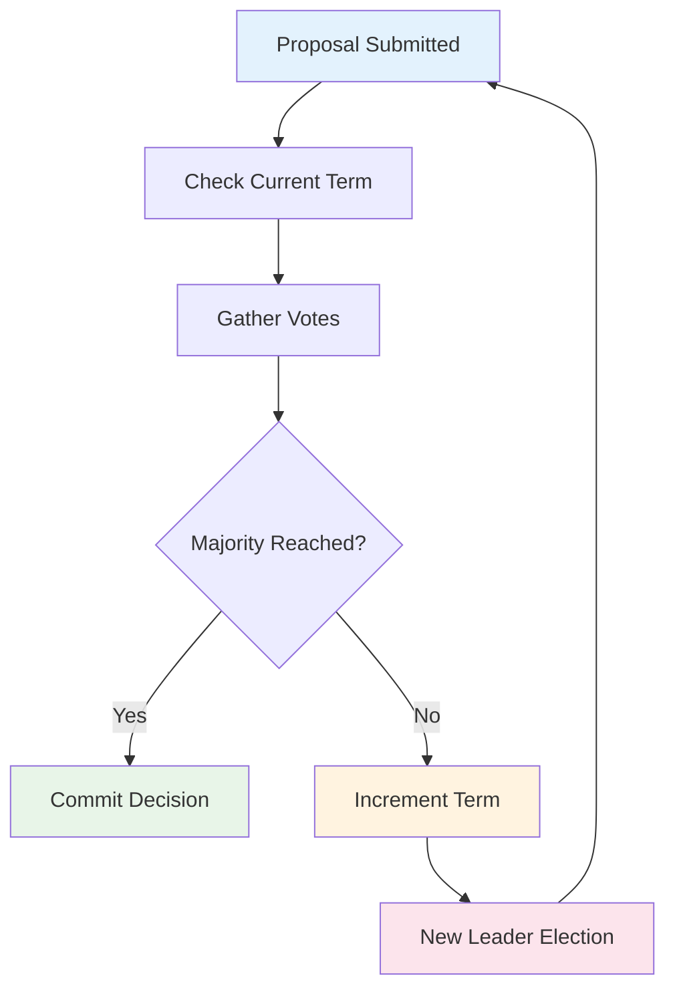
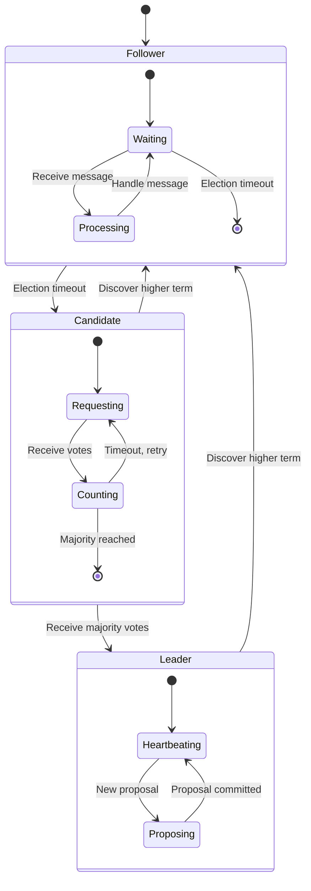
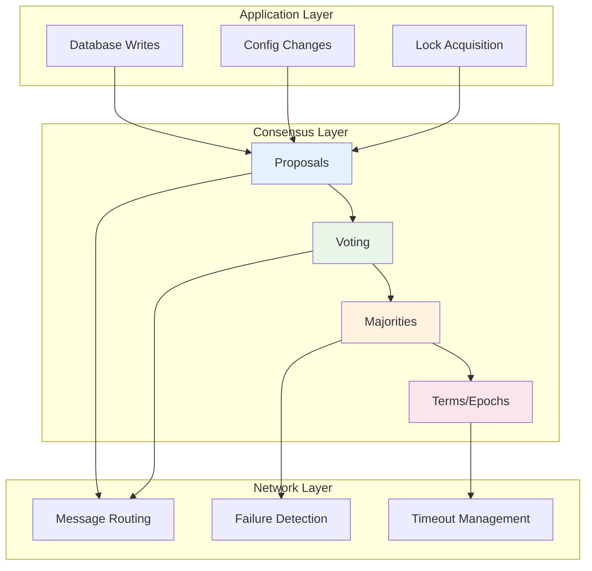
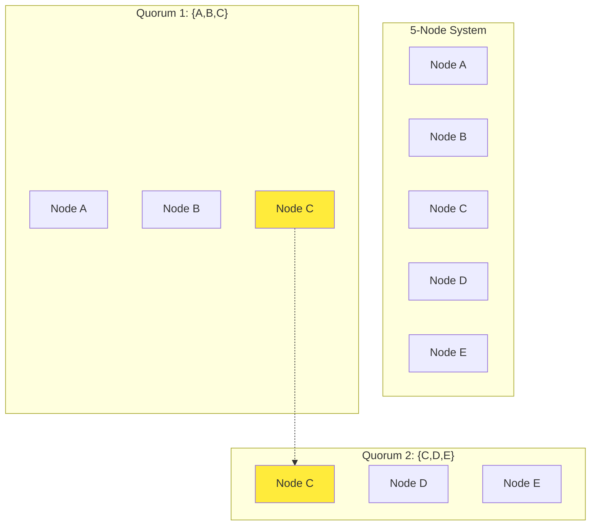

# Key Abstractions: The Building Blocks of Agreement

## The Four Pillars of Consensus

Every consensus algorithm is built on four fundamental abstractions. Understanding these is like learning the basic moves in chess—once you know them, you can understand any consensus algorithm.

## 1. The Proposal 📋

**What it is**: A candidate value that someone wants the group to agree on.

**Real-world analogy**: A motion in a town hall meeting. Someone stands up and says, "I propose we build the new library on Main Street."

**In distributed systems**:
- A database write operation
- A new configuration change
- A leadership candidate
- A blockchain transaction

**Key properties**:
- Must be **well-formed** (follows the system's rules)
- Must be **deterministic** (same input always produces same output)
- Should be **immutable** once submitted

```
Proposal {
    id: "proposal-123",
    value: "SET user_timeout = 30s",
    proposer: "node-A",
    timestamp: 1672531200
}
```

## 2. The Voting Process 🗳️

**What it is**: The mechanism by which nodes express their preference for a proposal.

**Real-world analogy**: The actual voting in our town hall. People raise hands, cast ballots, or voice their opinion. But there are rules: only registered voters can vote, you can't vote twice, etc.

**Types of votes**:
- **Promise**: "I promise to consider this proposal"
- **Accept**: "I agree with this proposal"
- **Reject**: "I disagree with this proposal"
- **Abstain**: "I'm not ready to decide"

**Voting rounds**:
Most algorithms use multiple rounds:
1. **Prepare round**: "Are you willing to vote on this?"
2. **Commit round**: "Do you accept this value?"

**Vote validity**:
- Must come from a **legitimate voter** (authenticated node)
- Must be for the **current epoch/term**
- Must be **well-formed** and **signed**

## 3. The Majority (Quorum) 🏛️

**What it is**: The minimum number of nodes that must agree for a decision to be considered valid.

**Real-world analogy**: In a jury of 12 people, you might need 9 to agree (supermajority) or just 7 (simple majority). The key insight is that any two majorities must overlap.

**Why majorities work**:
```
System with 5 nodes: [A, B, C, D, E]
Majority = 3 nodes

Possible majorities:
- {A, B, C}
- {A, B, D}
- {A, B, E}
- {A, C, D}
- ... (10 total combinations)

Key insight: Any two majorities share at least one node!
```

**Quorum mathematics**:
- **Simple majority**: ⌊N/2⌋ + 1
- **For Byzantine failures**: ⌊2N/3⌋ + 1
- **For read/write quorums**: R + W > N

**Practical example**:
```
5-node cluster:
- Majority = 3 nodes
- Can tolerate 2 failures
- Need 3 votes to make decisions

7-node cluster:
- Majority = 4 nodes  
- Can tolerate 3 failures
- Need 4 votes to make decisions
```

## 4. The Term/Epoch 📅

**What it is**: A logical time period that helps order events and prevent confusion from old messages.

**Real-world analogy**: Presidential terms. We don't listen to orders from the previous president once a new one is elected. Each term has a number, and higher numbers always win.

**Why terms matter**:
Without terms, a delayed message from a crashed leader could cause chaos:
```
Timeline without terms:
T1: Leader A sends "commit X"
T2: Leader A crashes
T3: Leader B elected, sends "commit Y"  
T4: A's old message "commit X" arrives!
    → Confusion! Which is correct?

Timeline with terms:
T1: Term 1 - Leader A sends "commit X, term=1"
T2: Leader A crashes
T3: Term 2 - Leader B elected, sends "commit Y, term=2"
T4: A's old message arrives with term=1
    → Ignored! Term 2 > Term 1
```

**Term properties**:
- **Monotonically increasing**: Terms only go up, never down
- **Unique leadership**: At most one leader per term
- **Global ordering**: Higher term always wins
- **Failure detection**: Missing heartbeats trigger term increments

## The Elegant Interaction

These four abstractions work together like a well-choreographed dance:



## Detailed State Transitions



## Mental Models for Each Abstraction

### **Proposal** = "The Motion"
Think of it as a formal motion in a meeting. It's specific, actionable, and recorded.

### **Voting** = "The Democracy"
Think of it as a fair election system with rules about who can vote when.

### **Majority** = "The Legitimacy"
Think of it as the minimum crowd size needed for a decision to be binding.

### **Term** = "The Time Period"
Think of it as preventing confusion about "which government" made which decision.

## Advanced Patterns

### **Two-Phase Commit with Terms**
```
Phase 1 (Prepare):
- "In term T, are you willing to vote on proposal P?"
- Majority responds: "Yes, and I promise not to accept older proposals"

Phase 2 (Commit):
- "In term T, please accept proposal P"
- Majority responds: "Accepted"
```

### **Leader Election with Terms**
```
Term N: Leader dies
Term N+1: Multiple candidates emerge
Term N+2: One candidate wins majority
Term N+3: New leader begins proposing
```

### **Conflict Resolution**
```
If two proposals compete:
1. Higher term wins
2. If same term, higher proposal ID wins
3. If same term and ID, deterministic tie-breaking
```

## Consensus in Different Failure Models

```mermaid
graph TD
    subgraph "Crash Failures"
        A1["Majority: n/2 + 1"]
        A2["Examples: Raft, Multi-Paxos"]
        A3["Assumption: Fail-stop behavior"]
    end
    
    subgraph "Byzantine Failures"
        B1["Majority: 2f + 1"]
        B2["Examples: PBFT, HotStuff"]
        B3["Assumption: Arbitrary behavior"]
    end
    
    subgraph "Omission Failures"
        C1["Majority: Variable"]
        C2["Examples: Practical systems"]
        C3["Assumption: Message loss"]
    end
    
    A1 --> A2
    A2 --> A3
    B1 --> B2
    B2 --> B3
    C1 --> C2
    C2 --> C3
    
    style A1 fill:#e8f5e8
    style B1 fill:#ffcdd2
    style C1 fill:#fff3e0
```



These abstractions are the DNA of consensus algorithms. Master them, and you've mastered the fundamental building blocks that power everything from Apache Kafka to blockchain networks.

## The Consensus Protocol Stack



## Mathematical Guarantees

### Quorum Intersection Property



**Key Insight**: Node C appears in both quorums, ensuring consistency!